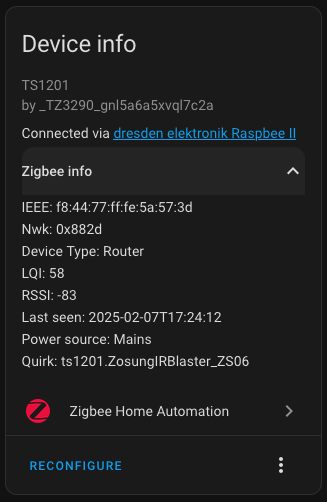
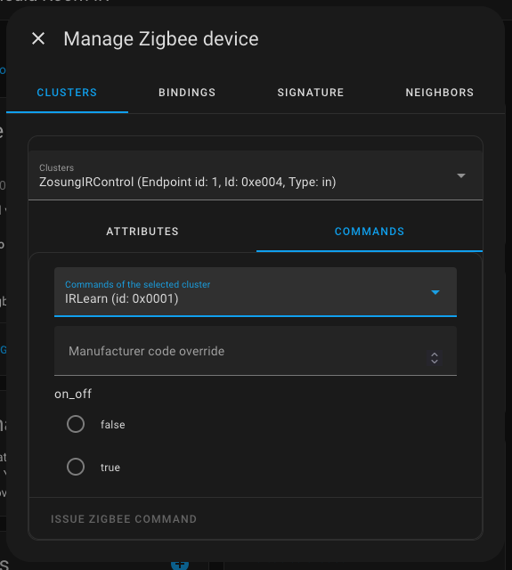
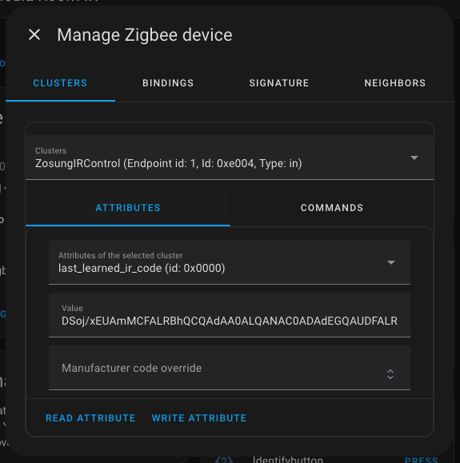
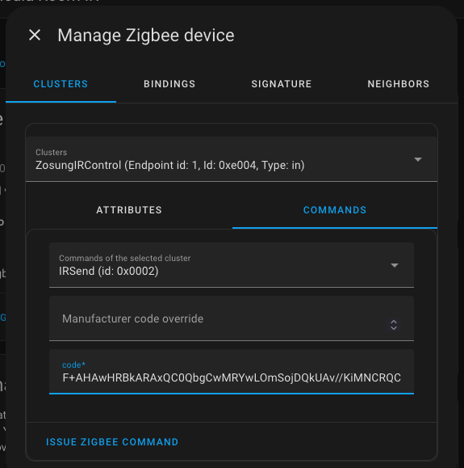
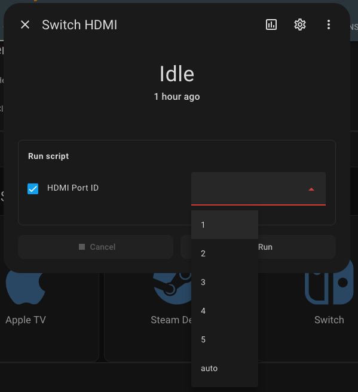
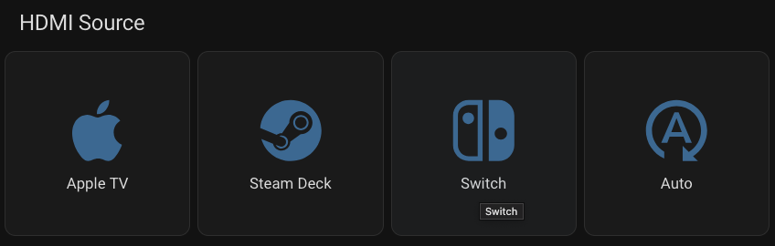

I spent long than I would have liked setting up a touch of automation for our home media center setup. Specifically, we have a projector, an HDMI switch, and multiple input devices connected to it (Apple TV, Steam Deck, Switch at the moment). 

There are a few things that are suboptimal with this setup, but so it goes. One thing that's been bothering me for a while is that there's no great way for the switch I have to easily switch devices. It has a remote... but where's the fun in that? (Plus we lost it for a few months). 

So I took this as a chance to finally set up an IR transmitter with [Home Assistant](https://www.home-assistant.io/), using [Zigbee Home Automation](https://www.home-assistant.io/integrations/zha/)! 

It was a bit confusing to get it all working, so I'm sharing it half so I can reproduce what I did if I ever need to or so that anyone trying the same can get it working. 

A lot of what I did was based first on [this blog post](https://smarthomescene.com/reviews/tuya-zigbee-infrared-ir-remote-zs06-review/). 

<!--more-->



## The hardware

First up, the hardware (none of these are affiliate links):

* ConBee II Zigbee Gateway ([Amazon](https://www.amazon.com/dp/B07PZ7ZHG5))
* Tuya IR Remote ([AliExpress](https://www.aliexpress.us/item/3256806627878566.html), [Amazon](https://www.amazon.com/Yitouniu-Conditioner-Universal-Controller-Compatible/dp/B0CCWSYQRW?)?)
* 5 port HDMI switch ([Amazon](https://www.amazon.com/dp/B095H9NF35))
* Optoma GT1080Darbee Short Throw Projectr ([Amazon](https://www.amazon.com/dp/B06XHG92Y5))

The ConBee is plugged into my server to configure Zigbee devices. 

The Tuya IR remote is what actually transmits the IR codes (and can also [learn them](#learning-ir-codes)). There are a few options for this locally and on Amazon, but I haven't been able to actually find one that's designed for Zigbee. This one technically can support wifi as well, but it's not necessary, I didn't want it, and I didn't end up configuring it that way. 

The HDMI switch and projector are just what we have. I expect a different switch might make this better and the projector has already caused me some other issues in the past--specifically, it doesn't support HDMI ARC which would allow me to passthrough audio from the HDMI signal, so I needed an HDMI switch that could do that part for me. 

## Setting up a custom quirk 

The next thing I had to do was on the software end. ZHA doesn't (didn't at the time?) support configuring the Tuya IR, so I installed a ['custom quirk'](https://github.com/ferehcarb/zha-device-handlers/blob/dev/zhaquirks/tuya/ts1201.py). 

To do this, you have to manually install and configure the script:

* Install to a path in your config directory (like `/config/custom_zha_quirks`)
* Update your `configuration.yaml`:

  ```text
  zha:
    custom_quirks_path: /config/custom_zha_quirks/
  ```

* Reboot Home Assistant

## Learning IR codes

You should now be able to add the device to ZHA just like any other Zigbee device. To see that it's working and that you are actually using the custom Quirk, you should see a configuration like this:



Note specifically the `Quirk` at the bottom there. 

Next up, we can click the three dots there and go into 'Manage Zigbee device'. The `Cluster` you want is the new `ZosungIRControl`. Then you can send commands!

First, a command to put the device into learning mode:



(set `on_off` to `true`)

Send that and you should get a blue light on the IR device. Point your remote at it and push a button! If the light goes out, it worked. 

But nothing changed? Well, now you need to switch back to the `Attributes` tab:



Once you're there, click `Read Attribute` and the `Value` field will be populated. This is exactly the value you will need to transmit to copy whatever the IR remote did in the first place!

You can actually try this out, back on the `Commands` tab:



Change the command to `IRSend`, put in that `Value` as `code` and send it! Whatever that button on your remote does should now happen. 

Which all pretty cool, but remembering these codes and putting them in this panel is a pain. So let's automate it better!

(Side note: If you want to see all of the codes I learned, they're [available here](#the-codes-i-learned). I doubt anyone has exactly the same hardware. This is mostly so I have them later. :smile:)

## Setting up automation

Okay, next up, we're going to set up a Home Assistant script to actually issue these commands for me. In a nutshell:

```text
action: zha.issue_zigbee_cluster_command
metadata: {}
data:
  cluster_type: in
  ieee: f8:44:77:ff:fe:5a:57:3d
  endpoint_id: 1
  command: 2
  params:
    code: >-
      CRgjChIfArcGHwJAAQJpAh/gAAHAC8AHQCPgFwNAAcAjQDdAA8ABQAtAG0ABwAtAD0ADD8ieGCMBCR8C//8YIwEJHwI=
  command_type: server
  cluster_id: 57348
```

That's what you're going to end up needing, but getting those values right is a bit of a pain... We've seen all but one of them in the previous screenshots though!

The `IEEE` value is here in the device UI:


And the rest are in the `Clusters` part of `Manage Zigbee device`:


Specifically after `ZosungIRControl`. The `endpoint_id` and `Type` are obvious, but the other one `Id` is the value for `cluster_id`. I just converted the hex (`0xe004`) to decimal (`57348`). I'm not sure which `command_type` we need, so I tried `client` (didn't work) and `server` (did!). 

And that's all you need to send a Zigbee command!

You can how set up a single script for each and every single one of those!

But that sounds a bit annoying.

## Parameterizing the script

To fix this, I added a `field` named `device` to the script. Specifically, I wanted to have the options `1` through `5` plus one for `auto`. Then I can use template parameters to send the correct code for each to Zigbee!

```yaml
alias: Switch HDMI
description: ""
icon: mdi:hdmi-port

fields:
  device:
    selector:
      select:
        options:
          - "1"
          - "2"
          - "3"
          - "4"
          - "5"
          - "auto"
    name: HDMI Port ID
    default: 1

sequence:
  - action: zha.issue_zigbee_cluster_command
    metadata: {}
    data:
      cluster_type: in
      ieee: f8:44:77:ff:fe:5a:57:3d
      endpoint_id: 1
      command: 2
      params:
        code: >-
          
          CRgjChIfArcGHwJAAQJpAh/gAAHAC8AHQCPgFwNAAcAjQDdAA8ABQAtAG0ABwAtAD0ADD8ieGCMBCR8C//8YIwEJHwI=
          
          C2gjsxEGAscGBgJiAuAFA0AB4AMTQCPgDwNAJ4AbAGKgBwMGAmIC4AEDQA9AAeAHEwLHBmIgAwkGAt2eaCO4CAYC
          
          DT0jsRECAtAGAgJkAgIC4BMDQCPgEwNAO8AfQAvgBwNAG8ATQAvgAwMPw549IwQJAgL//z0jBAkCAg==
          
          CXEjzxEVAqsGFQJAAQFjAuARA0Aj4A8DQAEBqwZAPQEVAkAFA6sGFQJAAUALQAMBqwZABQMVAqsGQAPACwBjIA+AAwdTnnEjsQhjAg==
          
          C2MjsRFlAr0GBwJlAuAVA0AjgAMAZaAHwA8DBwJlAuABA0AB4AcTQA/gAwNAL+ADDw+nnmMjyQgHAv//YyPJCAcC
          
          C2EjsREAAs0GAAJiAuAVA0Aj4A8DQDuAGwBiYAcBYgLgBQMDzQYAAuADE0AP4AMDD8ueYSPNCAAC//9hI80IAAI=
          
      command_type: server
      cluster_id: 57348
```

Now, I can directly add that as an `Entity` to my dashboard. If I click it, it asks which ID I want and then sends the right command:



But you can also manually specify it for buttons:



Switch.

To configure this, I set up a `Grid Card` with a `Button` for each. Here's the configuration for the Apple TV button (on HDMI 1):

```yaml
name: Apple TV
entity: script.switch_hdmi
icon: mdi:apple
show_name: true
show_icon: true
type: button
tap_action:
  action: perform-action
  perform_action: script.switch_hdmi
  data:
    device: "1"
  target: {}
show_state: false
```

That `tap_action.data.device` is any of the IDs we set up as a `Field` before. You can also configure this in the visual editor, but I couldn't get the `device` field to populate there until I'd already put it in the YAML, so YMMV.

It was fun to find that the built in Home Assistant icons include ones for Apple, the Steam Deck, and a Switch. :smile:

## Overall

And... that's it! For now. I'm going to eventually set up some automations where you can say or push a button for 'watch TV' and it will start the projector, start the Apple TV, and switch to HDMI 1. Basically what the Harmony used to do for me... 

But for now, one more step to automation!

## Harmony

I used to do all of this with a Logitech [Harmony Hub](https://support.myharmony.com/en-us/hub). This actually worked pretty well... until it didn't. They've basically stopped selling them and mostly don't support them any more. They technically work (or did a year ago when I last tried it), but there's no guarantee that they will continue to do so. Especially since all of the configs for the Hub are required to go through Logitech's servers... 

With my local Zigbee setup? No remote connection at all needed!

Well, other than the internet to watch the TV. But we can play games without it!

## The codes I learned

| device    | button | code                                                                                                                   |
| --------- | ------ | ---------------------------------------------------------------------------------------------------------------------- |
| hdmi      | on     | `CTIjCBIMAsYGDAJAAQFlAuARA0Aj4A8DwDfgAx9AAUAPQBtAB0ADQAvAA8APQAcPo54yI`                                                |
| hdmi      | off    | `C08jjRFtAsgGAAJtAuAVA0Aj4CMD4CNPD82eTyPnCAAC`                                                                         |
| hdmi      | 1      | `CRgjChIfArcGHwJAAQJpAh/gAAHAC8AHQCPgFwNAAcAjQDdAA8ABQAtAG0ABwAtAD0ADD8ieGCMBCR8C//8YIwEJHwI=`                         |
| hdmi      | 2      | `C2gjsxEGAscGBgJiAuAFA0AB4AMTQCPgDwNAJ4AbAGKgBwMGAmIC4AEDQA9AAeAHEwLHBmIgAwkGAt2eaCO4CAYC`                             |
| hdmi      | 3      | `DT0jsRECAtAGAgJkAgIC4BMDQCPgEwNAO8AfQAvgBwNAG8ATQAvgAwMPw549IwQJAgL//z0jBAkCAg==`                                     |
| hdmi      | 4      | `CXEjzxEVAqsGFQJAAQFjAuARA0Aj4A8DQAEBqwZAPQEVAkAFA6sGFQJAAUALQAMBqwZABQMVAqsGQAPACwBjIA+AAwdTnnEjsQhjAg==`             |
| hdmi      | 5      | `C2MjsRFlAr0GBwJlAuAVA0AjgAMAZaAHwA8DBwJlAuABA0AB4AcTQA/gAwNAL+ADDw+nnmMjyQgHAv//YyPJCAcC`                             |
| hdmi      | auto   | `C2EjsREAAs0GAAJiAuAVA0Aj4A8DQDuAGwBiYAcBYgLgBQMDzQYAAuADE0AP4AMDD8ueYSPNCAAC//9hI80IAAI=`                             |
| hdmi      | arc    | `C2MjsREZAp8GGQJmAuAVA0AjAp8GZiADQAfgFQNAAQFmAuARA+AHPw+BnmMjzwgZAv//YyPPCBkC`                                         |
| projector | on     | `BjcjqhFrAgEgAQPgBgECQAlAA0ALQANAC0ADwAtAB0ADQBNAA0ALQAPAC0AH4AsD4AMjQAvgBwMPIpo3IwwJAQL//zcjDAkBAg==`                 |
| projector | off    | `DSoj/xEUAmMCFALRBhQCQAdAA0ALQANAC0ADAdEGQAUDFALRBoADQAFAEeADD0ALQAFAF+AHAwHRBkARAxQC0QbgCwMRYwLOmSojDQkUAv//KiMNCRQC` |
| projector | hdmi 1 | `BkUjqRFrAgMgAQPeBgMCQAlAA0ALQANAC0ADwAsC3gZrIAMBAwJAAQNrAgMCQAtAA+ALC0ATwAPAI0APwAtAB8ADDySaRSPrCAMC//9FI+sIAwI=`     |
| projector | hdmi 2 | `DSAj7hEAAnACAALfBgACQAdAA0ALQANAC0ADwAtAB0ADQBNAA0ALQANAC+ADA0ATQAPAE0AL4AMD4AcXDyOaICMQCXAC//8gIxAJAAI=`             |

I've tested all of these and with one exception they all work great! The one I haven't gotten to work yet for some reason is `projector off`. It just doesn't do anything. Previously with the Harmony, I had to set up a custom script that pushed the button, waited a second, then pushed it a again because of a timer, but this doesn't even show that much progress. I have no idea why, especially when everything else works. And I have auto-shutoff on inactivity so it's not *necessary*. But I am curious. 

I do wish I knew how those related to [this crowdsourced IR database](https://github.com/probonopd/irdb). The HDMI switch isn't in there, but the projector is! I expect it's backed binary somehow, but I don't have the time at the moment to figure it out. If you happen to know, let *me* know!

