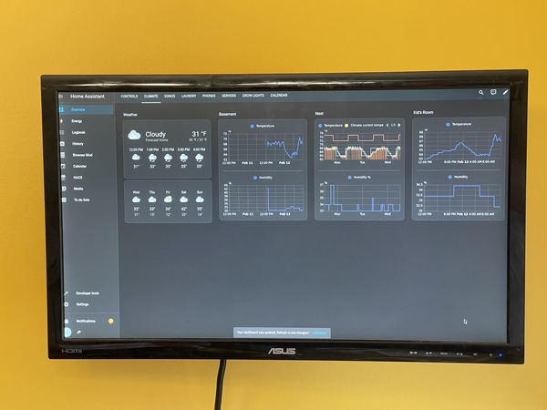
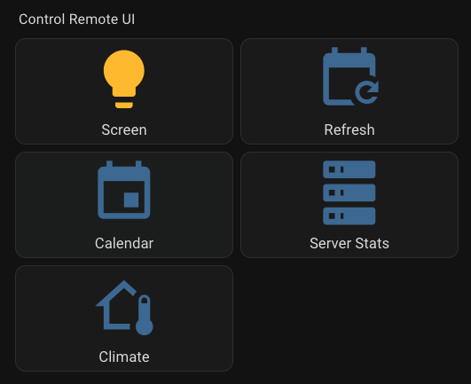
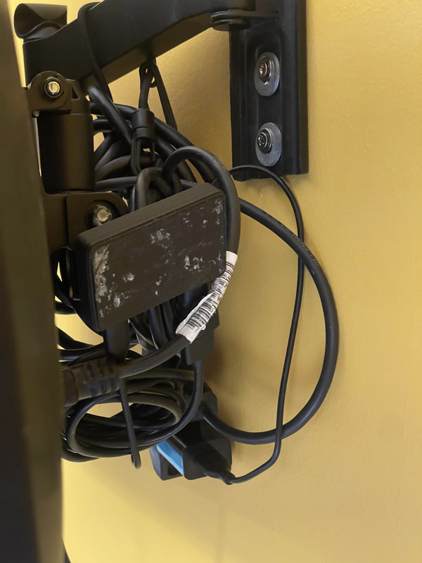

I've been on a home automation kick for the last little while, so what better time than to dust off an old project and put up a home / family dashboard in the kitchen/dining room!

Previously, I had this running off a FireTV and [MagicMirror](https://magicmirror.builders/). This worked well enough... but oh man is the FireTV browser terrible. Plus I had to do some crazy things to get it to stay on and never could get it to launch right back into the display on a power outage. So now we have version 2!

In the end, I ended up with:

* An [Orange Pi](http://www.orangepi.org/) Zero 2W for the brains
* [Armbian](https://www.armbian.com/) for the operating system
* [Chromium](https://www.chromium.org/Home/) as the browser (I did try Firefox first...)
* [Home Assistant](https://www.home-assistant.io/) for the data, remote control, and UI
  * [WallPanel](https://github.com/j-a-n/lovelace-wallpanel) to hide the side/top bar
  * [Browser Mod](#home-assistant-browser-mod) for remote control

Not too bad.

<!--more-->

- - - 

Okay, detail time.



## The Hardware

Okay, first things first, setting up the Orange Pi. My goal is for it to have a single standalone device that can run a web browser that shows whatever page I have for the UI. It should be easy to update (remotely) and run without needing any sort of input for the device. 

So, like I said, I used an  [Orange Pi](http://www.OrangePi.org/) Zero 2W for the brains ([Amazon](https://www.amazon.com/Allwinner-Computer-Frequency-Bluetooth-onboard/dp/B0CHM6XND9)). On board, we have a 1.5 GHz ARM processor, 1 GB RAM, and 16MB flash which I won't end up using. It also comes with two USB-C ports (one for power) and mini HDMI out (I have an adaptor from a previous project). 

The one I ordered came with the expansion board (for whatever reason it was cheaper that way) with ethernet, two USB-A ports, an IR receiver, a speaker, and a microphone; however, for this project I don't really need any of that, so I'm going to ignore it. :smile:

## The Operating System

Next up, the OS. It's not an esp32, so I want a full operating system on it. I do want to display a web browser, so I do actually need a desktop environment (I probably could have gotten by with just an X server? I'm not sure.)

My first was [Orange Pi OS](http://www.OrangePi.org/html/softWare/OrangePiOS/index.html). It's designed for the hardware and just works; however, I wanted something a little more cross platform and mainstream (ish), so instead I went with [Armbian](https://www.armbian.com/).

Other options I consider:

* [Raspberry Pi OS](https://www.raspberrypi.com/software/) - Couldn't get it working, as far as I can tell they're both based on ARM processors and similar enough that it's possible now, but upgrades can break
* [Porteus Kiosk](https://porteus-kiosk.org/) - Would have been great since I just wanted a kiosk, but it's not ARM compatible

## Installing

To install, I used the [Raspberry Pi Imager](https://www.raspberrypi.com/news/raspberry-pi-imager-imaging-utility/) with the Armbian image referenced above. That was really all it took. The custom install settings didn't work, but on first boot Armbian set up most of what that would have needed anyways. 

Copy it to the SD card, install in the Orange Pi, turn it on and... That's it. I have a running Linux system! That ... was surprisingly easy. I can SSH in or use the desktop environment so long as I'm hooked up to a keyboard and monitor. It's a little sluggish, but I am planning on displaying static content, so that will be fine. 

## Enable autologin

Okay, next up the software tweaks. First off, I want this machine to immediately go into it's kiosk mode when launching and to do that, I need to enable autologin. Luckily, this is pretty straight forward:

```ini 
# /etc/lightdm/lightdm.conf.d/12-autologin.conf

[Seat:*]
pam-service=lightdm
pam-autologin-service=lightdm-autologin
autologin-user=jp
autologin-user-timeout=0
autologin-session=
```

Any `.conf` files in the `lightdm.conf.d` directory will work, so I just added a new one. The `autologin-user` is the setting that matters most here. 

## Launch chromium in kiosk mode

Next up, the browser. I really did try to get Firefox to work, but ... it just didn't want to launch from an automated script. I also tried `chromium-shell` which is just the rendering component, but that still had buttons like reload and the address bar and didn't support either `--kiosk` or `--app` mode, 

```bash /usr/bin/kiosk
#!/usr/bin/bash
# Located in /usr/bin/kiosk

#!/usr/bin/bash

# Launch chrome in kiosk mode
chromium \
  --user-data-dir="/home/jp/.kiosk/" \
  --app="https://example.com/lovelace/calendar?wp_hide_toolbar=true&wp_hide_sidebar=true" \
  --start-fullscreen
```

What this does is launch `chromium` with a dedicated user directory (if you launch in `--kiosk` mode, it will not save this it seems, I'm not actually sure about `app`) in `--app` mode (which removes all of the UI elements like the buttons and address bar), and in `--fullscreen`.

I did try `--kiosk` mode, but I do actually want to be able to have some input when I plug in a keyboard and mouse. And I'm not on a touchscreen, so that part at least is also not a problem. So that's why I switched to `--app`. 

As mentioned, I do need to be able to login once to Home Assistant (it's possible to make a dashboard which is available without logging in, which if this ends up not staying logged in I will need to fix) and save my 'dark mode' preference locally. For that persistence, I do want the `--user-data-dir`. 

Now to actually get this to run on launch, I used this `.desktop` file:

```ini
# ~/.config/autostart/kiosk.desktop
[Desktop Entry]
Name=kiosk
GenericName=kiosk
Comment=MagicMirror kiosk
Exec=/usr/bin/kiosk
Terminal=false
Type=Application
X-GNOME-Autostart-enabled=true
```

You don't actually have to put the `Exec` in a separate script, you can put command line args directly here. But to make testing easier and also since I had a good number of parameters, this ended up being easier. 

## Disable overview mode

One last tweak that I needed was that by default Armbian (Gnome) launches into 'Overview' mode, which has the app launcher. The browser would launch fine into this, but not actually fullscreen, instead with a larger border with UI elements. 

To get around that, I ended up just directly using [this StackExchange post's solution](https://unix.stackexchange.com/questions/717123/how-to-disable-gnome-workspace-selection-at-login):

```bash
#!/usr/bin/sh
# Located in /usr/bin/exit-overview

# Monitoring time in tenths of seconds
MTIME=50
for ((i=0; i<${MTIME}; i++)); do
  read -r DUMMY DUMMY IS_OVERVIEW <<< "$(dbus-send --print-reply=literal --session --dest=org.gnome.Shell --type=method_call /org/gnome/Shell org.freedesktop.DBus.Properties.Get string:org.gnome.Shell string:OverviewActive)"
  if [[ "${IS_OVERVIEW}" = "true" ]] ; then
    /usr/bin/dbus-send --session --dest=org.gnome.Shell --type=method_call /org/gnome/Shell org.freedesktop.DBus.Properties.Set string:org.gnome.Shell string:OverviewActive variant:boolean:false
    exit
  fi
  sleep 0.1
done
```

This has a matching `.config/autostart` file. 

With all that, it just works! We have our software launch on boot as intended. While I still had it hooked up to a keyboard, I went through one last time to log in and configure [Browser Mod](https://github.com/thomasloven/hass-browser_mod) for remote control and that was it!

## Home Assistant: WallPanel

There are two HACS integrations that I added to Home Assistant to make this better. The first of those is [WallPanel](https://github.com/j-a-n/lovelace-wallpanel). In a nutshell, this is an integration that can be used to disable the side and top bars on the display (since I can't change them anyways). You can also use it to set up a screensaver, which sounds really cool, but isn't something that I particularly need. 

That's also why the URL above was:

```text
/lovelace/calendar?wp_hide_toolbar=true&wp_hide_sidebar=true
```

You can provide these parameters to any URL and it will hide the toolbar or sidebar for you! Exactly what I needed. 

## Home Assistant: Browser Mod

The other mod I added was [Browser Mod](https://github.com/thomasloven/hass-browser_mod). This basically lets you add Home Assistant running in a specific browser on a specific machine as a `Device`! You can get some stats from it (such as battery life, although that's not relevant in this case), but you can also use the corresponding services to do things such as `browser_mod.refresh` to reload the page (when you make changes) and `browser_mod.navigate` to load other pages on the UI! 

This can also be used to hide the sidebar and topbar, but I found it to be a bit more finicky than WallPanel above, so I stuck with that instead. 

## Remote control UI

One more thing I wanted to set up with [Browser Mod](#home-assistant-browser-mod) was remote control from any other machine running Home Assistant:



Those are all just buttons. The first one directly controls `ceres.screen` which blacks it out (for overnight for example). The second calls a script which runs `browser_mod.refresh`:

```yaml
alias: Refresh Ceres
description: ""

sequence:
  - action: browser_mod.refresh
    metadata: {}
    data:
      browser_id:
        - e3ed386cc4d03c9cf2c1df925aae50d8
```

The rest use a parameterized script that can navigate to any URL (although I'm only using it for internal dashboards at the moment):

```yaml
alias: Ceres navigation
description: ""

fields:
  url:
    selector:
      text: null
    name: URL

sequence:
  - action: browser_mod.navigate
    metadata: {}
    data:
      browser_id:
        - e3ed386cc4d03c9cf2c1df925aae50d8
      path: "{{ url }}"
```

## Case and final wiring 

As one final bit was wiring everything up and putting the Orange Pi in a 3D printed case:



It's ... ugly, but I can fix that as I go. I have an extension cord running up to the back of the monitor arm (which I had from a previous office setup). Then the monitor is powered from that and I have a USB power brock for the Orange Pi and a mini HDMI to HDMI adaptor + cable to the monitor. 

One thing I'd love to be able to do is power the Orange Pi from the monitor. That should (in theory) be practical but I don't have that ability with this monitor, so not for now.

For the case, I just printed [this one](https://www.thingiverse.com/thing:6319669). It might in the future have some heating issues if I drive the Orange Pi too hard, but it has a neat little snap in place for the wifi antenna and just works, so that was great to see!

## Overview

And... that's it! It was a fun little project and so much better to get working that my previous FireTV + MagicMirror setup. We'll have to see what else I can do with it now!
