I got back and forth with messing with iOS Shortcuts for automation. I have a nice one that let's me [automatically open a daily created file in Dropbox](#automatically-opening-daily-observations-in-dropbox) that I've had for a while, but now I have two more potentially interesting ones:

* [Enabling Grayness](#enabling-grayness) - Automatically reduce the saturation on my screen to slow down phone addition (hopefully?) with a timed temporary disable feature
* [Timing Reddit](#timing-reddit) - Every time I launch Reddit, set a 10 minute timer to stop using it so I don't just lose an hour (or more) [[wiki:doom scrolling]]()

So how did I do it? 



Side note: I do with Shortcuts had the ability to share a JSON (or whatever) file containing the shortcut rather than only allowing sharing through iCloud. It does appear that you can (used to?) be able to export them as plists, but it doesn't seem to work at the moment. 

But that's just the Apple way it seem :\ So it goes. 

- - - 

<!--more-->

## Enabling Grayness

Okay, first shortcut up: enabling grayness. 

Specifically, this is based on a [7 year old idea (wow)](https://www.nytimes.com/2018/01/12/technology/grayscale-phone.html) that you can help push back against over phone usage by setting a grayscale filter on your phone. I've tried it, it seems to work well enough. 

But there are some things that you just really want to be in color... And I'd like to automate it, so I don't have to go all the way into the iOS settings each time. So let's see what we can do with Shortcuts.

### Enabling Color Filters

The first thing we need to set up is color filters for iOS. This will apply system wide and is originally used for colorblindness, but will fit our needs as well. 

Specifically, we have the settings in Settings > Accessibility > Display & Text Size > Color Filters:

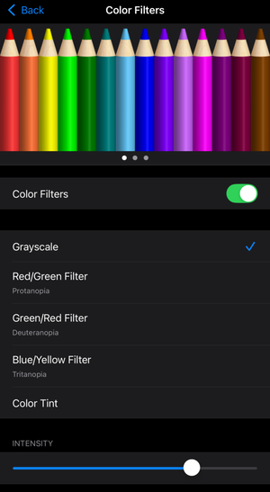 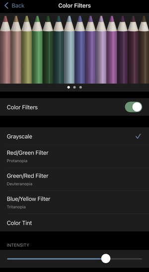

The second image just shows the settings as what I actually see. It turns out that even with the filtering in place, one thing that *doesn't* change is what screenshots look like (which I think is the right choice). So I manually edited the latter. 

### Actions to switch to gray/color

Next up, we set up a pair of shortcuts in iOS Shortcuts.

First, this is how we can turn our screen to grayscale:

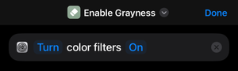

Easy enough. And second, we can return to full color by turning that filter off. 

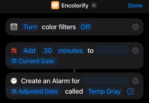

This is also setting up an alarm `Temp Gray`, but we'll come back to that. 

### Triggers: Daily and Alarm

Next up, we have a pair of triggers in Shortcuts:

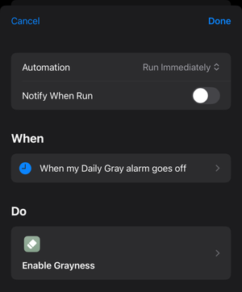 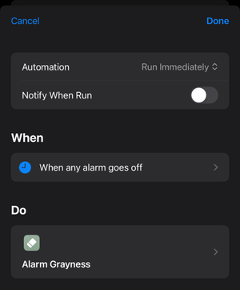

The first will run every day at 7am (that's when `Daily Gray` is set up in my Alarms) to start the day in grayscale. The second, unfortunately, will run every time any alarm goes off. This is because you can't filter at the trigger level by name (that doesn't exist yet). It does work though, if you look at the next action.

### Alarm based grayness action

Speaking of which, the final action that will deal with turning the screen back to gray when an alarm goes off:

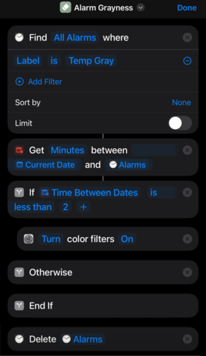 

So this will be fired every time an alarm goes off. So the first thing we do is find `All Alarms` when the `Label` is `Temp Gray` (remember setting that [above](#actions-to-switch-to-graycolor)?). 

Next, we check to make sure that there is at least one alarm within 2 minutes of the current time. 1 minute didn't seem to work in testing and this gives 'running right over the change between minutes' protection. If any alarm matches both the name and the time, turn the color filters back on. 

This can (and should) just call the other action instead. In case I set up other functionality later in that one. :shrug: 

Finally, at the end, we `Delete Alarms`. This looks alarming (hah), but `Alarms` in this case is the filtered ones, so we're only deleting all `Temp Gray` alarms, which should be fine. 

One thing you do need to do is add the ability to delete alarms without conformation. This is in Settings > Apps > Shortcuts > Advanced > Allow Deleting Without Confirmation. This will still require confirmation the first time, but if you select 'always allow' you should be good from now on. 

One gotcha that I haven't fixed yet is that the alarm will for a moment disable sound. It will come right back on as the action finishes and the alarm is deleted, but it's still slightly annoying. Silencing the alarm should be enough, but I haven't figured out how to do this in Shortcuts yet. 

### Thoughts

And that's it! Grayscale with a temporary turn off. 

I have it actually set up on my settings screen (pull down from the top) as buttons (you can set an Shortcut as a button). It can easily be on your homescreen as well though!

I'm a bit annoyed that there's no way to have an action set up a 'run in 30 minutes' so far as I can see. I see that Apple/iOS wouldn't want to check these constantly, but that's still a risk doing it this way, no? 

One option I did consider was using a `Focus`. You can change to a `Focus` as an action and those *do* have the ability to disable after 30 minutes, which can then `Trigger` an action. But you can only have one Focus enabled at a time while you can have as many alarms as you want, thus this solution. 

## Timing Reddit

The second Shortcut I have recently set up is also about phone addition: in this case, stopping from just endlessly scrolling Reddit forever. 

Previously, I used an app called [ScreenZen](https://www.screenzen.co/) that integrated with ScreenTime to limit how often I could open the app per day. That actually worked really well, but had the unfortunate side effect of every time I opened a Reddit link on some FAQ etc that I found (it's amazing how much of the useful internet is only on Reddit sometimes...) it would count towards one of my 'opens' in the app and lock me out early or just be annoying. Other than that, I just didn't use the app. So why not build something myself(ish). :smile:

In this case, I want to have a shortcut so that every time I open Reddit, it will set up an alarm for 10 minutes that yells at me to stop. I could easily use the '[all alarms trigger](#alarm-based-grayness-action)' above to actually just close the Reddit app for me, but for now, this is sufficient. 

First, the action itself:

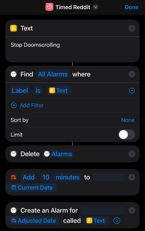

I ... seem to have cut off the the last action of that, which is 'Open App > Reddit'... oops. 

In this case, in order to not have multiple alarms and to reset the timer when I open Reddit through different actions, I first clear out all old alarms. This is also why I saved teh name in a Text attribute. 

Second, the trigger for this is... really straight forward:

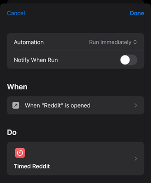

Something nice is that this doesn't cause an infinite loop (since the Action itself also opens the app). It only triggers when the app is tapped, not when focus switches or when the shortcut runs (if it's already open), which is exactly what I want. 

One option that I'm considering (as I'm writing this) would be to use a Focus for this instead of an Alarm. It still has the 'only one Focus' problem, but it might just work? We'll have to see. 

## Automatically opening Daily Observations in Dropbox

This is an older Shortcut, but for completeness sake here it is.

The basic idea is that I have a folder in my Dropbox called `/Observations/{YYYY}/{YYYY-MM-DD}.md` where I have basically a structured daily journal. It's great for highlighting useful things I did during the day or recording hilarious or adorable things the children or cats do. 

I already have a script that runs on my server once a day to create a new file (from template) and automatically archive old posts into a [[wiki:gzipped]]() [[wiki:tarball]]() :smile:. Plus an [Observation Server](https://github.com/jpverkamp/observation-server/) that can view any older date (I should blog about that one). So all I need is the ability to update from my phone (or computer).

Enter Shortcuts:

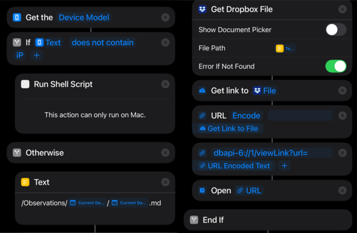

So this one is a bit more complicated than any we've seen previous, since I've designed it to run both on my laptop or on an iPhone/iPad, so long as they Dropbox installed. But those work differently in the two different cases: on Mac, Dropbox is a folder at `~/Dropbox` (for me at least), but on phones, I have to get a link from the Dropbox API which is... mildly annoying. 

### On a Mac

In case you're curious, here's the script:

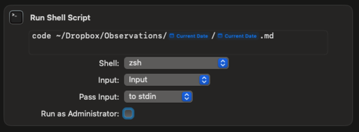

The first 'current date' is formatted with `yyyy-MM` and the second with `ISO-8601`. 

Yeah... it's kind of dumb. I'm pretty sure I had to do it this way in order to properly get the path when expanding `~`. Or at least I think? It's been a while since I worked on this, but it does work fine. 

### On iOS (iPhone or iPad)

For this case, we have to actually get a link for teh file first and then open it as a `URL` (which the Dropbox app is then assigned to automatically open based on the `dbxapi-6://` part of the path). Why the Dropbox App doesn't directly allow getting a file and opening it, I've no idea... but I expect not many people go down this path. 

And that's it! Three Shortcuts. I'll have to dig deeper into these, but for the moment, it's a kind of neat way to get a little bit more custom functionality out of my phone. Onward!

