We're going to be parents (again)! 

Last time around, we made adorable big brother/big sister/little sister shirts with dinosaurs, this time we wanted to go with FLOWERS! It'll be wonderful. 

<!--more-->

Originally, we were going to go the same route as last year and make stencils by cutting them out using wax paper and scissors, but it turns out that flowers are far more complicated than dinosaur outlines. So try two: [Cricut!](https://cricut.com/en_us). My mother-in-law has one, but try as we might, we couldn't quite get the detail right. 

So what's next? 3D printed stencils!

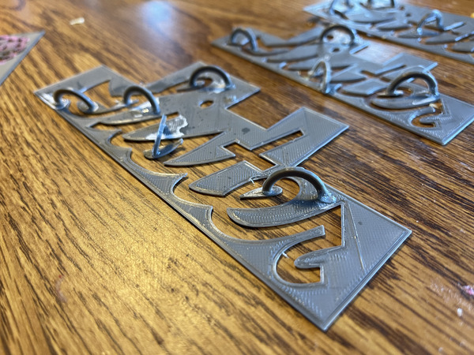

What could possible go wrong?

# Flowers

First up, this will be number 4, so we're going to need a different flower stencil for each child. For the most part, each picked their own. I got a collection of images in various formats, but to turn them into a stencil, I needed to turn them into SVGs first. For some nice images (black on white), this was easy (we'll get back into that in a bit). But for some... less so.

Previously, I probably would have done this in Adobe Photoshop, but each time I come back to it, I find myself a little more annoyed with their pricing and subscription model. I don't do enough work to afford hundreds of dollars a year, no matter the benefits they have. I want to *own* my software. I'm perfectly happy paying for a tool and version upgrades (if they actually have features I want). 

So where did I end up going? The [Affinity](https://affinity.serif.com/en-us/):

- [Affinity Photo](https://affinity.serif.com/en-us/photo/) for image editing, a la Photoshop/GIMP
- [Affinity Designer](https://affinity.serif.com/en-us/designer/) for editing vector graphics, a la InDesign/Inkscape

## Converting color images to black and white outlines

Let's work with the dandelion:

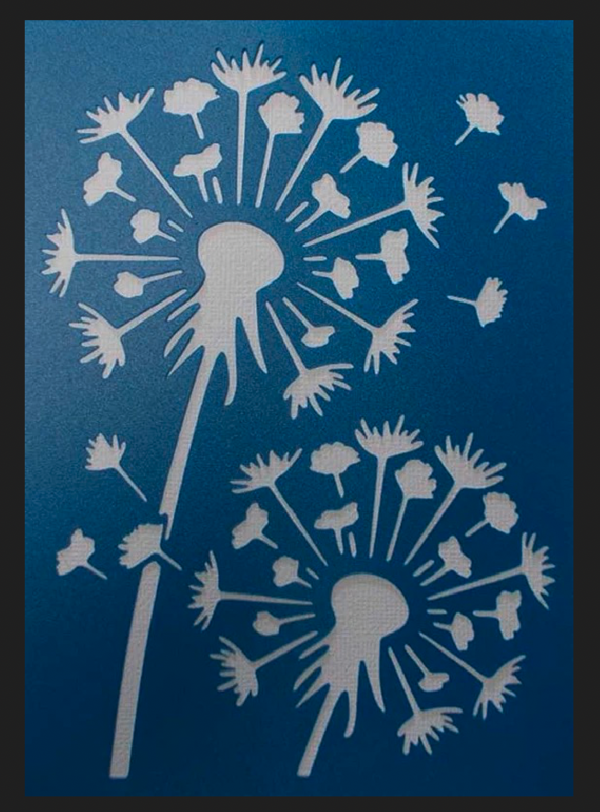

That's not terrible, but it does have two serious problems that we're going to have to figure out. First: it's white on blue instead of black on white, second, it's not very high contrast.

So first step, let's invert (to get black on white):

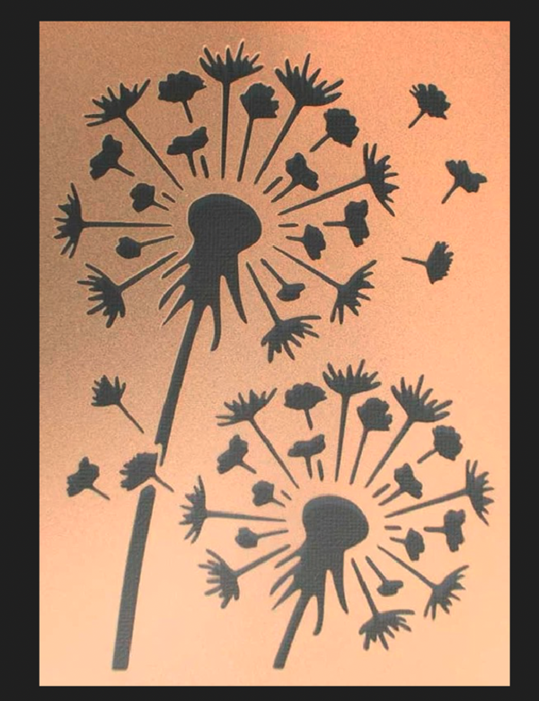

Next step, let's bump up the contrast. For this, the best tool is the 'Curves' editor. Make the 'curve' follow the rough color outline of the picture and you end up with a rather strange looking albeit high contrast version:

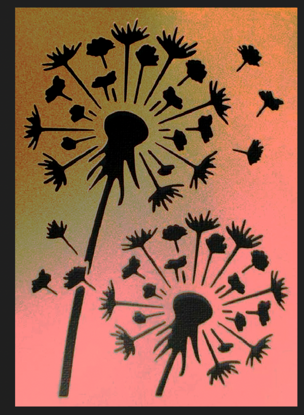

Next, let's chop it off and directly turn each pixel to black and white. A job for 'Threshold':

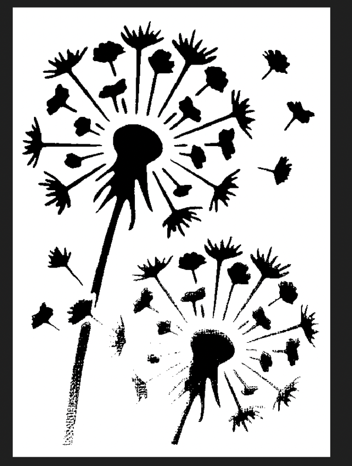

The noise isn't really a problem because we only want the one image, so I'm going to Crop it anyways:

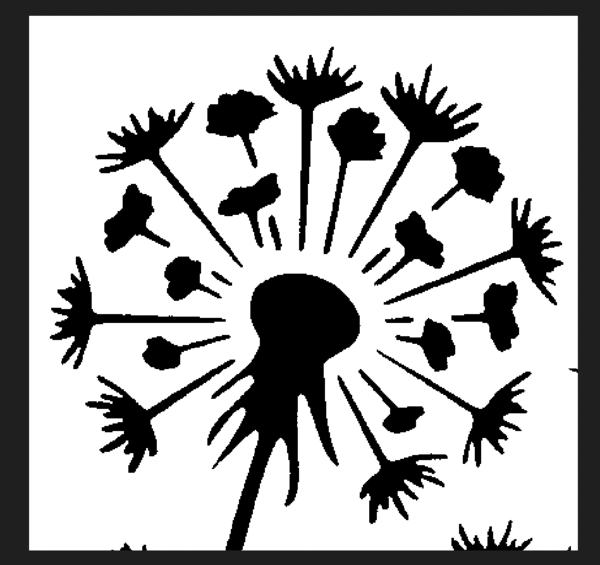

And there we have it. Next up, SVG!

## Converting to an SVG

This part is actually a bit trickier with Affinity than I wished it would be. I didn't actually check if they had an image tracing function (something that turns pixels into the nice lines of vector graphcs/svgs) built in before I bought it. But I can do that well enough. 

Start with an exported PNG:

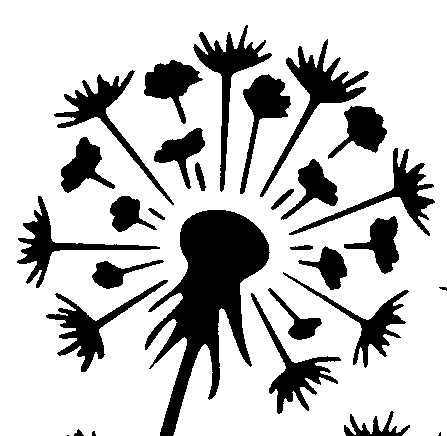

Convert to a bitmap with [ImageMagick](https://imagemagick.org/index.php), then into an SVG with [potrace](http://potrace.sourceforge.net/):

```bash
$ convert dandelion.png dandelion.bmp
$ potrace -b svg dandelion.bmp
```

That actually worked pretty much perfectly so far as I'm concerned, and I can always clean up the line work in Designer.

## Cleaning up the SVGs

Okay, now we have a number of flowers all combined into one image SVG image; one for each child:

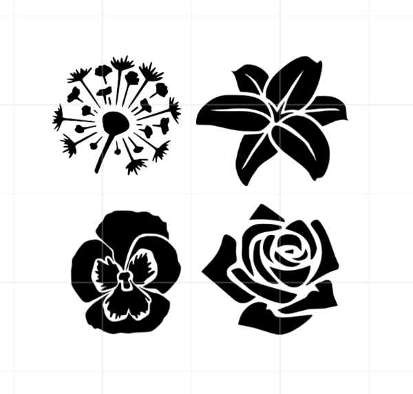

One thing that I needed to do at this step was to clean up the images a bit, removing extra pedals from the rose, stems from all of them, and cleaning up the dandelion a bit (see the above image). To do this in Designer, all you have to do is double click one of the images and then you can directly add/remove/change the control points:

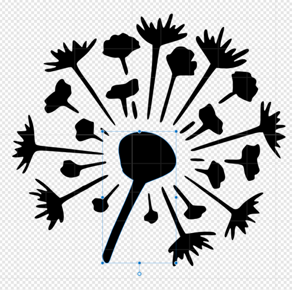

Nice!

## Editing in Tinkercad

Next up, Tinkercad! This could easily have been in other design software (I've used both Fusion 360 and FreeCAD for things like this), but Tinkercad really does make simple addition/subtraction + SVGs easy. 

All you have to do is:

1. Import the SVG from above
2. Convert it from a 'solid' to a 'hole'
3. Draw a box 1mm thick that's a little big larger

And you get something like this:

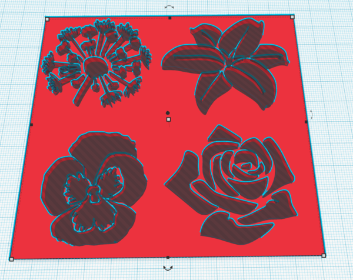

One thing to make sure is that the flower 'Cut' goes through all of the layers. It doesn't matter if it goes through the board, 

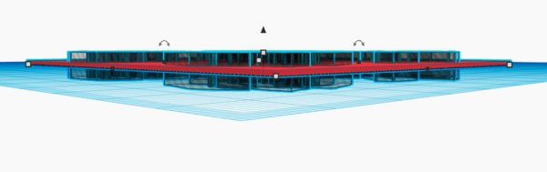

It looks a bit weird, but if you 'Group' the two parts together, it will automatically do the cut out you're expecting:

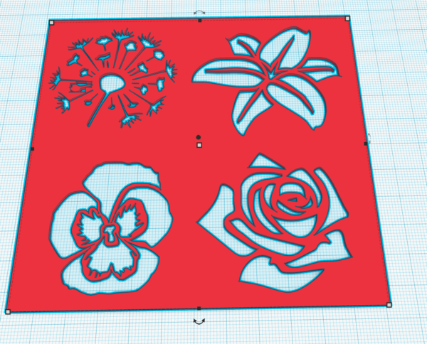

This isn't actually necessary, but it does make it look better, so you can see what you're going to get. I do wish Tinkercad had layers or that there was an option between Tinkercad and Fusion360 for projects like this (preferably one that ran locally). I expect something like that is out there... I just haven't found it yet. 

## Cura

Okay, we have an STL. Let's send it to [Cura](https://ultimaker.com/software/ultimaker-cura) to slide that up into GCode:

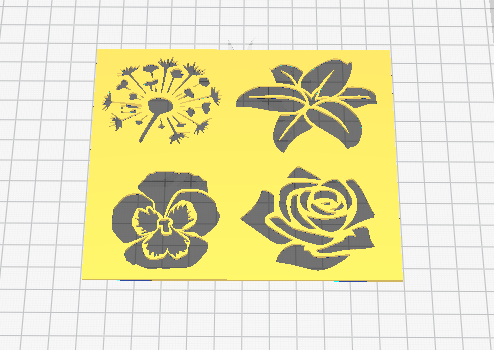

I went fairly basic with the settings. Dynamic/0.16mm layer hight, adhesion (to make sure the tiny cut outs don't get lost), no supports (it's flat). Print time was about 2 hours even for something this relatively large. It's only a half dozen or less layers!

And there we have it, stencils for the flowers!

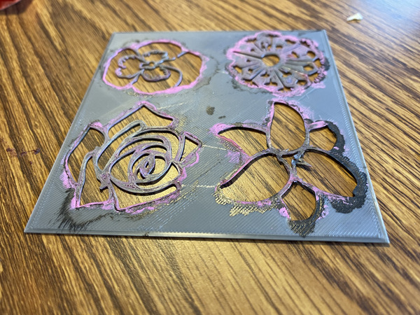

This has already been used as a test stencil, thus the paint, but the idea worked out pretty well. We did have a problem with very thin lines (especially on the pansy, you can see the difference between the final image and the stencil), but so it goes. 

# Lettering

Next up, the lettering! Now this got a bit more complicated than I was expecting... (I don't know why I don't expect things like this any more...).

## Creating the lettering

The first thing that we wanted to do was use the same Logic of English School Cursive font that we use for classwork. It's designed to teach cursive (if you turn on arrows) and has a few nice features. So I needed to be able to actually write text in that font, which Tinkercad cannot do (since it's local to my machine and they don't seem to expose local fonts). 

So back to Affinity Designer we go!

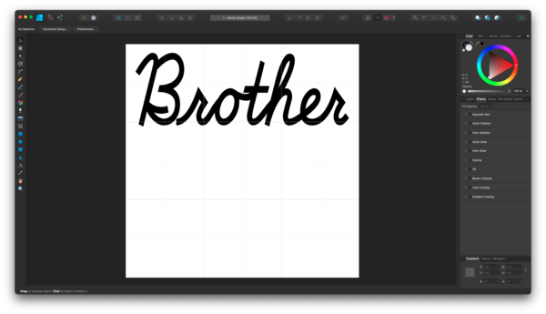

Export as SVG and it should import straight into Tinkercad, right? NO! Of course not. In the end, I tweaked the export settings significantly + converted the text from letters to curves to finally get it to easily import. Here are my final settings:

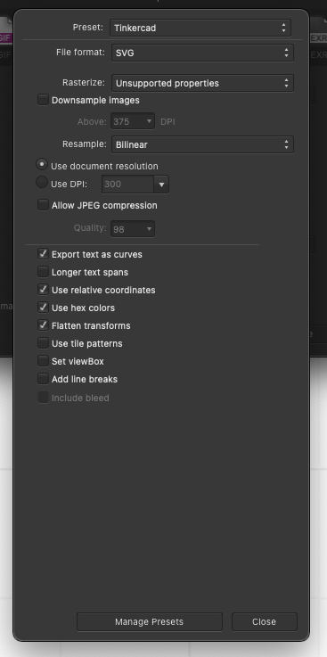

That will generate an SVG which Tinkercad can import. 

## Creating the STL

Next up, same as for the flowers. Import the SVG into Tinkercad, make it a hole, and add a box for it to cut out of. 

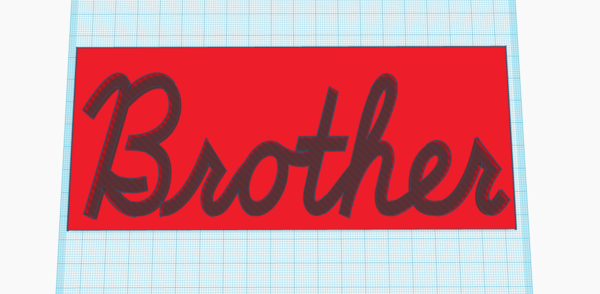

Group them together to make it actually appear correctly (not strictly necessary, but I liked doing it):

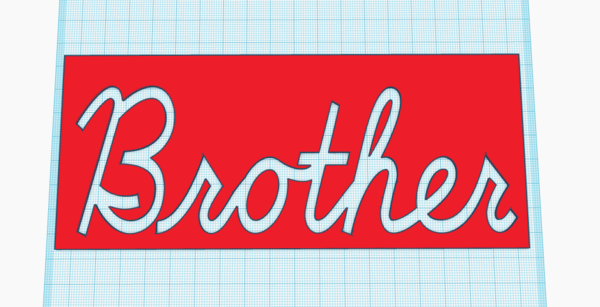

And then this time, I spent some time adding a few more boxes as holes to cut away some extra background that we wouldn't need. It saves a bit on print time and when I had to make a few versions while narrowing everything down... this was helpful. 

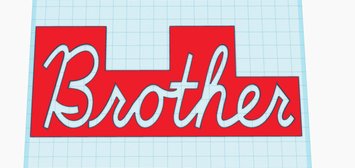

One really annoying problem with this whole solution though...

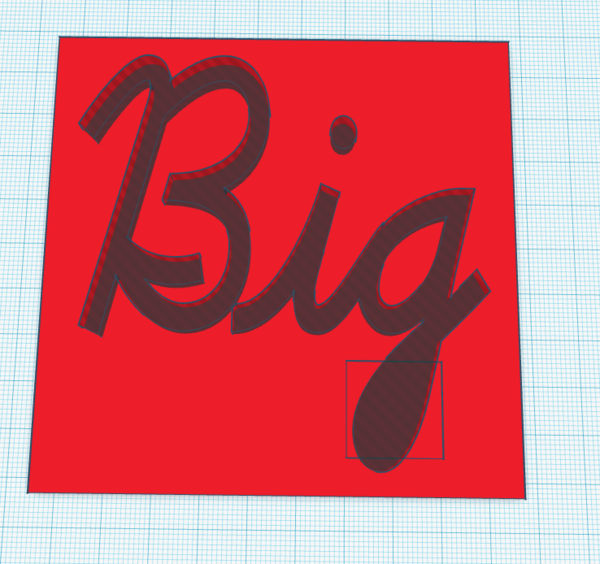

For whatever reason, the SVG properly exported the solid bit of the lower case g... but Tinkercad ignored it. I expect I could have fiddled with the settings even more, but in the end what worked out better was creating an image in Designer that was just that part of the G, exporting that, and then adding it as a solid shape back to Tinkercad. Oy.

## CURA Slicing and Dicing

And then we're back into Cura. Import:

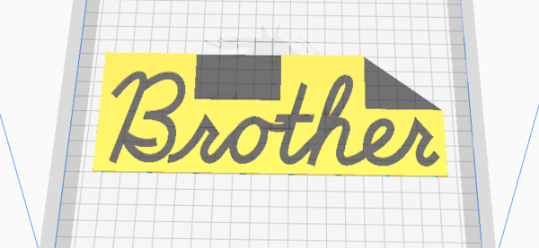

Slice as dynamic quality in adhesion:

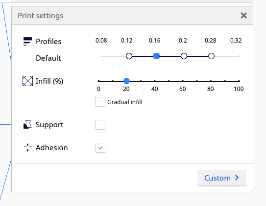

And off we go:

## Printing

Okay, this took a while. Several days of on and off printing. I actually had my Ender 3 freak out about temperature settings, so I took apart the print head, put it back together, and turned the device back on and it went on printing just fine. 

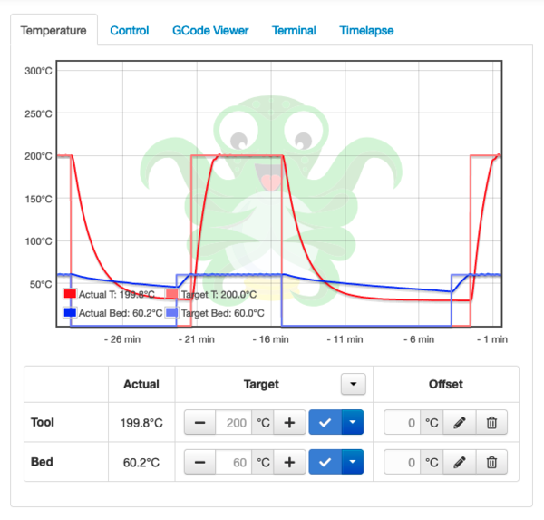

## Arches/Bridges

So, the letters have one big problem that the flowers did not have: holes. Specifically, there are letters like the O in Brother, where the center part of the circle is not connected to anything around that. There are fonts specifically designed for this, but I wanted to go with a different approach. Enter: arches/bridges!

In a nutshell, take a hollow circle in Tinkercad and cut off half of it with a hole:

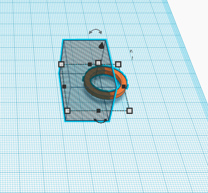

Group it together, then you can make a whole pile of them.

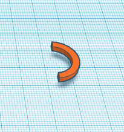

Originally, I attached these directly to each image in Tinkercad, so that they would be printed in place, but I couldn't for the life of me get them to successfully print. I think it was a combination of bridging (I did try supports, it didn't help) with the very small detail size. In the end, what worked far better was just to paint a pile of them lying flat and then super glue them into place...

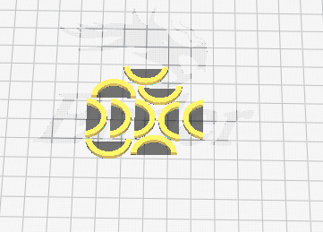

## Assembly

When leads me to:


I took each bit that had been cut out and then superglued it to an arch and then back to the main piece. It's a bit more manual than I would have liked, but it has one huge advange: IT WORKED. 

Here's a closeup of one of the arches glued in place along with the detail around the edges. 

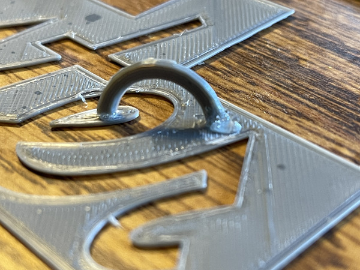

It's not beautiful by any stretch of the imagination, but the ability to print just about any stencil that you can possible imagine (so long as you can design it as an SVG) it pretty darn cool. And they've been holding up pretty well so far. 

# Painting

So, there you have it! Here's the first example of painting in progress on the current (but not for long!) youngest's shirt:

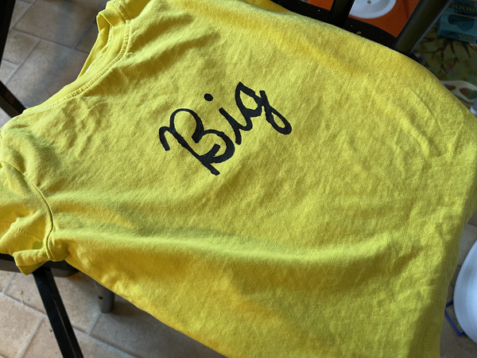

And here's a picture of one of the final designs!

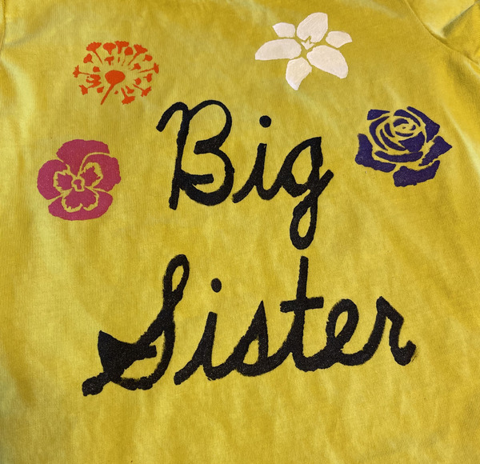

It's definitely homemade, but I think the combined effect is going to be absolutely adorable. Very very cool!

# Summary

So that was a crazy way to do it...

* Affinity Photo for cleaning up images
* potrace for generating SVGs
* Affinity Design for lettering + modifying SVGs
* Tinkercad for creating STLs
* Cura for slicing STLs to GCode
* Octoprint for controlling my Ender 3
* Superglue to assemble
* Painting the final product on the shirts

# Files

I doubt that this exact pattern would perfectly match what you want to do, but if you want to see my progress, I've attached a ZIP of all of the files used in this project:

* [files.zip](files.zip)
