Factorio is an absolutely delightful game. Recently though, I've been taking a look at my Steam Achievements for it and realized... I'm not that far off. 

So I decided to take a chance on a few runs to finish things off. 

For this first run, I was going for:

* Raining bullets - don't build any laser turrets
* Steam all the way - don't build any solar panels
* No time for chitchat - beat the game in 15 hours
* There is no spoon - beat the game in 8 hours

You can't turn biters off all the way (for any of these), but you can turn them down enough that it won't be a problem. 8 hours is... tight enough, so that's what I did. 

I did also crank up resources, but other than that, it's a standard vanilla game. 

And away we go!

<!--more-->



## Were it began--and ended

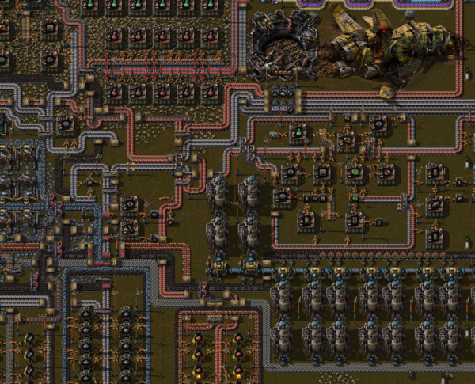

Here we have the original crash site, along with my initial spaghetti mess (just below the crash) and power (yup, I switched sides; there's NOT ENOUGH TIME TO DO ANYTHING ELSE). 

And ... you can already see (since I'm taking these pictures towards the end), this is also where I'm going to be ending the game. Seems fitting launching the rocket from right by the original one. 

## Map view

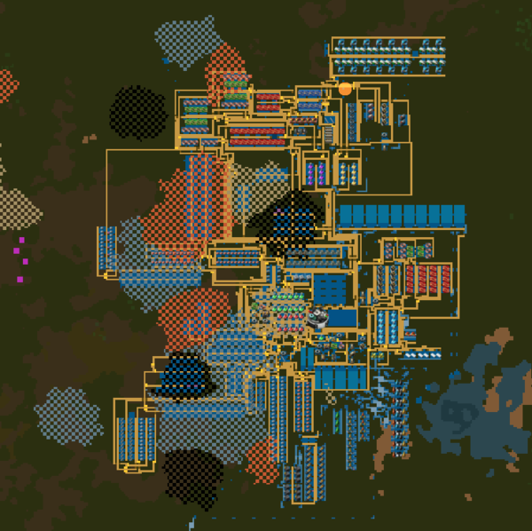

Next up, this is the entire base that launched the rocket in 8 hours. Yup. That's it. You can already see that's it's *quite* the mess of resources. I don't think I'll be doing that again. Just feels wrong to build right over resource patches. 

I ended up going for 60 science/minute, although the last two I did at half that. Really, the main chunk of time (surprisingly to me) is spent building up the LDS, RCU, and fuel for the rocket. You can stockpile a bunch, but it's still a fairly tight build at the end. 

## Green and red science

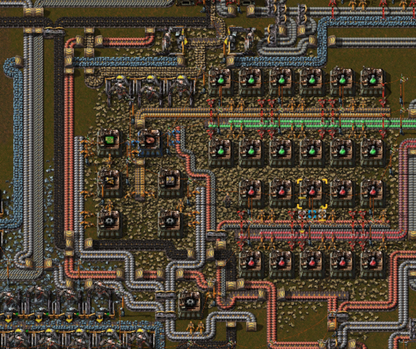

Here we have my initial science production. Why yes, this is crammed right in the middle of everything right on top of a stone patch. There's not much room for anything *not* on ores. 

## Early mall

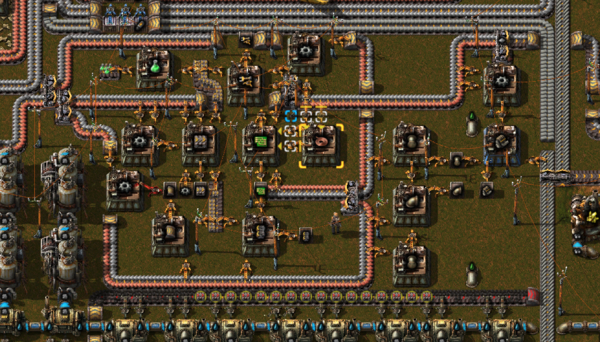

We saw this in [the first picture](#were-it-began--and-ended), but here's naother shot of the entire mall. Luckily we're not also doing *Lazy Bastard*, so I can hand craft a lot of things. We do have basic belts and inserters though. 

## Oil cracking

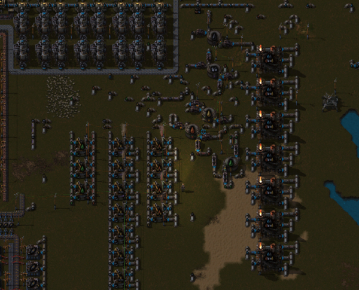

Now that we're past the basic sciences, next up is chemical science. Really, it's just a lot of piping (hence why I put pipes in my starter mall). I did actually circuit control all the tanks--which just sort of ended up in the middle of everything. Yeah...

## Purple and yellow science

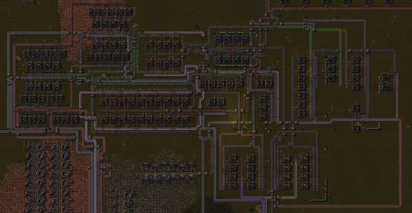

Okay next up (and I'm sorry it's a big small), purple and yellow science. I didn't build circuits in a central place and I'm regretting that here, since everything needs them. I started with only half capacity for both of these... That took some time to finish the last few techs.

It doesn't help when one or the other runs out of circuits though, so... this mess:

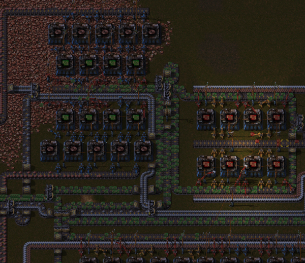

Hey, it worked? 

## Science labs

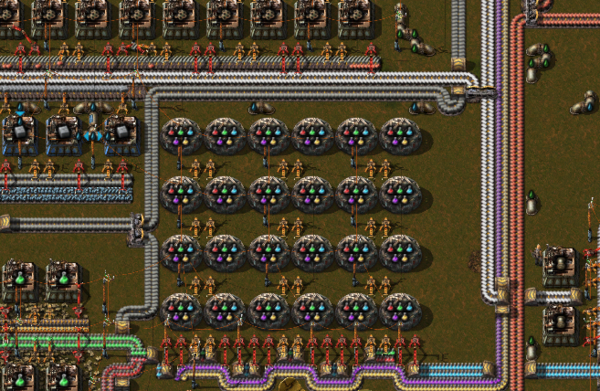

How many labs do you need to beat the game in 8 hours?

Not that many...

## Rocket components

Really, it's just a matter of combining everything. Fuel:

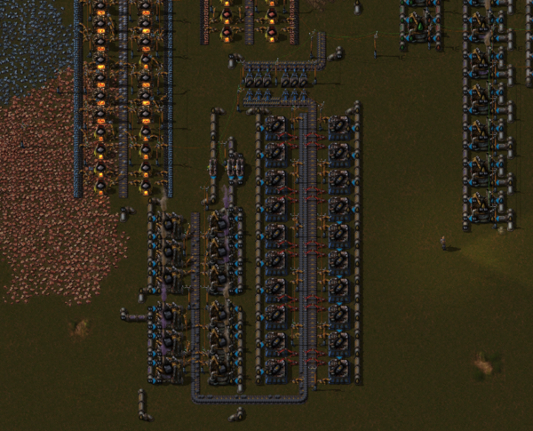

Control units:

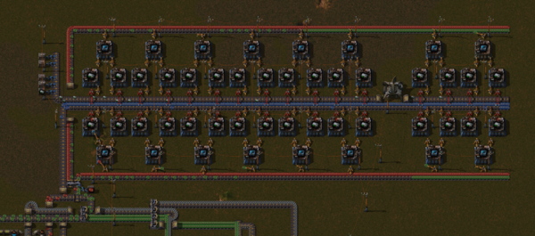

## The silo

You do *definitely* want prod3 modules in the silo though:

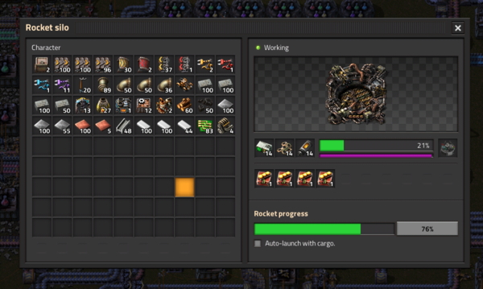

Rather than needing 1000 of each of the (very expensive) rocket components, this cuts down to closer to 700.

## Ready to launch. 

And here we go...

3:

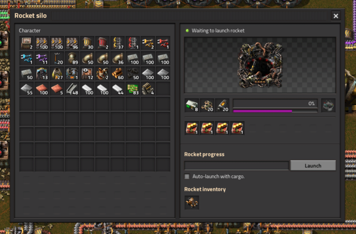

2:

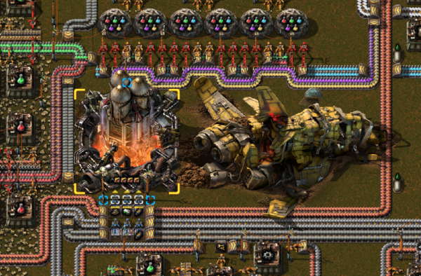

1:

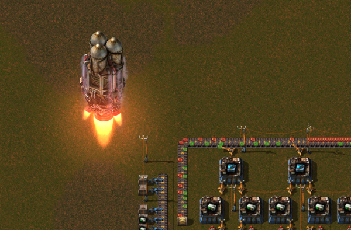

FIN!

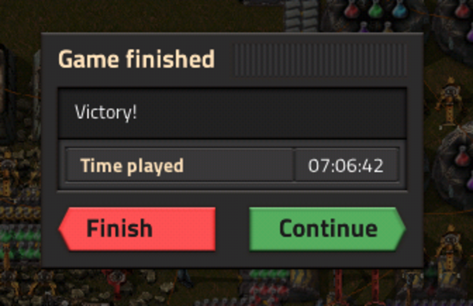

Plenty of time left!

I'm actually pretty happy with this. 

## Final graphs

Here's my final production, solids:

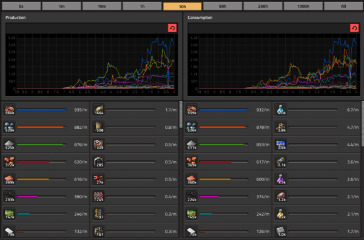

And fluids:

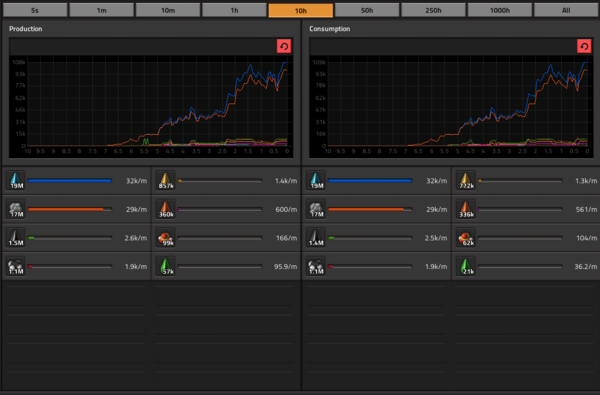

And... achievements!

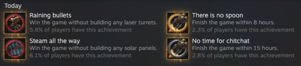

Join me next time for [[Factorio Achievement Hunting: Lazy Bastard / 100%|Lazy Bastard]]()!

