And here it is, [[Factorio Achievement Hunting; There is no Spoon|a month and a half later]]():

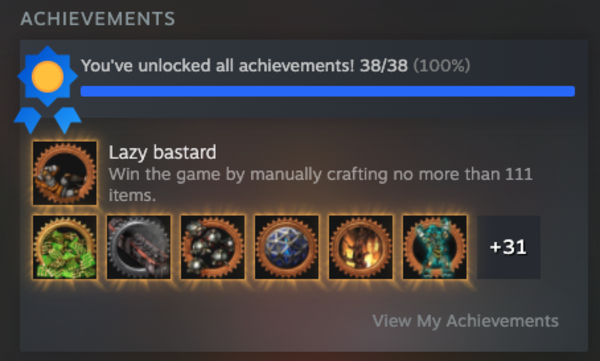

We did it!

This time, I had a quick save game in order to crank through a train in 90 minutes (that was actually closer than the 8 hour run, believe it or not) and then it's time for the long hall. I have two achievements left to achieve:

* Mass production 3 - produce 20M green chips (I had ~13M before this run)
* Lazy bastard - win the game with no more than 111 hand crafts

It's ... actually not *that* hard, just long. There are guides out there for what your 111 hand crafts can be. With recipe changes, you only need 103. Then you can turn off hand crafting permission (`/permissions` is allowed) and... just do everything by hand. You don't even need biters on.

All together, it took about 28 hours to set up my rocket for Lazy Bastard... but I wanted that one to be last. 

It may have taken another 30 hours to complete the remaining 7 million circuits...

<!--more-->

Anyway, pictures!

{{toc}}

## On the rails

Here's my only screenshot of my 'getting on the rails in 90 minutes' base:

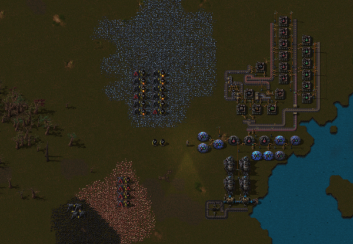

Basically, handcraft everything except science. Those last few techs *take a while* even with 8 labs and handcrafting science packs. But other than that, you can even handcraft the train. 

I enjoy weird achievements. 

## A lazy mall

Well, you can't handcraft for Lazy Bastard, so away we restarted. 

With this, there's going to be more than a bit of moving things around. But I finally got a basic mall set up. 

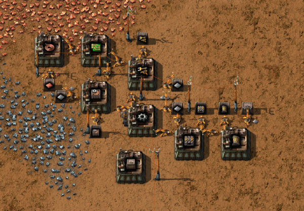

And then belted in early resources. 

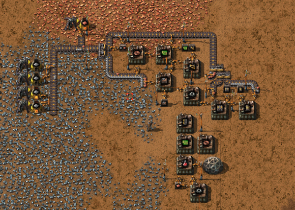

And finally got enough belts to get to automated power. 

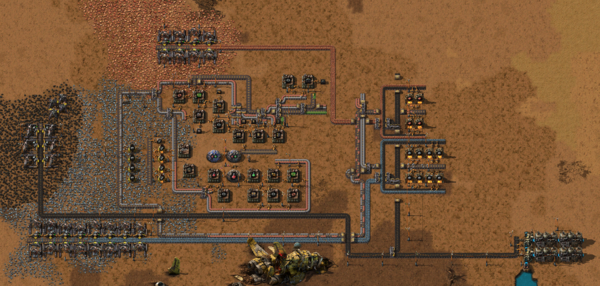

## Train expansion

I ... didn't take a lot of screenshots until I got to trains. You can seen from the top of this screenshot that I went with a fairly standard main bus base (right under the lake) for most things, but I also used the 'railworld' map preset, which means resources are pretty spread out. 

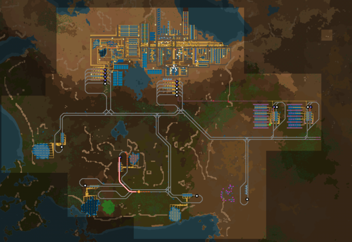

This time around, I went with 2 engine, 4 wagon trains. They look cool. The two north stations are dropoffs for the bus. Ores on the left and finished products on the right. Other than that, we have additional resources, iron in the west, coal, uranium (I'll get to it), and copper in the middle, and stone and oil in the south east. 

You can also so the beginnings of some smelting arrays taking shape for additional plate production:

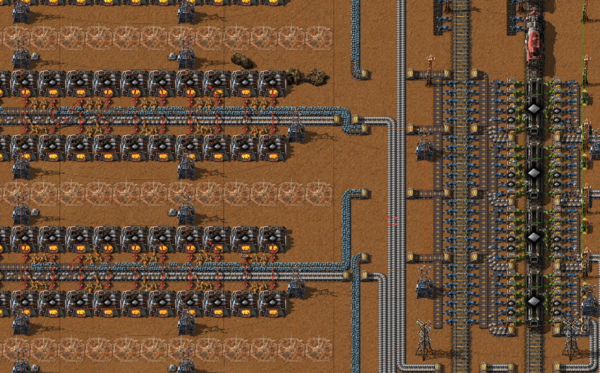

It's one of the first times I've actually built beacons into the base. I knew that I had to make 7M green chips, so I felt like building big would be good. Essentially, four wagons pull up and each is unloaded onto a yellow belt, which I can smelt the entire thing into a solid yellow belt of iron out. 

No balancers necessary!

## Keep growing

After that... well, just keep expanding. 

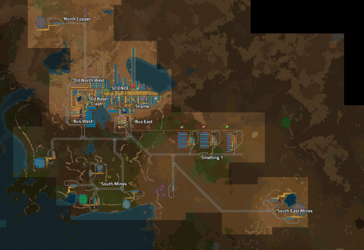

Now we've claimed two more mines in the far south east (coal and copper) and another copper vein in the north. Circuits are going to need all that. 

We also are dealing with uranium now. Nothing interesting about that, standard processing + Kovarex. I'm going to need nuclear power before too long. 

## And... growing

And we just keep needing more ores. 

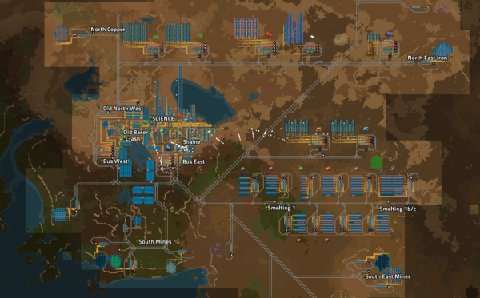

This is the full extend of the base. Here, you can see that I have many more smelting arrays (3 each of iron and copper, one of steel, and one for uranium), along with a second line north of the base for manufacturing (two green circuits, one red, one blue, and one plastic). 

Also, I tapped so many more resources. It's not as much about digging them up as it is needing enough loading capacity. I really should have put two loading stations for each. 

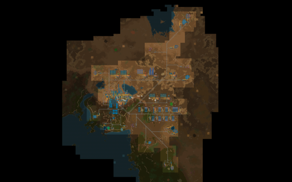

Here are some closer shots of the smelting arrays:

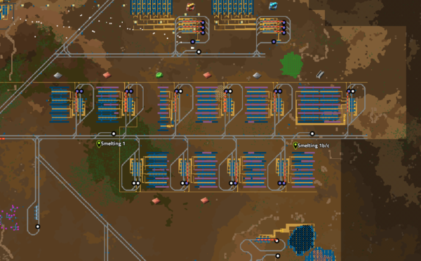

And manufacturing:

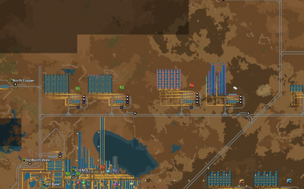

You can already see here that I'm starting to build beacons. 

I don't recall if I've ever built beacons at scale in vanilla factorio. That's a *lot* of resources. 

But hey, it did mean we could significantly upgrade our ore processing:

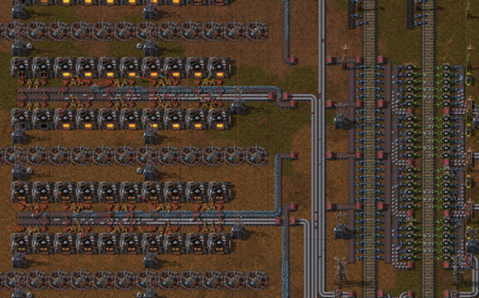

That went from 4 yellow belts to 4 red, with productivity modules meaning less resources used. And on top of that, 4 fewer furnaces per row. A nice upgrade!

## Green circuits

So, how was I actually doing with green circuits along this way?

Well, it turns out that for a while, using them was actually a problem. So...

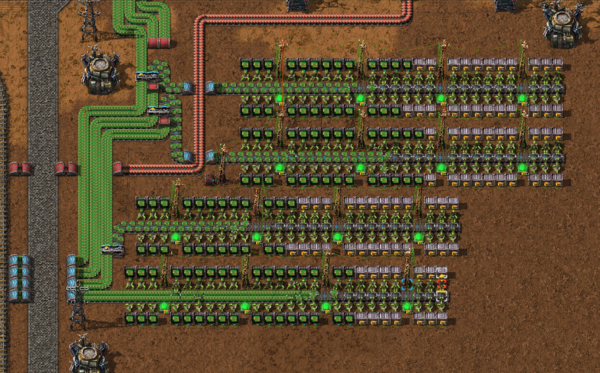

Yup. That's more than a million circuits in boxes. 

Hey, it worked. 

Here's my production:

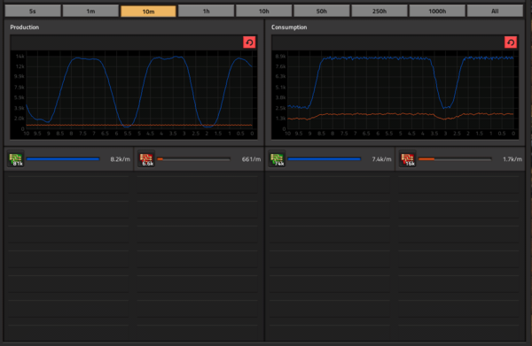

I was getting a pretty decent 8k/m green circuits, but that's still a little over two hours for each million... that's why I ran for 30 hours after building my rocket:

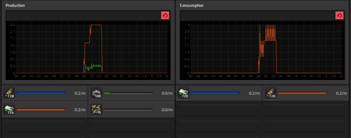

:smile:

## Overall production

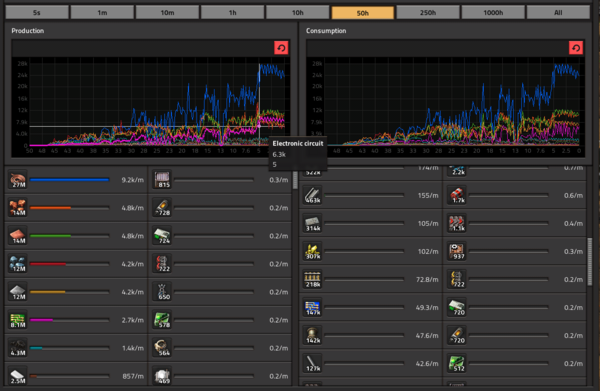

In case you're curious, here you go.

I do love how silly the copper cables (and ore for that matter) got at the end. ALL THE CIRCUITS. 

## And so we win

And so, after getting the final achievement (I ran it over night...):

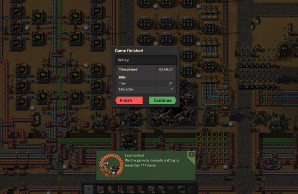

We win!

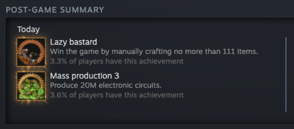

And so ends vanilla Factorio... 

For now!

(I'm so excited about the 2.0 DLC. It looks great!)