[Factorio](https://www.factorio.com/) is an absolute masterpiece of a game. It's perfect for a brian like main that loves to build things up, solve problems, and make things work. Perhaps too perfect. To date, I've put almost 2000 hours into the game over a number of runs, getting more complicated each time. Most recently, I've started a heavily modded run based around Space Exploration (adds planets!), Krastorio2 (designed to work with SE, think of it as Factorio++), LTN (automatic trains), Rampant (better enemies, although disabled on Nauvis), and the entire Brevven suite of a half dozen additional materials. If you'd like a full list of mods, I've included one [at the end of this post](#mods).

It should be fun. :smile:

I figured this time around, I should actually post my progress. Probably not straight up videos, although that's a possibility at some point, but rather screenshots and perhaps a few short clips. If you're interested, take a look, drop me a line. I'd love to chat about it. If not, just skip over it. This is as much for me (supplemental memory go!) as anything. :smile:

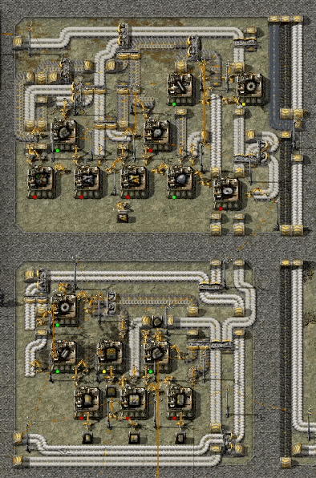

It's it just so much fun to watch?

Onward!



<!--more-->

## The map

As always, we start in the middle of the map, a bit to the East (in this case) of our starting lake. You can already see here that we've tapped all sorts of starting resources. 

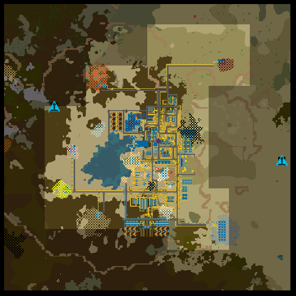

## The burner phase

First, the crash landing. For a while here, all I had was a series of burner mines on each ore type (as seen below). During the early game with Brevven's mods, you eat up iron as normal, but also a ton of aluminum, and also zircon (for anything that would otherwise need stone). In addition to the manual burner miners, I had a series of three furnaces for each ore. The second and third rows here are both for aluminum, it's a two step process. More on that later. 

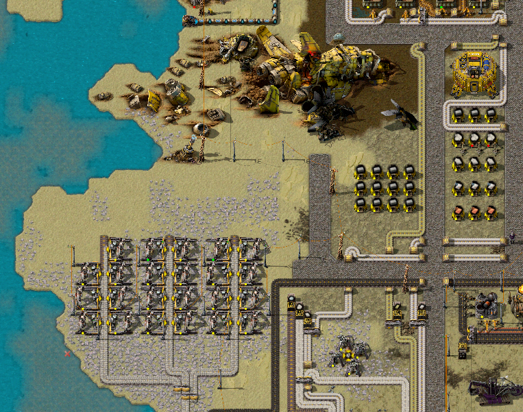

One thing that you can already see here was that I'm going for a combination of spaghetti (there will be belts going everywhere until I get to trains) and roads (so I always have somewhere to walk). We'll see how that goes. 

## Basic and Automation (Red) Tech Cards

### First smelting arrays

So at first, everything was manual. But of course, that can't last. The factory must grow. 

The first resources on the block? Aluminum and iron of course!

If you look back at the [map](#the-map), aluminum is the tan color right by the lake. Right in the middle of everything. That made for an interesting first build, I was already taking that space. 

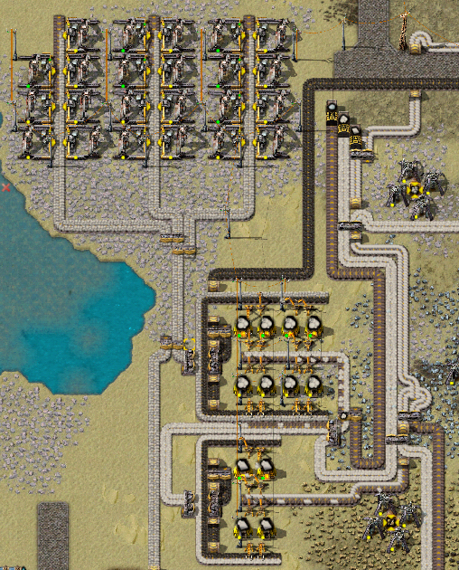

Especially since it needs multiple steps. Eventually I made a larger smelting array for aluminum to the south. 

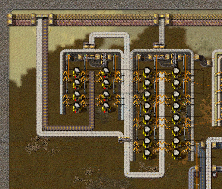

Not big, but enough for the moment. That goes all of the base... it's such a wonderful  mess. 

Each array is designed with a pattern I've seen and used a number of times with two splitters facing each other, one for coal and one for the resource to smelt. That way they can be chained side to side. In this case, the output is the same direction as the input:

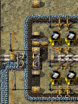

Next up, iron. The main patch of that is to the far southeast of the [map](#the-map), so I had to run a belt up a decent bit to a smelting array. I thought about doing it on-site, but at this point in the game there's not much difference.

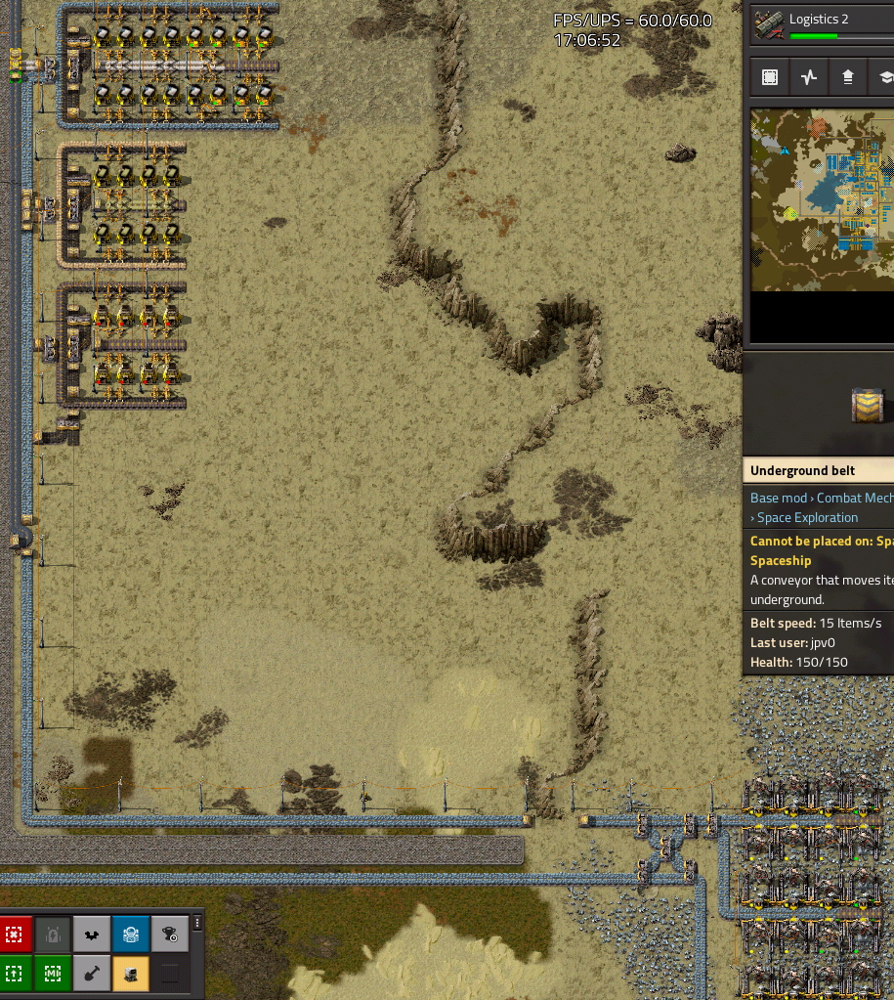

Whew. That's a lot and we still only have two resources. :smile:

### Science

Aluminum and iron are enough to set up the basic tech cards (science packs in Krastorio). I no longer have my original hand fed science setup, but here's what I have built for basic, automation (red), and logistic (green):

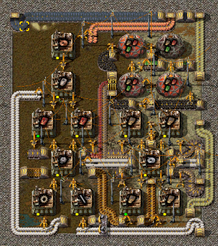

Everything has already been upgraded to electric assemblers and inserters, but I'm still using those burner labs so have to bring in coal for that. Luckily, you can snake the coal in pretty well. Originally, everything was hand fed, but now I have belts snaking all through bringing resources in from other parts of the base. For basic tech, aluminum and wood. For automation, iron as well. I'll come back to logistic. 

### Early manufacturing

Two things that I need a ton of that I can automate: belts (of various kinds) and inserters (only yellow, since I'm using Bob's inserters):

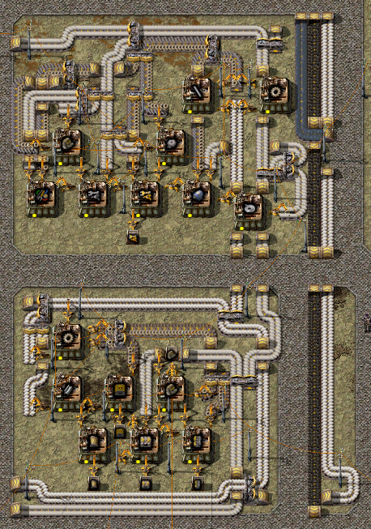

They're not at all fast, but they build up enough over time for the time being. 

Man I have such a mess of belts running around those. :smile: Isn't it wonderful? 

### Power

So far, we're really basic on power. I just have a fuel processor running on coal (it adds 10%) and a handful of burner turbines. I'll probably upgrade to steam soon.

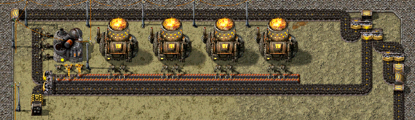

Although, I could use my natural gas setup...

## Logistic (Green) Tech Cards

### Greenhouses

I never understood quite why you couldn't automate wood in the base game. No worries, with Krastorio, you can!

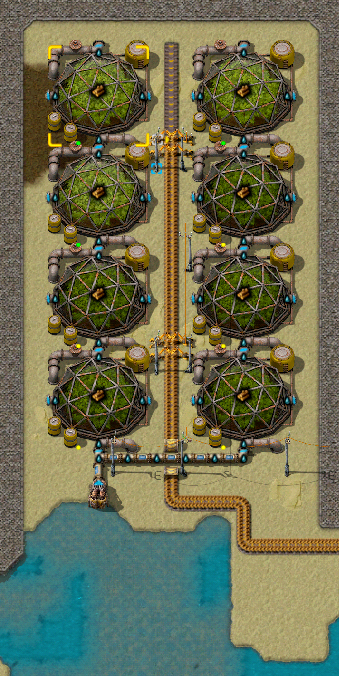

It's not much, but it's more than enough for right now. 

This is one interesting bit that Brevven's mods brought to the table: to make pipes, I needed lead (I'll come back to that). But to make *underground* pipes, you need solder, which needs tin as well, and a foundry. So... all above ground pipes for now! I really like that wrinkle. A bit more thinking. :smile:

So that's enough for tech 1 and 2. Back to more resources. 

### Stoneworks

Other than aluminum and iron, I've also tapped a number of other basic resources. I have stone in the south and zircon in the west coming around the bottom of my lake to make a stoneworks. 

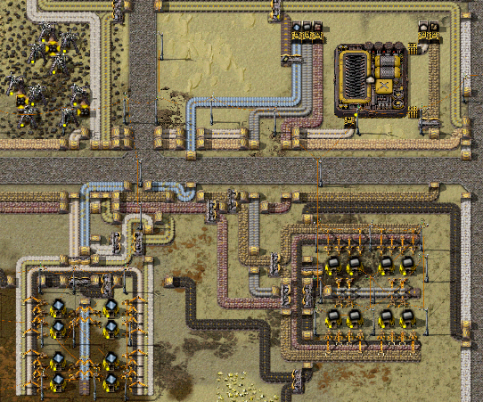

By far the most interesting bit is that glass needs alumina (a byproduct of making aluminum) and tin (which you get back 80% of the time). So far, the prioritization loops I have in place are working well enough, but I imagine logistics for that are only going to get more interesting. 

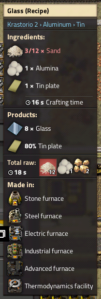

### Other metals

We also have tin in the west, copper in the northwest, and lead in the northeast. For the most part, basic smelting setups, except lead produces copper ore as a byproduct. Again, I prioritize things that are byproducts over direct production to not bottleneck anything. It's worked so far. 

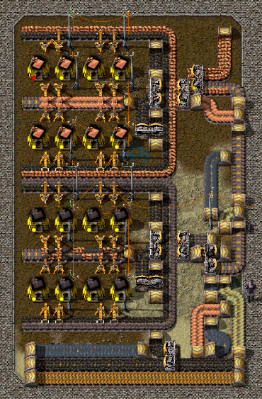

### Natural gas and early plastic

Speaking of which, one of the Brevven resources is natural gas. You can tap it early, but at first, all you can do is burn it for power. I don't have tanks or even underground pipes yet after all...

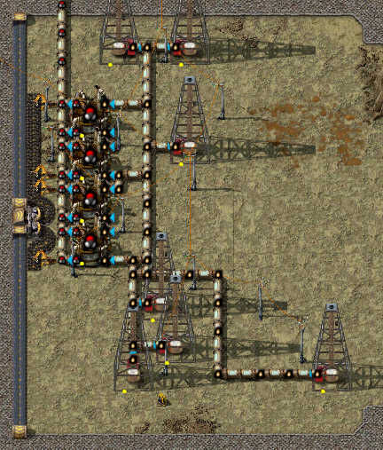

But finally I've gotten to the point of making it into [[wiki:formaldehyde]](), which in turn can be made into a very early plastic: [[wiki:bakelite]](). Oh factorio, making me learn things about real chemistry. 

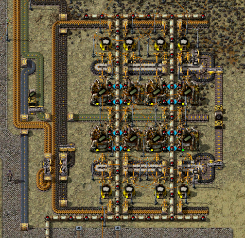

### More metals: bronze and solder

Finally, we're getting somewhere. With all the basic metals, we can combine them in the foundry (from Brevven as well) to make bronze and solder:

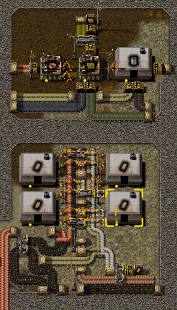

They're so fast compared to the scale I'm at that I only need a handful, but with those and copper, I have enough to make green circuits already!

### Logistics Tech Cards

And... green tech cards! (Logistic)

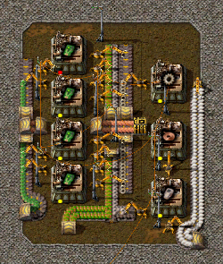

## What's next? 

And that's all. 7 hours. That's quite a lot, but I'm loving it so far.

As always, the next tech card is the next goal, but with green science comes a number of other cool things I hope to do this week:

- Trains / LTN: At least a basic network, possibly full blown train stations.
- AAI Wardens: Construction on wheels, albeit without bots so far.
- Early oil processing: Mostly for the next tech cards.
- Chemical Tech (Blue): Unlocks bots!
- Early core mining: All the resources! I don't know if I'm ready for that, especially power wise. 

Onward!

## Mods

First post, here's a list of all of the mods that I'm using this run. It's... extensive. 

Core Mods:
- Space Exploration: Much more late game! Go to other planets!
- AAI: Same dev as SE so works well together, adds programmable vehicles and other cool stuff
- Krastorio: A bit more complicated early game + powerful late game machines
- Brevven's BZ Mods: Adds a bunch more resources, works well enough with the above
- LTN: Smarter train networks
- Rampant (+ Arsenal): Better biters, disabled on Nauvis, but on any planets/moons with biters

AAI:
- Containers & Warehouses
- Industry
- Programmable Structures
- Programmable Vehicles
- Signal Transmission
- Signals
- Vehicles: Chaingunner, Flame Tank, Flame Tumbler, Hauler, Ironclad, Laser Tank, Miner, Warden
- Zones

Brevven's BZ Mods:
- Alumium
- Graphite & Diamonds
- Lead
- Natural Gas
- Salt & Chlorine
- Silica & Silicon
- Tin
- Titanium
- Tungsten
- Zirconium
- Foundry: Melting ores
- Optional Advanced BZ Settings

Inserters:
- Bob's Adjustable Inserters mod: I don't like many inserters and I like L shaped inserters :smile:
- Bob's Functions Library mod: see above

For Space Exploration:
- Alien Biomes: Make planets cooler, required by SE
- Better Asteroid Mining: Infinite ores in asteroids to make it worthwhile to use them
- Bullet Trails: Required by SE
- Combat Mechanics Overhaul: Required by SE
- Grappling Gun: Required by SE, sounds fun
- InformaTron: Required by SE
- Jetpack: Required by SE, faster transport without trains
- Orbital Ion Cannon: Die, biters!
- Robot Attrition: Die, bots! Wait, what?
- SE Space Trains: Space themed trains
- Shield Projector: For protection
- Shiveros Nuclear Overhaul for SE: Multiple nuclear fuels and processes
- SE - LTN Integration: Use trains with space eleveators
- SE - Core Miner Output Helper: Show output per miner

LTN:
- LTN Combinator Modernized: A single combinator for stations
- LTN Manager: See what your network is doing

Blueprints:
- Blueprint reader combinator: Add blueprints to circuits to load everything needed into a rocket
- Blueprint Tools: Add landfill under blueprints among other things
- Recursive Blueprints: Automate blueprints, potentially used for self-expanding or automatic offworld factories

Circuits and Combinators:
- fCPU: Programmable combinators (for late game circuits)
- Moon Logic: Alternative to fCPU, programmable circuits in Lua
- Stack Combinator: Turn item counts into stack counts, mostly for trains

Other:
- Advanced Solar High Resolution: More tiers of solar power
- Auto Deconstruct: Automatically set miners for deconstruction when they're out (placing pipes if necssary)
- Auto Trash: Set up several different logistics setups (on planet, in space, building)
- Bottleneck Lite: To identify parts of the factory not working
- Display Plates: Put markers on the ground and blueprints to remember what goes where
- Even Distribution: Fill early game factories easier and clean inventory
- Factory Planner: Design mini-factories with correct ratios even with complicated mods
- Far Reach: I like being able to grab things across the map
- Fireproof Bots: Just in case
- Fluid Must Flow (+ for Space Exploration): Big ducts for large fluid networks
- GUI Unifyer: Make all the various mods play better together
- Logistic Cargo Wagon: Direct logistics from trains
- Max Rate Calculator: Select a region and see how fast it runs, complement to Factory Planner
- Milestones: Figure out when you first do each ore/science (achievements lite)
- Portable Power: Personal nuclear reactors
- Quality of Life Research: Primarily for faster hand crafting and movement
- Recipe Book: Look up recipes/uses for materials (like FNEI)
- Safe Waterfill: Place water, not intended for use on dry planets
- Santa' Nixie Tube Display: Pretty pretty displays
- Solar Calculator: Set up optimal solar ratios on any planet, with any level of tech
- Solar Walls: Use up that extra space
- Squeak Through: Just walk through anything
- The Ruins Mod (+ for Krastorio2): Find things on various planets
- Updated Construction Drones: Start with cheap drones that can build things for you, accelerate early game building
- VortiK's Armor Plating: Armored trains
- Well Planner: Automatically make blueprints for oil wells
- YARM: Watch critical patches for running low
- Train Trails: Trains leave pretty colors behind