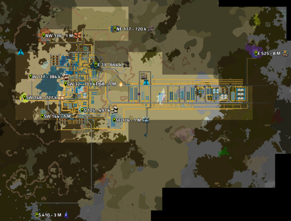
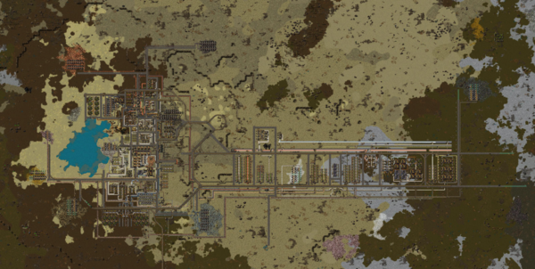
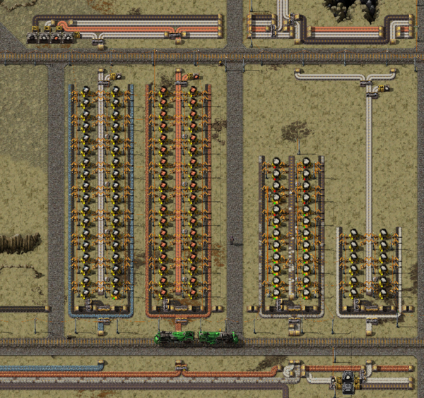
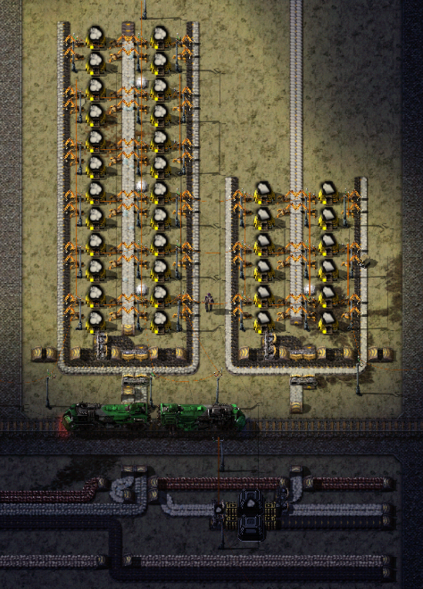
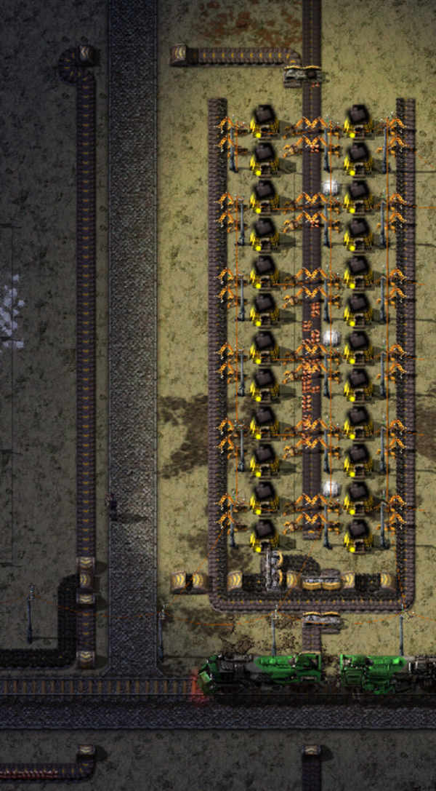
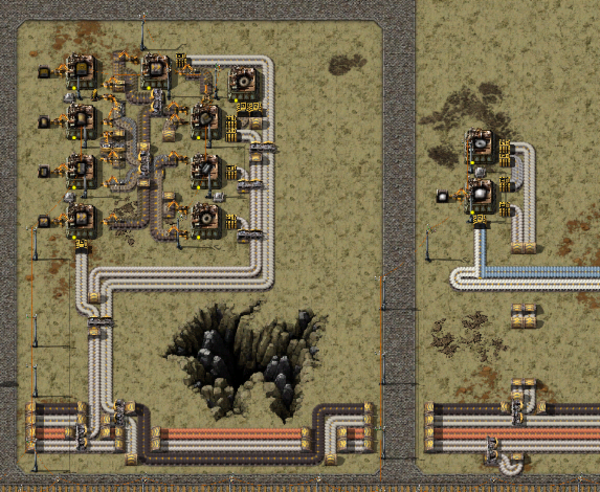
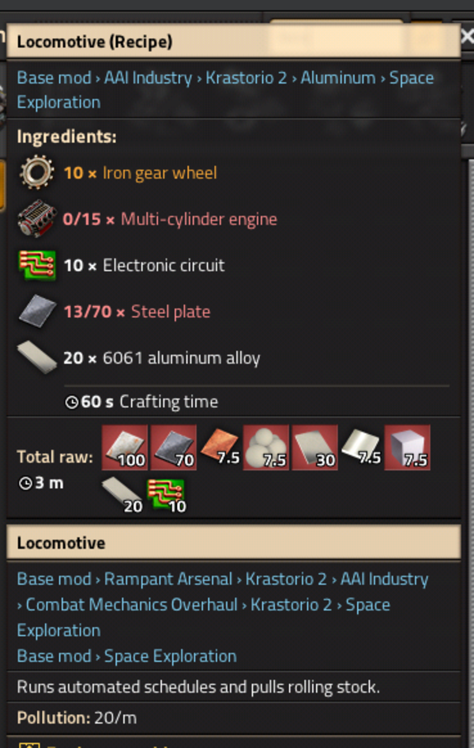
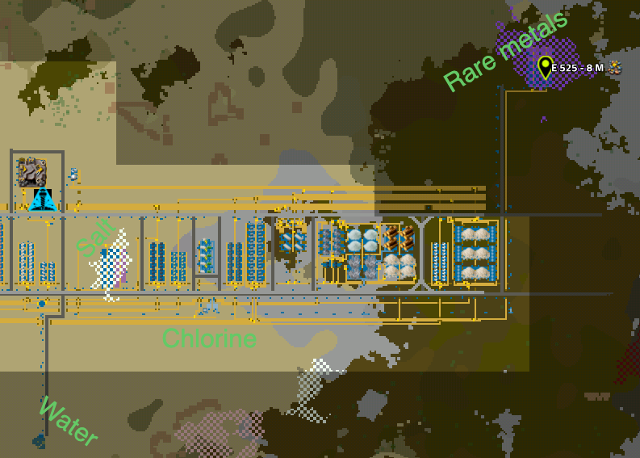
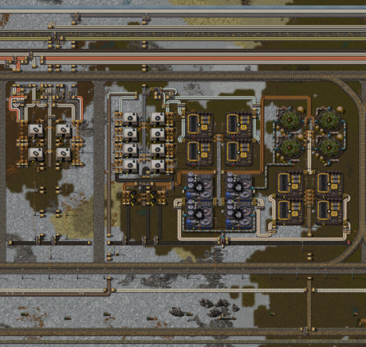
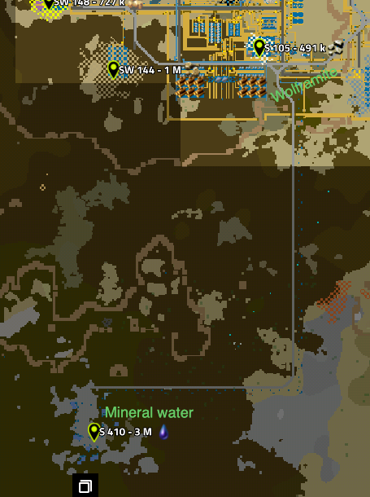

You thought I'd forgotten, didn't you? Well, yeah. It took a while, but I'm still here!

<video controls src="train-trails.webm"></video>

The main reason that it took so long is... I got sick of spaghetti. I like building like that, but for something the scale of what I'm attempting, it just doesn't work. 

Enter: the main bus:

Or as a rendered view with [mapshot](https://mods.factorio.com/mod/mapshot) (I was planning to include that, but the output is a few hundred MB. Perhaps in another post). 

Off we go to the east. As I mentioned in the first post, there are no biters on Nauvis, so I'm safe to do whatever is needed until I get off world. 

## Table of Contents



<!--more-->

## YARM

So, you might have noticed a few waypoints there. Those are generated by [YARM](https://mods.factorio.com/mod/YARM). Basically, when I tap a patch, I can put this on to monitor it. That way I know when I'm running low / out of a specific resource. Particularly helpful with so very many of them. 

## Starting the bus: Iron and copper

So first up, all of the smelting columns. They're mostly all the same pattern. Here are iron and copper:

Most of the single use products are just like that. 

You will notice a second copper input line coming in from the east. That's from lead. Speaking of which:

## Aluminum and lead

More interesting though are aluminum and lead, since those have byproducts. 

Specifically, aluminum is a two step process and I have to store the extra alumina and silica, just in case (see below the array):

And then lead outputs copper ore, which I feed back along the resource lines to the copper smelter. 

I do have to make sure that I take that *first*, otherwise, I might back up my lead production. I still might, but that will be a problem for another day. 

## Glass

Speaking of smelting, I found glass really interesting to do again. Mostly so that I could make lamps. :smile:

<video controls src="glass.webm"></video>

I'm using [Bob's Adjustable Inserters](https://mods.factorio.com/mod/bobinserters) here as part of my 'I made the game hard enough, let's make some parts easier' bit. So I can pick up from most tiles around. It just makes more sense!

## A 'mall'

Now that I have a basic bus... what in the world am I going to do with it? 

Well, apparently I'm just going to make belts and lamps so far. :smile: I spent so long rebuilding everything into a bus (and getting more resources) that I haven't built anything else yet...

## Trains

Now that I have the bus and a mall, my base is really starting to get pretty huge. (For early game values of huge.) So I need a way to get around quickly. 

At this moment, I could push for one of three options:

* A car
* [A car that drives itself](https://mods.factorio.com/mod/aai-programmable-vehicles)
* A train system

The point of the second and third is that I tell them I want to go somewhere and then I can switch focus to my other monitor and do something else while I get there. And the AAI cars are pretty good... but I'm going to want trains everywhere.

The only problem is...

The train recipe is kind of nuts.

You might think that doesn't look that bad. I have iron, steel, copper, and aluminum. I even have green chips and I can make zircon. But ... what in the world is that aluminum alloy? And is that tungsten? 

Yup. 

Both things I do *not* have yet and both things that I need a fluid to mine. 

## 6061 aluminum alloy 

Aluminum alloy needs rare metals. Which need chlorine to mine. Which I can make, but needs salt and water. But my map is dry... there's no large scale water other than at spawn. 

So what did I need to do?

Well, luckily, there is a *tiny* (about 6 tiles) lake just south of my new bus. And there's a salt patch right in the middle of it. So I can combine those two and make chlorine. That's still not really anywhere near the rare metals... so pumps it is!

This is so silly looking. It would be much nicer with a proper train network... but remember? I can't even build a train yet. 

Once I actually have it though, I also need silicon, which I wasn't making yet. So that's fun. Silicon in turn needs coke, which needs wood. So I have this whole thing: 

But with that, I can make trains... right? 

## Tungsten

Nope. I need tungsten as well, which at least is easier to process. Just smelt wolframite. But to get that... I need mineral water. I drove all over the place before finally realizing that I missed some not *that* far south of my base. 

And that's it! I have enough for trains. A bit of pocket crafting (why yes, I am building a train my hand) and I have my own personal network! Rails were much easier, just steel (which I haven't even moved to my bus yet, but I am making) and stone (which I have lots of). 

Factorio is wonderful. 

All of that took several hours... so I'm done for the moment, but each hour I spent building up a solid base now is one I don't need to spend later! 

Right?

right...?

## What's next? 

So, what's next? 

I have trains. And I have a bus. But that's about all that I did on last time's checklist... But hopefully next time will be better. 

I think my main goal next time will be to use the bus for a while. I'll put off trains and bots first. Perhaps oil processing. We shall see!

Onward!

<video controls src="train-trails.webm"></video>
