Been a bit. I ... did not realize just how much a bit though. 10 hours? I must have left it running at some point... really I must have. :smile:

In any case, the big change this time has been a massive extension of the main bus (about double) along with initial implementation of a gigantic rail network. 

## Table of Contents



<!--more-->

## Overview

As mentioned, everything is just ... more. 

The factory must grow. 

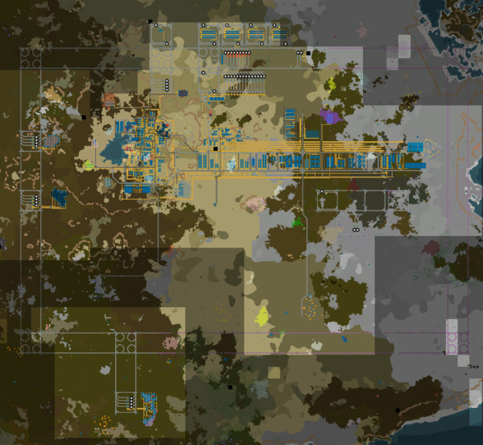

A few things to note: 

* There is a fair bit of [bus extension](#extending-the-bus) to the west. Mostly new smelting, but especially in additional more complicated outcomes.

* [Science](#science) is now on the bus, just north of the center, near the rare metals. 

* Power is now primarily [natural gas](#natural-gas-power) instead of coal. 

Let's go through each in term. 

## Extending the bus 

First, the bus. 

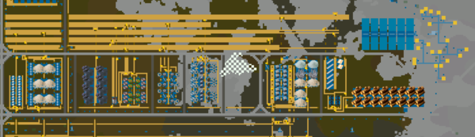

You can see (it's tiny!) on the machines, but from left to right we're now doing titanium, glass, flake graphite, green circuits (that needs to be scaled way up eventually, but that will probably be on trains), concrete (helps with power poles), and titanium byproducts. That may be as much as stays on this main bus, since as can be seen [above](#overview)... we're running into a bit of water. 

Back at the very base of the bus, I did actually add a bunch more to a proto 'mall':

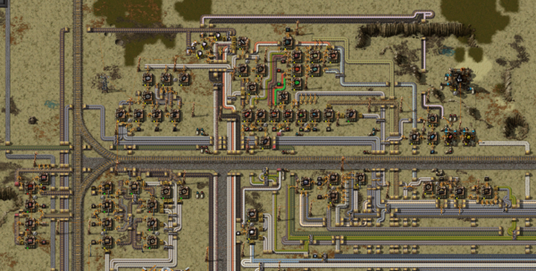

I do find it amusing that despite going for a bus... the mall is still a mess. But that's sort of how things have to go for one off products in my mind. Ordering is great for things that require a bunch of machines (ergo bus or city blocks). But single producers? Just route it around. 

And by having it all around this rail, it's easier to pick things up! At least until bots. For next time! I hope. 

## SCIENCE 

Next up, SCIENCE. 

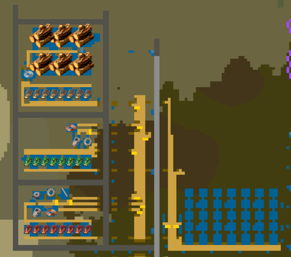

Previously, it was in the big spaghetti mess. Now, we have a branch above the center of the bus. So far, it's producing basic, green, and red. I really do need to move on to chemical science... but trains. 

Having so many more labs (35) certainly does make science quite a bit quicker though!

## Natural gas power 

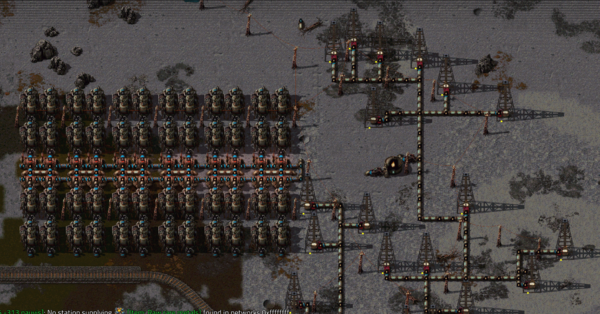

With great expansion comes great power needs (Spider-Man? if you say so...). There's another natural gas well that's pretty large on the end of the bus... and we can burn that for power, so let's do it. 

It's kind of nice and IMO easier even than coal. This should last for a while, until we get to either solar or nuclear. It definitely won't expand well to space though. 

## Core mining

Speaking of power, remember that big core seam right in the bus? I've tapped it!

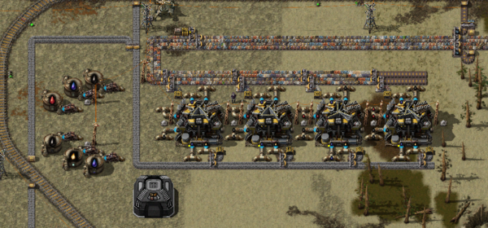

The entire point of core mining is that it's an infinite source of resources. So you never need to move to new ore patches. On the other hand, it's much slower. On the other other hand, you get everything from it. So worth doing. 

It does take a lot of power though (when running), ergo [natural gas power](#natural-gas-power). 

Once we have it all, we're just getting into trains. So set up a line to parse out each individual resource:

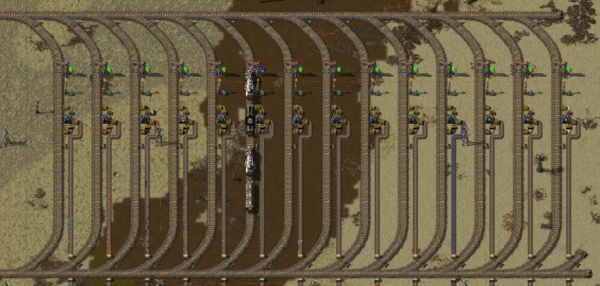

On the good side, this lets us produce everything! On the downside, if we're not using something yet (like flake graphite right now), everything just stops moving. So I do need to figure out syncs for everything if we want to use this. Perhaps eventually recycling extra into landfill? We'll see. 

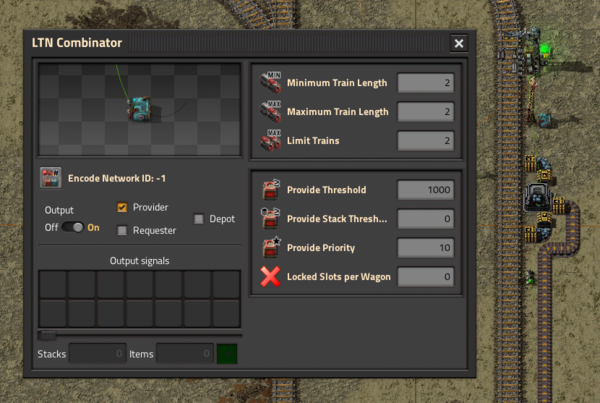

One reason that I'm [using LTN](#ltn---trains) is exactly this: priority! It's possible to build priority stations with vanilla circuits... but it's a bit more complicated. In this case, what I can do is set `Provide Priority: 10`. That means that if LTN needs iron ore (for this station) and this station has enough, it will get used first. That should help with the backup, at least so long as we're using everything. 

## LTN - Trains!

Speaking of trains... this probably took the most time so far. Just look at that loop:

Around the entire old base. Everything outward from here should be trains.

Because we're using LTN, one thing that we need is a depot:

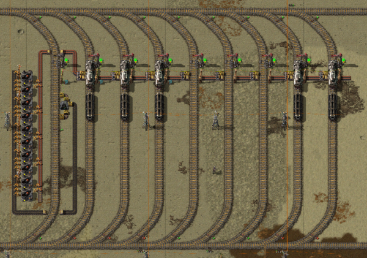

This is where trains will sit between loads. Originally I was using coal directly, but that's *slow*. So now I've put a bunch of fuel processors in place. Now whatever I drop off in that first station will be turned to fuel. All of the rest of the stations will hold trains. 

For now, it's all 1-1 trains. They're small for bulk movement, but then you get more trains. And how awesome is that? 

I will consider longer trains for ore loading, perhaps 1-3? We'll see. 

Next up, unloading for LTN cells ([ore smelting for example](#ltn---smelting)):

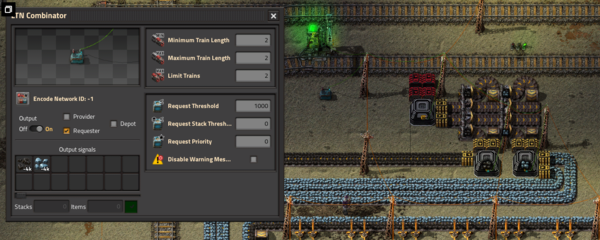

For better or for worse, I decided to have a single unloading station with train limit 2 for each cell. Everything gets unloaded into one container which is then passed onto one per resource with splitters. You do need to program the splitters, but it works so far. Everything is connected with wires, so the 'current resource count' LTN needs is based both on that just unloaded + that sorted (- anything on belts). 

That does mean that I can only drop one resource at a time (with a second train on the way or waiting), but it does make the stations all the same. We'll see how that goes with overall bandwidth. 

I expect that we may need to increase this. But that's one benefit of city blocks. If you need more... build another block!

Next, turning around. Originally, you could only turn left around each block. But that meant that to turn right... you have to turn left three times. Not great. So instead, I designed a block designed for turning right. 

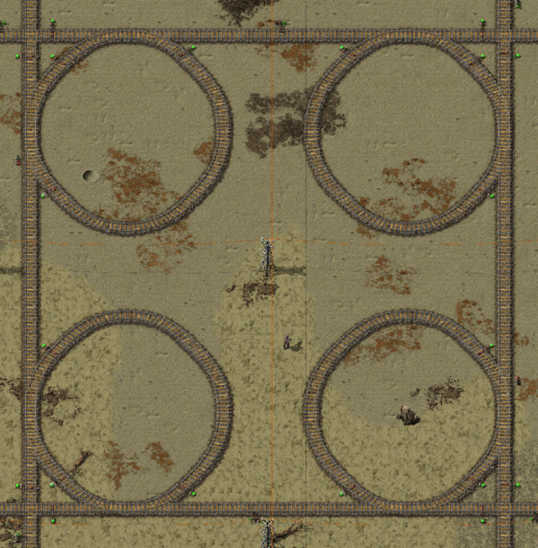

Does it look ridiculous? 

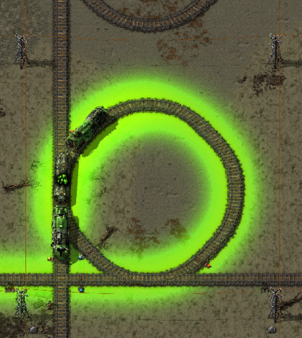

(Yes, my personal train is carrying around uranium. What of it? It makes it green!)

Absolutely. 

But it does work!

For now. We'll have to see if there are any issues with trains blocking one another. I expect with almost all signals being chain right now, it will. I can put a few more full signals in place. 

## LTN - Smelting

And finally, ores and smelting. 

First, pick up:

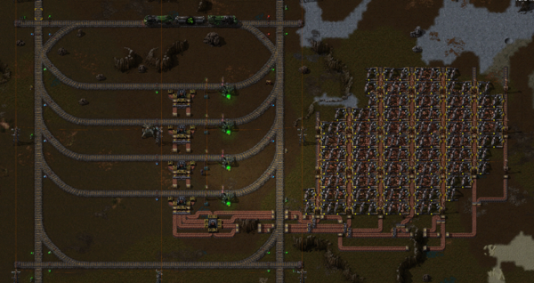

I've added stations for coal, copper, and iron so far to boost the core mining. Coal in particular needed it. 

The nice thing is that these fit well into the straight lines or a single cell. So wherever we need one, we can have one. 

The other bit (I know it's small) is that each loading station has priority to pass the ore to the next station first and only load itself after it's full. And each station can hold two trains. Hopefully, with all that, we can keep a steady supply of ore going to each group of smelting stations as we need. We shall see!

And finally, smelting:

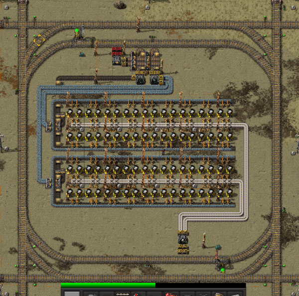

That's twice as much smelting as I already had, so that's cool. With two trains coming at a time (and needing far less coal), it works well so far. We'll have to see if it continues. I expect I'll want to expand the red belt parts though at least to move trains through more quickly. 

## What's next? 

So, what's next this time? I got to trains! I totally didn't put them off. 

Still next: oil processing and chemical science. With trains! I have no idea if that makes sense, but we'll give it a try!

Onward!