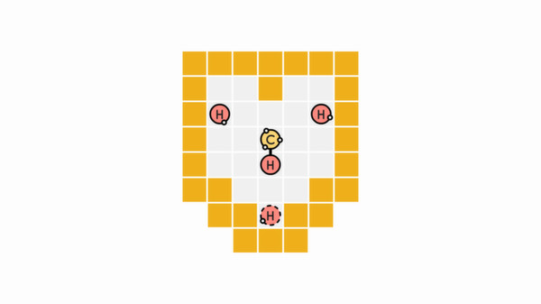

Another solver that I've been working on, after [A Good Snowman Is Hard To ... Solve?](). This time, we have [Sokobond](https://store.steampowered.com/app/290260/Sokobond/)! It's a [[wiki:Sokobon]]()... but with chemical bonds! Yeah, that's a really good title. 

The basic idea is you have a field of elements with (chemical accurate) free electrons):



Here we have 4 hydrogens (1 bond each) and a carbon (4 bonds). It should seem pretty obvious that the carbon should end up with a hydrogen on each end. The one last bit of interest: the element with the dashed border is the one we actually control, that will never change. 

This eventually gets more complicated, adding:

* Modifiers that are placed on the map between squares:
  * One that strengthens bonds, turning a single bond into double into triple
  * One that weakens bonds, turning triple to double to single or breaking single bonds
  * One that rotates bonds as you move by it
* More elements, eventually hydrogen (1), oxygen (2), nitrogen (3), carbon (4), and helium (0)
* Solutions that require forming multiple elements at the same time

It's a pretty neat puzzle game with 144 levels of increasing difficulty. Perfect to solve.

- - -

<!--more-->



## Initial state 

Okay, let's define an additional state. I'm planning to use global + local state this time, with the global state (as it should be) being the parts that can't change--walls, empty space, and modifiers--and the local state containing a list of molecules. Each of the molecules in turn will have a list of elements and a list of bonds. 

### Helper structs

First, we have a few helper structs:

```rust
// A point in 2D space
#[derive(Copy, Clone, PartialEq, Eq, Hash, Debug, PartialOrd, Ord)]
struct Point {
    x: isize,
    y: isize,
}

impl Add<Point> for Point {
    type Output = Point;

    fn add(self, rhs: Point) -> Self::Output {
        Point {
            x: self.x + rhs.x,
            y: self.y + rhs.y,
        }
    }
}

impl Sub<Point> for Point {
    type Output = Point;

    fn sub(self, rhs: Point) -> Self::Output {
        Point {
            x: self.x - rhs.x,
            y: self.y - rhs.y,
        }
    }
}

impl Into<Point> for (isize, isize) {
    fn into(self) -> Point {
        Point {
            x: self.0,
            y: self.1,
        }
    }
}

impl Point {
    const ZERO: Point = Point { x: 0, y: 0 };

    fn manhattan_distance(&self, other: Point) -> isize {
        (self.x - other.x).abs() + (self.y - other.y).abs()
    }
}
```

This is one I've implemented any number of times. Specifically this time, we'll allows signed numbers, since we're going to represent elements in a molecule using relative coordinates. So you very well might have an element 'left' of the center of the molecule, needing a `x` that's negative. 

### Global state

Next up, we're going to represent the `Map`, which will be our global state. This is the final form, you can look at the rather lengthy [git history](https://github.com/jpverkamp/rust-solvers/commits/main/) to see how it's evolved over time. 

#### `Map`

First, the `Map` itself:

```rust
// Global state: a set of walls
#[derive(Clone, PartialEq, Eq, Hash, Debug)]
struct Map {
    width: usize,
    height: usize,
    walls: Vec<bool>,
    modifiers: Vec<Modifier>,
    allow_multiple: bool,
    solutions: Vec<String>,
}
```

This will be the map. We have a grid of `width` x `height` and a `Vec` of the same length that will store if a point is a `wall` or not. After that, we have `Vec` of `Modifiers` (we'll [come back to this](#modifier)), a flag for tests that `allow_multiple` molecules in the final answer, and a list of embedded `solutions` (for [test cases](#running-test-cases)). 

The `Map` itself only really has a single interesting function: `load`. This will take a `&str` and create a `Map` plus the associated local [`State`](#state). 

```rust
impl Map {
    fn load(input: &str) -> (Map, LocalState) {
        let mut width = 0;
        let mut height = 0;

        let mut walls = Vec::new();
        let mut modifiers = Vec::new();

        let mut molecules = Vec::new();

        let mut solutions = Vec::new();

        // Version 1 files are just the grid of elements

        // Version 2 files start with v2 on the first line
        // After that, grid elements are spaced out with extra items in between, like:
        // H - -
        //    /
        // H - -

        let mut lines = input.lines().peekable();

        let mut multiple = false;

        // In v2, build a new input array as alternating lines
        let grid = if lines.peek().is_some_and(|l| l.starts_with("v2")) {
            // Look for additional options
            let options = lines.next().unwrap();
            if options.contains("multiple") {
                multiple = true;
            }

            let mut new_input = String::new();

            let mut y = 0;
            while let Some(line) = lines.next() {
                if line.starts_with("=") {
                    new_input.push_str(line);
                    new_input.push('\n');
                    continue;
                }

                y += 1;
                if y % 2 == 1 {
                    for (x, c) in line.chars().enumerate() {
                        if x % 2 == 0 {
                            new_input.push(c);
                        } else if c != ' ' {
                            panic!("unexpected character in v2 grid spacing: {}", c);
                        }
                    }
                    new_input.push('\n');
                } else {
                    for (x, c) in line.chars().enumerate() {
                        if c == ' ' {
                            continue;
                        }

                        let x = x / 2;
                        let y = y / 2 - 1;
                        modifiers.push(Modifier {
                            location: Point {
                                x: x as isize,
                                y: y as isize,
                            },
                            kind: ModifierKind::from(c),
                        });
                    }
                }
            }

            new_input
        } else {
            String::from(input)
        };

        // Now grid contains just the elements, walls, and empty space
        for (y, line) in grid.lines().enumerate() {
            // Lines starting with = represent solutions
            // They should only be at the end of the file
            if line.starts_with('=') {
                solutions.push(line[1..].to_string());
                continue;
            }

            width = width.max(line.len());
            height += 1;

            for (x, c) in line.chars().enumerate() {
                let pt = Point {
                    x: x as isize,
                    y: y as isize,
                };

                match ElementKind::try_from(c) {
                    // A new element, convert it to a molecule
                    // Primaries are uppercase and put at the start of the list
                    // The rest are added to the end
                    // Technically only one primary is supported, this will take the last if multiple
                    Ok(e) => {
                        let molecule = Molecule::new(pt, e);

                        if c.is_uppercase() {
                            molecules.insert(0, molecule);
                        } else {
                            molecules.push(molecule);
                        }

                        walls.push(false);
                    }
                    Err(_) => match c {
                        ' ' | '-' => walls.push(false),
                        'x' | 'X' | '#' => walls.push(true),
                        _ => panic!("unknown character: {}", c),
                    },
                }
            }
        }

        // Try to bond each original pair of molecules
        'bonding: loop {
            for i in 0..molecules.len() {
                for j in 0..molecules.len() {
                    if i == j {
                        continue;
                    }

                    let mut primary = molecules[i].clone();
                    if primary.try_bond(Point::ZERO, &molecules[j]) {
                        molecules[i] = primary;
                        molecules[j].active = false;
                        continue 'bonding;
                    }
                }
            }

            break 'bonding;
        }

        // Remove molecules marked inactive
        molecules.retain(|m| m.active);

        // Modifiers have to be applied in a specific order: weaken, strengthen, rotate(?)
        modifiers.sort_by_key(|m| m.kind);

        (
            Map {
                width,
                height,
                walls,
                modifiers,
                allow_multiple: multiple,
                solutions,
            },
            LocalState { molecules },
        )
    }

    fn is_wall(&self, x: usize, y: usize) -> bool {
        if x >= self.width || y >= self.height {
            return true;
        }

        self.walls[y * self.width + x]
    }
}
```

I think the most interesting part of this is the versioning and solution loading that I eventually built into it. Each basic input file will look like this:

```text
xxxxxxxxx
xxxx----x
xxxx----x
x----xh-X
x---ox--x
x-H-----x
x----xxxx
xxxxxxxxx
```

We have `x` for walls, `-` for open space, `h`, `o`, `n`, `c`, and `e` for [`Elements`](#element)--there should be a single capital element that will represent the one we have to move. 

We don't actually have to specify the bonds between elements since they'll always bind immediately on load. There aren't any levels where which bonds exist are ambiguous, like this would be:

```text
hh
hh
```

But eventually, we started needing [`Modifiers`](#modifier), which are between spots on the level. Initially, I wanted to put them at the top left position, but sometimes there's a wall or element there, so that wouldn't work. So instead, I updated the save format. If the first line is `v2`, load something like this:

```text
v2
- - x x x x x x - -

- - x - - - - x - -

- - x - - - - x - -
         /
x x x - - - - x x x

x H h - - - - - o x

x x x x x x x x x x
```

In this case, we have a `/` representing a `Modifier` that will `Weaken` bonds. 

To load these, I'll actually take every other line, removing the spaces and making a `v1` `&str` out of it. The remaining lines will all be `Modifiers`, so record the type and location of each. 

Finally, we have potential solutions:

```text
v2
x x x x x x x -

x - h - x h x x
   / /
x - N - - - - x
   / /
x - h - x x x x

x x x x x - - -
=ASDWDWASSAWSDWDDD
=DSAWAWDSSDWSAWDDD
```

If there are one or more lines at the end starting with `=`, it will represent a series of keystrokes that is a valid solution to the problem generated by various iterations of this solver and validated against the actual game. We get multiple solutions since each time I change the algorithm, it's possible that it will change the order we're searching in. It's not always perfect!

We'll come back to how those are actually used when talking about [testing](#running-test-cases).

#### `Modifier`

So how do the `Modifiers` work? Well, we have:

```rust
#[derive(Copy, Clone, PartialEq, Eq, Hash, Debug, PartialOrd, Ord)]
struct Modifier {
    kind: ModifierKind,
    location: Point,
}

#[derive(Copy, Clone, PartialEq, Eq, Hash, Debug, PartialOrd, Ord)]
enum ModifierKind {
    Weaken,
    Strengthen,
    Rotate,
}

impl From<char> for ModifierKind {
    fn from(value: char) -> Self {
        match value {
            '/' => ModifierKind::Weaken,
            '+' => ModifierKind::Strengthen,
            '@' => ModifierKind::Rotate,
            _ => panic!("unknown modifier: {}", value),
        }
    }
}

impl Into<char> for ModifierKind {
    fn into(self) -> char {
        match self {
            ModifierKind::Weaken => '/',
            ModifierKind::Strengthen => '+',
            ModifierKind::Rotate => '@',
        }
    }
}
```

Originally, I directly stored data as a tuple of `(ModifierKind, Point)` rather than a struct, but all the `.0` and `.1` got confusing, so I went through a large series of clarifying refactors. This is much better. 

### Local state

Okay, we have the global state, so what do we need to track locally? A list (or `Vec` I suppose) of `Molecule`, each made of `Elements` and `Bonds`. 

#### `LocalState`

Okay, lets start at the top. Our state is ... kind of boring:

```rust
#[derive(Clone, PartialEq, Eq, Hash, Debug)]
struct LocalState {
    molecules: Vec<Molecule>,
}
```

That's really all it is. It's nice to have a type to make sure I'm passing the right thing around (it was originally directly a `Vec<Molecule>`). We do have two interesting functions: [`try_move`](#localstatetry_move) and [`split_at_bond`](#localstatesplit_at_bond). We'll get to those after we define everything that makes up a `LocalState`. 

#### `Molecule`

Next, we have the implementation of the `Molecules` themselves:

```rust
#[derive(Clone, PartialEq, Eq, Hash, Debug)]
struct Molecule {
    active: bool,
    offset: Point,
    elements: Vec<Element>,
    bonds: Vec<Bond>,
}
```

The `offset` is where the center of the `Molecule` is within the full `Map`. All `Elements` in this `Molecule` are relative to this point. Then a `Vec` each of [`Elements`](#element) and [`Bonds`](#bond).

The first (last added) field is a bit more interesting. `active` is set to `false` when a molecule should not be considered to still exist or otherwise interact with anything. I do this rather than removing the elements immediately since a lot of things deal with indexes rather than references. This ... is not perfect. But it works well enough. 

Now, a few functions. First, we have a few basic constructors and accessors:

```rust
impl Molecule {
    fn new(offset: Point, element: ElementKind) -> Molecule {
        Molecule {
            active: true,
            offset,
            elements: vec![Element {
                kind: element,
                offset: Point::ZERO,
                free_electrons: element.free_electrons(),
            }],
            bonds: Vec::new(),
        }
    }

    // Test for molecular helium
    fn is_helium(&self) -> bool {
        self.elements.len() == 1 && self.elements[0].kind == ElementKind::Helium
    }

    // How many free electrons in the hole molecule
    fn free_electrons(&self) -> usize {
        self.elements
            .iter()
            .map(|e| e.free_electrons)
            .sum::<usize>()
    }
}
```

Then, intersections. This is where `active` comes in (you can't intersect with something that no longer exists). 

Things like `intersects` do get a bit interesting, since the `Elements` in each `Molecule` are relative to their own center. So we always have to add the offset to them. It works out clearly enough I think though. 

```rust
impl Molecule {
    // If the given molecule at an offset would intersect with a wall
    fn intersects_wall(&self, offset: Point, map: &Map) -> bool {
        if !self.active {
            return false;
        }

        for element in &self.elements {
            let target = self.offset + element.offset + offset;
            if map.is_wall(target.x as usize, target.y as usize) {
                return true;
            }
        }

        false
    }

    // If the given molecule + an offset would intersect another molecule
    // If there's an intersection, return the intersecting point of each molecule (without offset)
    fn intersects(&self, offset: Point, other: &Molecule) -> Option<(Point, Point)> {
        if !self.active || !other.active {
            return None;
        }

        for element in &self.elements {
            for other_element in &other.elements {
                if self.offset + element.offset + offset == other.offset + other_element.offset {
                    return Some((element.offset, other_element.offset));
                }
            }
        }

        None
    }
}
```

Next, a function that will bond two molecules together. It's named `try_bond` since it doesn't always bond them. This ... probably is badly named, but I wrote i a long time ago. 

If the two elements can be bond, we'll go ahead and do it. All of the `Elements` and `Bonds` in `other` will be added to `self` along with the newly created bond. It will be the responsibility of the caller to properly set `other.active = false`. 

```rust
impl Molecule {
    // Try to bond two molecules together
    // Offset is between the centers of the molecules
    // Updates and returns true if successful
    fn try_bond(&mut self, offset: Point, other: &Molecule) -> bool {
        if !self.active || !other.active {
            return false;
        }

        let mut bound = false;

        // Make local mutable copies
        let mut other = other.clone();

        // Go through each molecule pairwise
        for a in self.elements.iter_mut() {
            for b in other.elements.iter_mut() {
                let real_a = self.offset + offset + a.offset;
                let real_b = other.offset + b.offset;

                // Not adjacent
                if real_a.manhattan_distance(real_b) != 1 {
                    continue;
                }

                // Not enough free electrons
                if a.free_electrons == 0 || b.free_electrons == 0 {
                    continue;
                }

                // Bond the two elements
                bound = true;

                self.bonds.push(Bond {
                    a: offset + a.offset,
                    b: other.offset - self.offset + b.offset,
                    count: 1,
                });

                a.free_electrons -= 1;
                b.free_electrons -= 1;
            }
        }

        // If we bound anything, add the other elements and bonds to our molecule
        if bound {
            for element in other.elements {
                self.elements.push(Element {
                    kind: element.kind,
                    offset: other.offset - self.offset + element.offset,
                    free_electrons: element.free_electrons,
                });
            }

            for bond in other.bonds {
                self.bonds.push(Bond {
                    a: other.offset - self.offset + bond.a,
                    b: other.offset - self.offset + bond.b,
                    count: bond.count,
                });
            }

            true
        } else {
            false
        }
    }
}
```

And finally, we have a function to change where the center of the `Molecule` is. This will come up when we split a `Molecule` into two. The first will keep it's center, but the second will have no element at `0,0`. While this doesn't actually break our code, it does make some things easier. So this will set the center to a specific point instead!

```rust
impl Molecule {
    fn recenter(&mut self, new_zero: Point) {
        self.offset = self.offset + new_zero;

        for element in &mut self.elements {
            element.offset = element.offset - new_zero;
        }
        for dst_bond in &mut self.bonds {
            dst_bond.a = dst_bond.a - new_zero;
            dst_bond.b = dst_bond.b - new_zero;
        }
    }
}
```

Okay, so now we need [`Elements`](#element) and [`Bonds`](#bond).

#### `Element`

One step further down, `Molecule` is made of `Elements`:

```rust
#[derive(Copy, Clone, PartialEq, Eq, Hash, Debug)]
struct Element {
    kind: ElementKind,
    offset: Point,
    free_electrons: usize,
}

#[derive(Copy, Clone, PartialEq, Eq, Hash, Debug)]
enum ElementKind {
    Hydrogen,
    Helium,
    Nitrogen,
    Carbon,
    Oxygen,
}

impl TryFrom<char> for ElementKind {
    type Error = ();

    fn try_from(value: char) -> Result<Self, Self::Error> {
        use ElementKind::*;

        match value {
            'h' | 'H' => Ok(Hydrogen),
            'e' | 'E' => Ok(Helium),
            'n' | 'N' => Ok(Nitrogen),
            'c' | 'C' => Ok(Carbon),
            'o' | 'O' => Ok(Oxygen),
            _ => Err(()),
        }
    }
}

impl Into<char> for ElementKind {
    fn into(self) -> char {
        match self {
            ElementKind::Hydrogen => 'H',
            ElementKind::Helium => 'E',
            ElementKind::Nitrogen => 'N',
            ElementKind::Carbon => 'C',
            ElementKind::Oxygen => 'O',
        }
    }
}

impl ElementKind {
    fn free_electrons(&self) -> usize {
        use ElementKind::*;

        match self {
            Hydrogen => 1,
            Helium => 0,
            Nitrogen => 3,
            Carbon => 4,
            Oxygen => 2,
        }
    }
}
```

Each `Element` has 1 of the 5 kinds, which we need to load and print back out. In addition, it will store the `offset`, which is a relative location to the `Molecule` containing this `Element`. And finally, a number of `free_electrons`. This is how many more bonds this `Element` can have. 

#### `Bond`

`Bonds` themselves don't do anything in particular, they're mostly storage for the link between points:

```rust
#[derive(Copy, Clone, PartialEq, Eq, Hash, Debug)]
struct Bond {
    a: Point,
    b: Point,
    count: usize,
}

impl Add<Point> for Bond {
    type Output = Bond;

    fn add(self, rhs: Point) -> Self::Output {
        Bond {
            a: self.a + rhs,
            b: self.b + rhs,
            count: self.count,
        }
    }
}

impl Sub<Point> for Bond {
    type Output = Bond;

    fn sub(self, rhs: Point) -> Self::Output {
        Bond {
            a: self.a - rhs,
            b: self.b - rhs,
            count: self.count,
        }
    }
}
```

It's... not great that I'm using `Points` here. If I went back to implement this from scratch, it would probably be *much* easier to have a reference to some sort of `ElementId`. But... it eventually worked!

#### `LocalState.try_move`

Okay, we have all the pieces. Here's where things get... really long. This is *really* the bulk of the function and is messy at times. 

```rust
impl LocalState {
    // Try to move the ith molecule by the given offset
    // Will also move all other touching molecules out of the way
    // Returns the new state if successful
    fn try_move(&mut self, map: &Map, index: usize, offset: Point) -> bool {
        self.__try_move_recursive__(map, index, offset, true)
    }

    fn __try_move_recursive__(
        &mut self,
        map: &Map,
        index: usize,
        offset: Point,
        first: bool,
    ) -> bool {
        let original_molecules = self.molecules.clone();
        let mut moved_early = false;

        // Collect all map modifiers that we are trying to cross (this may take multiple passes)
        let mut modifiers_applied = Vec::new();
        loop {
            let mut bond_to_modify = None;

            // We want to handle bonds from the closest to origin first
            // This will help with cases with multiple rotators when we only want to hit the 'first' one
            let mut sorted_bonds = self
                .molecules[index]
                .bonds
                .iter()
                .enumerate()
                .collect::<Vec<_>>();


            sorted_bonds.sort_by_key(|(_, bond)| {
                bond.a.manhattan_distance(Point::ZERO) + bond.b.manhattan_distance(Point::ZERO)
            });

            'find_bond: for (bond_index, bond) in sorted_bonds {
                let mut sorted_modifiers = map.modifiers.clone();

                sorted_modifiers.sort_by_key(|m| {
                    let real_bond = *bond + self.molecules[index].offset;
                    real_bond.a.manhattan_distance(m.location) + real_bond.b.manhattan_distance(m.location)

                    // TODO: Do we still need to sort by type? 
                });


                for modifier in sorted_modifiers {
                    if modifiers_applied.contains(&modifier) {
                        continue;
                    }

                    let real_a = bond.a + self.molecules[index].offset;
                    let real_b = bond.b + self.molecules[index].offset;

                    // Vertical bonds have the same x
                    let is_vertical = bond.a.x == bond.b.x;

                    // We'll hit a vertical splitter if the offset is horizontal and we're moving across it
                    // Ignore bonds that are moving the wrong way
                    if is_vertical && offset.x == 0 || !is_vertical && offset.y == 0 {
                        continue;
                    }

                    // Moving 'positive' is down or right
                    let is_positive = offset.x > 0 || offset.y > 0;

                    // Because either x or y is the same for all bonds, min is top/left and max is bottom/right
                    // This will always match the splitter if we're moving across it right or down
                    let pre_min = Point {
                        x: real_a.x.min(real_b.x),
                        y: real_a.y.min(real_b.y),
                    };

                    // The post point is the one after we've moved
                    let post_a = real_a + offset;
                    let post_b = real_b + offset;
                    let post_min = Point {
                        x: post_a.x.min(post_b.x),
                        y: post_a.y.min(post_b.y),
                    };

                    // If we're moving positive, the min (top left) will equal the splitter
                    if is_positive && modifier.location != pre_min {
                        continue;
                    }

                    // If we're moving negative, then the *post* min will equal the splitter
                    if !is_positive && modifier.location != post_min {
                        continue;
                    }

                    // We have a bond to try to modify
                    bond_to_modify = Some((bond_index, modifier));
                    break 'find_bond;
                }
            }

            // We found no more bonds to modify
            if bond_to_modify.is_none() {
                break;
            }

            // Note it, so we don't apply the same modifier more than once per move
            let (bond_index, modifier) = bond_to_modify.unwrap();
            modifiers_applied.push(modifier);

            // Figure out which elements we're dealing with
            let bond = self.molecules[index].bonds[bond_index];

            let el_a_index = self.molecules[index]
                .elements
                .iter()
                .position(|el| el.offset == bond.a)
                .unwrap();

            let el_b_index = self.molecules[index]
                .elements
                .iter()
                .position(|el| el.offset == bond.b)
                .unwrap();

            // Handle different modifier types
            match modifier.kind {
                ModifierKind::Weaken => {
                    // Reduce the bond and give back electrons
                    self.molecules[index].elements[el_a_index].free_electrons += 1;
                    self.molecules[index].elements[el_b_index].free_electrons += 1;
                    self.molecules[index].bonds[bond_index].count -= 1;

                    // If it was more than a single bond (originally), we're done now (no splitting)
                    if self.molecules[index].bonds[bond_index].count > 0 {
                        continue;
                    }

                    // Try to performe a split at that bond
                    // If this returns None, it means we have a ring, so have nothing else to do
                    // Otherwise, update our molecule list
                    if let Some((part_a, part_b)) = self.split_at_bond(index, bond_index) {
                        self.molecules[index] = part_a;
                        self.molecules.push(part_b);
                    };
                }
                ModifierKind::Strengthen => {
                    // Verify we have enough free electrons
                    if self.molecules[index].elements[el_a_index].free_electrons == 0
                        || self.molecules[index].elements[el_b_index].free_electrons == 0
                    {
                        continue;
                    }

                    // If so, strengthen the bond and take the electrons
                    self.molecules[index].elements[el_a_index].free_electrons -= 1;
                    self.molecules[index].elements[el_b_index].free_electrons -= 1;
                    self.molecules[index].bonds[bond_index].count += 1;
                }
                ModifierKind::Rotate => {
                    // When rotating, the rest of the molecule will move as expected
                    // But the bond with the primary will 'wrap' around
                    // I expect I will get this wrong

                    // Split the molecule into two parts, (temporarily) removing the rotate bond
                    // The part with the old primary will move as expected
                    // The other part will be 'pulled' along the bond
                    // Both have to move without colliding
                    // And then we'll merge them and put the bond back

                    // Part b will move 'along' the path of the original bond
                    let parts = self.split_at_bond(index, bond_index);

                    // If it doesn't split, we have a ring; rotator won't work
                    if parts.is_none() {
                        self.molecules = original_molecules;
                        return false;
                    }

                    let (part_a, part_b) = parts.unwrap();

                    // Determine how which way part b will remove because we'll move a and b shortly

                    // Find the half of the bond that is still in a
                    let part_a_el_of_bond = part_a.offset + part_a
                        .elements
                        .iter()
                        .find(|el| part_a.offset + el.offset == part_a.offset + bond.a || part_a.offset + el.offset == part_a.offset + bond.b)
                        .expect("couldn't find bond in part a")
                        .offset;

                    let part_b_el_of_bond= part_b.offset + part_b
                        .elements
                        .iter()
                        .find(|el| part_b.offset + el.offset == part_a.offset + bond.a || part_b.offset + el.offset == part_a.offset + bond.b)
                        .expect("couldn't find bond in part b")
                        .offset;

                    // Determine which side of the rotate modifier that element is in
                    let left_side = part_a_el_of_bond.x == modifier.location.x;
                    let top_side = part_a_el_of_bond.y == modifier.location.y;
                    let moving_horizontal = offset.x != 0;

                    // And use that information to figure out how the b half of the bond will move
                    let new_b_offset = match (left_side, top_side, moving_horizontal) {
                        (true, true, true) => Point { x: 0, y: -1 },
                        (true, true, false) => Point { x: -1, y: 0 },
                        (true, false, true) => Point { x: 0, y: 1 },
                        (true, false, false) => Point { x: -1, y: 0 },
                        (false, true, true) => Point { x: 0, y: -1 },
                        (false, true, false) => Point { x: 1, y: 0 },
                        (false, false, true) => Point { x: 0, y: 1 },
                        (false, false, false) => Point { x: 1, y: 0 },
                    };

                    // Part a becomes the new primary, b is added
                    self.molecules[index] = part_a;
                    let part_b_index = self.molecules.len();
                    self.molecules.push(part_b);

                    // Part a contains the original primary, it moves in the original direction
                    // Disable collision checking with b to allow tail chasing
                    self.molecules[part_b_index].active = false;
                    let moved = self.__try_move_recursive__(map, index, offset, false);
                    if !moved {
                        self.molecules = original_molecules;
                        return false;
                    }
                    self.molecules[part_b_index].active = true;
                    
                    // Part b contains the 'other' half which moves along the bond (as calculated earlier)
                    // Likewise, disable collision checking with a
                    self.molecules[index].active = false;
                    let moved = self.__try_move_recursive__(map, part_b_index, new_b_offset, false);
                    if !moved {
                        self.molecules = original_molecules;
                        return false;
                    }
                    self.molecules[index].active = true;
                    
                    // Once they've both moved, make sure they're non intersecting
                    if self.molecules[index].intersects(Point::ZERO, &self.molecules[part_b_index]).is_some() {
                        self.molecules = original_molecules;
                        return false;
                    }

                    // Combine b into a
                    let mut part_a = self.molecules[index].clone();
                    let part_b = self.molecules[part_b_index].clone();

                    for element in part_b.elements {
                        part_a.elements.push(Element {
                            kind: element.kind,
                            offset: part_b.offset - part_a.offset + element.offset,
                            free_electrons: element.free_electrons,
                        });
                    }

                    for bond in part_b.bonds {
                        part_a.bonds.push(Bond {
                            a: part_b.offset - part_a.offset + bond.a,
                            b: part_b.offset - part_a.offset + bond.b,
                            count: bond.count,
                        });
                    }

                    // Create the new bond, this will be based on the part_a_el_of_bond and the new_b_offset
                    let new_bond = Bond {
                        a: part_a_el_of_bond + offset - part_a.offset,
                        b: part_b_el_of_bond + new_b_offset - part_a.offset,
                        count: bond.count,
                    };

                    // Validate that we didn't create a screwy bond
                    assert!(part_a.elements.iter().any(|el| el.offset == new_bond.a));
                    assert!(part_a.elements.iter().any(|el| el.offset == new_bond.b));

                    // Validate we don't have any overlapping bonds
                    assert!(
                        !part_a.bonds.iter().enumerate().any(|(i, b1)|
                            part_a.bonds.iter().enumerate().any(|(j, b2)| 
                                i != j && (
                                    (b1.a == b2.a && b1.b == b2.b)
                                    || (b1.a == b2.b && b1.b == b2.a)
                                )
                            )
                        )
                    );

                    part_a.bonds.push(new_bond);

                    self.molecules[index] = part_a;
                    self.molecules[part_b_index].active = false;

                    // We've already moved both parts, so don't move again
                    moved_early = true;

                    // HACK: Only apply one rotate per move
                    break;
                }
            }
        }

        if !moved_early {
            // Make sure we won't hit a wall
            // Check each moving molecule to see if it would hit a wall
            if self.molecules[index].intersects_wall(offset, map) {
                self.molecules = original_molecules;
                return false;
            }

            // Try to update each molecule we're pushing on
            'moving: loop {
                for other_index in 0..self.molecules.len() {
                    if other_index == index {
                        continue;
                    }

                    if let Some((_, other_intersection_offset)) =
                        self.molecules[index].intersects(offset, &self.molecules[other_index])
                    {
                        // HACK: Don't try to move the primary molecule more than once
                        // This can happen if the primary wraps around another, like:
                        /*
                        O-O-O
                        |   |
                        H h H
                        */
                        // This can happen for non-primaries, but I don't have a good way to fix that
                        // Assume if we made it this far, the primary *can* move, but don't actually do it here
                        if other_index == 0 {
                            continue;
                        }

                        // Recenter the other point so that the intersection is at 0,0
                        // This will properly handle a molecule being pushed across a split
                        // TODO: This won't properly work if multiple points are being pushed since only one is returned
                        self.molecules[other_index].recenter(other_intersection_offset);

                        let moved = self.__try_move_recursive__(map, other_index, offset, false);
                        if !moved {
                            self.molecules = original_molecules;
                            return false;
                        }

                        continue 'moving;
                    }
                }

                break 'moving;
            }

            // Verify that after pushing, we're no longer intersecting anything
            for i in 0..self.molecules.len() {
                if i == index {
                    continue;
                }

                if self.molecules[index]
                    .intersects(offset, &self.molecules[i])
                    .is_some()
                {
                    self.molecules = original_molecules;
                    return false;
                }
            }

            // Finally, update our own location
            self.molecules[index].offset = self.molecules[index].offset + offset;
        }

        // If we're the first call, re-apply bonds and remove inactive molecules
        if first {
            'bonding: loop {
                for i in 0..self.molecules.len() {
                    for j in 0..self.molecules.len() {
                        if i == j {
                            continue;
                        }

                        let mut primary = self.molecules[i].clone();
                        if primary.try_bond(Point::ZERO, &self.molecules[j]) {
                            self.molecules[i] = primary;
                            self.molecules[j].active = false;
                            continue 'bonding;
                        }
                    }
                }

                break 'bonding;
            }

            self.molecules.retain(|m| m.active);
        }

        true
    }
}
```

It's ... complicated. Essentially, we kick off the recursive version of the function with the molecule we're trying to move (the `Molecule` at `index`) and the move we're making--`offset`. 

The algorithm should be well commented, but here's where we ended up:

* Try to apply any modifiers
  * First, loop over each `Bond`, starting at the `0,0` point of the molecule and moving out; this fixes a bug with `Rotation` modifiers (where you'd hit more than one at the same time without this)
  * Within that, loop over each `Modifier`
  * Check if the `Bond` plus the `offset` crosses the `Modifier`, if so apply it:
    * `Weaken` modifiers will take one level from the `Bond` and give back `free_electrons` on each half; if this was the last level of the `Bond`, we'll need to call `LocalState.split_at_bond` to create two halves. This gets interesting, since only the half containing the `0,0` will keep moving, the other is left in place. 
    * `Strengthen` is much easier: if there are free electrons on both halves, increase the strength of the `Bond` up to the maximum (of these elements) of a triple bond (`count = 3`)
    * `Rotate` is... by far the most complicated. Implementation wise, what we end up doing is:
      * Split the `Molecule` into `part_a` (that contains the `0,0`) and `part_b` (that doesn't). `part_a` will move with the `offset` and `part_b` has to calculate a new offset that will be perpendicular to that. Both halves move, then we'll remerge them, and put the bond back. 

        This... took forever to get right... and it still isn't. I wrote a number of [test cases](#running-test-cases) throughout this, each making sure that 1) it's implemented correctly and 2) when I change something, it doesn't break. 

        But it's close enough to solve most of the puzzles!
* Now that we've applied modifiers, check that moving won't hit a wall; this is done here because of things like `Weaken` (which means half the `Molecule` might not move)
* Next, check for any other `Molecules` that we're running into. If we do, `try_move` (recursive version) *those* in turn, going through this whole mess. 
  * Here's why this is `try_move`. If any of these recursive calls fail, we'll return `false` up the call tree. This will then reset the `self.molecules` to the original value (this is why we cloned it), undoing any mutations! Alternatively, I could have not modified anything, returning a `Result<Molecule>` instead, but... that's just not how I ended up doing this.
* Now that we've checked collisions, actually move this molecule (except in the case of `Rotation`, those are moved earlier). 
* Finally, check if there are any new bonds to add. This is one case where I can generate solutions that look completely 'correct' but the game won't accept. If bonds are ambiguous, I don't know what order the game generates them in... I expect it will bond the oldest `Molecules` first, but that doesn't seem completely right. Such it goes. 

Hopefully either the code and comments above and/or the description here of the algorithm helps. It's... really a lot of code and kind of a mess. But it's *so cool* to see this working. 

#### `LocalState.split_at_bond`

Finally, one more helper function. Originally, this was part of the `Weaken` code, but `Rotate` also uses it, so I factored it out:

```rust
impl LocalState {
    fn split_at_bond(&mut self, index: usize, bond_index: usize) -> Option<(Molecule, Molecule)> {
        // Create a new primary half of the molecule
        let mut part_a = self.molecules[index].clone();
        part_a.bonds.remove(bond_index);

        // Flood fill to determine what elements and bonds are part of part A
        let mut connected_elements = Vec::new();
        let mut connected_bonds = Vec::new();
        let mut todo = vec![Point::ZERO];
        let mut done = vec![];

        // Keep going until we find all connected elements
        while let Some(pt) = todo.pop() {
            done.push(pt);

            // If any element matches the point, add to connected
            for (i, element) in part_a.elements.iter().enumerate() {
                if element.offset == pt && !connected_elements.contains(&i) {
                    connected_elements.push(i);
                }
            }

            // If any bond matches the point, add to connected
            // Then, if the other end isn't already accounted for, add it to the list to do
            for (i, src_bond) in part_a.bonds.iter().enumerate() {
                if src_bond.a == pt {
                    if !connected_bonds.contains(&i) {
                        connected_bonds.push(i);
                    }

                    if !(todo.contains(&src_bond.b) || done.contains(&src_bond.b)) {
                        todo.push(src_bond.b);
                    }
                }

                if src_bond.b == pt {
                    if !connected_bonds.contains(&i) {
                        connected_bonds.push(i);
                    }

                    if !(todo.contains(&src_bond.a) || done.contains(&src_bond.a)) {
                        todo.push(src_bond.a);
                    }
                }
            }
        }

        // If we are still connected to everything, this split will not create a new molecule
        // This can happen if you have a ring
        if connected_elements.len() == part_a.elements.len() {
            self.molecules[index] = part_a;
            return None;
        }

        // Create the second element
        // The first will remove anything that is *not* connected
        // The second (this one) will remove anything that *is* connected
        let mut part_b = part_a.clone();

        // Sort the elements and bonds and remove from the end so the indexes are correct
        connected_elements.sort();
        for i in connected_elements.iter().rev() {
            part_b.elements.remove(*i);
        }
        connected_bonds.sort();
        for i in connected_bonds.iter().rev() {
            part_b.bonds.remove(*i);
        }

        // Likewise, remove anything not in the list from the end to preserve indexes
        for i in (0..part_a.elements.len()).rev() {
            if !connected_elements.contains(&i) {
                part_a.elements.remove(i);
            }
        }
        for i in (0..part_a.bonds.len()).rev() {
            if !connected_bonds.contains(&i) {
                part_a.bonds.remove(i);
            }
        }

        // Part b no longer has an element at (0,0), choose one arbitrarily and recenter
        part_b.recenter(part_b.elements[0].offset);

        // Return the new parts
        Some((part_a, part_b))
    }
}
```

Essentially:

* Remove the target bond
* Use a flood fill to collect all `Elements` and `Bonds` that are still reachable from the `0,0` element 
* If this is still all `Elements`, that means broke a loop and this doesn't actually split the molecule, so return `None`
* Otherwise, create a new `part_b` Molecule
  * Remove all connected `Elements` and `Bonds` from `part_b`
  * Remove all non-connected ones from `part_a`
* Return both

I'm expecting that the caller will replace the `Molecule` at `index` with `part_a` and add `part_b` to the list, but that's not strictly required. 

And there we have the entire state, both [global](#global-state) and [local](#local-state). 

## The rest of the owl-gorithm

Okay, that's a whole lot of code to say 'how do we represent this problem'. Now we need to implement `State<Map, Step>` to actually solve it. 

### `is_valid`

First, check if a state is valid:

```rust
impl State<Map, Step> for LocalState {
    fn is_valid(&self, map: &Map) -> bool {
        if self.is_solved(map) {
            return true;
        }

        // If it's a board that allows multiples, anything goes
        if map.allow_multiple {
            return true;
        }

        // If we have any splitters, anything goes :)
        if !map.modifiers.is_empty() {
            return true;
        }

        // The primary molecule must have free electrons
        if !(self.molecules[0].is_helium() || self.molecules[0].free_electrons() > 0) {
            return false;
        }

        // Any non-primary (other than helium) must have free electrons
        if self
            .molecules
            .iter()
            .skip(1)
            .any(|m| !m.is_helium() && m.free_electrons() == 0)
        {
            return false;
        }

        return true;
    }
}
```

Technically, I actually don't really do anything interesting here, since almost all but the most basic solutions either `allow_multiple` `Molecules` or have `modifiers` (since those can re-split something that would otherwise be invalid). 

This isn't perfect. There are certainly cases we can get in that we should prune. But... it's good enough. 

### `is_solved`

```rust
impl State<Map, Step> for LocalState {
    fn is_solved(&self, _global: &Map) -> bool {
        self.molecules.iter().all(|m| m.free_electrons() == 0)
    }
}
```

At one point, I actually took `allow_multiple` into account here... but not that I look at it while writing this up... well, it seems I don't care about that. 

In any case, the puzzle is solved when all `Molecules` (and thus all `Elements` within them) have no more `free_electrons`. That's it! 

### `heuristic`

This... is not really anything interesting. I'm mostly just doing a breadth-first search but not really accounting for this. Mostly, I count more the more `free_electrons` we still have:

```rust
impl State<Map, Step> for LocalState {
    fn heuristic(&self, _global: &Map) -> i64 {
        self.molecules
            .iter()
            .map(|m| m.free_electrons() as i64)
            .sum()
    }
}
```

This is something that could really be done better, but at this point, I've spent... more hours than I'd care to admit on this, so that will have to be another day. 

### `next_states` 

And finally, the heart of the algorithm, `next_states`. With everything (mostly `try_move`), this is really short:

```rust
impl State<Map, Step> for LocalState {
    fn next_states(&self, map: &Map) -> Option<Vec<(i64, Step, LocalState)>> {
        let mut next_states = Vec::new();

        // Try to move the primary each direction
        for step in [Step::North, Step::South, Step::East, Step::West].iter() {
            let mut next_state = self.clone();
            if next_state.try_move(map, 0, (*step).into()) {
                next_states.push((1, *step, next_state));
            }
        }

        if next_states.is_empty() {
            return None;
        } else {
            return Some(next_states);
        }
    }
}
```

That's really it. Try to move the `primary` `Molecule` (the first one) each direction; if we can, queue that state. That's it! That's the entire program. 

Out of all 144 cases, it solves ~135 of them. There are a few that have bugs that prevent solving (all but 1 in rotations, I expect it's to do with two rotations on the same move) and a few that aren't efficient (mostly with many free `Helium`, since that generates many more states without getting closer to a solution. 

## Running test cases

this one was a fun mess, trying to work out how things were going wrong. I wrote a rather good number of test cases of individual parts. That way, as I added more code, I would be able to determine if I'd broken anything! (And if so, what). I'm not going to go through all of them, but you can see them here:

* [`test_map`](https://github.com/jpverkamp/rust-solvers/blob/633d32a5cfac93d553f4b2d5432a3d91e4f77ae0/src/bin/sokobond.rs#L274) - Test cases for `Map::load`
* [`test_molecule`](https://github.com/jpverkamp/rust-solvers/blob/633d32a5cfac93d553f4b2d5432a3d91e4f77ae0/src/bin/sokobond.rs#L544) - Test cases for molecules; primarily intersections but also `try_bond`
* [`test_localstate`](https://github.com/jpverkamp/rust-solvers/blob/633d32a5cfac93d553f4b2d5432a3d91e4f77ae0/src/bin/sokobond.rs#L1116) - The lion's share of test cases, these represent loading some small map, performing a sequence of [`try_moves`](#localstatetry_move), and validating the state is correct

And finally, a single test for each and every level. This is why I loaded `solutions` above:

```bash
$ cargo nextest run --release --bin sokobond

   Compiling solver v0.1.0 (/Users/jp/Projects/rust-solvers)
    Finished release [optimized + debuginfo] target(s) in 1.33s
warning: the following packages contain code that will be rejected by a future version of Rust: nom v4.2.3
note: to see what the problems were, use the option `--future-incompat-report`, or run `cargo report future-incompatibilities --id 1`
    Starting 35 tests across 1 binary
        PASS [   0.012s] solver::bin/sokobond test_localstate::test_bump_into_wall
        PASS [   0.011s] solver::bin/sokobond test_localstate::test_doubler
        PASS [   0.012s] solver::bin/sokobond test_localstate::test_cats_cradle
        PASS [   0.013s] solver::bin/sokobond test_localstate::test_join_split
        PASS [   0.009s] solver::bin/sokobond test_localstate::test_move_push
        PASS [   0.011s] solver::bin/sokobond test_localstate::test_move_and_bond
        PASS [   0.014s] solver::bin/sokobond test_localstate::test_move_across_splitter
        PASS [   0.011s] solver::bin/sokobond test_localstate::test_no_move_push_into_wall
        PASS [   0.010s] solver::bin/sokobond test_localstate::test_not_double_rotate
        PASS [   0.013s] solver::bin/sokobond test_localstate::test_move_basic
        PASS [   0.010s] solver::bin/sokobond test_localstate::test_partial_split
        PASS [   0.011s] solver::bin/sokobond test_localstate::test_push_across_splitter
        PASS [   0.009s] solver::bin/sokobond test_localstate::test_push_and_bond
        PASS [   0.010s] solver::bin/sokobond test_localstate::test_push_across_splitter_inverse
        PASS [   0.010s] solver::bin/sokobond test_localstate::test_push_unbound
        PASS [   0.008s] solver::bin/sokobond test_localstate::test_rotate_chain_succeed
        PASS [   0.011s] solver::bin/sokobond test_localstate::test_rotate_chain_fail
        PASS [   0.008s] solver::bin/sokobond test_localstate::test_split_and_push
        PASS [   0.010s] solver::bin/sokobond test_localstate::test_rotate_simple
        PASS [   0.011s] solver::bin/sokobond test_localstate::test_rotate_chase_tail
        PASS [   0.011s] solver::bin/sokobond test_localstate::test_rotate_in_a_corner
        PASS [   0.010s] solver::bin/sokobond test_localstate::test_rotate_tail_part
        PASS [   0.010s] solver::bin/sokobond test_localstate::test_small_key
        PASS [   0.010s] solver::bin/sokobond test_localstate::test_split_multiple
        PASS [   0.011s] solver::bin/sokobond test_localstate::test_split_join
        PASS [   0.009s] solver::bin/sokobond test_map::test_load
        PASS [   0.010s] solver::bin/sokobond test_localstate::test_splitter_second_join
        PASS [   0.008s] solver::bin/sokobond test_map::test_load_prebond
        PASS [   0.006s] solver::bin/sokobond test_molecule::test_molecule_intersection
        PASS [   0.008s] solver::bin/sokobond test_molecule::test_bond
        PASS [   0.006s] solver::bin/sokobond test_molecule::test_nobond_no_free
        PASS [   0.006s] solver::bin/sokobond test_molecule::test_nobond_too_far
        PASS [   0.007s] solver::bin/sokobond test_molecule::test_single_bond_o2_not_double
        PASS [   0.006s] solver::bin/sokobond test_molecule::test_wall_intersection_hit
        PASS [   2.901s] solver::bin/sokobond test_solutions::test_all_solutions
------------
     Summary [   2.932s] 35 tests run: 35 passed, 0 skipped
```

Woot!

### `test!` macro

Originally, I had a `test!` macro:

```rust
macro_rules! test {
    ($name:ident, $folder:expr, $file:expr, $expected:expr) => {
        ($name:ident, $folder:literal, $file:literal, $expected:expr) => {
            #[test]
            #[test]
            fn $name() {
            fn $name() {
                let input = include_str!(concat!("../../data/sokobond/", $folder, "/", $file));
                let input = include_str!(concat!("../../data/sokobond/", $folder, "/", $file));
                let solution = solve(input);
                let solution = solve(input);
                assert_eq!(solution.expect("solution exists"), $expected);
                assert_eq!(solution.expect("solution exists"), $expected);
            }
            }
        };
    };
}
```

This lets us write test cases like this:

```rust
test! {test_01_01, "01 - Yellow", "01 - Let's Go.txt", "WWDDWWDD"}
```

That's pretty cool. We have the input in folders/files (one per problem). And for a while, it worked. I would change the solution part when I changed the algorithm. But eventually that got annoying, so I added a second form:

```rust
macro_rules! test {
    ($name:ident, $folder:literal, $file:literal in $expected_list:expr) => {
        #[test]
        fn $name() {
            let input = include_str!(concat!("../../data/sokobond/", $folder, "/", $file));
            let solution = solve(input).expect("solution exists");
            assert!($expected_list.contains(&solution.as_str()), "{solution} not in {:?}", $expected_list);
        }
    };
    ($name:ident, $folder:literal, $file:literal, $expected:expr) => {
        // ...
    };
}
```

This way, we can have more than one:

```rust
test! {test_03_06, "03 - Gray", "06 - Three Doors.txt" in [
    "DAWWSAAWWAWDDSDSSAASDSDWWWSDDWSDSSAWWAAAAWWDD",
    "AWAWSDDWSDDWWDWAAASSSDDSASAWWWSDDWWAASSSASAWW",
]}
```

Now so long as we generate any one of them, it's great!

But eventually, this got messy and I wanted to extract the solutions. 

### A single (parallel) test case

I wanted a nice macro that could generate the `test!` above for each file/folder/solution in that file... but that would require procedural macros. So instead, a single test function:

```rust
#[cfg(test)]
mod test_solutions {
    use std::{fs::File, io::Read, sync::mpsc, thread};

    use rayon::iter::{IntoParallelRefIterator, ParallelIterator};

    use super::*;

    #[test]
    fn test_all_solutions() {
        // Timeout after 1 second or SOKOBOND_TEST_TIMEOUT if set
        let timeout = std::time::Duration::from_secs(
            std::env::var("SOKOBOND_TEST_TIMEOUT")
                .ok()
                .and_then(|s| s.parse().ok())
                .unwrap_or(1),
        );

        // Collect all tests to run in order
        let mut test_files = Vec::new();
        for entry in std::fs::read_dir("data/sokobond").unwrap() {
            let entry = entry.unwrap();
            let path = entry.path();
            if !path.is_dir() {
                continue;
            }

            for entry in std::fs::read_dir(&path).unwrap() {
                let entry = entry.unwrap();
                let path = entry.path();
                if path.extension().unwrap() != "txt" {
                    continue;
                }

                test_files.push(path);
            }
        }
        test_files.sort();

        // Run each test with timeout
        #[derive(Debug, Clone, Eq, PartialEq)]
        enum TestResult {
            Success,
            NoSolution,
            InvalidSolution(String),
            TimedOut,
        }

        let results = test_files
            .par_iter()
            .map(move |path| {
                let mut file = File::open(&path).unwrap();
                let mut input = String::new();
                file.read_to_string(&mut input).unwrap();

                let (map, _) = Map::load(&input);

                let (tx, rx) = mpsc::channel();
                thread::spawn(move || {
                    let solution = solve(&input);
                    match tx.send(solution) {
                        Ok(_) => {}
                        Err(_) => {}
                    } // I don't actually care if this succeeds, but need to consume it
                });

                match rx.recv_timeout(timeout) {
                    Ok(solution) => {
                        if solution.is_none() {
                            log::debug!("No solution: {:?}", path);
                            return TestResult::NoSolution;
                        }
                        let solution = solution.unwrap();

                        if !map.solutions.contains(&solution) {
                            log::debug!("Invalid solution ({}): {:?}", solution, path);
                            return TestResult::InvalidSolution(solution);
                        }

                        log::debug!("Solved: {:?}", path);
                        return TestResult::Success;
                    }
                    Err(_) => {
                        log::debug!("Timed out: {:?}", path);
                        return TestResult::TimedOut;
                    }
                }
            })
            .collect::<Vec<_>>();

        // Print out the results
        if results.iter().any(|r| *r == TestResult::TimedOut) {
            println!("\nTimed out tests:");
            for (path, result) in test_files.iter().zip(results.iter()) {
                if *result == TestResult::TimedOut {
                    println!("  {:?}", path);
                }
            }
        }

        if results.iter().any(|r| *r == TestResult::NoSolution) {
            println!("\nUnsolved tests:");
            for (path, result) in test_files.iter().zip(results.iter()) {
                if *result == TestResult::NoSolution {
                    println!("  {:?}", path);
                }
            }
        }

        if results.iter().any(|r| {
            if let TestResult::InvalidSolution(_) = r {
                true
            } else {
                false
            }
        }) {
            println!("\nFailed tests:");
            for (path, result) in test_files.iter().zip(results.iter()) {
                if let TestResult::InvalidSolution(solution) = result {
                    println!("  {:?} -> {:?}", path, solution);
                }
            }
        }

        let perfect = results
            .iter()
            .all(|r| *r == TestResult::Success || *r == TestResult::TimedOut);
        if !perfect {
            println!();
        }
        assert!(perfect);
    }
}
```

This is actually pretty fun. It uses two interesting tricks:

* `mpsc` channels + `recv_timeout` to allow timing out tests; some of these take a while to run
* [`rayon`](https://docs.rs/rayon/latest/rayon/) for `par_iter` to run all of the tests automagically in parallel

And that's it! We have full output:

```bash
$ cargo test test_all_solutions -- --nocapture

    Finished test [unoptimized + debuginfo] target(s) in 0.02s
warning: the following packages contain code that will be rejected by a future version of Rust: nom v4.2.3
note: to see what the problems were, use the option `--future-incompat-report`, or run `cargo report future-incompatibilities --id 1`
     Running unittests src/lib.rs (target/debug/deps/solver-dfc21431ff367efe)

running 0 tests

test result: ok. 0 passed; 0 failed; 0 ignored; 0 measured; 0 filtered out; finished in 0.00s

     Running unittests src/bin/cosmic-express.rs (target/debug/deps/cosmic_express-ed8c5ceee43a9e50)

running 0 tests

test result: ok. 0 passed; 0 failed; 0 ignored; 0 measured; 0 filtered out; finished in 0.00s

     Running unittests src/bin/good-snowman.rs (target/debug/deps/good_snowman-a3689d1d47ea7196)

running 0 tests

test result: ok. 0 passed; 0 failed; 0 ignored; 0 measured; 0 filtered out; finished in 0.00s

     Running unittests src/bin/sokobond.rs (target/debug/deps/sokobond-1de5d97c6b7c7bd4)

running 1 test

Timed out tests:
  "data/sokobond/03 - Gray/04 - Against the Wall.txt"
  "data/sokobond/03 - Gray/05 - Pathways.txt"
  "data/sokobond/03 - Gray/06 - Three Doors.txt"
  "data/sokobond/03 - Gray/08 - Planning.txt"
  "data/sokobond/03 - Gray/09 - Out of the Way.txt"
  "data/sokobond/03 - Gray/10 - Impasse.txt"
  "data/sokobond/03 - Gray/11 - Fetch.txt"
  "data/sokobond/04 - Red/07 - Wingman.txt"
  "data/sokobond/06 - Dark Green/02 - Airplane.txt"
  "data/sokobond/07 - Dark Red/01 - Plunge.txt"
  "data/sokobond/07 - Dark Red/07 - Grater.txt"
  "data/sokobond/07 - Dark Red/09 - Home.txt"
  "data/sokobond/07 - Dark Red/11 - Station.txt"
  "data/sokobond/07 - Dark Red/12 - Arena.txt"
  "data/sokobond/08 - Light Gray/04 - Aye.txt"
  "data/sokobond/08 - Light Gray/06 - Double-Bleached.txt"
  "data/sokobond/08 - Light Gray/07 - Spaceship.txt"
  "data/sokobond/08 - Light Gray/08 - Counterintuitive.txt"
  "data/sokobond/08 - Light Gray/10 - Ocean.txt"
  "data/sokobond/08 - Light Gray/11 - Much Methane.txt"
  "data/sokobond/08 - Light Gray/12 - Hydrogen Machine.txt"
  "data/sokobond/09 - Blue/10 - Feng Shui.txt"
  "data/sokobond/09 - Blue/11 - Jumbo Jet.txt"
  "data/sokobond/09 - Blue/12 - Cross.txt"
  "data/sokobond/10 - Blue Green/07 - Diagonal.txt"
  "data/sokobond/10 - Blue Green/10 - Right Angle.txt"
  "data/sokobond/11 - Dark Blue/05 - Quadro.txt"
  "data/sokobond/12 - Bonus/02 - Grand Slam.txt"
  "data/sokobond/12 - Bonus/04 - Skull.txt"
  "data/sokobond/12 - Bonus/06 - Combine.txt"
  "data/sokobond/12 - Bonus/08 - Guards.txt"
  "data/sokobond/12 - Bonus/11 - Jellyfish.txt"
  "data/sokobond/12 - Bonus/14 - The Monster.txt"
  "data/sokobond/12 - Bonus/15 - Square.txt"
  "data/sokobond/12 - Bonus/17 - Fortress.txt"
test test_solutions::test_all_solutions ... ok

test result: ok. 1 passed; 0 failed; 0 ignored; 0 measured; 34 filtered out; finished in 4.13s

     Running unittests src/main.rs (target/debug/deps/solver-a5093a0a26171edd)

running 0 tests

test result: ok. 0 passed; 0 failed; 0 ignored; 0 measured; 0 filtered out; finished in 0.00s

     Running unittests src/bin/sudoku.rs (target/debug/deps/sudoku-a4a50a2deb34d5ac)

running 0 tests

test result: ok. 0 passed; 0 failed; 0 ignored; 0 measured; 0 filtered out; finished in 0.00s

     Running unittests src/bin/transmission.rs (target/debug/deps/transmission-d37caa0346cda4ef)

running 0 tests

test result: ok. 0 passed; 0 failed; 0 ignored; 0 measured; 0 filtered out; finished in 0.00s
```

We can set `SOKOBOND_TEST_TIMEOUT` to a longer value to run more of the tests, but this was a great way to make sure nothing broke. 