Another day (week? month?), another puzzle game. 

This time around, we're going to solve [Golf Peaks](https://store.steampowered.com/app/923260/Golf_Peaks/). I picked this up a while ago on iOS, but only recently on Steam. It's a cute little puzzle game themed around minigolf. 

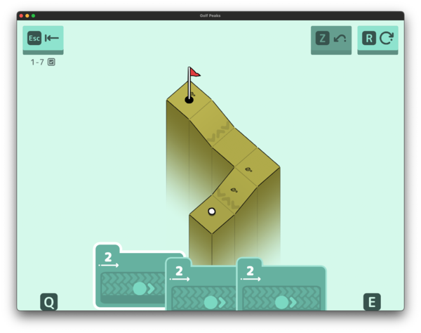

Basically, you're on a grid and you have to get the ball (in the bottom in that screenshot above) to the flag (currently at the top). You have a set list of moves you can take, styled as cards--all of which either move a certain number of tiles in a specific direction or possibly jump into the air (and fly over obstacles). 

It gets more complicated from there, but hopefully you have the basic idea. :smile:

<!--more-->



## The initial/basic model

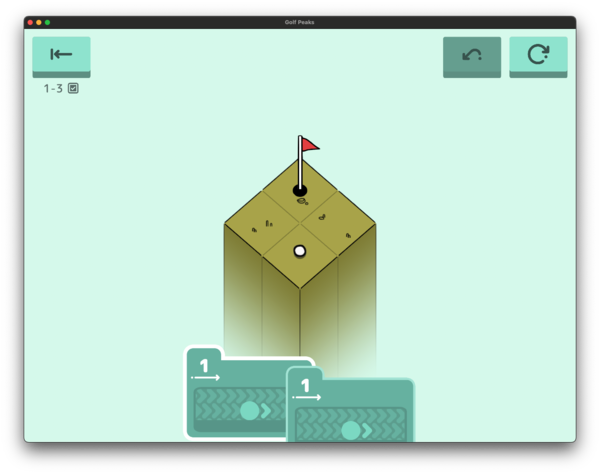

Okay, to start out with, we're going to represent `Tiles` as an `enum` (since I'm writing this after finishing the game, I know we'll have a bunch :smile:). 

```rust
#[derive(Debug, Clone, Copy, PartialEq, Eq, Hash)]
enum Tile {
    Empty,
    Flat(usize),
    ...
}
```

The map (our `Global` state) will then hold all of the tiles, the location of the flag, and any solutions (for test cases later):

```rust
#[derive(Debug, Clone)]
struct Global {
    width: usize,
    height: usize,
    tiles: Vec<Tile>,
    flag: Point,
    solutions: Vec<String>,
}
```

Then the `Local` state should store any `Cards` remaining (they look like cards, so that's what I've called them throughout) plus the current location of the `ball`:

```rust
#[derive(Debug, Clone, Copy, PartialEq, Eq, Hash)]
enum Card {
    Move(usize),
    Jump(usize),
}

#[derive(Debug, Clone, Hash, PartialEq, Eq)]
struct Local {
    ball: Point,
    cards: Vec<Card>,
}
```

This is eventually going to have to change ([eventually](#multiple-step-moves) we'll add moves that `Jump` and then `Move`), but for the first good number of puzzles this will work. 

And finally, our `Step` will be a `Card` in a `Direction`:

```rust
#[derive(Debug, Clone, Copy, PartialEq, Eq, Hash)]
struct Step {
    card: Card,
    direction: Direction,
}
```

We do also need a function to `read` in the initial `Global` + `Local` state, but I'm not going to get into that much detail here. Suffice it to say... it [got complicated](https://github.com/jpverkamp/rust-solvers/blob/5268b3ed21c72f7e9cd263fa460cda5fa929fed0/src/bin/golf-peaks.rs#L249-L482)...

```text
9x9
0,flag  5,left  3       2,*e    0       1,left  2,left  3,warp0 x
5,up    4,warp0 3       2,*e    0,ice   1,left  2,left  3,/bl   3,warp1
3       3       3,ice   2,*e    0       1,left  1,icetr 2,down  2,down
2,*s    2,*s    2,*s    2,ice   2,*e    2,*s    1,down  1,down  1,down
0       0,ice   0       2,*s    1,ball  2,*e    0       0,ice   0,ice
1,up    1,up    1,up    2,*e    2,*s    2       1,up    1,up    1,up
2,up    2,up    1,icebl 1,right 0       1,left  1       2,*w    2,*n
2       3,warp2 2,right 1,right 0,ice   1,left  2,*n    3,/tl   3,warp1
x       2       2,right 1       0,ice   1       2,*w    3,warp2 x

1- 1- 2- 2- 1/ 1/ 1/1- 1/1- 1/2-

1/↗ 2-↙ 1/1-↙ 1-↖ 1/2-↖ 1/1-↗ 1-↗ 2-↖ 1/↗
```

(We'll get to all of those different kinds of tiles later.)

:smile:

## Generating states

Okay, the next step for a solver is to impelement `State::next_states`. At first, it's relatively clean:

```rust
impl State<Global, Step> for Local {
    fn next_states(&self, global: &Global) -> Option<Vec<(i64, Step, Self)>>
    where
        Self: Sized {

        let mut next_states = Vec::new();

        for (i, card) in self.cards.iter().enumerate() {
            for direction in Direction::all() {
                let mut next_state = self.clone();
                next_state.cards.remove(i);

                if !match card {
                    Card::Move(strength) => next_state.try_move(global, direction, *strength),
                    Card::Jump(strength) => next_state.try_jump(global, direction, *strength),
                } {
                    // Invalid state, try next direction
                    continue;
                }

                next_states.push((1, Step { card: *card, direction }, next_state));
            }
        }


        if next_states.is_empty() {
            return None;
        }
        Some(next_states)
    }
}
```

As we've done in [[Rust Solvers|several of these posts now]](), we go through each possible move (each `Card` in each `Direction`) and queue up each of those as a state. Currently, we just handle everything in a `try_move` and `try_jump` function on the `Local`. Each of those is designed to return `bool` if the move/jump 'worked'. If it returns `false` (currently, if the ball falls off the map), then that state isn't considered as part of a solution.

### `try_move`

So how do we `try_move`?

```rust
impl Local {
    fn try_move(&mut self, global: &Global, direction: Direction, strength: usize) -> bool {
        // No more moving to do, we're done
        if strength == 0 {
            return true;
        }

        let current_height = match global.tile_at(self.ball) {
            Tile::Empty => unreachable!(),
            Tile::Flat(height) => height,
        };

        let next_point = self.ball + Point::from(direction);
        let next_tile = global.tile_at(next_point);

        // Trying to move into empty space/out of bounds
        if let Tile::Empty = next_tile {
            return false;
        }

        // Normal flat tile
        if let Tile::Flat(height) = next_tile {
            // On the same level, just move
            if height == current_height {
                self.ball = next_point;
                return self.try_move(global, direction, strength - 1);
            }

            // New tile is higher, bounce
            // This effectively reverses direction and moves 'back' to the same tile
            if height > current_height {
                return self.try_move(global, direction.flip(), strength - 1);
            }

            // New tile is lower, fall?
            if height < current_height {
                todo!()
            }

            unreachable!();
        }

        // Normal flat tile, recur
        self.ball = self.ball + direction.into();
        self.try_move(global, direction, strength - 1)
    }
}
```

We certainly have some room for expansion, since I knew even then we'd be adding in a bunch of different kinds of tiles. 

### `try_jump`

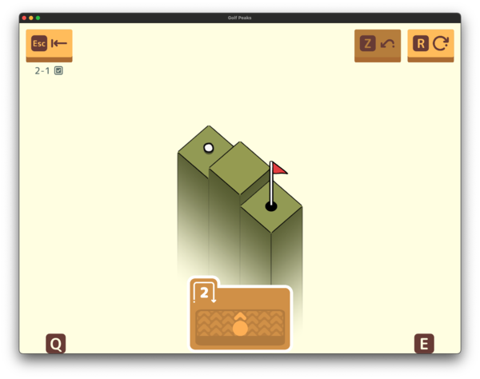

Jumping... is much easier. 

```rust
impl Local {
    fn try_jump(&mut self, global: &Global, direction: Direction, strength: usize) -> bool {
        let next_point = self.ball + Point::from(direction) * strength as isize;
        let next_tile = global.tile_at(next_point);

        // Trying to jump into empty space
        if let Tile::Empty = next_tile {
            return false;
        }

        // Otherwise, it always works
        self.ball = next_point;
        true
    }
}
```

Jumping explicitly just ignores any intervening terrain (there's not a 'jump height'), so we just teleport. Whee!

And that's all we need to solve all of the levels up until ~1.7 when slopes are introduced!

## Sloped tiles


Okay, first addition will be sloped tiles. These will come back a number of times as we interact with other kinds of tiles, but the basic idea is this:

* If you are moving 'with' the slope (either up or down), `try_move` will treat it as flat and end up going up/down a level
* If you end a move or jump on a slope, you will slide down the slope (possibly in a chain)

There's one (major) edge case here that actually doesn't come up until 9-6 ([falling sideways onto slopes](#edge-case-falling-sideways-onto-slopes)). 

Slopes will be handled as `Tile::Slope(usize, Direction)` where the first is the height of the top of the slope and the `Direction` is 'down' the slope. 

`try_move` has a few updates. First, we calculate the current height a bit differently for slopes:

```rust
let current_height = match global.tile_at(self.ball) {
    Tile::Empty => unreachable!(),
    Tile::Flat(height) => height,
    Tile::Slope(height, slope_direction) => if direction == slope_direction {
        height
    } else if direction == slope_direction.flip() {
        height - 1
    } else {
        return false; // TODO: Support this? 
    },
};
```

That `TODO: Support this?` is the side on case I mentioned earlier. It doesn't come up for a surprisingly long time. Other than that, the `height` of the slope is as specified in the map at the top and one less at the bottom. 

Then, later moving onto a slope:

```rust
if let Tile::Slope(height, slope_direction) = next_tile {
    // Sliding down at the proper height
    if height == current_height && (slope_direction == direction || slope_direction == direction.flip()) {
        self.ball = next_point;
        return self.try_move(global, direction, strength - 1);
    }

    // Dropping down onto a slope
    if height < current_height {
        self.ball = next_point;
        return self.try_move(global, direction, strength - 1);
    }

    // Anything else we don't support for now
    // TODO: Support this?
    return false;
}
```

And that's it for `try_move`, *but* we do need to add on a `try_slopes` function:

```rust
fn try_slopes(&mut self, global: &Global) -> bool {
    let current_tile = global.tile_at(self.ball);
    if current_tile == Tile::Empty {
        return false;
    }

    // Slopes apply a single tile move than recur
    if let Tile::Slope(_, slope_direction) = current_tile {
        if !self.try_move(global, slope_direction, 1) {
            return false;
        }

        return self.try_slopes(global);
    }

    // Any non-slopes just don't slide
    true
}
```

What this is going to do is, after each move, if you're currently on a `Slope`, use `try_move` to move once on that slope (which will check bouncing into something or falling off the level) and then `try_slope` again in case there are multiple ones in a chain. 

To implement this, our `next_states` becomes this:

```rust
// ...

for (i, card) in self.cards.iter().enumerate() {
    for direction in Direction::all() {
        let mut next_state = self.clone();
        next_state.cards.remove(i);
        if !match card {
            Card::Move(strength) => next_state.try_move(global, direction, *strength),
            Card::Jump(strength) => next_state.try_jump(global, direction, *strength),
        } {
            // Invalid state, try next direction
            continue;
        }

        // Apply slopes
        next_state.try_slopes(global);

        next_states.push((1, Step { card: *card, direction }, next_state));
    }
}

// ...
```

Pretty good for now!

## Multiple step moves

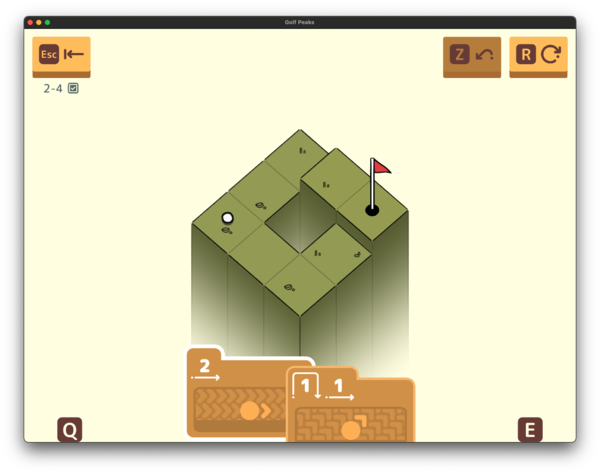

Whelp. It was good while it lasted. It turns out that our current implementation of `Cards` isn't sufficient, we need to be able play a single card that can `Jump` and `Move` in the same direction (and there are a number of things that end up applying in between those two states). 

Now, instead of a single card, we're going to implement a `Card` that can have 1 or more `CardSteps`:

```rust
enum CardStep {
    Move(usize),
    Jump(usize),
    None,
}

const CARD_MAX_STEPS: usize = 10;

#[derive(Debug, Clone, Copy, PartialEq, Eq, Hash)]
struct Card([CardStep;CARD_MAX_STEPS]);
```

I use a constant array with size 10 here (I eventually drop this to 3) because you can't get `Copy` if you're going to store them in a `Vec<CardStep>`. `Copy` has to be constant size and inline (no pointers). Technically, I *really* didn't have to do this. I expected that we might end up with even more interesting moves or cards as we want (perhaps ones that turn in midair? or 3+ steps?) but... this is as complicated as we get. We'll never do anything other than `Move(usize)`, `Jump(usize)`, or `JumpAndMove(usize, usize)`. 

But it was still fun to implement! :smile:

And the actual implementation is not at *all* that bad:

```rust
for (i, card) in self.cards.iter().enumerate() {
    for direction in Direction::all() {
        let mut next_state = self.clone();
        next_state.cards.remove(i);

        for card_step in card.0.iter() {
            let step_success = match card_step {
                CardStep::Move(strength) => next_state.try_move(global, direction, *strength),
                CardStep::Jump(strength) => next_state.try_jump(global, direction, *strength),
                CardStep::None => break,
            };
            if !step_success {
                // Invalid state, try next direction
                continue;
            }

            // Apply slopes
            next_state.try_slopes(global);
        }

        next_states.push((1, Step { card: *card, direction }, next_state));
    }
}
```

We still loop over each `Card` in each `Direction`, but now when actually implementing the move, we apply each step in turn, failing if after any one of them we end up off the board. 

One interesting bug I did have in the initial implementation was that I only applied slopes at the end. But apparently, you can apply them in between the `Jump` and the `Move` (already fixed above). 

While I was working on this, I did end up pulling in the 'solution checker' that I wrote about in [[Solving Sokobond]](). Each level file will also include any possible solutions I've found for that level. That lets me write a single test case that will try all solved levels and make sure we still generate a valid solution even after I change things. Go go gadget integration tests!

## Bouncing off angled walls

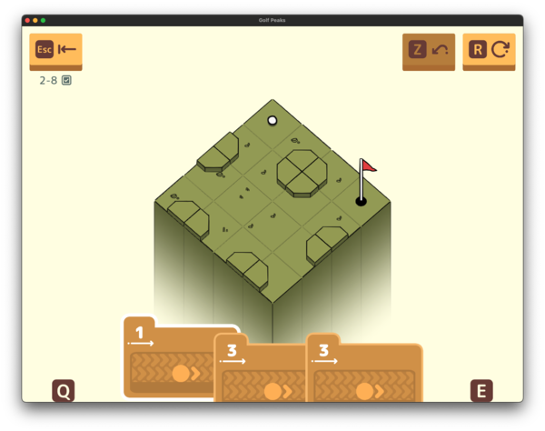

Okay, still in world 2, we do have one more trick. This time we have angled walls. If a ball comes in from either of the sides with the angled wall, it will change direction. The other two basically act as walls one step higher.

To implement this, first I'm going to define an `enum` to store the four possible `AngleTypes`:

```rust
#[derive(Debug, Clone, Copy, PartialEq, Eq, Hash)]
enum AngleType {
    TopLeft,
    TopRight,
    BottomLeft,
    BottomRight,
}

impl AngleType {
    fn try_reflect(&self, direction: Direction) -> Option<Direction> {
        match self {
            AngleType::TopLeft => match direction {
                Direction::Up => Some(Direction::Right),
                Direction::Left => Some(Direction::Down),
                _ => None,
            },
            AngleType::TopRight => match direction {
                Direction::Up => Some(Direction::Left),
                Direction::Right => Some(Direction::Down),
                _ => None,
            },
            AngleType::BottomLeft => match direction {
                Direction::Down => Some(Direction::Right),
                Direction::Left => Some(Direction::Up),
                _ => None,
            },
            AngleType::BottomRight => match direction {
                Direction::Down => Some(Direction::Left),
                Direction::Right => Some(Direction::Up),
                _ => None,
            },
        }
    }
}

#[derive(Debug, Clone, Copy, PartialEq, Eq, Hash)]
enum Tile {
    Empty,
    Flat(usize),
    Slope(usize, Direction),
    Angle(usize, AngleType),
}
```

I originally had these stored using a pair of `Direction`, but ... it got confusing, mostly because I didn't have the two ordered. This is much better. 

To handle this in `try_move`, we end up adding a new block after `Tile::Slope` but before the base 'flat' case:

```rust
impl Local {
    fn try_move(&mut self, global: &Global, direction: Direction, strength: usize) -> bool {
        // ...

        // Angled tiles
        // On either of their angled sides, reflect to the other
        // On the other two, treat them as a wall
        if let Tile::Angle(height, a_type) = next_tile {
            // If we're on the same height and reflect
            if height == current_height {
                if let Some(new_direction) = a_type.try_reflect(direction) {
                    self.ball = next_point;
                    return self.try_move(global, new_direction, strength - 1);
                }
            }

            // Otherwise, always treat this as a wall one height (fall through)
            next_tile = Tile::Flat(height + 1);
        }

        // ...
    }
}
```

If we bounce off the angle, we'll recur on `try_move` in the new direction and immediately return it's response, this will handle the bounce. But the interesting part is that we can modify `next_tile` here (which doesn't modify the `Global` map, since it's intentionally immutable) and fall through to treat it as a flat tile if you bounce into the 'back' of it. 

And that's it. Angles!

## Sand

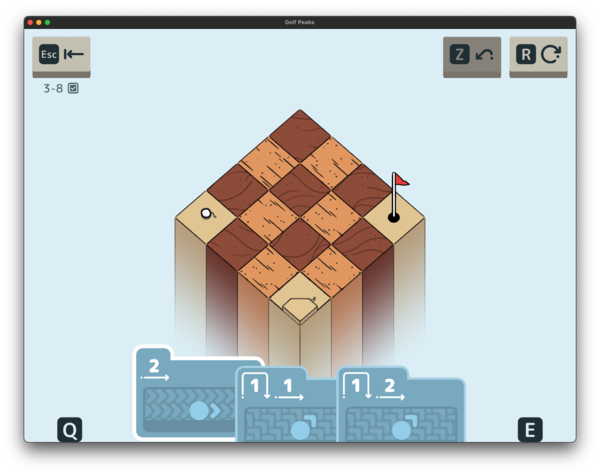

World 3's trick? Sand! Also quicksand. This is 3-8, which has both of them. 

```rust
#[derive(Debug, Clone, Copy, PartialEq, Eq, Hash)]
enum Tile {
    Empty,
    Flat(usize),
    Slope(usize, Direction),
    Angle(usize, AngleType),
    Sand(usize),
}

impl Local {
    fn try_move(&mut self, global: &Global, direction: Direction, strength: usize) -> bool {
        // ...

        // Cannot slide out of sand, just stop moving
        // But return true, this isn't an error, just stopping
        if let Tile::Sand(_) = current_tile {
            return true;
        }

        // ...
    }
}
```

Instead of recurring `try_move` with `strength - 1`... we just immediately return `true`. And that's enough to stop the ball in it's tracks when it `try_moves` across sand. 

I like the easy ones. 

## Quicksand

Quicksand though, that one is slightly more sneaky. 

* As long as you are moving, `Quicksand` is treated as a normal flat tile
* If you finish a card on quicksand, the ball slowly sinks (which should return `false` from `try_move`)

```rust
#[derive(Debug, Clone, Copy, PartialEq, Eq, Hash)]
enum Tile {
    Empty,
    Flat(usize),
    Slope(usize, Direction),
    Angle(usize, AngleType),
    Sand(usize),
    Quicksand(usize),
}
```

To actually implement this properly, I did do a bit of refactoring. Rather than `next_states` handling the different kinds of cards itself, I instead created a new `try_card` function on `Local` which will properly handle a single `Card` in a single `Direction`:

* For each step of the `Card`
  * `Move`/`Jump` as specified
  * Check for slopes
* After each step is done, check `Quicksand`

Something like this:

```rust
impl Local {
    fn try_card(&mut self, global: &Global, card: Card, direction: Direction) -> bool {
        for card_step in card.0.iter() {
            let success = match card_step {
                CardStep::Move(strength) => self.try_move(global, direction, *strength),
                CardStep::Jump(strength) => self.try_jump(global, direction, *strength),
                CardStep::None => break,
            };
            if !success {
                return false;
            }

            if !self.try_slopes(global) {
                return false;
            }
        }

        // On quicksand, we fail
        if let Tile::Quicksand(_) = global.tile_at(self.ball) {
            return false;
        }

        true
    }
}
```

Now the `next_states` loop just becomes:

```rust
for (i, card) in self.cards.iter().enumerate() {
    'next_direction: for direction in Direction::all() {
        let mut next_state = self.clone();
        next_state.cards.remove(i);

        if !next_state.try_card(global, *card, direction) {
            // Invalid state, try next direction
            continue 'next_direction;
        }

        next_states.push((1, Step { card: *card, direction }, next_state));
    }
}
```

If I had this in more than one file, this would be `pub fn try_card` and `try_move` / `try_jump` / etc would all be private so I can force myself only to call this one. As it is though... well I just have to be careful, now don't I? :smile:

## Water

Next up, world 4 and water traps!

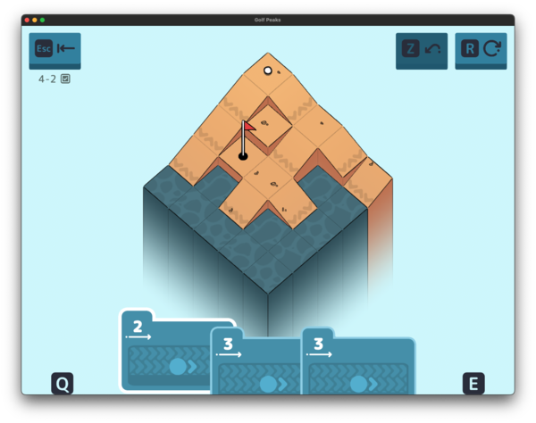


Water is interesting, since it wouldn't make any sense to immediately lose the level (you could just leave it open). Instead, if a ball ever falls into water, it will respawn--not where you hit the ball from, but rather on the last 'safe' tile that the ball moved across. So you can respawn on `Flat` or `Sand`, but not `Slope` or `Quicksand`. (Technically `Angle` is allowed as well.)

```rust
#[derive(Debug, Clone, Copy, PartialEq, Eq, Hash)]
enum Tile {
    Empty,
    Flat(usize),
    Slope(usize, Direction),
    Angle(usize, AngleType),
    Sand(usize),
    Quicksand(usize),
    Water(usize),
}

#[derive(Debug, Clone, Hash, PartialEq, Eq)]
struct Local {
    ball: Point,
    cards: Vec<Card>,
    last_safe: Point,
}
```

This requires a few changes. In `try_card`, if we end a move on water (this can be between steps as well), revert to the `last_safe` point:

```rust
impl Local {
    fn try_card(&mut self, global: &Global, card: Card, direction: Direction) -> bool {
        for card_step in card.0.iter() {
            let success = match card_step {
                CardStep::Move(strength) => self.try_move(global, direction, *strength),
                CardStep::Jump(strength) => self.try_jump(global, direction, *strength),
                CardStep::None => break,
            };
            if !success {
                return false;
            }
            
            // If after any step, we're on water, reset to last safe tile and stop move
            // This shouldn't apply after move (it's handled in try_move), but might after jump or slide
            if let Tile::Water(_) = global.tile_at(self.ball) {
                self.ball = self.last_safe;
                return true;
            }
        }

        // ...
    }
}
```

Then, when we `try_move`, if we're moving *from* a safe tile, we can mark it + handle falling into water during a move (`jump` and `slide` are handled above):

```rust
impl Local {
    fn try_move(&mut self, global: &Global, direction: Direction, strength: usize) -> bool {
        let current_tile = global.tile_at(self.ball);

        // If we're on a flat/safe tile, mark this as the last safe spot
        if let Tile::Flat(_) | Tile::Angle(_, _) | Tile::Sand(_) = current_tile {
            self.last_safe = self.ball;
        }

        // ...

        // Trying to move onto water, fall back to last safe tile and end move
        if let Tile::Water(_) = next_tile {
            self.ball = self.last_safe;
            return true;
        }

        // Normal flat tile, recur
        self.ball = self.ball + direction.into();
        self.try_move(global, direction, strength - 1)
    }
}
```

It's interesting that `try_move` *succeeds* if the ball falls in water, but that's actually what a lot of levels in this section are built around, which is kind of cool. 

## Springs 

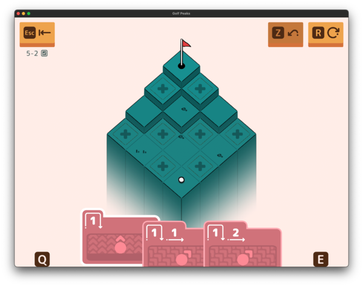

Next up, world 5 is built around springs. Basically if you hit a spring part of the way through a `Move`, treat it as a `Jump` for the rest of the move. 

```rust
#[derive(Debug, Clone, Copy, PartialEq, Eq, Hash)]
enum Tile {
    Empty,
    Flat(usize),
    Slope(usize, Direction),
    Angle(usize, AngleType),
    Sand(usize),
    Quicksand(usize),
    Water(usize),
    Spring(usize),
}

impl Local {
    fn try_card(&mut self, global: &Global, card: Card, direction: Direction) -> bool {
        let mut bouncing = false;

        for card_step in card.0.iter() {
            let success = match card_step {
                CardStep::Move(strength) => if bouncing {
                    self.try_jump(global, direction, *strength)
                } else {
                    self.try_move(global, direction, *strength)
                },
                CardStep::Jump(strength) => self.try_jump(global, direction, *strength),
                CardStep::None => break,
            };
            if !success {
                return false;
            }

            // ...

            // If we end part of a card on a spring, the next move counts as a jump
            if let Tile::Spring(_) = global.tile_at(self.ball) {
                bouncing = true;
            }
        }

        // ...
    }

    fn try_move(&mut self, global: &Global, direction: Direction, strength: usize) -> bool {
        // ...

        // If we move onto a spring, treat the rest of the move as a jump
        if let Tile::Spring(_) = next_tile {
            self.ball = self.ball + direction.into();
            return self.try_jump(global, direction, strength - 1);
        }

        // Normal flat tile, recur
        self.ball = self.ball + direction.into();
        self.try_move(global, direction, strength - 1)
    }
}
```

For `try_move`, the change is easy enough. If we see a `Spring`, call to `try_jump` for the next part of the move instead of `try_move`. But we also need to handle an interesting edge case. If you have a `Jump(1) + Move(1)` card and after the jump you end up on a `Spring`, then the `Move` part needs to be handled as a `Jump` instead. Which of course comes up in levels in this section. Whee!

## Warps / Teleporters

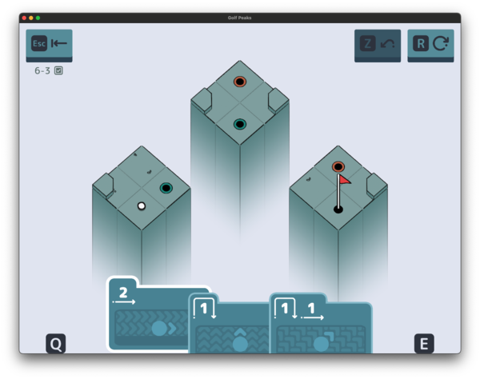

Up next, warps! Or teleporters. Or holes, although in golf that would be the flag, so I had to rename them. :smile:

```rust
#[derive(Debug, Clone, Copy, PartialEq, Eq, Hash)]
enum Tile {
    Empty,
    Flat(usize),
    Slope(usize, Direction),
    Angle(usize, AngleType),
    Sand(usize),
    Quicksand(usize),
    Water(usize),
    Spring(usize),
    Warp(usize, usize),
}
```

The extra second parameter here is the `id` of the `Warp` since (as you can see in the above picture), it's possible to have multiple pairs of `Warps` per level--although you'll always have exactly a pair of each kind (no non-determinism here thankfully). 

I originally had this inline with the `try_card` functionality, but you can also actually see it in the middle of a `try_slope`, so I had to refactor again. 

On thing that's interesting is this one does not at all touch `try_move` or `try_jump`, since you cannot warp in the middle of a `CardStep`. 

```rust
impl Local {
    fn try_card(&mut self, global: &Global, card: Card, direction: Direction) -> bool {
        // ...

        for card_step in card.0.iter() {
            // ...

            self.try_warp(global);

            // If we end on the flag, we don't have to finish this card
            if self.ball == global.flag {
                return true;
            }
        }

        // ...
    }

    fn try_slopes(&mut self, global: &Global) -> bool {
        let current_tile = global.tile_at(self.ball);
        if current_tile == Tile::Empty {
            return false;
        }

        // Slopes apply a single tile move than recur
        if let Tile::Slope(_, slope_direction) = current_tile {
            if !self.try_move(global, slope_direction, 1) {
                return false;
            }

            self.try_warp(global);

            return self.try_slopes(global);
        }

        // Any non-slopes just don't slide
        true
    }

    fn try_warp(&mut self, global: &Global) {
        // If we're on a warp after any card part, transport to the other half
        if let Tile::Warp(_, warp_index) = global.tile_at(self.ball) {
            let ball_index = self.ball.y as usize * global.width + self.ball.x as usize;

            let other_warp_map_index = global
                .tiles
                .iter()
                .enumerate()
                .find_map(|(other_index, tile)| {
                    if other_index == ball_index {
                        None
                    } else if let Tile::Warp(_, other_warp_index) = tile {
                        if *other_warp_index == warp_index {
                            return Some(other_index);
                        } else {
                            None
                        }
                    } else {
                        None
                    }
                })
                .expect("No other warp in map");

            self.ball = Point {
                x: (other_warp_map_index % global.width) as isize,
                y: (other_warp_map_index / global.width) as isize,
            };
        }
    }
}
```

I probably could have directly stored the 'warp to' point in the `Tile::Warp` on load (which I'm just thinking about now), but I didn't really have any performance problems with this as is, so it's fine to leave for now.

### The worst warp level

So remember how I said that we only ever have pairs of warps?

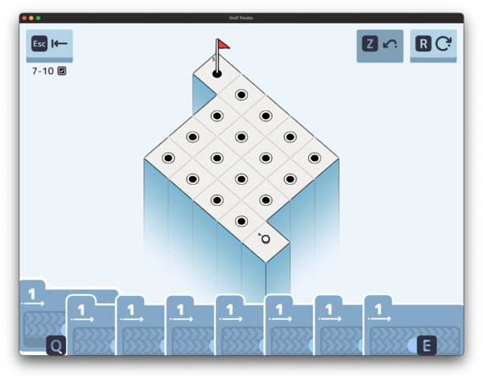

Yeah... that was a surprising level to see :smile:

Technically, each one is *still* only part of a single pair, but there's no visual indicator. You instead have to manually go through each to figure out where they all go. 


<code><pre>
6x4
0,flag  0,warp7 0,warp6 0,warp4 0,warp7 x
x       0,warp1 0,warp0 0,warp5 0,warp3 x
x       0,warp2 0,warp1 0,warp6 0,warp2 x
x       0,warp4 0,warp3 0,warp5 0,warp0 0,ball

1- 1- 1- 1- 1- 1- 1- 1-

1-↖ 1-↘ 1-↖ 1-↗ 1-
1-↖ 1-↘ 1-↖ 1-↗ 1-↖
</pre></code>


Interesting. Annoying to code for the solver. But interesting. 

## Belts

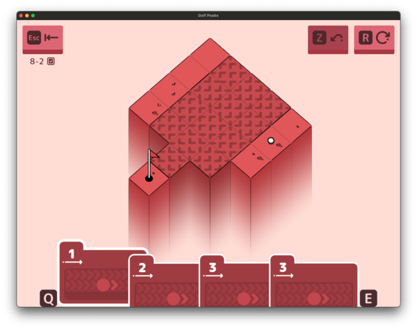

So... these are a bit weird. They really are `slopes` that are flat. There's not actually an edge case that I ever found where they'd be treated differently. Which makes them (implementation wise) easier than slopes, since you don't have to deal with falling onto them from the sides or the high/low side. 

```rust
impl Local {
    fn try_slopes(&mut self, global: &Global) -> bool {
        let current_tile = global.tile_at(self.ball);
        if current_tile == Tile::Empty {
            return false;
        }

        // Slopes apply a single tile move than recur
        if let Tile::Slope(_, slope_direction) = current_tile {
            if !self.try_move(global, slope_direction, 1) {
                return false;
            }
            self.try_warp(global);
            return self.try_slopes(global);
        }

        // Same for belts
        if let Tile::Belt(_, belt_direction) = current_tile {
            if !self.try_move(global, belt_direction, 1) {
                return false;
            }

            self.try_warp(global);

            return self.try_slopes(global);
        }

        // Any non-slopes just don't slide
        true
    }
}
```

That's... really it. I could actually have rewritten this in arguably a more compact syntax:

```rust
impl Local {
    fn try_slopes(&mut self, global: &Global) -> bool {
        let current_tile = global.tile_at(self.ball);
        if current_tile == Tile::Empty {
            return false;
        }

        // Slopes and belts apply a single tile move than recur
        match current_tile {
            Tile::Slope(_, direction) | Tile::Belt(_, direction) => {
                if !self.try_move(global, direction, 1) {
                    return false;
                }
                self.try_warp(global);
                return self.try_slopes(global);
            },
            _ => {}
        }

        // Any non-slopes just don't slide
        true
    }
}
```

I just ... didn't think about it until I saw the code when writing this post. Oops. :smile:

## Edge case: Falling sideways onto slopes

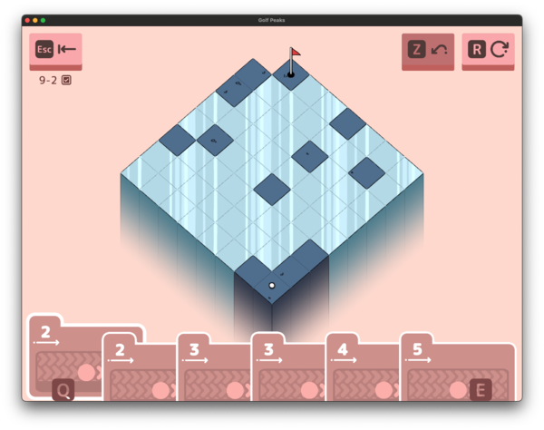

Ooh ice. Ice is nice. 

So this is an interesting one. `Ice` will basically work in that if you finish a `Card` on ice, you will continue to move in the same direction until either:

* You move off the `Ice` onto some other kind of `Tile`
* You 'bounce' into a wall, staying on the same `Ice` block

This ended up being a bit tricky to implement though, since the direction you're moving can change mid-move (`Angles`), but the `Ice` won't be implemented until `try_card`. So we either need to return the last direction ... or store it in the `Local` state. Let's go with the latter:

It gets even more complicated (but also even more fun) when you introduce `Ice` + `Angles`:

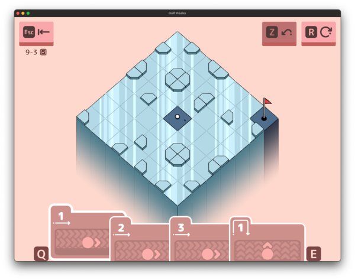

I could have implemented this as a single spot on the map having multiple `Tile` attributes, but instead, I just made this `IceAngle`. 

```rust
#[derive(Debug, Clone, Hash, PartialEq, Eq)]
struct Local {
    ball: Point,
    cards: Vec<Card>,
    last_safe: Point,
    last_move: Direction,
}
```

Now unlike `last_safe`, we do need to set `last_move` on things like `Slope`, so we end up setting it a bunch of different places. This was by far the most interesting single addition (pair of additions?) to the game.

I ended up implementing this with `last_move` as above (should that have been `slide_direction`?) + refactoring the `try_slope` method into `try_slide` instead, which will handle `Slopes`, `Belts`, and now `Ice`. 

```rust
impl Local {
    fn try_card(&mut self, global: &Global, card: Card, direction: Direction) -> bool {
        let mut direction = direction;
        let mut bouncing = false;

        for card_step in card.0.iter() {
            // ...
        }

        if !self.try_slide(global) {
            return false;
        }

        // On quicksand, we fail
        if let Tile::Quicksand(_) = global.tile_at(self.ball) {
            return false;
        }

        true
    }

    fn try_slide(&mut self, global: &Global) -> bool {
        let current_tile = global.tile_at(self.ball);
        if current_tile == Tile::Empty {
            return false;
        }

        // ... 

        // If we're on ice, continue to slide in that direction until it changes
        loop {
            match global.tile_at(self.ball) {
                Tile::Ice(_) | Tile::IceAngle(_, _) => {}
                _ => break,
            }

            let start_position = self.ball;
            let success = self.try_move(global, self.last_move, 1);
            
            // Fell off the map (most likely)
            if !success {
                return false;
            }

            // Didn't actually slide, probably bounced
            if self.ball == start_position {
                break;
            }
        }

        // Any non-slopes just don't slide
        true
    }
}
```

## Sideways slope fix

This... was not the end of these levels though. We also ended up having to fix a *really* old bug.

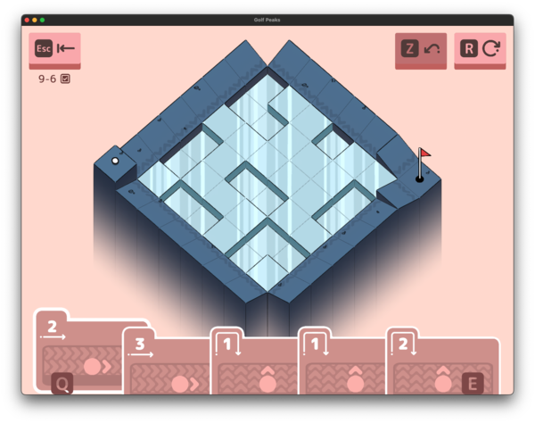

It turns out that if you fall onto a `Slope` from above, it immediately cancels your momentum and you slide down it. This is really the only difference between `Belts` and `Slopes` (other than the height difference). 

It took a while to find this one...

## Loops

And finally, we're on to the last levels.

For the most part, there was nothing new here, just a culmination of all of the tricks of the other 9 worlds. We did finally (in 10.5) come across our first loop though:

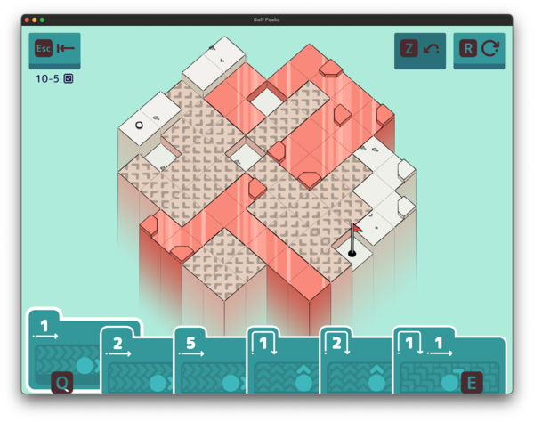

See it yet? 

It's down in the bottom left, with the two `IceAngles` forming one end of a rectangle with the `Belts` along one side. 

This was interesting to fix. Essentially, I added a loop detection cache to `Local` (which has to be `Clone`, but not `Copy`, so we can use a `Vec`!)

```rust
#[derive(Debug, Clone, Hash, PartialEq, Eq)]
struct Local {
    ball: Point,
    cards: Vec<Card>,
    last_safe: Point,
    last_move: Direction,
    slide_loop_cache: Vec<(Point, Direction)>,
}
```

This is reset in `try_card` and then only used in `try_slide`:

```rust
impl Local {
    fn try_card(&mut self, global: &Global, card: Card, direction: Direction) -> bool {
        let mut direction = direction;
        log::debug!("try_card({:?}, {card:?}, {direction:?})", self.ball);

        // Keep a cache of moves we've seen on the same card while sliding
        // If we see the same move again, we're in a loop and should stop
        self.slide_loop_cache.clear();

        // ...

        if !self.try_slide(global) {
            return false;
        }

        // ...
    }

    fn try_slide(&mut self, global: &Global) -> bool {
        if global.tile_at(self.ball) == Tile::Empty {
            return false;
        }

        fn is_ice(tile: Tile) -> bool {
            match tile {
                Tile::Ice(_) | Tile::IceAngle(_, _) => true,
                _ => false,
            }
        }

        // If we're on ice, continue to slide in that direction until it changes
        // This is if + while to deal with the warp at the end of ice case
        if is_ice(global.tile_at(self.ball)) {
            // Keep sliding until we hit something that isn't ice
            while is_ice(global.tile_at(self.ball)) {
                // Update/check slide loop check
                if self.slide_loop_cache.contains(&(self.ball, self.last_move)) {
                    return false;
                }
                self.slide_loop_cache.push((self.ball, self.last_move));

                let start_position = self.ball;
                let success = self.try_move(global, self.last_move, 1);
                
                // Fell off the map (most likely)
                if !success {
                    return false;
                }

                // Didn't actually slide, probably bounced
                if self.ball == start_position {
                    break;
                }
            }

            self.try_warp(global);
        }

        // Slopes apply a single tile move than recur
        if let Tile::Slope(_, slope_direction) = global.tile_at(self.ball) {
            // Update/check slide loop check
            if self.slide_loop_cache.contains(&(self.ball, slope_direction)) {
                return false;
            }
            self.slide_loop_cache.push((self.ball, slope_direction));

            // Try to slide down the slope
            if !self.try_move(global, slope_direction, 1) {
                return false;
            }

            self.try_warp(global);
            return self.try_slide(global);
        }

        // Same for belts
        if let Tile::Belt(_, belt_direction) = global.tile_at(self.ball) {
            // Update/check slide loop check
            if self.slide_loop_cache.contains(&(self.ball, belt_direction)) {
                return false;
            }
            self.slide_loop_cache.push((self.ball, belt_direction));

            // Try to get pushed by the belt
            if !self.try_move(global, belt_direction, 1) {
                return false;
            }

            self.try_warp(global);
            return self.try_slide(global);
        }

        // Any non-slopes just don't slide
        true
    }
}
```

Yes, I know, I still have both `Tile::Slope` and `Tile::Belt` with identical code. But otherwise, it's easy. Each time we slide, store the ball location and direction in the cache. If we ever see the same as something in the cache, we have a loop, so this isn't a valid solution. 

Oops!

It works well though. 

## The final level

And so we come to the end. 

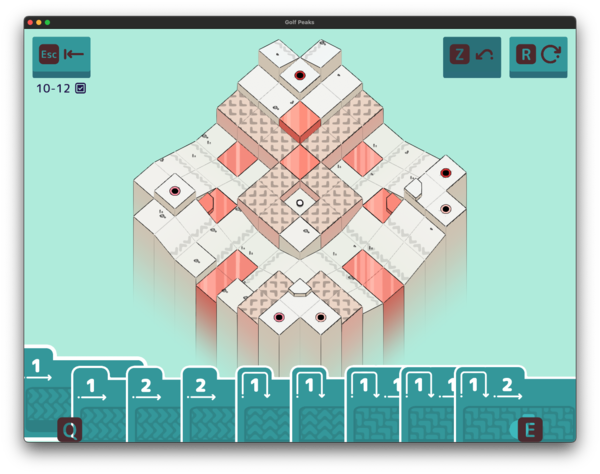

This is a fun one. Except... where in the world is the flag?!

## Fin. 

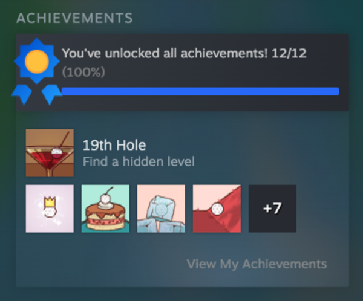

And that's it! There's a hidden 19th Hole in the credits, but that's it. 

That was a fun game. It was kind of nice to work on a solver for something with such a ridiculously smaller exploration space. In this case, there's a maximum of  (where `n` is the number of cards) possible moves. 

The most cards is 9 in [10-12 (the last level!)](#the-final-level). Which... is technically 3.71e41 states... but a *vast* majority of those are invalid (jumping off the level or not doing anything interesting). To find the solution, I only ended up having to evaluate 6831 of those states, which was the most states of any of the puzzles here (there wasn't one with fewer cards but a higher branching factor). 

Even that took less about half a second on my laptop *in debug mode*. In release mode, it took 0.05 seconds. So I really wasn't worried about optimization for this one. :smile:


