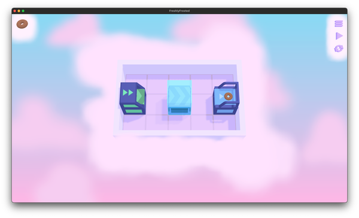
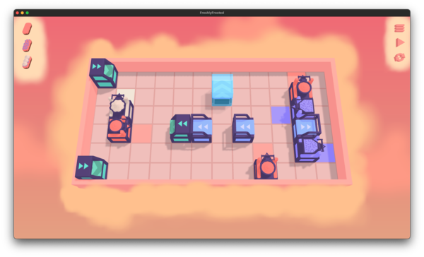
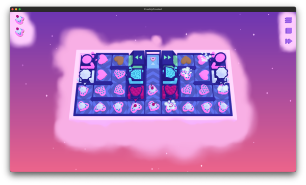
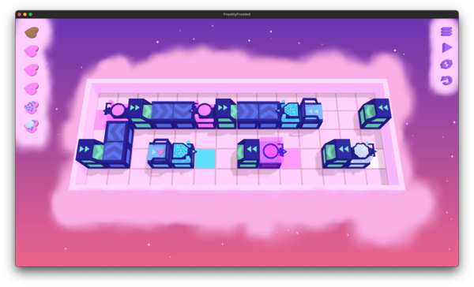
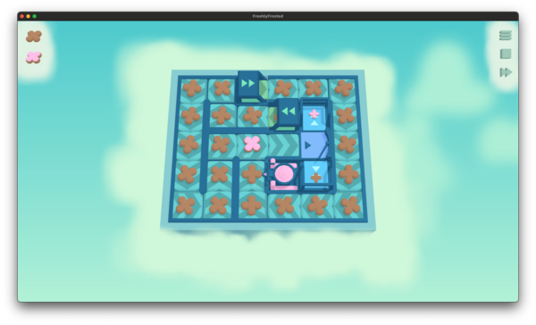
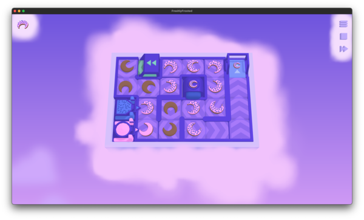
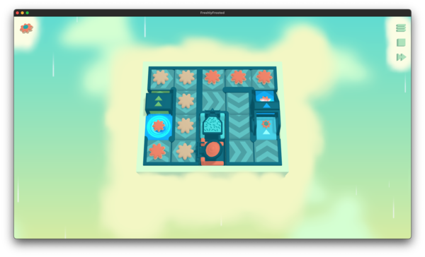
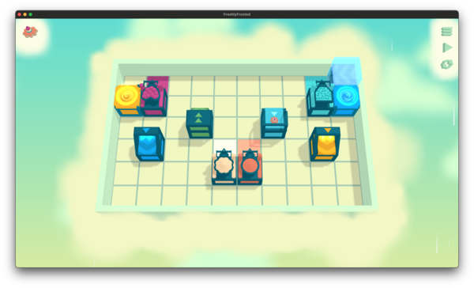
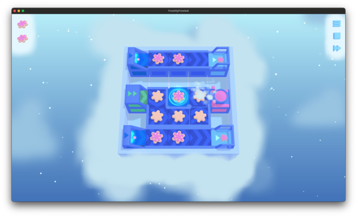
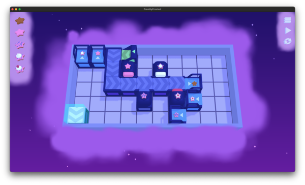

And so it begins. 

[Freshly Frosted](https://store.steampowered.com/app/1070790/Freshly_Frosted/)

It's a cute little puzzle game about making a donut factory. 

It's a lot like [[Solving Cosmic Express]]() in that it's a 'puzzle on rails', you are basically routing around the grid from source to target. In the way, we have to go to certain tiles in a certain order (in this case, to apply toppings to our donuts). 



Let's do it!

The first section (starting with [Basic layout](#basic-layout)) is the final state of the solution. If you jump down to [Interesting challenges and rewrites](#interesting-challenges-and-rewrites), that is more of a step by step walkthrough of what changed over time.

If you'd just like to see the entire source, [here](https://github.com/jpverkamp/rust-solvers/blob/877c8b933df5a7f85bbde3315e879d44181ea186/src/bin/freshly-frosted.rs) is the binary as of the writing of this post. I probably won't change too much from this point, except running some more tests and cleaning up. 



## Basic layout

First, our basic layout. Like all of the [[Rust Solvers]](), we'll need a `Global` state that is shared throughout the solver and a smaller `Local` state that we need to be able to `Hash` and `Clone` in order to implement our search function. 

### `Global` state

First, the `Global` state:

```rust
#[derive(Debug, Clone, Default)]
struct Global {
    // Map settings
    width: isize,
    height: isize,
    targets: Option<Vec<Option<Toppings>>>,

    // Map entities etc
    entities: Vec<Option<Entity>>,
    initial_belts: Vec<Option<Direction>>,
    teleporter_outs: Vec<Vec<Point>>,

    // Flags that change behavior for specific puzzles
    use_tickwise: bool,
    allow_invalid_deliveries: bool,
    loop_threshold: Option<usize>,

    // Local caches
    simulate_cache: Rc<RefCell<HashMap<Local, Vec<(Point, Toppings)>>>>,
    simulate_tickwise_cache: Rc<RefCell<HashMap<Local, SimulateTickwiseResult>>>,
}
```

This... certainly grew over time. The `width`, `height`, `targets`, and `entities` were in there right from the beginning. `width` and `height` should be obvious.

`targets` has a funny signature though. This isn't actually the `targets` on the map, those are `entities`. This instead is for later puzzles where you have only one `Target` on the map and have to deliver a specific list of donuts to it. So if it's `None`, this isn't a requirement. But if it's `Some`, you have to deliver a specific list. The internal a `Option<Toppings>` is mostly to match the type of current donuts, but really shouldn't have been done that way. 

`entities` is a list of all `Entities` on the level, with `None` for empty spaces. 

`initial_belts` was initially for [stepping through solutions](#stepping-through-solutions), but World 8 actually use these as part of the puzzles!

The next three are flags, see the sections on [tickwise simulation](#simulation-tickwise), [invalid deliveries](#allow-invalid-deliveries), or [allowing loops](#loop-treshold) for more details. 

Finally, the simulation caches. Originally, this was a single global `static`, then it was two, then I realized *that* was what was breaking my tests... and I [moved it inline](#parallelism--moving-simulation-caches). Yay [[wiki:interior mutability]]()!

So why cache? Because of how I [implemented State](#implementing-state), I will call `simulate` on `Local` (plus `Global`) multiple times for the same `Local`. It's *expensive*, so it's cheaper to `Hash` this state and store this result rather than doing it more than once. 

It's a lot, but this is designed to only be cloned a few times at most, so we can put mostly arbitrary things in here. It builds up over time. 

### Parsing levels

Just like the `struct`, the format for this grew throughout the solving of this. At the very beginning, it was pretty straight forward:

```text
.   .   .   .   .
+>  .   .   .   ->
.   .   .   .   .
```

I'll get more into it in [a bit](#parsing-entity), but `.` is empty space, `+` is a `Source`, `-` is a `Target`, and `>` indicates that the `Source` / `Target` want belts moving to the `Right`. 

But they got *quite* a bit more complicated as we went on:

```text
:targets 7 7
:tickwise
.   .   .   .   .   .   -^7
+^  .   .   .   .   .   .
+v  .   b>3 .   .   .   .
.   *   .   .   .   .   .
.   .   .   .   *   .   .
.   2<  .   1<  .   4<  .
.   .   .   .   .   .   .
```

The `:` lines at the top are flags that tell us (in this case) that we have specific `global.targets` that we need to meet and that we want to use the [`tickwise`](#simulation-tickwise) simulator (instead of the faster [default](#simulation-first-pass) one). 

Then we still have empty space, but we also have `Bumpers` (`b`), a `Crossover` (`*`), Toppers (start with `1`, `2`, `4`, or `f`; see the [toppings rewrite](#toppings-rewrite) for why), and a `Target` with a required type (`-^7`; `Target` going `Up` that needs `1` + `2` + `4` = `7`). 

So how do we load all that? 

```rust
impl From<&str> for Global {
    fn from(input: &str) -> Self {
        let mut global = Global::default();

        for line in input.lines() {
            let mut line_width = 0;
            let line = line.trim();

            if line.is_empty() {
                continue;
            }

            if line.starts_with(':') {
                if line.starts_with(":target") {
                    global.targets = Some(
                        line.split_whitespace()
                            .skip(1)
                            .map(|t| {
                                if t == "F" || t == "f" {
                                    return Some(Toppings::Cherries);
                                }

                                let v = t.parse::<usize>()
                                    .expect("Invalid target, must be numeric")
                                    .into();

                                match v {
                                    0 => Some(Toppings::None),
                                    1 => Some(Toppings::Frosting),
                                    3 => Some(Toppings::Sprinkles),
                                    7 => Some(Toppings::WhippedCream),
                                    15 => Some(Toppings::Cherries),
                                    _ => panic!("Invalid target: {t}"),
                                }
                            })
                            .collect::<Vec<_>>(),
                    );
                } else if line.starts_with(":comment") {
                    // Not stored, just do nothing
                } else if line.starts_with(":tickwise") {
                    global.use_tickwise = true;
                } else if line.starts_with(":allow-invalid-deliveries") {
                    global.allow_invalid_deliveries = true;
                } else if line.starts_with(":loop-threshold") {
                    global.loop_threshold = Some(
                        line.split_whitespace()
                            .skip(1)
                            .next()
                            .expect("Missing loop threshold")
                            .parse()
                            .expect("Invalid loop threshold"),
                    );
                } else {
                    panic!("Invalid/unknown flag: {line}");
                }
                continue;
            }

            for part in line.split_whitespace() {
                let mut belt = None;
                let mut entity = None;
                line_width += 1;

                if part == "." {
                    // Do nothing
                } else if let Ok(found_belt) = Direction::try_from(part) {
                    belt = Some(found_belt);
                } else {
                    entity = match Entity::try_from(part) {
                        Ok(entity) => Some(entity),
                        Err(e) => panic!("Invalid entity: {e}"),
                    };
                }

                assert!(!(entity.is_some() && belt.is_some()));

                global.initial_belts.push(belt);
                global.entities.push(entity);
            }

            global.width = global.width.max(line_width);
            global.height += 1;
        }

        // Teleporter validity check
        let mut teleporter_in_ids = global
            .entities
            .iter()
            .filter_map(|e| {
                if let Some(Entity {
                    kind: EntityKind::TeleporterIn(id),
                    ..
                }) = e
                {
                    Some(*id)
                } else {
                    None
                }
            })
            .collect::<Vec<_>>();
        teleporter_in_ids.sort();

        let mut teleporter_out_ids = global
            .entities
            .iter()
            .filter_map(|e| {
                if let Some(Entity {
                    kind: EntityKind::TeleporterOut(id),
                    ..
                }) = e
                {
                    Some(*id)
                } else {
                    None
                }
            })
            .collect::<Vec<_>>();
        teleporter_out_ids.sort();

        // Store the teleporter outs by ID for easy access
        let mut teleporter_outs = global
            .entities
            .iter()
            .enumerate()
            .filter_map(|(index, e)| {
                if let Some(Entity {
                    kind: EntityKind::TeleporterOut(id),
                    ..
                }) = e
                {
                    Some((
                        id,
                        Point {
                            x: index as isize % global.width,
                            y: index as isize / global.width,
                        },
                    ))
                } else {
                    None
                }
            })
            .collect::<Vec<_>>();
        teleporter_outs.sort_by_key(|(id, _)| *id);

        // Collapse that from (id, point) to vec<vec<point>>
        global.teleporter_outs = teleporter_outs
            .into_iter()
            .chunk_by(|(id, _)| *id)
            .into_iter()
            .map(|(_id, group)| {
                group.map(|(_, p)| p).collect::<Vec<_>>()
            })
            .collect::<Vec<_>>();

        global
    }
}
```

The core of it is pretty simple, but we do have a few big stages:

* First, parse any flags. I'll go through this [later](#interesting-challenges-and-rewrites), but we have:
    * `:target` - A list of donuts we need to make regardless of what `Targets` we have
    * `:comment` - Comments. They don't actually do anything.
    * `:allow-invalid-deliveries` - Only ended up used in 06/08; see [this section](#allow-invalid-deliveries) below
    * `:loop-threshold` - Allows loop detection; thought I'd need it for levels with bumperts, but didn't end up needing it, see [this section](#loop-treshold)

After that, we loop through each line (skipping empty lines) and load each `entity`

### Parsing `Entity`

From there, we need to go one level deeper, to parsing each specific kind of `Entity`. I'm actually fairly proud of this code:

```rust
impl TryFrom<&str> for Entity {
    type Error = String;

    fn try_from(value: &str) -> Result<Self, Self::Error> {
        if value.is_empty() {
            return Err("Entity cannot be empty".to_owned());
        }

        fn top(c: char) -> Result<Toppings, String> {
            Ok(c.into())
        }

        fn dir(c: char) -> Result<Direction, String> {
            Ok(Direction::try_from(c).map_err(|_| format!("Invalid direction: {c}"))?)
        }

        match value.chars().collect::<Vec<_>>().as_slice() {
            // A wall (doesn't actually have facing :smile:)
            &['#'] => Ok(Entity {
                kind: EntityKind::Block,
                facing: Direction::Up,
            }),

            // A source of new donuts
            &['+', facing] => Ok(Entity {
                kind: EntityKind::Source,
                facing: dir(facing)?,
            }),
            &['+', facing, '?'] => Ok(Entity {
                kind: EntityKind::AnySource,
                facing: dir(facing)?,
            }),

            // A target for donuts, first without any toppings
            &['-', facing] => Ok(Entity {
                kind: EntityKind::Target(Some(Toppings::None)),
                facing: dir(facing)?,
            }),
            // Doesn't matter what toppings
            &['-', facing, '?'] => Ok(Entity {
                kind: EntityKind::Target(None),
                facing: dir(facing)?,
            }),
            // Now with specific requested toppings
            &['-', facing, topping] => Ok(Entity {
                kind: EntityKind::Target(Some(top(topping)?)),
                facing: dir(facing)?,
            }),

            // A topping machine
            &[topping, facing] if topping.is_ascii_digit() => Ok(Entity {
                kind: EntityKind::Topper(top(topping)?),
                facing: dir(facing)?,
            }),

            // A splitter
            &['X', facing] | &['x', facing] => Ok(Entity {
                kind: EntityKind::Splitter,
                facing: dir(facing)?,
            }),

            // A bumper
            &['b', facing, topping] => Ok(Entity {
                kind: EntityKind::Bumper(top(topping)?),
                facing: dir(facing)?,
            }),

            // Teleporters (in doesn't currently have a facing)
            &['T', '-'] => Ok(Entity {
                kind: EntityKind::TeleporterIn(0),
                facing: Direction::default(),
            }),
            &['T', '+', facing] => Ok(Entity {
                kind: EntityKind::TeleporterOut(0),
                facing: dir(facing)?,
            }),

            &['U', '-'] => Ok(Entity {
                kind: EntityKind::TeleporterIn(1),
                facing: Direction::default(),
            }),
            &['U', '+', facing] => Ok(Entity {
                kind: EntityKind::TeleporterOut(1),
                facing: dir(facing)?,
            }),

            // Crossovers
            &['*'] => Ok(Entity {
                kind: EntityKind::Crossover,
                facing: Direction::default(),
            }),

            // Something we don't know how to parse
            _ => Err(format!("Invalid entity: {value}")),
        }
    }
}
```

It's a `match` again 1-3 character that can define any kind of `Entity`. The variables are always a facing (`Direction`) or `Toppings`. So each time I added a new `EntityKind`, I just had to add another match here (this is the one that wouldn't warn me about exhaustive matching). 

### `Entity`, `EntityKind`, and `Toppings`

`entities` is a list of anything that can be on the map that doesn't actually change in state (anything but the `belts`):

```rust
#[derive(Debug, Clone, Copy, PartialEq, Eq, Hash)]
struct Entity {
    kind: EntityKind,
    facing: Direction,
}

#[derive(Debug, Clone, Copy, PartialEq, Eq, Hash)]
enum EntityKind {
    Block,
    Source,
    AnySource,
    Target(Option<Toppings>),
    Topper(Toppings),
    Splitter,
    Bumper(Toppings),
    TeleporterIn(usize),
    TeleporterOut(usize),
    Crossover,
}

#[derive(Debug, Clone, Copy, PartialEq, Eq, Hash, Default, PartialOrd, Ord)]
enum Toppings {
    #[default]
    None,
    Frosting,
    Sprinkles,
    WhippedCream,
    Cherries,
}
```

I'll go through these in the [interesting challenges](#interesting-challenges-and-rewrites) section later, but roughly in order of introduction:

* World 1:
  * `Source` - Where un-topped donuts come from
  * `Target` - Where donuts are delivered to; if `None` any donut can go there, otherwise the `Toppings` must match
  * `Topper` - Apply the given `Toppings` to any donut in front of it

* World 2: Introduces multiple `Source` and `Target` on the same level
* World 3: Nothing new, just more complicated levels
* World 4: Introduce merging; this isn't an `EntityKind` but represents two belts or `Entities` moving onto the same point
* World 5: Clarifies that `Toppers` will ignore donuts sent to them out of order
* World 6: Introduce `Splitter` - Send donuts left/right/left/right (alternating)
* World 7: Introduces `Bumper` - If the `Toppings` match, push the donut in front of it away
* World 8: Introduces preset belts
* World 9: Introduces `TeleporterIn`/`Out` - Teleport from an `In` to an `Out`
* World 10: Introduces `Crossover` - Allow paths to cross, but you must alternate between horizontal and vertical
* World 11: Now you can have multiple `TeleporterOut` for each `TeleporterIn` and donuts are copied to all of then
* World 12: Introduces `AnySource` - Create random donuts from among all 5 possible kinds

Also... this is *not* how I did `Toppings` for *entirely* too long. I didn't realize that you could only have those 5 kinds, I thought you might be able to introduce any combination at some point (like `Frosting` and `Cherries` but not `Sprinkles`). But that was never the case. 

### `Local` state

Now that we have all that, we have the `Local` state:

```rust
#[derive(Clone, Debug, PartialEq, Eq, Hash)]
struct Local {
    belts: Vec<Option<Direction>>,
}
```

After all that mess above... this seems rather easy. :smile: 

It's `None` if you don't have a belt, otherwise, the belt goes in the direction specified. That's it, nothing changed for these throughout the entire puzzle, which I appreciated. And which also meant that we did have a very static way of representing these as a known length `Vec`. I could have used a slice, but the length depends on the size of the `Global`. So it goes. 

### Simulation: First pass

Okay, I'd like to get to the [root of the algorithm](#implementing-state), but before that, we have to actually write out simulation. I didn't actually do this the entire time, but eventually it just made sense!

I actually ended up writing two different simulators. The first one doesn't actually simulate the puzzle the same way you'd see it. Instead, it will follow a single donut at a time, applying whatever changes are necessary on each state. 

We do get some interesting cases: 
* multiple spawners mean we have to simulate multiple donuts
* splitters and teleporters with multiple exits will effectively 'split' the donut into 2.

But other than that, it's just a series of steps:

```rust
impl Local {
    #[tracing::instrument(skip(self, global), ret)]
    fn simulate(&self, global: &Global) -> Result<Vec<(Point, Toppings)>, String> {
        // Check the cache first
        if let Some(cached) = global.simulate_cache.borrow().get(self) {
            return Ok(cached.clone());
        }

        let step_tracing_enabled = std::env::var("FRESHLY_FROSTED_STEP_TRACE").is_ok();

        let mut donuts = vec![];
        let mut complete_donuts = vec![];

        // Now we actually have to simulate each source
        let mut visited = vec![];
        for _ in Toppings::all() {
            visited.push(vec![false; global.width as usize * global.height as usize]);
        }

        // First, find the sources:
        for x in 0..global.width {
            for y in 0..global.height {
                let index = (y * global.width + x) as usize;
                let p = Point { x, y };
                let toppings = Toppings::None;

                // Start a source here
                if let Some(Entity {
                    kind: EntityKind::Source,
                    facing,
                }) = global.entities[index]
                {
                    donuts.push((p, toppings, facing, visited.clone()));
                }

                // AnySource starts one for each type
                if let Some(Entity {
                    kind: EntityKind::AnySource,
                    facing,
                }) = global.entities[index]
                {
                    for topping in Toppings::all() {
                        donuts.push((p, topping, facing, visited.clone()));
                    }
                }
            }
        }

        // Now, until we've simulated all of the donuts, simulate each
        'each_donut: while let Some((mut p, mut toppings, initial_facing, mut visited)) =
            donuts.pop()
        {
            let span = tracing::debug_span!("Simulating donut", p = ?p, t = ?toppings, f = ?initial_facing);
            let _enter = span.enter();

            p = p + initial_facing.into();
            if !global.in_bounds(p) {
                return Err(format!(
                    "Donut started at {p:?} but immediately went out of bounds"
                ));
            }

            visited[toppings.index()][p.index(global.width)] = true;
            let mut crossover_direction = initial_facing;

            'simulation_tick: while !matches!(
                global.entities[p.index(global.width)],
                Some(Entity {
                    kind: EntityKind::Target(_),
                    ..
                })
            ) {
                if step_tracing_enabled {
                    // ... 
                }

                if !global.in_bounds(p) {
                    return Err(format!("Attempted to move out of bounds at {p:?}"));
                }

                // If there is a topper adjacent to us, apply it's topping
                for top_d in Direction::all() {
                    let p2 = p - top_d.into();
                    if !global.in_bounds(p2) {
                        continue;
                    }

                    if let Some(Entity {
                        kind: EntityKind::Topper(new_toppings),
                        facing,
                    }) = global.entities[p2.index(global.width)]
                    {
                        if top_d == facing && toppings.can_apply(new_toppings) {
                            tracing::debug!(
                                "Adding topping {new_toppings:?} from {p2:?} / {facing:?}"
                            );
                            toppings = new_toppings;
                        }
                    }
                }

                // If we're adjacent to a matching bumper, bump
                // TODO: Assume that the space we move onto is valid
                for bump_d in Direction::all() {
                    let p2 = p - bump_d.into();
                    if !global.in_bounds(p2) {
                        continue;
                    }

                    if let Some(Entity {
                        kind: EntityKind::Bumper(bump_toppings),
                        facing,
                    }) = global.entities[p2.index(global.width)]
                    {
                        if bump_d == facing && toppings == bump_toppings {
                            crossover_direction = bump_d;
                            p = p + bump_d.into();
                            continue 'simulation_tick;
                        }
                    }
                }

                // Otherwise, apply entities we are on
                if let Some(entity) = global.entities[p.index(global.width)] {
                    match entity.kind {
                        // Should never move out of any of these
                        EntityKind::Block
                        | EntityKind::Source
                        | EntityKind::AnySource
                        | EntityKind::Target(_)
                        | EntityKind::Topper(_)
                        | EntityKind::Bumper(_) => {
                            return Err(format!("Donut at {p:?} tried to move from a {entity:?}",));
                        }

                        EntityKind::Splitter => {
                            // Queue the two new donuts
                            donuts.push((p, toppings, entity.facing.turn_left(), visited.clone()));
                            donuts.push((p, toppings, entity.facing.turn_right(), visited.clone()));

                            // Do not simulate this path any more
                            continue 'each_donut;
                        }
                        EntityKind::TeleporterIn(id) => {
                            // Queue one new point for each teleporter out
                            for &p_out in &global.teleporter_outs[id] {
                                if let Some(Entity {
                                    kind: EntityKind::TeleporterOut(_),
                                    facing
                                }) = global.entities[p_out.index(global.width)]
                                {
                                    donuts.push((p_out, toppings, facing, visited.clone()));
                                } else {
                                    return Err(format!(
                                        "Teleporter in at {p:?} tried to move to a non-teleporter out",
                                    ));
                                }
                            }

                            // Do not follow this path any more
                            continue 'each_donut;
                        }
                        EntityKind::TeleporterOut(_) => {
                            // TODO: This doesn't check can_enter on the next space; assuming that's not a problem
                            crossover_direction = entity.facing;
                            p = p + entity.facing.into();
                            continue 'simulation_tick;
                        }
                        EntityKind::Crossover => {
                            // TODO: This doesn't check can_enter on the next space; assuming that's not a problem
                            p = p + crossover_direction.into();
                            continue 'simulation_tick;
                        }
                    }
                }

                // If we're on a belt, move along it
                if let Some(belt) = self.belts[p.index(global.width)] {
                    p = p + belt.into();
                    crossover_direction = belt;

                    // Some entities cannot be run into at all
                    // Some require that you are moving the right direction
                    if let Some(entity) = global.entities[p.index(global.width)] {
                        if !entity.can_enter(belt) {
                            return Err(format!(
                                "Donut at {p:?} tried to move {belt:?} onto a {entity:?} but couldn't",
                            ));
                        }
                    }
                } else {
                    break; // Ran off the end of a belt
                }

                if visited[toppings.index()][p.index(global.width)] {
                    if donuts.is_empty() {
                        tracing::info!("Loop detected at {p:?}, on the last donut");
                        break 'each_donut;
                    } else {
                        tracing::info!("Loop detected at {p:?}, but there are more donuts");
                        continue 'each_donut;
                    }
                } else {
                    visited[toppings.index()][p.index(global.width)] = true;
                }
            }

            complete_donuts.push((p, toppings));
        }

        // Cache the result
        global
            .simulate_cache
            .borrow_mut()
            .insert(self.clone(), complete_donuts.clone());

        Ok(complete_donuts)
    }
}
```

I hope it's well commented, but here are a few key points:

`visited` is a `Vec` of `Vec` that stores if we've already seen each point (for each simulated `donut`); this handles loop detection - originally, this was a single `Vec` for each point, but once things got complicated (with `Splitters` and `Bumpers`), we needed to be able to check if we saw *this kind of donut* at each point

Finding the sources just goes through the map and finds each `Source`. I could easily pre-calculate this and probably should, but this works well enough. For `AnySource` (in world 12), we do need to spawn one donut for each kind. For this simulation I completely ignore that they can be in any order. For the most part, it doesn't matter. 

Then, the main simulation loop: `each_donut`. We keep track of the current `p: Point` the donut is at and the `toppings` it current has. The `initial_facing` we don't track, since donuts don't *themselves* have a facing, that mostly comes from the component they are sitting on. This we do store in the queue though, since `Splitters` make two donuts facing in opposite directions and we need some way to tell them apart. 

Within that loop, we're going to have an inner loop that runs each `simulate_tick` until we hit a `Target` or an empty space (we'll come back to that). 

Then, we have `step_tracing_enabled`, which is entirely debugging (see [here](#stepping-through-solutions)). It's behind a flag since this is doing some wacky string things and is thus expensive to calculate each frame if I'm not debugging. 

Within the tick, we apply in order:

* Adjacent `Toppers` (that `can_apply` their `Toppings`)
* `Bumpers` which are evaluated before `belts`, since if they apply, you *cannot* pass them (this could have been in the next `match`)
* Other entities: `Splitters` and `Teleporters` actually spawn new donuts (two for `Splitters` and one or more for `Teleporters`) and stop the current simulation! This actually does clone `visited`, since we only want a single 'lineage' of simulated donuts to do loop detection; if donuts from two different sources hit the same point, that's actually expected
* Belts, the main case!
* Loop detection using `visited`

If we successfully exit the `while` loop, we record that we finished simulating a donut. Once the queue is empty, we return this whole list!

That code took a while to get right. And then again and again as I added more features!

### Simulation: `tickwise`

Unfortunately... for some levels (particular those involving merging timing), this just... didn't work. There are some cases that we need to actually simulate ever single donut on the board, thus the second `tickwise` simulation. 

The main reason I didn't switch over to this entirely though is that it is probably an order of magnitude slower than the [first simulation](#simulation-first-pass). So when possible, I use the other. 

Here's how this one works:

```rust
impl Local {
    #[tracing::instrument(skip(self, global), ret)]
    fn simulate_tickwise(&self, global: &Global) -> Result<SimulateTickwiseResult, String> {
        // Check the cache first
        if let Some(cached) = global.simulate_tickwise_cache.borrow().get(self) {
            return Ok(cached.clone());
        }

        let vec_size = global.width as usize * global.height as usize;

        #[derive(Debug, Clone, Copy, Default, PartialEq, Eq, Hash)]
        enum CrossoverState {
            #[default]
            Open,
            Occupied(Direction),
            OpenHorizontal,
            OpenVertical,
        }

        #[derive(Debug, Clone, Default, PartialEq, Eq, Hash)]
        struct TileState {
            toppings: Option<Toppings>,
            source: Option<Point>,
            waiting_time: usize,
            split_next_right: bool,
            crossover_state: CrossoverState,
            any_source_state: Toppings,
        }

        #[derive(Debug, Clone, PartialEq, Eq, Hash)]
        struct Update {
            move_from: Point,
            move_to: Point,
            toppings: Toppings,
            source: Point,
        }

        let mut state = vec![TileState::default(); vec_size];

        let mut deliveries = HashMap::new();
        let mut states_seen = HashMap::new();

        macro_rules! state_at {
            ($p:expr) => {
                state[$p.index(global.width)]
            };
        }

        // We have a very expensive tracing option; so don't calculate it if we're not going to print it
        let tracing_enabled = std::env::var("FRESHLY_FROSTED_TRACE").is_ok();
        let step_tracing_enabled = std::env::var("FRESHLY_FROSTED_STEP_TRACE").is_ok();

        // Advance the simulation one tick
        'tick: loop {
            let mut updates = vec![];
            let max_waiting_time = state.iter().map(|s| s.waiting_time).max().unwrap_or(0);

            // This shouldn't generally happen; but if it does we have an infinite loop so don't hang
            if max_waiting_time > global.width as usize * global.height as usize {
                panic!("Waiting time exceeded maximum");
            }

            // Debugging ticking
            if tracing_enabled {
                // ...
            }

            // Cache which exact states we've seen; break once we see the same more than once (or a set threshold of times)
            if let Some(count) = states_seen.get(&state) {
                let threshold = global.loop_threshold.unwrap_or(1);
                if *count >= threshold {
                    tracing::debug!("Loop detected (threshold={threshold}), breaking");
                    tracing::debug!("Deliveries are: {deliveries:?}");
                    break 'tick;
                }
            }
            states_seen
                .entry(state.clone())
                .and_modify(|e| *e += 1)
                .or_insert(1);

            // Calculate all requested updates
            for x in 0..global.width {
                'next_point: for y in 0..global.height {
                    let p = Point { x, y };

                    // Create a potential update for sources
                    if let Some(Entity {
                        kind: EntityKind::Source,
                        facing,
                    }) = global.entities[p.index(global.width)]
                    {
                        updates.push(Update {
                            move_from: p,
                            move_to: p + facing.into(),
                            toppings: Toppings::None,
                            source: p,
                        });
                        continue 'next_point;
                    }

                    // AnySources update sequentially 
                    if let Some(Entity {
                        kind: EntityKind::AnySource,
                        facing,
                    }) = global.entities[p.index(global.width)]
                    {
                        let next_toppings = state_at!(p).any_source_state;

                        updates.push(Update {
                            move_from: p,
                            move_to: p + facing.into(),
                            toppings: next_toppings,
                            source: p,
                        });

                        state_at!(p).any_source_state = next_toppings.any_source_next();

                        continue 'next_point;
                    }

                    // No updates for spaces that do not have a donut
                    if state_at!(p).toppings.is_none() {
                        continue;
                    }

                    // If we are trying to update on an empty space, stop the simulation here
                    if self.is_empty(global, p) {
                        break 'tick;
                    }

                    // Bumpers take priority over belts
                    // TODO: Can you push into a merge situation? Then we'd need both.
                    // TODO: Assume there's only one bumper per space
                    for d in Direction::all() {
                        let p2 = p - d.into();
                        if !global.in_bounds(p2) {
                            continue;
                        }

                        if let Some(Entity {
                            kind: EntityKind::Bumper(bumper_toppings),
                            facing,
                        }) = global.entities[p2.index(global.width)]
                        {
                            if facing == d && bumper_toppings == state_at!(p).toppings.unwrap() {
                                tracing::debug!("Bumper at {p2:?} with facing {d:?} and toppings {bumper_toppings:?}");
                                updates.push(Update {
                                    move_from: p,
                                    move_to: p + d.into(),
                                    toppings: state_at!(p).toppings.unwrap(),
                                    source: state_at!(p).source.unwrap(),
                                });
                                continue 'next_point;
                            }
                        }
                    }

                    // Belts are easy!
                    if let Some(belt) = self.belts[p.index(global.width)] {
                        // We have to be able to move onto that space
                        let p2 = p + belt.into();
                        if !global.in_bounds(p2) {
                            return Err(format!("Attempted to move out of bounds at {p:?}"));
                        }

                        // We have to be able to move onto the next entity
                        if let Some(entity) = global.entities[p2.index(global.width)] {
                            if !entity.can_enter(belt) {
                                return Err(format!(
                                    "Donut at {p:?} tried to move {belt:?} onto a {entity:?} but couldn't",
                                ));
                            }
                        }

                        // If we make it this far, this is a valid potential move
                        updates.push(Update {
                            move_from: p,
                            move_to: p + belt.into(),
                            toppings: state_at!(p).toppings.unwrap(),
                            source: state_at!(p).source.unwrap(),
                        });
                        continue 'next_point;
                    }

                    // Any entities we could be standing on
                    // We should never have moved onto invalid ones (see above)
                    if let Some(entity) = global.entities[p.index(global.width)] {
                        match entity.kind {
                            EntityKind::Block | EntityKind::Topper(_) | EntityKind::Bumper(_) => {
                                unreachable!("Donut at {p:?} is on a {:?}", entity.kind);
                            }
                            // Try to create a (potential) new donut
                            EntityKind::Source | EntityKind::AnySource => unreachable!("Sources are handled earlier"),
                            // If we're on a target, matching done/not error
                            EntityKind::Target(toppings) => {
                                if toppings.is_none()
                                    || state_at!(p).toppings.unwrap() == toppings.unwrap()
                                    || global.allow_invalid_deliveries
                                {
                                    deliveries.entry(p).or_insert_with(HashSet::new).insert((
                                        state_at!(p).source.unwrap(),
                                        state_at!(p).toppings.unwrap(),
                                    ));
                                } else {
                                    return Err(format!(
                                        "Donut at {p:?} is on a target with the wrong toppings"
                                    ));
                                }
                            }
                            // Splitters try to move in the next direction
                            EntityKind::Splitter => {
                                if state_at!(p).split_next_right {
                                    updates.push(Update {
                                        move_from: p,
                                        move_to: p + entity.facing.turn_right().into(),
                                        toppings: state_at!(p).toppings.unwrap(),
                                        source: state_at!(p).source.unwrap(),
                                    });
                                } else {
                                    updates.push(Update {
                                        move_from: p,
                                        move_to: p + entity.facing.turn_left().into(),
                                        toppings: state_at!(p).toppings.unwrap(),
                                        source: state_at!(p).source.unwrap(),
                                    });
                                }
                            }
                            // Teleporter in tries to move to each of the teleporter outs
                            // If we have an in, we have an out (according to the loading function)
                            EntityKind::TeleporterIn(id) => {
                                global.teleporter_outs[id].iter().for_each(|&p_out| {
                                    updates.push(Update {
                                        move_from: p,
                                        move_to: p_out,
                                        toppings: state_at!(p).toppings.unwrap(),
                                        source: state_at!(p).source.unwrap(),
                                    })
                                })
                            },
                            // Teleporter out basically acts like a source
                            EntityKind::TeleporterOut(_) => {
                                updates.push(Update {
                                    move_from: p,
                                    move_to: p + entity.facing.into(),
                                    toppings: state_at!(p).toppings.unwrap(),
                                    source: state_at!(p).source.unwrap(),
                                });
                            }
                            // Crossovers keep going in the same direction
                            EntityKind::Crossover => match state_at!(p).crossover_state {
                                CrossoverState::Open
                                | CrossoverState::OpenHorizontal
                                | CrossoverState::OpenVertical => {
                                    unreachable!("Donuts should not be able to move out of non-occupied crossovers")
                                }
                                CrossoverState::Occupied(d) => {
                                    updates.push(Update {
                                        move_from: p,
                                        move_to: p + d.into(),
                                        toppings: state_at!(p).toppings.unwrap(),
                                        source: state_at!(p).source.unwrap(),
                                    });
                                }
                            },
                        }
                    }
                }
            }

            // Okay, now for any update that has multiple choices, we have to choose one
            // Choose the one that has the largest waiting_time
            // Then we have to increment the waiting time for the rest and wind back any updates depending on those
            let mut will_update = vec![true; updates.len()];
            for x in 0..global.width {
                for y in 0..global.height {
                    let p = Point { x, y };

                    let mut updates = updates
                        .iter()
                        .enumerate()
                        .filter(|(_, u)| u.move_to == p)
                        .collect::<Vec<_>>();

                    // Special case: if we are moving onto a crossover at most one is valid
                    // TODO: This assumes we don't have both up and down in when openvertical in the same tick
                    if let Some(Entity { kind: EntityKind::Crossover, .. }) = global.entities[p.index(global.width)] {
                        if updates.len() == 0 {
                            continue;
                        }

                        for (index, update) in updates.iter() {
                            let d: Direction = (p - update.move_from).try_into().expect("Moved onto a crossover with a non-adjacent move");

                            let failed = match state_at!(p).crossover_state {
                                CrossoverState::Occupied(_) => true,
                                CrossoverState::OpenHorizontal => d == Direction::Up || d == Direction::Down,
                                CrossoverState::OpenVertical => d == Direction::Left || d == Direction::Right,
                                _ => false,
                            };

                            if failed {
                                will_update[*index] = false;
                            }
                        }

                        continue;
                    }

                    // Otherwise, if there are zero or 1 updates to this point, it's fine
                    if updates.len() <= 1 {
                        continue;
                    }

                    // Sort, the longest waiting will end up first
                    // On ties, the most frosted donut goes first
                    updates.sort_by(|(_, a), (_, b)| {
                        state_at!(b.move_from)
                            .waiting_time
                            .cmp(&state_at!(a.move_from).waiting_time)
                            .then_with(|| {
                                state_at!(b.move_from)
                                    .toppings
                                    .unwrap_or(Toppings::None)
                                    .cmp(&state_at!(a.move_from).toppings.unwrap_or(Toppings::None))
                            })
                    });

                    // The waiting time for the source of the one that moves is 0'ed
                    // The rest incremented
                    state[updates[0].1.move_from.index(global.width)].waiting_time = 0;
                    for (_, u) in updates.iter().skip(1) {
                        state[u.move_from.index(global.width)].waiting_time += 1;
                    }

                    // All the rest of them are flagged as not updating
                    for (index, _) in updates.iter().skip(1) {
                        will_update[*index] = false;
                    }
                }
            }

            // Now propagate that backwards
            'still_did_not_updating: loop {
                for (i, ui) in updates.iter().enumerate() {
                    for (j, uj) in updates.iter().enumerate() {
                        if i != j && will_update[i] && !will_update[j] && ui.move_to == uj.move_from
                        {
                            will_update[i] = false;
                            continue 'still_did_not_updating;
                        }
                    }
                }

                // If we make it through the loops without updating anything, we're done
                break;
            }

            // Now apply each update that is still in the list

            // First, remove from the source to make space for the destinations
            for (i, u) in updates.iter().enumerate() {
                if will_update[i] {
                    state_at!(u.move_from).toppings = None;
                    state_at!(u.move_from).source = None;

                    // Moving from a splitter means it toggles
                    // This updates the flag for everything, even non-splitters, but we never read it otherwise
                    state_at!(u.move_from).split_next_right =
                        !state_at!(u.move_from).split_next_right;

                    // When we move out of a crossover, it toggles the state depending on how we did
                    if let Some(Entity {
                        kind: EntityKind::Crossover,
                        ..
                    }) = global.entities[u.move_from.index(global.width)]
                    {
                        let d: Direction = (u.move_to - u.move_from)
                            .try_into()
                            .expect("Moved out of a crossover with a non-adjacent move");

                        state_at!(u.move_from).crossover_state = match d {
                            Direction::Up | Direction::Down => CrossoverState::OpenHorizontal,
                            Direction::Left | Direction::Right => CrossoverState::OpenVertical,
                        };

                        tracing::debug!("Moved out of a crossover at {u:?} with direction {d:?}");
                    }
                }
            }

            // And then set each destination
            for (i, u) in updates.iter().enumerate() {
                if will_update[i] {
                    state_at!(u.move_to).toppings = Some(u.toppings);
                    state_at!(u.move_to).source = Some(u.source);

                    // Moving to a splitter does *not* toggle it

                    // If we move into a crossover, toggle it's mode
                    if let Some(Entity {
                        kind: EntityKind::Crossover,
                        ..
                    }) = global.entities[u.move_to.index(global.width)]
                    {
                        let d = (u.move_to - u.move_from)
                            .try_into()
                            .expect("Moved into a crossover with a non-adjacent move");

                        state_at!(u.move_to).crossover_state = CrossoverState::Occupied(d);

                        tracing::debug!("Moved into a crossover at {u:?} with direction {d:?}");
                    }
                }
            }

            // Finally, apply toppers
            for x in 0..global.width {
                for y in 0..global.height {
                    let p = Point { x, y };

                    if let Some(Entity {
                        kind: EntityKind::Topper(new_topping),
                        facing,
                    }) = global.entities[p.index(global.width)]
                    {
                        let p2 = p + facing.into();
                        if !global.in_bounds(p2) {
                            continue;
                        }

                        if let Some(state) = state.get_mut(p2.index(global.width)) {
                            if let Some(current_toppings) = state.toppings {
                                if current_toppings.can_apply(new_topping) {
                                    state.toppings = Some(new_topping)
                                }
                            }
                        }
                    }
                }
            }
        }

        // At the end, extra donuts are any on an empty space
        let extras = state
            .iter()
            .enumerate()
            .filter_map(|(index, s)| {
                let p = Point {
                    x: index as isize % global.width,
                    y: index as isize / global.width,
                };

                if self.is_empty(global, p) && s.toppings.is_some() {
                    Some((p, s.toppings.unwrap()))
                } else {
                    None
                }
            })
            .collect();

        let result = SimulateTickwiseResult { deliveries, extras };

        // Cache the result
        global
            .simulate_tickwise_cache
            .borrow_mut()
            .insert(self.clone(), result.clone());

        Ok(result)
    }
}
```

That is so much more code. You can see why it might take longer. 

The basic idea for this one is that we are *actually* going to run the entire simulation. First, we calculate a list of all updates that we want to apply. Then, we check for incompatible updates (caused by merging and `Crossovers`) and remove those. Then, we apply the rest of the updates and run another tick. 

We do have three additional structs here:

`TileState` is the state of the map and donuts on it. We create a single `Vec` of these at the beginning of the state and then re-use it for the entire simulation to avoid allocations. Within that, we have:

* `toppings`: Represents a donut, `None` if there isn't one here
* `source`: Represents the `Source` a donut came from (both for loop detection and `is_solved` checks (each `Source` must deliver at least once))
* `waiting_time`: When two belts merge, the one that has been waiting longer goes first; this tracks that
* `split_next_right`: Handles state for `Splitters` alternating 
* `crossover_state`: Is the 4 states that a `Crossover` can be in: `Open` only at the start when any donut can enter it, `Occupied` when a donut is passing through and `OpenHorizontal` / `OpenVertical` to implement the alternating that these require

Then we also have `Update` which will be a list of all the donuts that want to update. This one we *do* re-allocate for, which is probably suboptimal. But I didn't benchmark it. 

On to the simulation:

For each `tick`, we need to calculate a list of `updates`.

We have an internal cache `states_seen` that tracks loop detection. In this simulation, the entire state needs to be the same (so `Splitters` the same way, `CrossOvers` the same, etc) to be declared a loop

Within that, the kinds of `updates` are (evaluated for each point on the map):

* `Sources` and `AnySources` spawn new donuts; the later just cycles through rather than doing it randomly, I want this to be deterministic (I could have used a [[wiki:pseudorandom number generator]]() with a known seed, but didn't bother).
* `Bumpers` bump; this has to be first since the update for a `belt` won't be generated then
* `belts` just move along the belt
* `Splitters` queue a different update depending on `split_next_right`
* `Teleporters` make an update that jumps across the map
* `CrossOvers` only update they are occupied (going into a crossover is handled later)

In addition, `Targets` directly remove their donut. This isn't an `update` since it's impossible for a collision to happen *on* the `Target`.

Then, we have to figure out which updates to apply: `will_update`. 

First, we handle `Crossover`. These are close to `merges` but we don't choose on timing, but rather by the state of the `CrossOver`. 

Then for merges, if there are two `updates` going to the same spot: The oldest one goes first and all the rest wait (incrementing their own timer). If there's a tie, the donut with the most `Toppings` goes first. If there's still a tie... well that didn't actually end up mattering, so because of the order we generated updates it will go left to right, top to bottom. 

Now actually actually *apply* these updates. This is done in two passes so we don't need to double buffer. First, we remove the donut from the `move_from` location (this is why the `Update` stores what kind of donut it is); then we loop again adding them in the `move_to`. 

Finally, apply `toppers` and advance!

After the simulation is done; we can return. In this case, I return separately any `extras` (donuts that aren't delivered, we'll use this in [`next_states`](#next_states)) and `deliveries` (used for [`is_solved`](#is_solved)).

### Implementing `State`

Okay, we have two simulations. 

To actually use our solver, we're going to need to actually `impl State` over `Global` for `Local` (I'm not using `Step` this time around). 

#### `next_states`

These actually end up fairly straight forward based on our previous simulation functions. 

To get next states:

* get a list of the current states of donuts
* for each (until we find one with next states; only return states for one)
  * try each direction (checking if we can exit / enter entities in that direction)
* if we returned at least one possible belt, add it and return those as new states

```rust
impl State<Global, ()> for Local {
    #[tracing::instrument(skip(self, global), fields(belts = %self))]
    fn next_states(&self, global: &Global) -> Option<Vec<(i64, (), Local)>> {
        let mut donuts = if global.use_tickwise {
            match self.simulate_tickwise(global) {
                Ok(tickwise_result) => tickwise_result.extras,
                Err(e) => {
                    tracing::debug!("Simulation failed: {e}");
                    return None;
                }
            }
        } else {
            match self.simulate(global) {
                Ok(donuts) => donuts,
                Err(e) => {
                    tracing::debug!("Simulation failed: {e}");
                    return None;
                }
            }
        };
        donuts.sort();

        // Find the first empty point
        for (p, _) in donuts {
            tracing::debug!("Checking for expansion at {p:?}");

            if !self.is_empty(global, p) {
                continue;
            }

            tracing::debug!("Expanding new_state at {p:?}");

            // This is necessary in the (rare, only 6/8 so far) case that one expansion is invalid now but will become valid after another state is added
            let maybe_next_states = Direction::all()
                .iter()
                .flat_map(|&d| {
                    if let Some(entity) = global.entities[p.index(global.width)] {
                        if !entity.can_exit(d) {
                            tracing::debug!("^ Cannot exit {entity:?} going {d:?}");
                            return None;
                        }
                    }

                    let p2 = p + d.into();
                    if global.in_bounds(p2) {
                        if let Some(entity) = global.entities[p2.index(global.width)] {
                            if !entity.can_enter(d) {
                                tracing::debug!("^ Cannot enter {entity:?} going {d:?}");
                                return None;
                            }
                        }
                        
                        tracing::debug!("^ Expanding {d:?}");

                        let mut new_state = self.clone();
                        new_state.belts[p.index(global.width)] = Some(d);
                        Some((1, (), new_state))
                    } else {
                        None
                    }
                })
                .collect::<Vec<_>>();

            if !maybe_next_states.is_empty() {
                return Some(maybe_next_states);
            }
        }

        None
    }
}
```

And that's it! I had a lot of that simulation code inlined for a long while, but after I got the second simulation it just got too long so I refactored. 

#### `is_valid`

Similarly, `is_valid`:

```rust
impl State<Global, ()> for Local {
    #[tracing::instrument(skip(self, global), fields(belts = %self), ret)]
    fn is_valid(&self, global: &Global) -> bool {
        if global.use_tickwise {
            self.simulate_tickwise(global).is_ok()
        } else {
            let donuts = match self.simulate(global) {
                Ok(donuts) => donuts,
                Err(e) => {
                    tracing::debug!("Simulation failed: {e}");
                    return false;
                }
            };
            tracing::debug!("Simulation result: {donuts:?}");

            let target_points = global
                .entities
                .iter()
                .enumerate()
                .filter_map(|(index, entity)| {
                    if let Some(Entity {
                        kind: EntityKind::Target(_),
                        ..
                    }) = entity
                    {
                        Some(Point {
                            x: index as isize % global.width,
                            y: index as isize / global.width,
                        })
                    } else {
                        None
                    }
                })
                .collect::<Vec<_>>();

            // Each current donut must be either on a target or be able to reach one
            tracing::debug!("Checking reachability");
            for (donut_p, toppings) in donuts.iter() {
                tracing::debug!("Checking donut at {donut_p:?} with toppings {toppings:?}");
                if !target_points
                    .iter()
                    .any(|target_p| self.is_reachable(global, *donut_p, *target_p))
                {
                    return false;
                }
            }

            // We cannot have an over filled simulation
            // For example, if we need 1 plain donut, we cannot have frosting on all the donuts
            let mut donut_types = donuts
                .into_iter()
                .map(|(_, toppings)| Some(toppings))
                .collect::<Vec<_>>();
            donut_types.sort();

            let mut target_donuts = global
                .entities
                .iter()
                .filter_map(|e| match e {
                    Some(Entity {
                        kind: EntityKind::Target(toppings),
                        ..
                    }) => Some(*toppings),
                    _ => None,
                })
                .collect::<Vec<_>>();
            target_donuts.sort();

            // We can't do this comparison if we have any 'any' targets
            if target_donuts.iter().all(|t| t.is_some()) {
                // This comparison also doesn't work if we have fewer targets than dummies (world 4: merge)
                if donut_types.len() == target_donuts.len() {
                    // Because they're sorted, this means have at least one donut with too many toppings
                    if donut_types > target_donuts {
                        tracing::debug!(
                            "Not possible. Got {donut_types:?} but needed {target_donuts:?}"
                        );
                        return false;
                    }
                }
            }

            // But if we have a target in the globals, we must (also?) match that
            if let Some(target_donuts) = &global.targets {
                if &donut_types > target_donuts {
                    tracing::debug!("Not possible against global types. Got {donut_types:?} but needed {target_donuts:?}");
                    return false;
                }
            }

            true
        }
    }
}
```

I don't actually do must checking with the `tickwise` simulation, since that will `Err` on most cases. But I do make sure to check a few more in the original simulation. The main check here is `is_reachable`:

```rust
impl Local {
    // Is it at all possible to get from src to dst with the current belt configuration?
    // Use empty points, allowed to step on targets, and can follow belts + splitters
    #[tracing::instrument(skip(self, global), ret)]
    fn is_reachable(&self, global: &Global, src: Point, dst: Point) -> bool {
        if src == dst {
            return true;
        }

        pathfinding::prelude::bfs(
            &src,
            |p| {
                // If we're on a teleporter, step out of it
                if let Some(entity) = global.entities[p.index(global.width)] {
                    match entity.kind {
                        EntityKind::TeleporterIn(id) => {
                            return global.teleporter_outs[id].clone();
                        }
                        EntityKind::TeleporterOut(_) => {
                            return vec![*p + entity.facing.into()];
                        }
                        _ => {}
                    }
                }

                // Otherwise, try each direction
                let mut neighbors = vec![];
                for d in Direction::all() {
                    // If we're expanding along a belt, we have to follow the belt
                    if let Some(belt_direction) = self.belts[p.index(global.width)] {
                        if belt_direction != d {
                            continue;
                        }
                    }

                    // Don't expand the bfs out of bounds
                    let p2 = *p + d.into();
                    if !global.in_bounds(p2) {
                        continue;
                    }

                    // Trying to leave a point in a way we're not allowed
                    if global.entities[p.index(global.width)].is_some_and(|e| !e.can_exit(d)) {
                        continue;
                    }

                    // Otherwise, we can always step onto empty space or a belt
                    if self.is_empty(global, p2) || self.belts[p2.index(global.width)].is_some() {
                        neighbors.push(p2);
                    }

                    // And if we're stepping onto an entity that allows it, that's fine
                    if global.entities[p2.index(global.width)].is_some_and(|e| e.can_enter(d)) {
                        neighbors.push(p2);
                    }
                }

                // Also account for bumpers
                for d in Direction::all() {
                    let p2 = *p + d.into();
                    if !global.in_bounds(p2) {
                        continue;
                    }

                    // If we're looking at a bumper pointing at us, include being bumped backwards
                    if let Some(Entity {
                        kind: EntityKind::Bumper(_),
                        facing,
                    }) = global.entities[p2.index(global.width)]
                    {
                        if facing == d.flip() {
                            let p3 = *p - d.into();

                            if !global.in_bounds(p3) {
                                continue;
                            }

                            if self.is_empty(global, p3)
                                || self.belts[p3.index(global.width)].is_some()
                            {
                                neighbors.push(p3);
                            }

                            if global.entities[p3.index(global.width)]
                                .is_some_and(|e| e.can_enter(d))
                            {
                                neighbors.push(p3);
                            }
                        }
                    }
                }

                neighbors
            },
            |p| *p == dst,
        )
        .is_some()
    }
}
```

It amuses me somewhat to process that using `pathfinding` since we're implementing A* ourselves. But it works. 

Other than that, we also check if we've applied too many toppings and that's about it. Mostly, we don't generate invalid states in the first place. 

#### `is_solved`

Okay, this got a bit longer as we went. I seem to be saying that a lot. 

```rust
impl State<Global, ()> for Local {
        #[tracing::instrument(skip(self, global), fields(belts = %self), ret)]
    fn is_solved(&self, global: &Global) -> bool {
        if global.use_tickwise {
            let simulation_result = match self.simulate_tickwise(global) {
                Ok(simulation_result) => simulation_result,
                Err(e) => {
                    tracing::debug!("Simulation failed: {e}");
                    return false;
                }
            };
            tracing::debug!("Simulation result: {simulation_result:#?}");

            // If we're allowing invalid deliveries, it's still not solved if there are any that don't match
            if global.allow_invalid_deliveries {
                for (dst, donuts) in simulation_result.deliveries.iter() {
                    for (_, toppings) in donuts.iter() {
                        match global.entities[dst.index(global.width)] {
                            // Each destination must be none or matching
                            Some(Entity {
                                kind: EntityKind::Target(target_toppings),
                                ..
                            }) if target_toppings.is_none()
                                || *toppings == target_toppings.unwrap() => {}
                            // If not, this is not a valid solution
                            _ => {
                                tracing::debug!(
                                    "Invalid delivery at {dst:?} with toppings {toppings:?}"
                                );
                                return false;
                            }
                        }
                    }
                }
            }

            // All sources must have been delivered from
            let all_delivered_from = simulation_result
                .deliveries
                .values()
                .flatten()
                .map(|(p, _)| *p)
                .collect::<HashSet<_>>();

            for (index, entity) in global.entities.iter().enumerate() {
                if let Some(Entity {
                    kind: EntityKind::Source | EntityKind::AnySource,
                    ..
                }) = entity
                {
                    let p = Point {
                        x: index as isize % global.width,
                        y: index as isize / global.width,
                    };

                    if !all_delivered_from.contains(&p) {
                        tracing::debug!("Source at {p:?} was not delivered from");
                        return false;
                    }
                }
            }

            // All targets must have been delivered to
            for (index, entity) in global.entities.iter().enumerate() {
                if let Some(Entity {
                    kind: EntityKind::Target(_),
                    ..
                }) = entity
                {
                    let p = Point {
                        x: index as isize % global.width,
                        y: index as isize / global.width,
                    };

                    if !simulation_result.deliveries.contains_key(&p) {
                        tracing::debug!("Target at {p:?} was not delivered to");
                        return false;
                    }
                }
            }

            // If a global target list is set, check that the donuts match
            if let Some(global_targets) = &global.targets {
                // For this check, a single source delivering to multiple targets counts as a single donut
                // That's why we HashSet first
                let mut all_delivered_donuts = simulation_result
                    .deliveries
                    .values()
                    .flatten()
                    .map(|pt| pt)
                    .collect::<HashSet<_>>()
                    .into_iter()
                    .map(|(_, t)| Some(*t))
                    .collect::<Vec<_>>();

                all_delivered_donuts.sort();

                if &all_delivered_donuts != global_targets {
                    tracing::debug!("Invalid solution, types don't match. Got {all_delivered_donuts:?} but needed {global_targets:?}");
                    return false;
                }
            }

            // We passed all conditions, we're SOLVED!
            true
        } else {
            // Simulate the current state
            tracing::debug!("Running simulation");
            tracing::debug!("\n{}", self.stringify(global));
            let donuts = match self.simulate(global) {
                Ok(donuts) => donuts,
                Err(e) => {
                    tracing::debug!("Simulation failed: {e}");
                    return false;
                }
            };
            tracing::debug!("Simulation result: {donuts:?}");

            // Each target must have at least one donut
            for (index, entity) in global.entities.iter().enumerate() {
                if let Some(Entity {
                    kind: EntityKind::Target(_),
                    ..
                }) = entity
                {
                    let p = Point {
                        x: index as isize % global.width,
                        y: index as isize / global.width,
                    };

                    if !donuts.iter().any(|(donut_p, _)| *donut_p == p) {
                        tracing::debug!("No donut delivered to {p:?}");
                        return false;
                    }
                }
            }

            // Each donut must end at a matching target
            // A non-target accepts any donut
            for (donuts_p, toppings) in donuts.iter() {
                tracing::debug!("Checking donut at {donuts_p:?} with toppings {toppings:?}");
                match global.entities[donuts_p.index(global.width)] {
                    Some(Entity {
                        kind: EntityKind::Target(target_toppings),
                        ..
                    }) if target_toppings.is_none() || *toppings == target_toppings.unwrap() => {}
                    _ => {
                        tracing::debug!("Invalid solution, donut at {donuts_p:?} with toppings {toppings:?} isn't at a matching target");
                        return false;
                    }
                }
            }

            // If we have a toppings array, match that as well/instead
            // The check above already checks that they're all at targets, this just checks types
            if let Some(target_donuts) = &global.targets {
                let mut donut_types = donuts.iter().map(|(_, t)| Some(*t)).collect::<Vec<_>>();
                donut_types.sort();

                if &donut_types != target_donuts {
                    tracing::debug!("Invalid solution, types don't match. Got {donut_types:?} but needed {target_donuts:?}");
                    return false;
                }
            }

            true
        }
    }
}
```

Because `simulate` returns just a single `Vec` of final states and `simulate_tickwise` returns `deliveries` and `extras` separately, these overlap less. But it works out well enough. 

#### `heuristic` 

For the heuristic, I actually only use the `simulate` solver:

```rust
impl State<Global, ()> for Local {
    fn heuristic(&self, global: &Global) -> i64 {
        // TODO: This uses the non-tickwise solver in both modes, is this okay?

        // For each donut, the distance to the nearest reachable target
        let donuts = match self.simulate(global) {
            Ok(donuts) => donuts,
            Err(_) => return 0,
        };

        let target_points = global
            .entities
            .iter()
            .enumerate()
            .filter_map(|(index, entity)| {
                if let Some(Entity {
                    kind: EntityKind::Target(_),
                    ..
                }) = entity
                {
                    Some(Point {
                        x: index as isize % global.width,
                        y: index as isize / global.width,
                    })
                } else {
                    None
                }
            })
            .collect::<Vec<_>>();

        donuts
            .iter()
            .map(|(donut_p, _)| {
                target_points
                    .iter()
                    .filter(|target_p| self.is_reachable(global, *donut_p, **target_p))
                    .map(|target_p| donut_p.manhattan_distance(*target_p))
                    .min()
                    .unwrap_or(0) as i64
            })
            .sum()
    }
}
```

I could definitely have used `extras` on `simulate_tickwise`, especially since this means that I'm running both simulations for each state (I wonder if that's one reason it's so much slower...) but it works well enough.

## Overview

And that's it! Simulate, implement `State`, and type up all the levels. There are a 12 worlds of 12 each, which is just gross. I enjoyed it!

## Interesting challenges and rewrites

Okay, that's the higher level solution as it stands. If you'd rather read through the solutions state by state (with more a focus on what changed), this is the section for you!

### Initial solution

* [Commit](https://github.com/jpverkamp/rust-solvers/commit/a97d12cd9e71058151706215932aea9b33856d7e)

And so it begins! This is the first commit to `freshly-frosted.rs` which sets everything up. 

We already have `Entity` and `EntityKind` with `TryFrom<&str>` exactly the same as it ended up (just with only a handful of `Entities`). 

`Global` only has `width`, `height`, and `entities`. 

Otherwise, we have: 

* `is_valid` is `true`; this is always handled by `next_states` or `is_solved`, so we don't cut out *any* invalid states
* `is_solved` requires a belt pointing at each `Target`
* Simulation is only done in `is_solved` and is inline
* `next_states` finds 'heads' (a source or belt pointing at empty space) and then expands one of them; the checks to 'can expand' are longer than they ended up
* `heuristic` is `0`

All that being said though... it works great for the entire first world of levels! So a good place to start. 

### Global targets

* [Commit](https://github.com/jpverkamp/rust-solvers/commit/fc27ff068968040fde0c4c5f7250f9eebd119c94)

This is where we first learn that the `Targets` on the board are not always the set of `Targets` that we need to deliver to: we can have `Targets` that take anything and a global list in the corner. 



Note the three `Targets` down the middle don't list what you need to deliver anymore. And at least in this one we have 3 `Targets` and need to deliver 3 (top left), but that's not even always the case. 

So now, we need `Target` to have `Option<Toppings>`:

```diff
enum EntityKind {
    Block,
    Source,
-   Target(Toppings),
+   Target(Option<Toppings>),
    Topper(Toppings),
}
```

With a `->?` style `Entity` to signify we don't know (or care) what it can accept. 

At this point we have our first flag, but rather than `:targets`, we use `#targets`... but it turns out I also used `#` for walls, which I bumped into later. 

This also changes how we check `is_solved`:

```diff
-        // Because they're sorted, this means have at least one donut with too many toppings
-       if donut_types > target_donuts {
-           tracing::debug!("Donuts are too many. lol.");
-           return false;
-       }
+       // We can't do this comparison if we have any 'any' targets
+       if target_donuts.iter().all(|t| t.is_some()) {
+           // Because they're sorted, this means have at least one donut with too many toppings
+           if donut_types > target_donuts {
+               tracing::debug!("Not possible. Got {donut_types:?} but needed {target_donuts:?}");
+               return false;
+           }
+       }
+       // But if we have a target in the globals, we must (also?) match that
+       if let Some(target_donuts) = &global.targets {
+           if &donut_types > target_donuts {
+               tracing::debug!("Not possible against global types. Got {donut_types:?} but needed {target_donuts:?}");
+               return false;
+           }
+       }
```

Straight forward enough and this gets us through World 2. 

### Allow merging / Loop detection

* [Commit](https://github.com/jpverkamp/rust-solvers/commit/222b7a4a2dc1181efcc40af51022f614cf8c98bc)



And then there was merging. 

This one ended up taking a few iterations to get right, but at the beginning (with the original simulation) it wasn't actually a matter of implementing merging, but rather generating states where belts could point at each other (rather than always pointing at empty spaces or targets). 

This in turn... mean that we had to handle loop detection!

```diff
+                    let mut visited = vec![false; global.width as usize * global.height as usize];
+
                     p = p + facing.into();
+                    visited[p.index(global.width)] = true;

                     while !matches!(
                         global.entities[p.index(global.width)],
```

```diff
                         } else {
                             break; // Ran off the end of a belt
                         }
+
+                        // Error on loops
+                        if visited[p.index(global.width)] {
+                            return Err(format!("Loop detected at {p:?}"));
+                        } else {
+                            visited[p.index(global.width)] = true;
+                        }
                     }
```

Otherwise who knows how long we might keep adding new states. [[wiki:Infinite loop|FOREVER]]()?

### Simulate cache

* [Commit](https://github.com/jpverkamp/rust-solvers/commit/749da9787b8d8cda0edd78e0c635394c2aeb5bf4)

On change that I first implemented around here as a cache for the simulation. If I see a single set of belts, I never have to simulate it more than once. 

```diff
@@ -1,4 +1,4 @@
-use std::io::Read;
+use std::{collections::HashMap, io::Read, sync::{LazyLock, Mutex}};

 use bitmask_enum::bitmask;
 use solver::{Direction, Point, Solver, State};
@@ -187,8 +187,15 @@ impl Global {
     }
 }

+static SIMULATE_CACHE: LazyLock<Mutex<HashMap<Local, Vec<(Point, Toppings)>>>> = LazyLock::new(|| Mutex::new(HashMap::new()));
+
 impl Local {
     fn simulate(&self, global: &Global) -> Result<Vec<(Point, Toppings)>, String> {
+        // Check the cache first
+        if let Some(cached) = SIMULATE_CACHE.lock().unwrap().get(self) {
+            return Ok(cached.clone());
+        }
+
         let mut donuts = vec![];

         // Now we actually have to simulate each source
@@ -270,6 +277,9 @@ impl Local {
             }
         }

+        // Cache the result
+        SIMULATE_CACHE.lock().unwrap().insert(self.clone(), donuts.clone());
+
         Ok(donuts)
     }
```

That's the entirety of it. 

You might notice one oddity there... why in the world am I implementing that as a `static`? Well, that's going to bite me (when it comes to [testing](#testing-with-macros)) and I don't fix it until [much later](#parallelism--moving-simulation-caches). But for the most part, this worked...

And I totally forgot/didn't make the connection to what interior mutability actually *means*. I'm more traditionally used to a more functional mindset where immutable means *immutable*. But in the case of Rust, if you have a `&Global` with a `Rc<RefCell<Thing>>` on it... you can get a mutable (runtime checked) reference to `Thing`. 

So it goes. This does work (mostly) and did save me a decent bit of performance!

### Hints (Preset belts; also used for World 8)

* [Commit](https://github.com/jpverkamp/rust-solvers/commit/288d95ae06d271dd5fa4598eacd96ab950d96718)

Okay, next up wasn't actually part of a puzzle, but rather a way of making sure that the simulation worked as intended. Initial belts!

This means that we can actually fill out part of a solution (like via the in game hint system) 



Which I might encode as this:

```text
:targets 0 1 1 1 3 7
.   .   .   .   .   .   .   .   .   .   .   .   .   .
.   1<  +>  >   v   1<  +>  >   ^   2<  -<? .   .   +<
.   <   .   .   .   .   .   .   .   .   .   .   .   .
+>  ^   .   ->3 2>  .   .   +<  1>  .   .   +<  4>  .
.   .   .   .   .   .   .   .   .   .   .   .   .   .
```

This is our second change to `Global`:

```diff
@@ -103,6 +104,7 @@ impl From<&str> for Global {
     height: isize,
     entities: Vec<Option<Entity>>,
     targets: Option<Vec<Option<Toppings>>>,
+    initial_belts: Vec<Option<Direction>>,
}
```

Other than that, it's mostly actually in loading:

```diff
@@ -124,19 +126,25 @@ impl From<&str> for Global {
             let mut line_width = 0;

             for part in line.split_whitespace() {
+                let mut belt = None;
+                let mut entity = None;
                 line_width += 1;

                 if part == "." {
-                    entities.push(None);
-                    continue;
+                    // Do nothing
+                } else if let Ok(found_belt) = Direction::try_from(part) {
+                    belt = Some(found_belt);
+                } else {
+                    entity = match Entity::try_from(part) {
+                        Ok(entity) => Some(entity),
+                        Err(e) => panic!("Invalid entity: {e}"),
+                    };
                 }

-                let entity = match Entity::try_from(part) {
-                    Ok(entity) => entity,
-                    Err(e) => panic!("Invalid entity: {e}"),
-                };
+                assert!(!(entity.is_some() && belt.is_some()));

-                entities.push(Some(entity));
+                initial_belts.push(belt);
+                entities.push(entity);
             }
```

And when creating the `Local` state, clone that initial state:

```diff
 impl Global {
     fn make_local(&self) -> Local {
         Local {
-            belts: vec![None; self.width as usize * self.height as usize],
+            belts: self.initial_belts.clone(),
         }
     }
 }
```

It's fun when a change only impacts loading and still has a fairly big impact. 

### Starting splitters

* Commits: [1](https://github.com/jpverkamp/rust-solvers/commit/b43c051bbdb10a8884a03ccfc92222b4b011e687) [2](https://github.com/jpverkamp/rust-solvers/commit/bd9769133215e037989c3605264e1a08583aa965) [3](https://github.com/jpverkamp/rust-solvers/commit/4b45320c8e330e95aa96cfc1de9ac0097ae95d26)

Okay, now we're actually back to a new `Entity` we need to implement: `Splitters`. In this case, they have one input and two outputs: 90° clockwise and counterclockwise / left and right of the input. It will always alternate between the two, sending one donut left, then one right, then left, etc. 


For the most part, we can keep ignoring the details of our current implementation and just replace the one donut we're simulating now (by `continue 'each_donut`) with two new ones (`donuts.push`):

```diff
+                // If we are at a splitter, split the donut
+                if let Some(Entity {
+                    kind: EntityKind::Splitter,
+                    facing,
+                }) = global.entities[p.index(global.width)]
+                {
+                    // TODO: Check if we came into the splitter the wrong way?
+
+                    // Queue the two new donuts
+                    donuts.push((p, toppings, facing.turn_left(), visited.clone()));
+                    donuts.push((p, toppings, facing.turn_right(), visited.clone()));
+
+                    // Do not simulate this path any more
+                    continue 'each_donut;
+                }
```

Unfortunately, that doesn't work for every level... 



In this one, we're merging a belt of Frosted donuts with a belt of Plain/None... and you have to make sure that they are delivered in alternating order with Frosted first. Man this one took a while to get right. 

### Tickwise

* [Commit](https://github.com/jpverkamp/rust-solvers/commit/9f664d3f779d6a7e50b4c96e5b49fd44dda556ca)

So here's one of our first big changes: the introduction of `simulate_tickwise`, which I talked about [above](#simulation-tickwise). This also doubles my [previous issues](#simulate-cache)...

```diff
+static SIMULATE_TICKWISE_CACHE: LazyLock<Mutex<HashMap<Local, SimulateTickwiseResult>>> =
+    LazyLock::new(|| Mutex::new(HashMap::new()));
```

But so it goes. 

One interesting difference is that, while this is simulating `tickwise`, it's not actually the same algorithm as I ended up with. Instead of finding all of the potential updates and then resolving merges, I find a space that needs to be updated (that has room to move into) and update it:

```diff
+            // Look for a space that can be updated
+            // This is always a destination space, find a donut that can be put there
+            'find_update: loop {
+                for x in 0..global.width {
+                    for y in 0..global.height {
+                        let p = Point { x, y };
+
+                        // Only update each point once
+                        if state_at!(p).updated {
+                            continue;
+                        }
+
+                        // If the spot is occupied, skip it
+                        if state_at!(p).toppings.is_some() {
+                            continue;
+                        }
+
+                        // Find the potential donuts that can move into this space
+                        let mut potential_donuts = vec![];
+                        for d in Direction::all() {
+                            let p_from = p - d.into();
+                            if !global.in_bounds(p_from) {
+                                continue;
+                            }
```

Unfortunately... this doesn't work. If we have a completely full loop, this will never find a postition that can be updated. And with [bumpers](#bumpers--improved-loop-detection)... we can have that case, since the only way out of the loop could be a bumper. 

But it worked for then. 

### `Bumpers` + Improved loop detection

* [Commit](https://github.com/jpverkamp/rust-solvers/commit/be265d473d8ae68f4a5c4d4e1ccba54dcc0471e5)

Okay, time for another, `EntityKind::Bumper(Toppings)`:



Whenever the *matching* donut passes it, push away. 

```diff
-                            // TODO: Bumpers
+                            // A bumper two spaces away matching a donut on a belt one tile away
+                            let p_bumper = p_from - d.into();
+                            if global.in_bounds(p_bumper) {
+                                if let Some(Entity {
+                                    kind: EntityKind::Bumper(bumper_toppings),
+                                    facing,
+                                }) = global.entities[p_bumper.index(global.width)]
+                                {
+                                    if facing == d {
+                                        if let Some(toppings) = state_at!(p_from).toppings {
+                                            if toppings == bumper_toppings {
+                                                potential_donuts.push((p_from, toppings, d));
+                                            }
+                                        }
+                                    }
+                                }
+                            }
                         }
```

This add another level of complication to our simulation, since we specifically have puzzles where you might have bumpers pushing different types of donuts onto different branches that later merge together. 

Currently `visited` will detect that as a loop, which doesn't work out too well. 

```diff
         // Now we actually have to simulate each source
-        let visited = vec![false; global.width as usize * global.height as usize];
+        let mut visited = vec![];
+        for _ in 0..(Toppings::all_flags().bits + 1) {
+            visited.push(vec![false; global.width as usize * global.height as usize]);
+        }
```

```diff
-            visited[p.index(global.width)] = true;
+
+            visited[toppings.bits][p.index(global.width)] = true;
```

```diff
                 // Error on loops
-                if visited[p.index(global.width)] {
+                if visited[toppings.bits][p.index(global.width)] {
                     return Err(format!("Loop detected at {p:?}"));
                 } else {
-                    visited[p.index(global.width)] = true;
+                    visited[toppings.bits][p.index(global.width)] = true;
                 }
             }
```

It does cost a bit more memory (~16), but it's more correct, so that seems a fair enough trade. 

Except... we're still assuming that any combination of `Toppings` could be valid, which turns out not true. Eventually we'll [fix that](#toppings-rewrite)...

### Tickwise rewrite

* [Commit](https://github.com/jpverkamp/rust-solvers/commit/52f0cf27acb865bea2e7cd9cd554c84dbfe9c3b2)

Here's the bumper fix for the issue mentioned at the end of [tickwise](#tickwise)... which actually ended up being an entire rewrite, switching over to the state [described above](#simulation-tickwise). I won't go back into details here, but I did end up liking this one a lot better when I got to it...

### `:allow-invalid-deliveries`

* [Commit](https://github.com/jpverkamp/rust-solvers/commit/5de97c956ca52b343fea484f76702a6fe141d605)

Oh, level 6/8...


This is the only one that has that problem... where you very specifically have to solve the problem in order. We solved this with the `tickwise` solver, but unfortunately that only works for `is_solved` (so if we supply all of the belts as [hints](#hints-preset-belts-also-used-for-world-8) it will work, but not for `next_states`.

The problem is the two belts leading into the merge and the one to the right of it. Because as soon as the exit + either entrace is set up, it will try to deliver to both with the same kind of donut--which is currently invalid. But as soon as the second belt is hooked up, we're fine. 

```diff
@@ -500,6 +490,7 @@ Maps (belts, toppings, waiting times, splitters):
                             EntityKind::Target(toppings) => {
                                 if toppings.is_none()
                                     || state_at!(p).toppings.unwrap() == toppings.unwrap()
+                                    || global.allow_invalid_deliveries
                                 {
                                     deliveries.entry(p).or_insert_with(HashSet::new).insert((
                                         state_at!(p).source.unwrap(),
@@ -1011,6 +1002,27 @@ impl State<Global, ()> for Local {
             };
             tracing::debug!("Simulation result: {simulation_result:#?}");

+            // If we're allowing invalid deliveries, it's still not solved if there are any that don't match
+            if global.allow_invalid_deliveries {
+                for (dst, donuts) in simulation_result.deliveries.iter() {
+                    for (_, toppings) in donuts.iter() {
+                        match global.entities[dst.index(global.width)] {
+                            // Each destination must be none or matching
+                            Some(Entity {
+                                kind: EntityKind::Target(target_toppings),
+                                ..
+                            }) if target_toppings.is_none() || *toppings == target_toppings.unwrap() => {}
+                            // If not, this is not a valid solution
+                            _ => {
+                                tracing::debug!("Invalid delivery at {dst:?} with toppings {toppings:?}");
+                                return false;
+                            }
+                        }
+                    }
+                }
+
+            }
```

This... I'm not proud of. It does solve this one puzzle, but it feels hacky and we never do need it for any other level. 

So it goes though, that's why it's a flag. 

### `:loop-treshold`

* [Commit](https://github.com/jpverkamp/rust-solvers/commit/6506159d59daf004e31a2d10498197230939fd87)

Speaking of flags, there are a few levels where you end up getting loops that bail early. This was the first attempt to fix that, moving from a `HashSet` to a `HashMap` (as a counter) for loop detection:

```diff
@@ -272,7 +282,7 @@ impl Local {
         let mut state = vec![TileState::default(); vec_size];

         let mut deliveries = HashMap::new();
-        let mut states_seen = HashSet::new();
+        let mut states_seen = HashMap::new();

         macro_rules! state_at {
             ($p:expr) => {
@@ -384,14 +400,16 @@ Maps (belts, toppings, waiting times, splitters):
                 }
             }

-            // Cache which exact states we've seen; break once we see the same more than once
-            // TODO: This is expensive..
-            // TODO: Loops with bumpers can mess with this
-            if !states_seen.insert(state.clone()) {
-                tracing::debug!("Loop detected, breaking");
-                tracing::debug!("Deliveries are: {deliveries:?}");
-                break 'tick;
+            // Cache which exact states we've seen; break once we see the same more than once (or a set threshold of times)
+            if let Some(count) = states_seen.get(&state) {
+                let threshold = global.loop_threshold.unwrap_or(1);
+                if *count >= threshold {
+                    tracing::debug!("Loop detected (threshold={threshold}), breaking");
+                    tracing::debug!("Deliveries are: {deliveries:?}");
+                    break 'tick;
+                }
             }
+            states_seen.entry(state.clone()).and_modify(|e| *e += 1).or_insert(1);
```

Unfortunately, this didn't actually end up solving it at all, which I suppose makes sense...

The simulation is entirely deterministic. If you are in a given state (so long as that state includes *everthing*, like state of splitters and merge wait times), then you will always generate exactly the same next state for it. And if you have a loop, you'll always come back to this state, there is no way out of it. 

No matter how high you set `loop_threshold`, this will never change which levels I can actually solve.

It was interesting enough code to leave for debugging though. 

### Teleporters

* Commits: [1](https://github.com/jpverkamp/rust-solvers/commit/4f321945e131b3e4a2c9c3e0ad6a45b77bdf067c), [2](https://github.com/jpverkamp/rust-solvers/commit/2fcf1cd8eaf89a1e3b86834274af5237f47bedb3), [3](https://github.com/jpverkamp/rust-solvers/commit/d21bbcb743e406df35d6d9c394e6d30dbacb8aa5)

Next `Entity`: Teleporters!

Actually, it's two `Entities`, `TeleporterIn`, which you can come into from any direction and a `TeleporterOut` which you always leave in the same way (like a `Source`):



Okay, a lot of this is storing the teleporters on our `Global` state so we don't have to find them every tick of every frame (why didn't I do this for `Sources`?):

```diff
struct Global {
+    // Map settings
     width: isize,
     height: isize,
-    entities: Vec<Option<Entity>>,
     targets: Option<Vec<Option<Toppings>>>,
+
+    // Map entities etc
+    entities: Vec<Option<Entity>>,
     initial_belts: Vec<Option<Direction>>,
+    teleporter_in: Option<Point>,
+    teleporter_out: Option<Point>,
+
+    // Flags that change behavior for specific puzzles
     use_tickwise: bool,
     allow_invalid_deliveries: bool,
     loop_threshold: Option<usize>,
@@ -204,6 +211,34 @@ impl From<&str> for Global {
             global.height += 1;
         }

+        // Store teleporters
+        for (index, entity) in global.entities.iter().enumerate() {
+            if let Some(Entity {
+                kind: EntityKind::TeleporterIn,
+                ..
+            }) = entity
+            {
+                global.teleporter_in = Some(Point {
+                    x: index as isize % global.width,
+                    y: index as isize / global.width,
+                });
+            }
+
+            if let Some(Entity {
+                kind: EntityKind::TeleporterOut,
+                ..
+            }) = entity
+            {
+                global.teleporter_out = Some(Point {
+                    x: index as isize % global.width,
+                    y: index as isize / global.width,
+                });
+            }
+        }
+        if global.teleporter_in.is_none() ^ global.teleporter_out.is_none() {
+            panic!("Teleporters must be both present or neither present");
+        }
```

And then implement it for both `simulate` functions. First for `simulate_tickwise`, generate an update moving into or out of the `Teleporter` same as ever (you can merge just after them and that failure to merge can propgate back through the `Teleporter`:

```diff
+                            // Teleporter in tries to move to the teleporter out
+                            // If we have an in, we have an out (according to the loading function)
+                            EntityKind::TeleporterIn => {
+                                updates.push(Update {
+                                    move_from: p,
+                                    move_to: global.teleporter_out.unwrap(),
+                                    toppings: state_at!(p).toppings.unwrap(),
+                                    source: state_at!(p).source.unwrap(),
+                                })
+                            }
+                            // Teleporter out basically acts like a source
+                            EntityKind::TeleporterOut => {
+                                updates.push(Update {
+                                    move_from: p,
+                                    move_to: p + entity.facing.into(),
+                                    toppings: state_at!(p).toppings.unwrap(),
+                                    source: p,
+                                });
```

And for `simulate`:

```diff
+                // If we're on a teleporter in, apply it
+                if let Some(Entity {
+                    kind: EntityKind::TeleporterIn,
+                    ..
+                }) = global.entities[p.index(global.width)]
+                {
+                    p = global.teleporter_out.unwrap();
+                    continue;
+                }
+
+                // A teleporter out just moves
+                if let Some(Entity {
+                    kind: EntityKind::TeleporterOut,
+                    facing,
+                }) = global.entities[p.index(global.width)]
+                {
+                    p = p + facing.into();
+                    continue;
+                }
```

And that works great!

Until I realize that when I went looking through the puzzles for multiple teleporters... I totally missed that we could have that:



```diff
@@ -23,8 +23,8 @@ enum EntityKind {
     Topper(Toppings),
     Splitter,
     Bumper(Toppings),
-    TeleporterIn,
-    TeleporterOut,
+    TeleporterIn(usize),
+    TeleporterOut(usize),
 }

 #[derive(Debug, Clone, Copy, PartialEq, Eq, Hash)]
@@ -99,11 +99,20 @@ impl TryFrom<&str> for Entity {

             // Teleporters (in doesn't currently have a facing)
             &['T', '-'] => Ok(Entity {
-                kind: EntityKind::TeleporterIn,
+                kind: EntityKind::TeleporterIn(0),
                 facing: Direction::default(),
             }),
             &['T', '+', facing] => Ok(Entity {
-                kind: EntityKind::TeleporterOut,
+                kind: EntityKind::TeleporterOut(0),
+                facing: dir(facing)?,
+            }),
+
+            &['U', '-'] => Ok(Entity {
+                kind: EntityKind::TeleporterIn(1),
+                facing: Direction::default(),
+            }),
+            &['U', '+', facing] => Ok(Entity {
+                kind: EntityKind::TeleporterOut(1),
                 facing: dir(facing)?,
             }),
```

I really could have (should have) made that flexible enough to parse and arbitrary number of teleporters, but I just used `U` for the second color. The rest of the code doesn't care how many we have though!

```diff
@@ -123,8 +132,7 @@ struct Global {
     // Map entities etc
     entities: Vec<Option<Entity>>,
     initial_belts: Vec<Option<Direction>>,
-    teleporter_in: Option<Point>,
-    teleporter_out: Option<Point>,
+    teleporter_outs: Vec<Point>,

     // Flags that change behavior for specific puzzles
     use_tickwise: bool,
@@ -211,33 +219,63 @@ impl From<&str> for Global {
             global.height += 1;
         }

-        // Store teleporters
-        for (index, entity) in global.entities.iter().enumerate() {
-            if let Some(Entity {
-                kind: EntityKind::TeleporterIn,
-                ..
-            }) = entity
-            {
-                global.teleporter_in = Some(Point {
-                    x: index as isize % global.width,
-                    y: index as isize / global.width,
-                });
-            }
+        // Teleporter validity check
+        let mut teleporter_in_ids = global
+            .entities
+            .iter()
+            .filter_map(|e| {
+                if let Some(Entity { kind: EntityKind::TeleporterIn(id), .. }) = e {
+                    Some(*id)
+                } else {
+                    None
+                }
+            })
+            .collect::<Vec<_>>();
+        teleporter_in_ids.sort();

-            if let Some(Entity {
-                kind: EntityKind::TeleporterOut,
-                ..
-            }) = entity
-            {
-                global.teleporter_out = Some(Point {
-                    x: index as isize % global.width,
-                    y: index as isize / global.width,
-                });
-            }
-        }
-        if global.teleporter_in.is_none() ^ global.teleporter_out.is_none() {
-            panic!("Teleporters must be both present or neither present");
-        }
+        let mut teleporter_out_ids = global
+            .entities
+            .iter()
+            .filter_map(|e| {
+                if let Some(Entity { kind: EntityKind::TeleporterOut(id), .. }) = e {
+                    Some(*id)
+                } else {
+                    None
+                }
+            })
+            .collect::<Vec<_>>();
+        teleporter_out_ids.sort();
+
+        // Teleporters must be defined in order (so no 1 without 0)
+        assert_eq!(teleporter_in_ids, (0..teleporter_in_ids.len()).collect::<Vec<_>>(), "Teleporter in IDs not in order");
+
+        // There must be exactly one out for every in
+        assert_eq!(teleporter_in_ids, teleporter_out_ids, "Mismatched teleporters");
+
+        // There cannot be any duplicates in either list
+        // This seems like a silly way to do it :smile:
+        assert_eq!(teleporter_in_ids.len(), teleporter_in_ids.iter().collect::<HashSet<_>>().len(), "Duplicate teleporter in");
+        assert_eq!(teleporter_out_ids.len(), teleporter_out_ids.iter().collect::<HashSet<_>>().len(), "Duplicate teleporter out");
+
+        // Store the teleporter outs by ID for easy access
+        let mut teleporter_outs = global
+            .entities
+            .iter()
+            .enumerate()
+            .filter_map(|(index, e)| {
+                if let Some(Entity { kind: EntityKind::TeleporterOut(id), .. }) = e {
+                    Some((id, Point {
+                        x: index as isize % global.width,
+                        y: index as isize / global.width,
+                    }))
+                } else {
+                    None
+                }
+            })
+            .collect::<Vec<_>>();
+        teleporter_outs.sort_by_key(|(id, _)| *id);
+
+        global.teleporter_outs = teleporter_outs.into_iter().map(|(_, p)| p).collect();
```

And I went ahead and put some error handling when I typed something wrong when putting in a level. In the simulation, the changes are fairly minimal:

```diff
@@ -597,16 +635,16 @@ Maps (belts, toppings, waiting times, splitters):
                             }
                             // Teleporter in tries to move to the teleporter out
                             // If we have an in, we have an out (according to the loading function)
-                            EntityKind::TeleporterIn => {
+                            EntityKind::TeleporterIn(id) => {
                                 updates.push(Update {
                                     move_from: p,
-                                    move_to: global.teleporter_out.unwrap(),
+                                    move_to: global.teleporter_outs[id],
                                     toppings: state_at!(p).toppings.unwrap(),
                                     source: state_at!(p).source.unwrap(),
                                 })
                             }
                             // Teleporter out basically acts like a source
-                            EntityKind::TeleporterOut => {
+                            EntityKind::TeleporterOut(_) => {
                                 updates.push(Update {
                                     move_from: p,
                                     move_to: p + entity.facing.into(),
@@ -875,17 +913,17 @@ Maps (belts, toppings, waiting times, splitters):

                 // If we're on a teleporter in, apply it
                 if let Some(Entity {
-                    kind: EntityKind::TeleporterIn,
+                    kind: EntityKind::TeleporterIn(id),
                     ..
                 }) = global.entities[p.index(global.width)]
                 {
-                    p = global.teleporter_out.unwrap();
+                    p = global.teleporter_outs[id];
                     continue;
                 }
```

### Parallelism / Moving simulation caches

* [Commit](https://github.com/jpverkamp/rust-solvers/commit/4497edd6ad153a0ee5f1e03ae4d3224217184275)

As mentioned... I can't believe this one took me so long to do...

Basically, I was having problems with inconsistent [tests](#testing-with-macros). Sometimes they would succeed, sometimes fail. And that did *not* make sense--as mentioned everything should be deterministic!

Well... do you remember these lines? 

```rust
static SIMULATE_CACHE: LazyLock<Mutex<HashMap<Local, Vec<(Point, Toppings)>>>> =
    LazyLock::new(|| Mutex::new(HashMap::new()));

static SIMULATE_TICKWISE_CACHE: LazyLock<Mutex<HashMap<Local, SimulateTickwiseResult>>> =
    LazyLock::new(|| Mutex::new(HashMap::new()));
```

It turns out that `cargo test` will run tests in the same thread/context, so those two `HashMap` were being shared between tests. And because I keyed the cache (at least the first) *entirely* on the `Local` state (just the belts), any two maps that were the same size would be sharing (and colliding in the cache). Specifically:

```rust
test_next_states! {
    bumper,
    "
    .   .   .
    .   bv0 .
    +>  >   .
    .   .   .
    ",
    [
        ((1, 3), [Left, Right, Up]),
    ]
}

test_next_states! {
    non_matching_bumper,
    "
    .   .   .
    .   bv1 .
    +>  >   .
    .   .   .
    ",
    [
        ((2, 2), [Up, Down, Left]),
    ]
}
```

I'll explain the macros [later](#testing-with-macros), but suffice it to say, one of these should be applying the `Bumper` and the other should not, but almost always, they would return the same value (generally, `non_matching_bumper` would be the one to fail)...

And the fix is *so easy*:

```rust
@@ -1,7 +1,5 @@
 use std::{
-    collections::{HashMap, HashSet},
-    io::Read,
-    sync::{LazyLock, Mutex},
+    cell::RefCell, collections::{HashMap, HashSet}, io::Read, rc::Rc
 };

 use bitmask_enum::bitmask;
@@ -138,6 +136,10 @@ struct Global {
     use_tickwise: bool,
     allow_invalid_deliveries: bool,
     loop_threshold: Option<usize>,
+
+    // Local caches
+    simulate_cache: Rc<RefCell<HashMap<Local, Vec<(Point, Toppings)>>>>,
+    simulate_tickwise_cache: Rc<RefCell<HashMap<Local, SimulateTickwiseResult>>>,
 }

 impl Global {
@@ -342,7 +344,7 @@ impl Local {
     #[tracing::instrument(skip(self, global), ret)]
     fn simulate_tickwise(&self, global: &Global) -> Result<SimulateTickwiseResult, String> {
         // Check the cache first
-        if let Some(cached) = SIMULATE_TICKWISE_CACHE.lock().unwrap().get(self) {
+        if let Some(cached) = global.simulate_tickwise_cache.borrow().get(self) {
             return Ok(cached.clone());
         }
```

A `Global` *is* unique to a single run and with [[wiki:interior mutability]]() via `RefCell`, I *can* mutate the cache in a `Global` without having a mutable reference to `Global` (so long as I'm not otherwise doing screwy things with lifetimes). 

Sigh. 

But now I know! And now my tests work!

### Refactoring `can_enter` and `can_exit` 

* [Commit](https://github.com/jpverkamp/rust-solvers/commit/317f04d655680c3c6fddead97955c0da916056c3)

For a while, I've had duplicated code between `simulate` and `simulate_tickwise`, specifically dealing with when I can walk onto / off of certain `Entities`. In another case of 'why didn't I do this a long time ago':

```rust
impl Entity {
    fn can_enter(self, dir: Direction) -> bool {
        match self.kind {
            // Can never enter
            EntityKind::Block
            | EntityKind::Source
            | EntityKind::Topper(_)
            | EntityKind::Bumper(_)
            | EntityKind::TeleporterOut(_) => false,

            // Can only enter if we're going the right direction
            EntityKind::Target(_)
            | EntityKind::Splitter => self.facing == dir,

            // Can always enter
            EntityKind::TeleporterIn(_)
        }
    }

    fn can_exit(self, dir: Direction) -> bool {
        match self.kind {
            // Can never exit
            EntityKind::Block
            | EntityKind::Topper(_)
            | EntityKind::Bumper(_)
            | EntityKind::TeleporterIn(_)
            | EntityKind::Target(_)  => false,

            // Can only exit if we're going the right direction
            EntityKind::TeleporterOut(_)
            | EntityKind::Source => self.facing == dir,

            // Splitters do their own thing
            EntityKind::Splitter => self.facing.turn_left() == dir || self.facing.turn_right() == dir,

        }
    }
}
```

Much more centralized and easier to use:

```diff
-                        // Some entities cannot be moved onto (at all or in a specific direction)
+                        // We have to be able to move onto the next entity
                         if let Some(entity) = global.entities[p2.index(global.width)] {
-                            match entity.kind {
-                                EntityKind::Block
-                                | EntityKind::Source
-                                | EntityKind::Topper(_)
-                                | EntityKind::Bumper(_)
-                                | EntityKind::TeleporterOut(_) => {
+                            if !entity.can_enter(belt) {
                                     return Err(format!(
-                                        "Donut at {p:?} tried to move onto a {:?}",
-                                        entity.kind
-                                    ));
-                                }
-                                EntityKind::Target(_) | EntityKind::Splitter => {
-                                    if entity.facing != belt {
-                                        return Err(format!("Donut at {p:?} tried to move onto a {:?} facing the wrong way", entity.kind));
-                                    }
-                                }
-                                EntityKind::TeleporterIn(_) => {
-                                    // No facing, we can always move onto this
-                                }
+                                    "Donut at {p:?} tried to move {belt:?} onto a {entity:?} but couldn't",
+                                ));
                             }
                         }
```

### Crossovers

* [Commit](https://github.com/jpverkamp/rust-solvers/commit/25c6e1604872c9d95464470d52c9e8ffb3947079)
* [Fix commit](https://github.com/jpverkamp/rust-solvers/commit/b97839017cf2aeb82407e814e19029f3c6b1a5fb)

Okay, next up, `Crossovers`. These allow two belts to cross one another. There are a couple ways that I could picture these working. Either like both at once (over and under) or merges (take turns)... but that's not how they work at all!

Before you use a `Crossover`, it looks like this:


But as soon as a donut crosses it... 


Note the walls at the top and bottom. Basically, the first donut through a `Crossover` can go either way, but after that they must alternate. One going vertically and the next horizontally or vice versa. 

This made implementation ... interesting?

Here, for example is my initial `tickwise` implementation of a `Crossover` treating it like a merger:

```diff
@@ -394,6 +398,7 @@ impl Local {
         struct TileState {
             toppings: Option<Toppings>,
             source: Option<Point>,
+            last_move: Direction,
             waiting_time: usize,
             split_next_right: bool,
         }
@@ -606,7 +611,7 @@ Maps (belts, toppings, waiting times, splitters):
                         // We have to be able to move onto the next entity
                         if let Some(entity) = global.entities[p2.index(global.width)] {
                             if !entity.can_enter(belt) {
-                                    return Err(format!(
+                                return Err(format!(
                                     "Donut at {p:?} tried to move {belt:?} onto a {entity:?} but couldn't",
                                 ));
                             }
@@ -684,6 +689,15 @@ Maps (belts, toppings, waiting times, splitters):
                                     source: state_at!(p).source.unwrap(),
                                 });
                             }
+                            // Crossovers keep going in the same direction
+                            EntityKind::Crossover => {
+                                updates.push(Update {
+                                    move_from: p,
+                                    move_to: p + state_at!(p).last_move.into(),
+                                    toppings: state_at!(p).toppings.unwrap(),
+                                    source: state_at!(p).source.unwrap(),
+                                });
+                            }
                         }
                     }
                 }
@@ -769,6 +783,13 @@ Maps (belts, toppings, waiting times, splitters):
                     state_at!(u.move_to).toppings = Some(u.toppings);
                     state_at!(u.move_to).source = Some(u.source);

+                    match (u.move_to - u.move_from).try_into() {
+                        Ok(d) => state_at!(u.move_to).last_move = d,
+                        Err(e) => {
+                            tracing::warn!("Invalid last_move update: {u:?}, error: {e}");
+                        }
+                    }
```

Not much too it. And for the basic levels, it works. But after 2-3 you start getting a lot of more interesting timing issues. It gets... a bit more complicated after that:

```diff
@@ -394,13 +425,22 @@ impl Local {

         let vec_size = global.width as usize * global.height as usize;

+        #[derive(Debug, Clone, Copy, Default, PartialEq, Eq, Hash)]
+        enum CrossoverState {
+            #[default]
+            Open,
+            Occupied(Direction),
+            OpenHorizontal,
+            OpenVertical,
+        }
+
         #[derive(Debug, Clone, Default, PartialEq, Eq, Hash)]
         struct TileState {
             toppings: Option<Toppings>,
             source: Option<Point>,
-            last_move: Direction,
             waiting_time: usize,
             split_next_right: bool,
+            crossover_state: CrossoverState,
         }
@@ -690,19 +748,63 @@ Maps (belts, toppings, waiting times, splitters):
                                 });
                             }
                             // Crossovers keep going in the same direction
-                            EntityKind::Crossover => {
-                                updates.push(Update {
-                                    move_from: p,
-                                    move_to: p + state_at!(p).last_move.into(),
-                                    toppings: state_at!(p).toppings.unwrap(),
-                                    source: state_at!(p).source.unwrap(),
-                                });
-                            }
+                            EntityKind::Crossover => match state_at!(p).crossover_state {
+                                CrossoverState::Open
+                                | CrossoverState::OpenHorizontal
+                                | CrossoverState::OpenVertical => {
+                                    unreachable!("Donuts should not be able to move out of non-occupied crossovers")
+                                }
+                                CrossoverState::Occupied(d) => {
+                                    updates.push(Update {
+                                        move_from: p,
+                                        move_to: p + d.into(),
+                                        toppings: state_at!(p).toppings.unwrap(),
+                                        source: state_at!(p).source.unwrap(),
+                                    });
+                                }
+                            },
                         }
                     }
                 }
             }

+            // Filter out any updates that are moving the wrong way into/through crossovers
+            tracing::debug!("Before filter: {}", updates.len());
+            let updates = updates
+                .into_iter()
+                .filter(|u| {
+                    if let Some(Entity {
+                        kind: EntityKind::Crossover,
+                        ..
+                    }) = global.entities[u.move_to.index(global.width)]
+                    {
+                        let d: Direction = match (u.move_to - u.move_from).try_into() {
+                            Ok(d) => d,
+                            Err(_) => return false,
+                        };
+
+                        match state_at!(u.move_to).crossover_state {
+                            // Open crossovers can always be moved into
+                            CrossoverState::Open => true,
+
+                            // Occupied can never be moved into
+                            CrossoverState::Occupied(_) => false,
+
+                            // Open horizontal/vertical must be moved into the correct way
+                            CrossoverState::OpenHorizontal => {
+                                d == Direction::Left || d == Direction::Right
+                            }
+                            CrossoverState::OpenVertical => {
+                                d == Direction::Up || d == Direction::Down
+                            }
+                        }
+                    } else {
+                        true
+                    }
+                })
+                .collect::<Vec<_>>();
+            tracing::debug!("After filter: {}", updates.len());
```

And that's *still* not actually correct. This does handle the directionality of `Crossovers` but causes some other issues down the line for a level or two. But this is the basic idea (at least for `tickwise`): Each tile (with a `Crossover`) now has to also track what state it's in. 

That also means that I can't actually use this implementation for the non-tickwise simulation, since it has no ability for different lines of donuts to interact. So even if we have the simplest case of two lines crossing...


...we can't actually enforce that. So `simulate` still uses the 'technically incorrect but works for some levels' version that you can just cross either way. Woot. Any levels that require the more specific behavior get the `:tickwise` flag. 

That ... was a fun one. 

### Fix the merge tiebreaker

* [Commit](https://github.com/jpverkamp/rust-solvers/commit/ab583552db2e63f3e3a0296088b14b13f4d7363a)

There are only a handlful of levels that this matters on (6/8, oh you crazy level you), but I did finally figure out how to correctly handle ties in merges:

```diff
                     // Sort, the longest waiting will end up first
+                    // On ties, the most frosted donut goes first
                     updates.sort_by(|(_, a), (_, b)| {
                         state_at!(b.move_from)
                             .waiting_time
                             .cmp(&state_at!(a.move_from).waiting_time)
+                            .then_with(|| {
+                                state_at!(b.move_from)
+                                    .toppings
+                                    .unwrap_or(Toppings::none())
+                                    .bits
+                                    .cmp(&state_at!(a.move_from).toppings.unwrap_or(Toppings::none()).bits)
+                            })
                     });
```

We're still taking the longest waiting first, but once that has moved, we use the most toppings next, not some arbitrary choice (whatever we added first). 

This is the first time I used the `thing.cmp(other).then_with(...)` API. That's a neat and fairly elegant way to do it. 

### 1:Many `Teleporter`

* [Commit](https://github.com/jpverkamp/rust-solvers/commit/359216aa19672b03cfc541d3f0f4f430922cae76)

And you thought we were done with `Teleporters`.



Yup. One donut comes in... two come out!

[[wiki:Many worlds theory]]()?

In any case, this actually ends up being fairly straight forward to implement for both `simulate` because it actually resembles a `Splitter`.

For `simulate_tickwise`:

```diff
-                            // Teleporter in tries to move to the teleporter out
+                            // Teleporter in tries to move to each of the teleporter outs
                             // If we have an in, we have an out (according to the loading function)
-                            EntityKind::TeleporterIn(id) => updates.push(Update {
-                                move_from: p,
-                                move_to: global.teleporter_outs[id],
-                                toppings: state_at!(p).toppings.unwrap(),
-                                source: state_at!(p).source.unwrap(),
-                            }),
+                            EntityKind::TeleporterIn(id) => {
+                                global.teleporter_outs[id].iter().for_each(|&p_out| {
+                                    updates.push(Update {
+                                        move_from: p,
+                                        move_to: p_out,
+                                        toppings: state_at!(p).toppings.unwrap(),
+                                        source: state_at!(p).source.unwrap(),
+                                    })
+                                })
+                            },
```

For `simulate`:

```diff
@@ -1112,8 +1099,23 @@ Maps (belts, toppings, waiting times, splitters):
                             continue 'each_donut;
                         }
                         EntityKind::TeleporterIn(id) => {
-                            p = global.teleporter_outs[id];
-                            continue 'simulation_tick;
+                            // Queue one new point for each teleporter out
+                            for &p_out in &global.teleporter_outs[id] {
+                                if let Some(Entity {
+                                    kind: EntityKind::TeleporterOut(_),
+                                    facing
+                                }) = global.entities[p_out.index(global.width)]
+                                {
+                                    donuts.push((p_out, toppings, facing, visited.clone()));
+                                } else {
+                                    return Err(format!(
+                                        "Teleporter in at {p:?} tried to move to a non-teleporter out",
+                                    ));
+                                }
+                            }
+
+                            // Do not follow this path any more
+                            continue 'each_donut;
                         }
```

Quick fix!

### `simulate` loop isn't an `Err`

* [Commit](https://github.com/jpverkamp/rust-solvers/commit/27012336cd734e37892b8da687283ba9d5fd62a7)

This is actually another one of those that mostly worked... but shouldn't have.

```diff
                 if visited[toppings.bits][p.index(global.width)] {
-                    return Err(format!("Loop detected at {p:?}"));
+                    if donuts.is_empty() {
+                        return Err(format!("Loop detected at {p:?}"));
+                    } else {
+                        tracing::warn!("Loop detected at {p:?}, but there are more donuts");
+                        continue 'each_donut;
+                    }
```

This is in the `simulate` source. As soon as we detected a loop on any branch, we would immediately bail out of the entire simulation, but that just means we don't need to simulate that loop any more (and it doesn't count as either `extras` or `deliveries`)... 

But even that wasn't complete:

* [Commit](https://github.com/jpverkamp/rust-solvers/commit/d458a0ce8aac2ec63a2d363f24cc42d89814f4e6)

```diff
                 if visited[toppings.bits][p.index(global.width)] {
+                    tracing::info!("Loop detected at {p:?}, but there are more donuts");
                     if donuts.is_empty() {
-                        return Err(format!("Loop detected at {p:?}"));
+                        break 'each_donut;
                     } else {
-                        tracing::warn!("Loop detected at {p:?}, but there are more donuts");
                         continue 'each_donut;
                     }
                 } else {
```

It turns out, that's true *even* if everything is still looping. It's *okay to have donuts that are never delivered*, just so long as you make all of the deliveries on some other branch!

### AnySource

* [Commit](https://github.com/jpverkamp/rust-solvers/commit/a29c095c0be2ab9d1b05afd5ceae9806a49ae1a2)

And finally we have world 12:



That... doesn't actually look any different? 

Well, it turns out that for level 12, any `Source` is a new kind: `AnySource`. It doesn't deliver unfrosted donuts, but rather *any* of the five kinds of donuts we've seen before ([foreshadowing?](#toppings-rewrite)). 

This took some fixing:

```diff
+impl Toppings {
+    fn any_source_next(&self) -> Toppings {
+        if self.is_none() {
+            return Toppings::Frosting;
+        } else if self.contains(Toppings::Cherries) {
+            return Toppings::none();
+        } else if self.contains(Toppings::WhippedCream) {
+            return Toppings::Frosting | Toppings::Sprinkles | Toppings::WhippedCream | Toppings::Cherries;
+        } else if self.contains(Toppings::Sprinkles) {
+            return Toppings::Frosting | Toppings::Sprinkles | Toppings::WhippedCream;
+        } else if self.contains(Toppings::Frosting) {
+            return Toppings::Frosting | Toppings::Sprinkles;
+        } else {
+            unreachable!("Invalid state");
+        }
+    }
+}
 #[derive(Debug, Clone, Copy, PartialEq, Eq, Hash)]
 enum EntityKind {
     Block,
     Source,
+    AnySource,
```

Mostly, the `any_source_next` will loop through the possibilities, but getting that order was kind of annoying ([foreshadowing!](#toppings-rewrite)).

For `simulate_tickwise`, we have to track one more piece of `state`: `any_source_state`. Then each time we spawn one, we spawn the next one. 

```diff
+                    // AnySources update sequentially
+                    if let Some(Entity {
+                        kind: EntityKind::AnySource,
+                        facing,
+                    }) = global.entities[p.index(global.width)]
+                    {
+                        let next_toppings = state_at!(p).any_source_state;
+
+                        updates.push(Update {
+                            move_from: p,
+                            move_to: p + facing.into(),
+                            toppings: next_toppings,
+                            source: p,
+                        });
+
+                        state_at!(p).any_source_state = next_toppings.any_source_next();
+
+                        continue 'next_point;
+                    }
```

For simulate, we just create five donuts, one of each kind:

```diff
+                // AnySource starts one for each type
+                if let Some(Entity {
+                    kind: EntityKind::AnySource,
+                    facing,
+                }) = global.entities[index]
+                {
+                    let mut any_source_state = Toppings::none();
+
+                    loop {
+                        donuts.push((p, any_source_state, facing, visited.clone()));
+                        any_source_state = any_source_state.any_source_next();
+                        if any_source_state == Toppings::none() {
+                            break;
+                        }
+                    }
+                }
```

And that mostly works, but man that was ugly...

### Toppings rewrite

* [Commit](https://github.com/jpverkamp/rust-solvers/commit/24ae2b85830fe672ed296e3b979bf9fc709e7717)

So... I finally got around to fixing `Toppings`. I originally did mention that I thought we could have any type... but that was never true. We only ever care about the top... topping? 

```diff
-use bitmask_enum::bitmask;
 use itertools::Itertools;
 use solver::{Direction, Point, Solver, State};
 
-#[bitmask]
+#[derive(Debug, Clone, Copy, PartialEq, Eq, Hash, Default, PartialOrd, Ord)]
 enum Toppings {
+    #[default]
+    None,
     Frosting,
     Sprinkles,
     WhippedCream,
     Cherries,
 }
 
-impl Default for Toppings {
-    fn default() -> Self {
-        Self::none()
+impl Toppings {
+    fn any_source_next(&self) -> Toppings {
+        match self {
+            Toppings::None => Toppings::Frosting,
+            Toppings::Frosting => Toppings::Sprinkles,
+            Toppings::Sprinkles => Toppings::WhippedCream,
+            Toppings::WhippedCream => Toppings::Cherries,
+            Toppings::Cherries => Toppings::None,
+        }
+    }
+}
+
+impl From<char> for Toppings {
+    fn from(c: char) -> Self {
+        match c {
+            '0' => Toppings::None,
+            '1' => Toppings::Frosting,
+            '2' | '3' => Toppings::Sprinkles,
+            '4' | '7' => Toppings::WhippedCream,
+            '8' | 'F' | 'f' => Toppings::Cherries,
+            _ => panic!("Invalid topping: {c}"),
+        }
     }
 }
 
 impl Toppings {
-    fn any_source_next(&self) -> Toppings {
-        if self.is_none() {
-            return Toppings::Frosting;
-        } else if self.contains(Toppings::Cherries) {
-            return Toppings::none();
-        } else if self.contains(Toppings::WhippedCream) {
-            return Toppings::Frosting | Toppings::Sprinkles | Toppings::WhippedCream | Toppings::Cherries;
-        } else if self.contains(Toppings::Sprinkles) {
-            return Toppings::Frosting | Toppings::Sprinkles | Toppings::WhippedCream;
-        } else if self.contains(Toppings::Frosting) {
-            return Toppings::Frosting | Toppings::Sprinkles;
-        } else {
-            unreachable!("Invalid state");
+    fn can_apply(&self, other: Toppings) -> bool {
+        matches!(
+            (self, other),
+            (Toppings::None, Toppings::Frosting)
+            | (Toppings::Frosting, Toppings::Sprinkles)
+            | (Toppings::Sprinkles, Toppings::WhippedCream)
+            | (Toppings::WhippedCream, Toppings::Cherries)
+        )
+    }
+
+    fn to_char(&self) -> char {
+        match self {
+            Toppings::None => '0',
+            Toppings::Frosting => '1',
+            Toppings::Sprinkles => '2',
+            Toppings::WhippedCream => '4',
+            Toppings::Cherries => '8',
+        }
+    }
+
+    fn all() -> Vec<Toppings> {
+        vec![
+            Toppings::None,
+            Toppings::Frosting,
+            Toppings::Sprinkles,
+            Toppings::WhippedCream,
+            Toppings::Cherries,
+        ]
+    }
+
+    fn index(&self) -> usize {
+        match self {
+            Toppings::None => 0,
+            Toppings::Frosting => 1,
+            Toppings::Sprinkles => 2,
+            Toppings::WhippedCream => 3,
+            Toppings::Cherries => 4,
         }
     }
 }
@@ -70,8 +114,7 @@ impl TryFrom<&str> for Entity {
         }
 
         fn top(c: char) -> Result<Toppings, String> {
-            let v = c.to_digit(16).ok_or(format!("Invalid topping: {c}"))? as usize;
-            Ok(v.into())
+            Ok(c.into())
         }
 
         fn dir(c: char) -> Result<Direction, String> {
@@ -97,7 +140,7 @@ impl TryFrom<&str> for Entity {
 
             // A target for donuts, first without any toppings
             &['-', facing] => Ok(Entity {
-                kind: EntityKind::Target(Some(Toppings::none())),
+                kind: EntityKind::Target(Some(Toppings::None)),
                 facing: dir(facing)?,
             }),
             // Doesn't matter what toppings
@@ -250,11 +293,22 @@ impl From<&str> for Global {
                         line.split_whitespace()
                             .skip(1)
                             .map(|t| {
-                                Some(
-                                    t.parse::<usize>()
-                                        .expect("Invalid target, must be numeric")
-                                        .into(),
-                                )
+                                if t == "F" || t == "f" {
+                                    return Some(Toppings::Cherries);
+                                }
+
+                                let v = t.parse::<usize>()
+                                    .expect("Invalid target, must be numeric")
+                                    .into();
+
+                                match v {
+                                    0 => Some(Toppings::None),
+                                    1 => Some(Toppings::Frosting),
+                                    3 => Some(Toppings::Sprinkles),
+                                    7 => Some(Toppings::WhippedCream),
+                                    15 => Some(Toppings::Cherries),
+                                    _ => panic!("Invalid target: {t}"),
+                                }
                             })
                             .collect::<Vec<_>>(),
                     );
@@ -512,8 +566,7 @@ impl Local {
                             // Map 2 shows the wait times (only for donuts)
                             let p = Point { x, y };
                             if let Some(toppings) = state_at!(p).toppings {
-                                maps[1][p.index(global.width + 1)] =
-                                    toppings.bits.to_string().chars().next().unwrap();
+                                maps[1][p.index(global.width + 1)] = toppings.to_char();
 
                                 maps[2][p.index(global.width + 1)] = state_at!(p)
                                     .waiting_time
@@ -633,7 +686,7 @@ Maps (belts, toppings, waiting times, splitters):
                         updates.push(Update {
                             move_from: p,
                             move_to: p + facing.into(),
-                            toppings: Toppings::none(),
+                            toppings: Toppings::None,
                             source: p,
                         });
                         continue 'next_point;
@@ -861,9 +914,8 @@ Maps (belts, toppings, waiting times, splitters):
                             .then_with(|| {
                                 state_at!(b.move_from)
                                     .toppings
-                                    .unwrap_or(Toppings::none())
-                                    .bits
-                                    .cmp(&state_at!(a.move_from).toppings.unwrap_or(Toppings::none()).bits)
+                                    .unwrap_or(Toppings::None)
+                                    .cmp(&state_at!(a.move_from).toppings.unwrap_or(Toppings::None))
                             })
                     });
 
@@ -961,7 +1013,7 @@ Maps (belts, toppings, waiting times, splitters):
                     let p = Point { x, y };
 
                     if let Some(Entity {
-                        kind: EntityKind::Topper(topping),
+                        kind: EntityKind::Topper(new_topping),
                         facing,
                     }) = global.entities[p.index(global.width)]
                     {
@@ -971,11 +1023,9 @@ Maps (belts, toppings, waiting times, splitters):
                         }
 
                         if let Some(state) = state.get_mut(p2.index(global.width)) {
-                            if let Some(toppings) = state.toppings {
-                                // We have to have exactly all previous toppings; if so apply the new one
-                                let must_have = Toppings::from(topping.bits() - 1);
-                                if toppings & must_have == must_have {
-                                    state.toppings = Some(toppings | topping);
+                            if let Some(current_toppings) = state.toppings {
+                                if current_toppings.can_apply(new_topping) {
+                                    state.toppings = Some(new_topping)
                                 }
                             }
                         }
@@ -1027,7 +1077,7 @@ Maps (belts, toppings, waiting times, splitters):
 
         // Now we actually have to simulate each source
         let mut visited = vec![];
-        for _ in 0..(Toppings::all_flags().bits + 1) {
+        for _ in Toppings::all() {
             visited.push(vec![false; global.width as usize * global.height as usize]);
         }
 
@@ -1036,7 +1086,7 @@ Maps (belts, toppings, waiting times, splitters):
             for y in 0..global.height {
                 let index = (y * global.width + x) as usize;
                 let p = Point { x, y };
-                let toppings = Toppings::none();
+                let toppings = Toppings::None;
 
                 // Start a source here
                 if let Some(Entity {
@@ -1053,14 +1103,8 @@ Maps (belts, toppings, waiting times, splitters):
                     facing,
                 }) = global.entities[index]
                 {
-                    let mut any_source_state = Toppings::none();
-
-                    loop {
-                        donuts.push((p, any_source_state, facing, visited.clone()));
-                        any_source_state = any_source_state.any_source_next();
-                        if any_source_state == Toppings::none() {
-                            break;
-                        }
+                    for topping in Toppings::all() {
+                        donuts.push((p, topping, facing, visited.clone()));
                     }
                 }
             }
@@ -1080,7 +1124,7 @@ Maps (belts, toppings, waiting times, splitters):
                 ));
             }
 
-            visited[toppings.bits][p.index(global.width)] = true;
+            visited[toppings.index()][p.index(global.width)] = true;
             let mut crossover_direction = initial_facing;
 
             'simulation_tick: while !matches!(
@@ -1100,12 +1144,12 @@ Maps (belts, toppings, waiting times, splitters):
                     let mut maps = vec![inital_map.clone()];
 
                     // The active donut
-                    maps[0][p.index(global.width + 1)] = toppings.bits.to_string().chars().next().unwrap();
+                    maps[0][p.index(global.width + 1)] = toppings.to_char();
 
                     // All queued donuts
                     for donut in donuts.iter() {
                         maps.push(inital_map.clone());
-                        maps.last_mut().unwrap()[donut.0.index(global.width + 1)] = donut.1.bits().to_string().chars().next().unwrap();
+                        maps.last_mut().unwrap()[donut.0.index(global.width + 1)] = donut.1.to_char();
                     }
 
                     // Convert each map into a string
@@ -1151,25 +1195,11 @@ Delivered: {complete_donuts:?}
                         facing,
                     }) = global.entities[p2.index(global.width)]
                     {
-                        if top_d == facing {
-                            // Only add the toppings if we have all previous stoppings, otherwise ignore it
-                            // I feel like this was frowned upon before 4/6, but so it goess bits set to add a new one
-                            assert!(new_toppings.bits().count_ones() == 1);
-                            let must_have = Toppings::from(new_toppings.bits() - 1);
-                            if toppings & must_have != must_have {
-                                continue;
-                            }
-
-                            // Already applied, not an error but we don't want to trace it
-                            if toppings | new_toppings == toppings {
-                                continue;
-                            }
-
-                            // Add the new topping!
+                        if top_d == facing && toppings.can_apply(new_toppings) {
                             tracing::debug!(
                                 "Adding topping {new_toppings:?} from {p2:?} / {facing:?}"
                             );
-                            toppings |= new_toppings;
+                            toppings = new_toppings;
                         }
                     }
                 }
@@ -1267,7 +1297,7 @@ Delivered: {complete_donuts:?}
                     break; // Ran off the end of a belt
                 }
 
-                if visited[toppings.bits][p.index(global.width)] {
+                if visited[toppings.index()][p.index(global.width)] {
                     if donuts.is_empty() {
                         tracing::info!("Loop detected at {p:?}, on the last donut");
                         break 'each_donut;
@@ -1276,7 +1306,7 @@ Delivered: {complete_donuts:?}
                         continue 'each_donut;
                     }
                 } else {
-                    visited[toppings.bits][p.index(global.width)] = true;
+                    visited[toppings.index()][p.index(global.width)] = true;
                 }
             }
``` 

... yeah. I could have done that a while ago. But better late (last?) than never? 

### End state

And... that's it. We've solved all 12 worlds! Only a few more bits to handle:

## Debugging and Testing

### Testing (with macros!)

First, testing! Once I got around to rewriting next states generation to use `simulate` / `simulate_tickwise`, I had a number of cases that weren't consistent between the two...

But we can test that!

```rust
test_next_states! {
    source,
    "
    .   .   .
    +>  .   .
    .   .   .
    ",
    [
        ((1, 1), [Up, Down, Right]),
    ]
}

test_next_states! {
    single_belt,
    "
    .   .   .
    .   .   .
    +>  ^   .
    .   .   .
    ",
    [
        ((1, 1), [Up, Down, Left, Right]),
    ]
}
```

Macros!

Basically, I want to provide just a map, a point where `next_states` should look and the possible directions... without having to rewrite all the boilerplate over and over again. I could wrap it into a function, but this is ... even better? Even better!

```rust
macro_rules! test_next_states_inner {
    ($name:ident, $source:expr, $expected_states:expr) => {
        // Initial stringify
        let global = Global::from($source);
        let local = global.make_local();
        let mut failures = vec![];

        match local.next_states(&global) {
            None => failures.push("No next states found".to_owned()),
            Some(next_states) => {
                let expected_len = $expected_states
                    .iter()
                    .map(|(_, ds)| ds.len())
                    .sum::<usize>();

                if next_states.len() != expected_len {
                    let next_states_stringy = next_states
                        .iter()
                        .map(|(_, _, state)| state.stringify(&global))
                        .collect::<Vec<_>>()
                        .join("\n\n");

                    failures.push(format!(
                        "Expected {} state(s), got {}:\n{}",
                        expected_len,
                        next_states.len(),
                        next_states_stringy
                    ));
                }

                for ((x, y), ds) in $expected_states.iter() {
                    let i = (y * global.width + x) as usize;
                    for d in ds.iter() {
                        if !next_states
                            .iter()
                            .any(|(_, _, state)| state.belts[i].is_some_and(|bd| bd == *d))
                        {
                            failures.push(format!(
                                "({x}, {y}) + {d:?} not found",
                                x = x,
                                y = y,
                                d = d
                            ));
                        }
                    }
                }
            }
        }

        if !failures.is_empty() {
            println!("Failures:");
            for failure in failures {
                println!("  {}", failure);
            }

            println!("Simulate results: {:#?}", local.simulate(&global));
            println!(
                "Tickwise simulate results: {:#?}",
                local.simulate_tickwise(&global)
            );

            panic!();
        }
    };
}

macro_rules! test_next_states {
    ($name:ident, $source:expr, $expected_states:expr) => {
        paste::paste! {
            #[test]
            fn [<test_next_states_ $name>] () {
                test_next_states_inner!($name, $source, $expected_states);
            }

            #[test]
            fn [<test_next_states_tickwise_ $name>] () {
                let source = format!(":tickwise\n{}", $source);
                test_next_states_inner!($name, source.as_str(), $expected_states);
            }
        }
    };
}
```

I don't know, I just think macros are neat. You really do need  though to generate multiple names. Other than that, we have testing for each new `Entity`! 

```bash
$ cargo test freshly_frosted_tests

running 20 tests
test freshly_frosted_tests::test_next_states_bumper_loop ... ok
test freshly_frosted_tests::test_next_states_splitter_left ... ok
test freshly_frosted_tests::test_next_states_single_belt ... ok
test freshly_frosted_tests::test_next_states_non_matching_bumper ... ok
test freshly_frosted_tests::test_next_states_source ... ok
test freshly_frosted_tests::test_next_states_bumper_double_loop ... ok
test freshly_frosted_tests::test_next_states_teleporter ... ok
test freshly_frosted_tests::test_next_states_bumper ... ok
test freshly_frosted_tests::test_next_states_splitter_right ... ok
test freshly_frosted_tests::test_next_states_crossover ... ok
test freshly_frosted_tests::test_next_states_tickwise_bumper ... ok
test freshly_frosted_tests::test_next_states_tickwise_crossover ... ok
test freshly_frosted_tests::test_next_states_tickwise_non_matching_bumper ... ok
test freshly_frosted_tests::test_next_states_tickwise_single_belt ... ok
test freshly_frosted_tests::test_next_states_tickwise_source ... ok
test freshly_frosted_tests::test_next_states_tickwise_splitter_left ... ok
test freshly_frosted_tests::test_next_states_tickwise_bumper_loop ... ok
test freshly_frosted_tests::test_next_states_tickwise_splitter_right ... ok
test freshly_frosted_tests::test_next_states_tickwise_teleporter ... ok
test freshly_frosted_tests::test_next_states_tickwise_bumper_double_loop ... ok
```

Well... I got most of them?

### Stepping through solutions

One thing that I ended up having to quite a lot (for both simulate functions) was stepping through the answers, making sure I could see the state of the function at any times. So I wrote some fairly neat (in my opinion) code to render that. 

For example, if I have the (solved) version of 


```bash
$ export FRESHLY_FROSTED_TRACE=true; export FRESHLY_FROSTED_STEP_TRACE=true

 INFO freshly_frosted: Initial state:
↓←+↓←
↓╦→*↑
↓↓*←-
→*↑╣↑
╠→→→↑

DEBUG is_solved{belts=↓←.↓←↓.→.↑↓↓.←.→.↑.↑.→→→↑}:simulate_tickwise: freshly_frosted: === Starting tick ===
Deliveries: {}
States seen: 0 (max: 0)
Max waiting time: 0

Maps (belts, toppings, waiting times, splitters):
↓←+↓←   .....   .....   .....   .....
↓╦→*↑   .....   .....   .....   ...*.
↓↓*←-   .....   .....   .....   ..*..
→*↑╣↑   .....   .....   .....   .*...
╠→→→↑   .....   .....   .....   .....


DEBUG is_solved{belts=↓←.↓←↓.→.↑↓↓.←.→.↑.↑.→→→↑}:simulate_tickwise: freshly_frosted: === Starting tick ===
Deliveries: {}
States seen: 1 (max: 1)
Max waiting time: 0

Maps (belts, toppings, waiting times, splitters):
↓←+↓←   .0...   .0...   .....   .....
↓╦→*↑   .....   .....   .....   ...*.
↓↓*←-   .....   .....   .....   ..*..
→*↑╣↑   .....   .....   .....   .*...
╠→→→↑   .....   .....   .....   .....

# ... skipping to the end ...

DEBUG is_solved{belts=↓←.↓←↓.→.↑↓↓.←.→.↑.↑.→→→↑}:simulate_tickwise: freshly_frosted: Moved out of a crossover at Update { move_from: Point { x: 2, y: 2 }, move_to: Point { x: 2, y: 1 }, toppings: Frosting, source: Point { x: 2, y: 0 } } with direction Up
DEBUG is_solved{belts=↓←.↓←↓.→.↑↓↓.←.→.↑.↑.→→→↑}:simulate_tickwise: freshly_frosted: === Starting tick ===
Deliveries: {Point { x: 4, y: 2 }: {(Point { x: 2, y: 0 }, WhippedCream)}}
States seen: 51 (max: 1)
Max waiting time: 0

Maps (belts, toppings, waiting times, splitters):
↓←+↓←   00...   00...   .....   .....
↓╦→*↑   0.1..   0.0..   .....   ...-.
↓↓*←-   0...4   0...0   .....   ..-..
→*↑╣↑   0...4   0...0   .....   .|...
╠→→→↑   .....   .....   .....   .....


DEBUG is_solved{belts=↓←.↓←↓.→.↑↓↓.←.→.↑.↑.→→→↑}:simulate_tickwise: freshly_frosted: Moved into a crossover at Update { move_from: Point { x: 2, y: 1 }, move_to: Point { x: 3, y: 1 }, toppings: Frosting, source: Point { x: 2, y: 0 } } with direction Right
DEBUG is_solved{belts=↓←.↓←↓.→.↑↓↓.←.→.↑.↑.→→→↑}:simulate_tickwise: freshly_frosted: === Starting tick ===
Deliveries: {Point { x: 4, y: 2 }: {(Point { x: 2, y: 0 }, WhippedCream)}}
States seen: 52 (max: 1)
Max waiting time: 0

Maps (belts, toppings, waiting times, splitters):
↓←+↓←   00...   00...   .....   .....
↓╦→*↑   0..1.   0..0.   .....   ...>.
↓↓*←-   0...4   0...0   .....   ..-..
→*↑╣↑   0....   0....   .....   .|...
╠→→→↑   .....   .....   .....   .....


DEBUG is_solved{belts=↓←.↓←↓.→.↑↓↓.←.→.↑.↑.→→→↑}:simulate_tickwise: freshly_frosted: Loop detected (threshold=1), breaking
DEBUG is_solved{belts=↓←.↓←↓.→.↑↓↓.←.→.↑.↑.→→→↑}:simulate_tickwise: freshly_frosted: Deliveries are: {Point { x: 4, y: 2 }: {(Point { x: 2, y: 0 }, WhippedCream)}}
 INFO is_solved{belts=↓←.↓←↓.→.↑↓↓.←.→.↑.↑.→→→↑}:simulate_tickwise: freshly_frosted: return=Ok(SimulateTickwiseResult { deliveries: {Point { x: 4, y: 2 }: {(Point { x: 2, y: 0 }, WhippedCream)}}, extras: [] })
DEBUG is_solved{belts=↓←.↓←↓.→.↑↓↓.←.→.↑.↑.→→→↑}: freshly_frosted: Simulation result: SimulateTickwiseResult {
    deliveries: {
        Point {
            x: 4,
            y: 2,
        }: {
            (
                Point {
                    x: 2,
                    y: 0,
                },
                WhippedCream,
            ),
        },
    },
    extras: [],
}
 INFO is_solved{belts=↓←.↓←↓.→.↑↓↓.←.→.↑.↑.→→→↑}: freshly_frosted: return=true
↓←+↓←
↓╦→*↑
↓↓*←-
→*↑╣↑
╠→→→↑
```

As mentioned, we have the entire map there in five parts across (I didn't update the comment): First the original map, then the current toppings, then how long we've been waiting, then the state of any splitters (none in this level) and crossovers. 

The implementation of that... I think was pretty interesting. 

Basically, I generate the initial map (as chars), copy it for the five maps, set each character, combine each into a string, split on lines, and then combine each line down the list:

```rust
// Debugging ticking
if tracing_enabled && step_tracing_enabled {
    let initial_map = self.stringify(global).chars().collect::<Vec<_>>();
    let mut maps = [
        initial_map.clone(), // Map 0: Default
        initial_map.clone(), // Map 1: Current toppings
        initial_map.clone(), // Map 2: Waiting times
        initial_map.clone(), // Map 3: Splitters
        initial_map.clone(), // Map 4: Crossovers
    ];

    for y in 0..global.height {
        for x in 0..global.width {
            // Map 0 does nothing

            // Map 1 shows the toppings
            // Map 2 shows the wait times (only for donuts)
            let p = Point { x, y };
            if let Some(toppings) = state_at!(p).toppings {
                maps[1][p.index(global.width + 1)] = toppings.to_char();

                maps[2][p.index(global.width + 1)] = state_at!(p)
                    .waiting_time
                    .to_string()
                    .chars()
                    .next()
                    .unwrap();
            } else {
                maps[1][p.index(global.width + 1)] = '.';
                maps[2][p.index(global.width + 1)] = '.';
            }

            // Map 3 shows current splitter state
            if let Some(Entity {
                kind: EntityKind::Splitter,
                ..
            }) = global.entities[p.index(global.width)]
            {
                if state_at!(p).split_next_right {
                    maps[3][p.index(global.width + 1)] = 'R';
                } else {
                    maps[3][p.index(global.width + 1)] = 'L';
                }
            } else {
                maps[3][p.index(global.width + 1)] = '.';
            }

            // Map 4 shows current crossover state
            if let Some(Entity {
                kind: EntityKind::Crossover,
                ..
            }) = global.entities[p.index(global.width)]
            {
                maps[4][p.index(global.width + 1)] = match state_at!(p).crossover_state
                {
                    CrossoverState::Open => '*',
                    CrossoverState::Occupied(Direction::Up) => '^',
                    CrossoverState::Occupied(Direction::Down) => 'v',
                    CrossoverState::Occupied(Direction::Left) => '<',
                    CrossoverState::Occupied(Direction::Right) => '>',
                    CrossoverState::OpenHorizontal => '-',
                    CrossoverState::OpenVertical => '|',
                };
            } else {
                maps[4][p.index(global.width + 1)] = '.';
            }
        }
    }

    // We want to render them side by side

    // Convert into a string
    let maps = maps
        .iter()
        .map(|m| m.iter().collect::<String>())
        .collect::<Vec<_>>();

    // Convert into a list of lines
    let maps = maps
        .iter()
        .map(|m| m.split("\n").collect::<Vec<_>>())
        .collect::<Vec<_>>();

    // Combine them line by line
    let mut final_map = String::new();
    for y in 0..global.height {
        for map in maps.iter() {
            final_map.push_str(map[y as usize]);
            final_map.push_str("   ");
        }
        final_map.push('\n');
    }

    let cache_size = states_seen.len();

    let max_cache_value = states_seen.values().max().unwrap_or(&0);

    tracing::debug!(
        "\
=== Starting tick ===
Deliveries: {deliveries:?}
States seen: {cache_size} (max: {max_cache_value})
Max waiting time: {max_waiting_time}

Maps (belts, toppings, waiting times, splitters):
{final_map}
",
    );
}
```

There's a reason I guarded that by an environment variable. :smile:

I have the same for non-tickwise simulations:

```bash
$ cat data/freshly-frosted/11-winter-snow/04-solved.txt | RUST_LOG=debug cargo run --release --bin freshly-frosted

 INFO freshly_frosted: Initial state:
↓+◐↓..
↓←←←↓←
↓╩○◓-↑
→→↑→→↑

DEBUG is_solved{belts=↓..↓..↓←←←↓←↓....↑→→↑→→↑}: freshly_frosted: Running simulation
DEBUG is_solved{belts=↓..↓..↓←←←↓←↓....↑→→↑→→↑}: freshly_frosted:
↓+◐↓..
↓←←←↓←
↓╩○◓-↑
→→↑→→↑

DEBUG is_solved{belts=↓..↓..↓←←←↓←↓....↑→→↑→→↑}:simulate:Simulating donut{p=Point { x: 1, y: 0 } t=None f=Left}: freshly_frosted: === Tick ===
0+◐↓..
↓←←←↓←
↓╩○◓-↑
→→↑→→↑

# ... snip ...

DEBUG is_solved{belts=↓..↓..↓←←←↓←↓....↑→→↑→→↑}:simulate:Simulating donut{p=Point { x: 1, y: 0 } t=None f=Left}: freshly_frosted: === Tick ===
↓+◐↓..
↓←←←↓←
↓╩0◓-↑
→→↑→→↑

Point: Point { x: 2, y: 2 }
Toppings: None
Facing: Up
Queue: []
Delivered: []

DEBUG is_solved{belts=↓..↓..↓←←←↓←↓....↑→→↑→→↑}:simulate:Simulating donut{p=Point { x: 3, y: 2 } t=None f=Down}: freshly_frosted: === Tick ===
↓+◐↓..   ↓+0↓..
↓←←←↓←   ↓←←←↓←
↓╩○◓-↑   ↓╩○◓-↑
→→↑0→↑   →→↑→→↑

Point: Point { x: 3, y: 3 }
Toppings: None
Facing: Down
Queue: [(Point { x: 2, y: 0 }, None, Right)]
Delivered: []

# ... snip ...
```

This time, we don't have as much state to track (since we instead branch on things like `Splitter` and mostly ignore `Crossover`). 

Instead, we have one map for each currently queued state. So in that last state tehre, we go through a teleporter and now we have two: one in the bottom center and the other top center. 

Pretty cool!

And that's it. Freshly Frosted. Solved. 