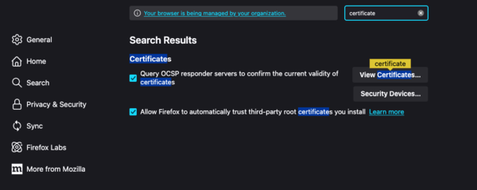
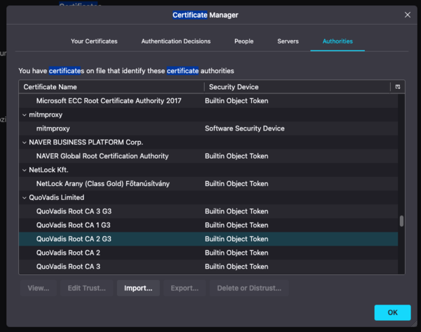
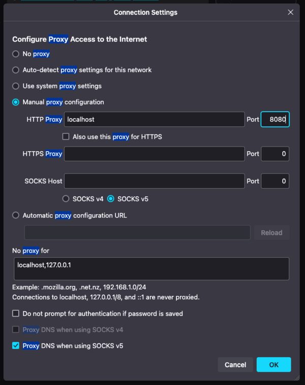

Another quick thing that I set up for the first time in a *long* time. It's honestly as much a note for myself as anything, but perhaps you'll find it useful too. 

The problem: We were having intermittent issues with a [[wiki:content security policy]](). One of the warnings that cropped up was the inclusion of `'inline-speculation-rules'` in the policy. This is currently only supported in Chrome and the issue was only appearing in Firefox. I could of course go through the effort of removing the header locally and testing--but what if I could lie to the browser and change the header on the fly?

Well, for that, you have a number of options. [Burp Suite](https://portswigger.net/burp), [ZAP](https://www.zaproxy.org/), [Charles Proxy](https://www.charlesproxy.com/). Many more, I'm sure. Any of these can modify traffic on the fly like that, but they'll all designed for *so much more* than that, making them a bit unwieldy. What I really wanted was something that was a whole lot smaller and did only this one thing (or could be at least configured as such)

Enter [`mitmproxy`](https://mitmproxy.org/). I've used it before, but never quite like this. As the name suggests, `mitmproxy` is designed to [[wiki:man-in-the-middle]]() yourself as a proxy--feed all web requests through it and it can read requests, modify and forward (or block them), read responses, modify or replace them entirely, and all so much more. 

Exactly what I needed!

<!--more-->

## Set up

On a Mac, installation with [Homebrew](https://brew.sh/) is straight forward:

```bash
brew install mitmproxy
```

Once you run it the first time, you will have created for you a custom local certificate in `~/.mitmproxy`, which you can then install into Firefox. 

Launch Firefox with a custom profile (so you don't MITM your general traffic :smile: and so nothing else you might have installed messes with your tests:

```bash
firefox --profile==mitm
```

And install the certificate. In settings, search for certificate and click 'View certificates':



Click 'import' and choose `mitmproxy-ca.pem`, voila!



Now you can proxy traffic without HTTPS/SSL/TLS warnings. 

Finally, configure Firefox to proxy all traffic through `mitmproxy` (port 8080 by default):



## Configure the proxy

Next, we'll write aa quick script that will modify requests/responses as we want. In this example, we want to check if `'inline-speculation-rules'` is in the CSP of the response and, if so, remove it:

```python
import mitmproxy

class RemoveInlineSpeculationRules:
    def response(self, flow):
        if csp := flow.response.headers.get("content-security-policy"):
            if "'inline-speculation-rules'" in csp:
                csp = csp.replace("'inline-speculation-rules'", "")
                flow.response.headers["content-security-policy"] = csp
                print("Removed 'inline-speculation-rules' from CSP")

addons = [
    RemoveInlineSpeculationRules()
]
```

There are a ton of other examples in the [`mitmproxy` docs](https://docs.mitmproxy.org/stable/addons-examples/), but this is all we need for now. 

## Run the proxy

Last but not least, run it (assuming the script above is named `proxy.py`):

```bash
$ mitmdump -s proxy.py --allow-host=www.example.com
```

Because we set `addons` in that script, we don't even have to enable it. If you only want to modify traffic for one host, you can set that (as I did) with `--allow-host`, but otherwise, it will by default modify everything.

And that's it! Firefox will now no longer see this specific part of the header.

Unfortunately, this didn't help me in this particular instance, but I expect it will in the future. No more will I have to launch and configure ZAP (usually) or Burp (depending on if I have a license through work :smile) just to make a quick header change. 

## Curl

You can also do the same with curl:

```bash
$ curl --cacert ~/.mitmproxy/mitmproxy-ca.pem -x localhost:8080 -v https://www.example.com/ > /dev/null
```

In this case:

* `--cacert` tells curl to use the certificate (`--insecure` would also work, it turns off checking entirely)
* `-x localhost:8080` tells it to proxy connections through `mitmproxy`
* `-v` is verbose mode (show the headers), combined with `> /dev/null` to not look at the body, only the headers (you can also use `-I` to make a `HEAD` request)

And that's about it. 

Onward!

<!--more-->