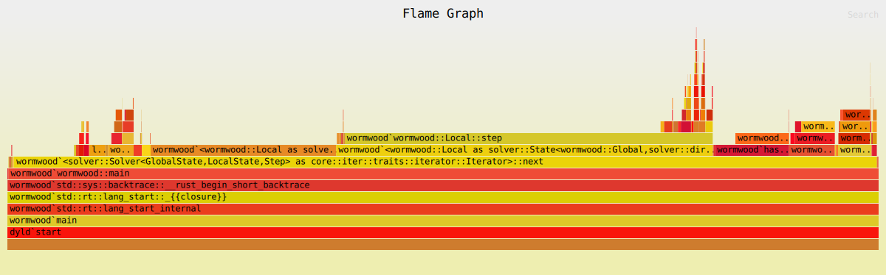

Woodworm is a cute little [PICO-8](https://www.lexaloffle.com/pico-8.php) puzzle game about a cute little worm... that eats wood. You can play it for free right now [right here](https://spratt.itch.io/woodworm)!

The goal is to turn this:


Into this:


There are a few rules to keep in mind:

* The block (and the worm) are affected by gravity
* The block can be split by into multiple pieces by eating it completely apart

    

* The worm can crawl up the side of blocks, so long as two (consecutive) segments of the worm are touching walls

    

And that's really it. 

So let's solve it!

<!--more-->



## Representing state

Okay, first, what global data do we have? The map:

```rust
#[derive(Debug, Clone, Default)]
struct Global {
    // Map settings
    width: isize,
    height: isize,
    cells: Vec<bool>,
}

impl From<&str> for Global {
    fn from(input: &str) -> Self {
        let mut global = Global::default();

        for line in input.lines() {
            if line.trim().is_empty() || line.starts_with("//") {
                continue;
            }

            let chars = line.chars();
            let mut width = 0;
            global.height += 1;

            for c in chars {
                width += 1;
                if c == '#' {
                    global.cells.push(true);
                } else {
                    global.cells.push(false);
                }
            }

            if global.width == 0 {
                global.width = width;
            } else if global.width != width {
                panic!("Map width mismatch: {} != {}", global.width, width);
            }
        }

        global
    }
}
```

I'm specifically storing it as a `Vec<bool>` with indexing this time, although a `HashSet` of `Point` could also work--but I've seen how poorly hashing can be for performance. 

Next, the local state:

```rust
#[derive(Clone, Debug, PartialEq, Eq, Hash)]
struct Local {
    worm: Vec<Point>,
    blocks: Vec<Vec<Point>>,
}
```

For this one, we're going to keep a `Vec` of the current points making up the worm. This is potentially suboptimal, since (apparently) the worm is always exactly 3 points long, so I really should have used a `[Point; 3]` to avoid allocations. But I'm already doing far more with the `blocks`. 

Speaking of which, `blocks` was originally another `Vec<bool>`, but once I realized you could (and would need to) split blocks, `Vec` it became.

To create a `Local` from the `Global`:

```rust
impl Global {
    fn make_local(&self) -> Local {
        // Start at the lower left 3 in length
        let worm = vec![
            Point {
                x: -1,
                y: self.height - 1,
            },
            Point {
                x: -2,
                y: self.height - 1,
            },
            Point {
                x: -3,
                y: self.height - 1,
            },
        ];

        // Create a single initial block
        let mut block = vec![];
        for y in 0..self.height {
            for x in 0..self.width {
                block.push(Point { x, y });
            }
        }
        let blocks = vec![block];

        Local { worm, blocks }
    }
}
```

This is a little interesting, since the blocks can only ever be in the `width x height` original grid, but the worm itself can go around that fairly freely. There's not much point in it going more than $$length = 3$$ units away, but still, I actually kind of like this solution. 

## Step

Okay, next up, the actual heart of the simulation:

```rust
impl Local {
    #[tracing::instrument(skip(self, global))]
    fn step(&self, d: Direction, global: &Global) -> Result<Self, String> {
        // The new head of the worm cannot go more than worm length out of bounds
        // And cannot eat through the floor at all
        let new_head = self.worm[0] + d.into();
        let worm_len = self.worm.len() as isize;

        if new_head.x < -worm_len
            || new_head.x >= global.width + worm_len
            || new_head.y < -worm_len
            || new_head.y >= global.height
        {
            return Err("Out of bounds".to_string());
        }

        // Cannot double back
        if self.worm.contains(&new_head) {
            return Err("Cannot double back".to_string());
        }

        // Otherwise, update state:
        // Worms moves, active cells are eaten, gravity is applied
        let mut new_blocks = self.blocks.clone();
        let mut new_worm = vec![new_head];

        // Move the worm
        new_worm.extend(self.worm.iter().take(self.worm.len() - 1).cloned());

        // Eat a chunk from a block (if possible)
        let mut eat_index = None;
        for (i, b) in new_blocks.iter_mut().enumerate() {
            if b.contains(&new_head) {
                eat_index = Some(i);
                b.retain(|p| p != &new_head);
                break;
            }
        }

        // If we did, potentially split that block
        if let Some(i) = eat_index {
            let b = &new_blocks[i];

            if b.is_empty() {
                // If it was empty, just remove it
                new_blocks.remove(i);
            } else {
                // If you can't reach all points from any remaining point, split the block
                let mut visited = vec![false; b.len()];
                let mut stack = vec![b[0]];
                while let Some(p) = stack.pop() {
                    if let Some(i) = b.iter().position(|x| x == &p) {
                        if !visited[i] {
                            visited[i] = true;
                            for n in p.neighbors() {
                                if n != new_head
                                    && b.contains(&n)
                                    && !visited[b.iter().position(|x| x == &n).unwrap()]
                                {
                                    stack.push(n);
                                }
                            }
                        }
                    }
                }

                if visited.iter().any(|&x| !x) {
                    let (b1, b2) = b
                        .iter()
                        .enumerate()
                        .filter(|(_, p)| new_head != **p)
                        .partition_map(|(i, p)| {
                            if visited[i] {
                                Either::Left(*p)
                            } else {
                                Either::Right(*p)
                            }
                        });

                    new_blocks.remove(i);
                    new_blocks.push(b1);
                    new_blocks.push(b2);
                }
            }
        }

        'falling: loop {
            // Apply gravity to worm
            'worm_falling: {
                // If any point is directly above a block or the ground, supported
                if new_worm.iter().any(|p| {
                    let down = *p + Direction::Down.into();
                    down.y >= global.height || new_blocks.iter().any(|b| b.contains(&down))
                }) {
                    tracing::debug!("Worm is supported directly");
                    break 'worm_falling;
                }

                // If two adjacent segments are supported on the sides, supported
                // TODO: Is this the actual condition?
                if new_worm.windows(2).any(|w| {
                    let left0 = w[0] + Direction::Left.into();
                    let right0 = w[0] + Direction::Right.into();
                    let left1 = w[1] + Direction::Left.into();
                    let right1 = w[1] + Direction::Right.into();

                    (new_blocks.iter().any(|b| b.contains(&left0))
                        || new_blocks.iter().any(|b| b.contains(&right0)))
                        && (new_blocks.iter().any(|b| b.contains(&left1))
                            || new_blocks.iter().any(|b| b.contains(&right1)))
                }) {
                    tracing::debug!("Worm is supported on the sides");
                    break 'worm_falling;
                }

                // If we passed all other conditions, still falling, update worm and continue loop
                tracing::debug!("Worm is falling");
                new_worm
                    .iter_mut()
                    .for_each(|p| *p = *p + Direction::Down.into());

                continue 'falling;
            }

            // Apply gravity to blocks
            for (i, b) in new_blocks.iter().enumerate() {
                'block_falling: {
                    // Supported by the ground
                    if b.iter().any(|p| p.y >= global.height - 1) {
                        tracing::debug!("Block {i} is supported by the ground");
                        break 'block_falling;
                    }

                    // Supported by the worm
                    if b.iter()
                        .any(|p| new_worm.contains(&(*p + Direction::Down.into())))
                    {
                        tracing::debug!("Block {i} is supported by the worm");
                        break 'block_falling;
                    }

                    // Supported by another block
                    if let Some((j, _)) = new_blocks.iter().enumerate().find(|(j, b2)| {
                        i != *j
                            && b.iter().any(|p| {
                                let down = *p + Direction::Down.into();
                                b2.contains(&down)
                            })
                    }) {
                        tracing::debug!("Block {i} is supported by block {j}");
                        break 'block_falling;
                    }

                    // If the worm was solely supported by this block by the sides, it falls too
                    // If it was supported under by this block this will be handled next loop
                    if new_worm.windows(2).any(|w| {
                        let left0 = w[0] + Direction::Left.into();
                        let right0 = w[0] + Direction::Right.into();
                        let left1 = w[1] + Direction::Left.into();
                        let right1 = w[1] + Direction::Right.into();

                        (b.contains(&left0) || b.contains(&right0))
                            && (b.contains(&left1) || b.contains(&right1))
                    }) {
                        tracing::debug!("Worm might be slide falling due to block {i}");

                        if new_worm.iter().any(|p| {
                            let down = *p + Direction::Down.into();
                            self.blocks.iter().any(|b| b.contains(&down))
                        }) {
                            // Another block is directly supporting the worm
                            tracing::debug!("^ Just kidding, worm is directly supported");
                        } else if false {
                            // TODO: Another block is side supporting the worm
                        } else {
                            // Otherwise, fall with the block
                            tracing::debug!("^ Yes, it's falling");
                            new_worm
                                .iter_mut()
                                .for_each(|p| *p = *p + Direction::Down.into());
                        }
                    }

                    // If we made it to this point, the block is falling
                    // Update it and continue falling
                    // This may have allowed the worm to fall
                    tracing::debug!("Block {i} ({b:?}) is falling");
                    for p in new_blocks[i].iter_mut() {
                        *p = *p + Direction::Down.into();
                    }

                    continue 'falling;
                }
            }

            // If we made it out of both loops, we're done with gravity
            break 'falling;
        }

        // If we made it all the way here, we have a valid state
        Ok(Local {
            worm: new_worm,
            blocks: new_blocks,
        })
    }
}
```

This returns `Result` so that I can use it to generate `next_states`: if you have `Ok` that's a new state, but `Err` is not. 

First, update the worm (error if we double back or go out of bounds).

After that, remove a bit from any block that we run into. 

After that, we have the first interesting bit of logic: removing empty blocks and potentially splitting blocks if we crawled through them. `partition_map` (from ) is nice!

And then finally, the most complicated bit: falling. To handle this:

* Loop forever (until everything stops falling)
  * Check if the worm is supported:
    * If any segment is on the ground, it is supported
    * If any segment is directly above a block, it is supported
    * If any two (consecutive) segments are supported on the sides, the worm is supported. This was the trickiest, but a great reason to use the `windows` function
  * If all of those conditions fail, the worm drops and restart the main loop
  * Otherwise, for each block, check if it's supported:
    * If a block is on the ground, it is supported
    * If any chunk of the block is directly above a *different* block, it is supported
      * Note: This doesn't cover interlocked blocks, but this didn't happen in any of the levels here
    * If any chunk is above the worm, it is supported
    * Otherwise, the block falls:
      * Update the block
      * Check if this block was solely supporting the worm by the sides: if so, the worm also needs to move (this was an edge case that one of the levels *did* need!)
      * Restart the main loop

That took a minute to get all of the smallest cases!

But that's actually it! Simulation!

## `impl State`

Okay. Now, like always, we need to implement `State`.

### `next_states`

This one is pretty straight forward, exactly because of how I implemented `Local`:

```rust
impl State<Global, Direction> for Local {
    #[tracing::instrument(skip(self, global), fields(self = %self))]
    fn next_states(&self, global: &Global) -> Option<Vec<(i64, Direction, Local)>> {
        let mut next_states = vec![];

        for d in Direction::all() {
            match self.step(d, global) {
                Ok(new_state) => next_states.push((1, d, new_state)),
                Err(e) => {
                    tracing::debug!("Invalid step in direction {:?}: {}", d, e);
                }
            }
        }

        // If we have any new states, return them
        if !next_states.is_empty() {
            Some(next_states)
        } else {
            None
        }
    }
}
```

I'm actually tempted to refactor the solver itself to make it so that `Local` must have a `fn step(&self, step: &S, global: &Global) -> Result<Local, _>` sort of function on whatever the step `S` type is. 

Another day. 

### `is_solved`

So `Global` has a `Vec<bool>` and `Local` has `Vec<Vec<Point>>`. How do we know when the puzzle `is_solved`?

```rust
impl State<Global, Direction> for Local {
    #[tracing::instrument(skip(global), ret)]
    fn is_solved(&self, global: &Global) -> bool {
        let mut local_cells = vec![false; global.width as usize * global.height as usize];

        for b in self.blocks.iter() {
            for p in b.iter() {
                let index = (p.y * global.width + p.x) as usize;
                local_cells[index] = true;
            }
        }

        global.cells == local_cells
    }
}
```

That is probably room for optimization, since I have to mostly recalculate that every frame. Worth some benchmarking, I think. 

### `is_valid`

Initially, this was just `true`. Any state we generated was valid, but eventually I realized that it *was* possible to cut out large swathes of the solution space:


It's possible for each chunk of wood to fall down, but it's never possible for them to go upwards. So in this case, the far left row is impossible, since there are no chunks that are still in the right place to match the left side of the shape. 

In code:

```rust
impl State<Global, Direction> for Local {
    #[tracing::instrument(skip(global), ret)]
    fn is_valid(&self, global: &Global) -> bool {
        // Blocks can only fall straight down, if any column doesn't have enough
        // This is measured top down since chunks can never go up or side to side
        for x in 0..global.width {
            let mut chunk_count = 0;
            let mut target_count = 0;

            for y in 0..global.height {
                if self.blocks.iter().any(|b| b.contains(&Point { x, y })) {
                    chunk_count += 1;
                }

                if global.cells[(y * global.width + x) as usize] {
                    target_count += 1;
                }

                if chunk_count < target_count {
                    tracing::debug!(
                        "Not enough blocks in column {}: {} < {}",
                        x,
                        chunk_count,
                        target_count
                    );
                    return false;
                }
            }
        }

        true
    }
}
```

### `heuristic`

This was originally also 0, but eventually I decided that 'how close we are to the solution' would be a good choice:

```rust
impl State<Global, Direction> for Local {
    fn heuristic(&self, global: &Global) -> i64 {
        // The number of chunks not in the correct position
        let mut local_cells = vec![false; global.width as usize * global.height as usize];
        for b in self.blocks.iter() {
            for p in b.iter() {
                let index = (p.y * global.width + p.x) as usize;
                local_cells[index] = true;
            }
        }

        let mut heuristic = 0;
        for (i, &cell) in local_cells.iter().enumerate() {
            let p = Point {
                x: (i % global.width as usize) as isize,
                y: (i / global.width as usize) as isize,
            };
            if cell != global.cells[i] {
                heuristic += 1;
            }
        }

        heuristic
    }
}
```

And that's it! Solved. 

## Optimization

Okay, let's see where we're spending time:



(<a target="_black" href="flamegraph.svg">Open in a new tab</a>)

It is interesting that we're spending almost as much time on `is_valid` as we are on `step`. But this is why you can't just use one form of profiling:

```bash
# Without is_valid
~/Projects/rust-solvers jp@venus {git main}
$ cat data/woodworm/13-tv.txt | RUST_LOG=debug cargo run --release --bin woodworm

# ...

[2025-04-21T20:06:10Z DEBUG woodworm] Solver<time=7.913953, checked=666530, queue=817834, invalid=0, time_pruned=452361>
[2025-04-21T20:06:10Z INFO  woodworm] 6x8
    ............
    ............
    ............
    ...111111...
    ...1....1...
    ...1....1...
    ...1....1...
    ...1....1...
    ...110011...
    .....00**...
    ....2222☺...

[2025-04-21T20:06:10Z INFO  woodworm] Path: [Right, Up, Right, Right, Up, Up, Left, Up, Up, Up, Right, Right, Right, Down, Down, Down, Left, Down, Down, Right, Right, Down]
Sequence: RURRU ULUUU RRRDD DLDDR RD

# With is_valid
$ cat data/woodworm/13-tv.txt | RUST_LOG=debug cargo run --release --bin woodworm

# ...

[2025-04-21T20:07:10Z DEBUG woodworm] Solver<time=1.1491113, checked=91799, queue=34983, invalid=79485, time_pruned=62063>
[2025-04-21T20:07:10Z INFO  woodworm] 6x8
    ............
    ............
    ............
    ...111111...
    ...1....1...
    ...1....1...
    ...1....1...
    ...1....1...
    ...110011...
    .....00**...
    ....2222☺...

[2025-04-21T20:07:10Z INFO  woodworm] Path: [Right, Up, Right, Right, Up, Up, Left, Up, Up, Up, Right, Right, Right, Down, Down, Down, Left, Down, Down, Right, Right, Down]
Sequence: RURRU ULUUU RRRDD DLDDR RD
```

7.9 seconds versus 1.1 seconds. 

That means that:

|         | Without | With   |
| ------- | ------- | ------ |
| Time    | 7.91s   | 1.15s  |
| Checked | 666,530 | 91,799 |
| Queued  | 817,834 | 34,983 |
| Invalid | 0       | 79,485 |

So we ran ~4x faster and examined roughly ~1/7 as many states by tossing out 80k states that were invalid. 'But wait...' you might say 'those don't add up...' That's because for each state that is declared `invalid`, we can toss *any* states that we would have generated from that state as well. That's also why we had significantly less states in the `With` queue. 

Optimization!

## Final remarks

In any case, this isn't nearly as complicated a puzzle game as those I've solved in the past, but it was still a lot of fun!

One thing I would feel remiss if I didn't mention:


I still haven't managed to solve the last 3 (and there were 4 that took more than 10k seconds). They just get too big for the search (as it is) to find the correct solutions. Which is a lot of fun. Can I write a better heuristic? A better validity or state checker? 

Is it possible that I'm actually completely missing a rule of the game? 

Could be! 

But for now, I think this is enough. 

Onward!
