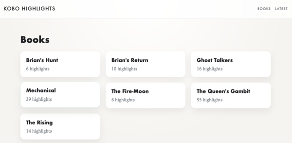
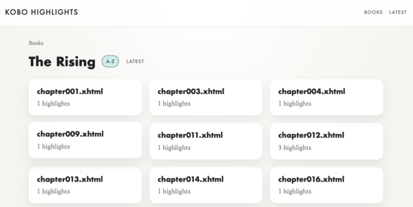
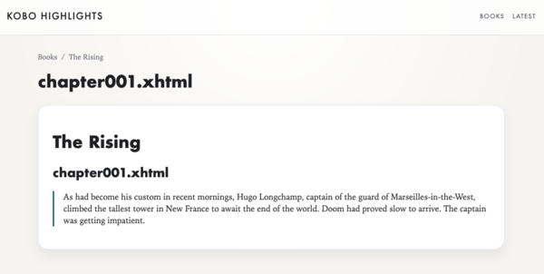
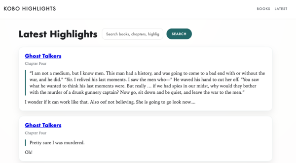

A few months back, I gave a [Kobo](https://www.kobo.com/) a try. I'm still really enjoying it. At the time, I was using [[Syncing Kobo Annotations|a script on the Kobo + Dropbox]]() to sync annotations. But it was a little heavy (to send the entire database) and tended to fail silently. Plus, I had to use a second script to take the exported database and actually turn it into Markdown I could easily read and share. 

So I took a chance to make that a bit better!

The code for this is available on Github here: https://github.com/jpverkamp/kobo-highlights/

<!--more-->



- - -

## Client/Kobo side

This code is similar to what I used before, but with one major addition:

### Building the database subset to upload

Rather than sending the entire database (Which was getting up to several megabytes. Not untenable, but slow on a poor connection), I will keep track of the last time I synced and only extract (with a SQL query) everything since then. 

```bash
NOTES="/mnt/onboard/.adds/notes"
DB="/mnt/onboard/.kobo/KoboReader.sqlite"
SQLITE="${NOTES}/sqlite3"

STATE_FILE="${NOTES}/last_sync.txt"
UPLOAD_DB="${NOTES}/upload.sqlite"

if [ -f "$STATE_FILE" ]; then
  LAST_SYNC=$(cat "$STATE_FILE")
else
  LAST_SYNC="1970-01-01T00:00:00"
fi

if ! "$SQLITE" "$UPLOAD_DB" <<EOF
ATTACH '$DB' AS k;
CREATE TABLE Bookmark AS
SELECT * FROM k.Bookmark
WHERE (DateModified IS NOT NULL AND DateModified > '$LAST_SYNC')
   OR (DateCreated IS NOT NULL AND DateCreated > '$LAST_SYNC');
CREATE TABLE content AS
SELECT * FROM k.content
WHERE ContentID IN (
  SELECT ContentID FROM Bookmark
  UNION
  SELECT VolumeID FROM Bookmark
  UNION
  SELECT ContentID || '-1' FROM Bookmark
);
DETACH k;
EOF
then
  fail "Failed to build upload database"
fi
```

### Uploading it

Then, we just send that file to our server!

```bash
SERVER_BASE="http://kobo-server.local:8000"

NOTES="/mnt/onboard/.adds/notes"
CURL="${NOTES}/curl"
CERT="${NOTES}/ca-bundle.crt"

SERVER_URL="${SERVER_BASE}/upload"
UPLOAD_DB="${NOTES}/upload.sqlite"

if ! $CURL $CURL_CERT_ARGS -f -s -S -X POST "$SERVER_URL" -F "db=@$UPLOAD_DB" > /dev/null; then
  fail "Upload failed"
fi
```

There is a bit more code around that to actually print useful messages if we fail, but that's really about it. And like last time:

### Adding it to the menus

We can wrap it up with NickelMenu to send the DB to our server:

```text
menu_item :main :Sync Notes :nickel_wifi :autoconnect
  chain_success :cmd_output :9999 :/mnt/onboard/.adds/notes/send-db.sh
```

You can add it to the in-book menu by swapping `:main` with `:reader` in the first line; I have both, which was a fun new addition. Now I don't even have to go back to the home screen to send my highlights!

## Server side

On the server side, I took what previously was on Dropbox + a Python 'export' script and combined it all into a simple `fastapi` server (with a bit of Co-Pilot written GUI, I'm still not *great* at UI...)



### Uploading highlights

The main bit of the server is the part that 'catches' the uploaded sqlite file:

```python
@app.post("/upload")
async def upload(db: UploadFile = File(...)) -> dict:
    if not db.filename:
        raise HTTPException(status_code=400, detail="Missing file")

    with tempfile.NamedTemporaryFile(delete=False, suffix=".sqlite") as temp:
        shutil.copyfileobj(db.file, temp)
        temp_path = temp.name

    try:
        count = import_kobo_db(temp_path)
    except sqlite3.Error as exc:
        raise HTTPException(status_code=400, detail=f"Import failed: {exc}") from exc
    finally:
        Path(temp_path).unlink(missing_ok=True)

    return {"imported": count}
```

This will in turn call the [`import_kobo_db` function](https://github.com/jpverkamp/kobo-highlights/blob/main/server/app/main.py#L146) that basically queries that new database and adds it to our local copies (in a slightly different structure, storing each highlight into a book / chapter / highlight hierarchy rather than the somewhat odder Kobo structure. 

### The UI

Other than that, we have a relatively simple UI (for now). From the home page, you can select a book...


...and from the book page you can select a chapter...



That gives you a Markdown -> HTML rendered version of highlights + any notes that I've made. 



In addition, you can also few the latest highlights between any various books, or you can do a basic search. 



Pretty cool, IMO. It's mostly a simple [[wiki:CRUD app]]() after you get the DB and `markdownify` comments, so I'll let you go check out [the code](https://github.com/jpverkamp/kobo-highlights/) if you'd like to know more. 

Now, I can click upload, go to my phone, and copy paste nice formatted notes to book reviews / emails / whatever I need. It's quicker and doesn't require me to go to a computer to run the format script!

Hopefully this is useful to someone. If not, well, at least it was fun to write for me!