Months ago now[^time], I started playing [Gentoo Rescue](https://store.steampowered.com/app/2830480/Gentoo_Rescue/) (after seeing the [Aliensrock video](https://www.youtube.com/watch?v=XK9AhMh5K_o&list=PLIwiAebpd5CIoqMDun9X7aMJIINeHT4Vz&index=1)). At the core, it's a Sokoban style puzzle game where you have to guide cute little sliding penguins to their color coded nests... but oh man does it start getting more complicated quickly.

[^time]: Man time flies[^arrow]. I meant to write this up back in late October/early November last year, but now here it is half a hear later. 

[^arrow]: Time flies like an arrow. Fruit flies like a banana. 

On top of that, it has a really interesting nesting level concept--the level select screens are levels themselves. You can go several 'levels' deep into levels or eventually further back out. And that's just with how far I've gotten so far...

Overall, it's been a fun est of my solving framework. But before I spend too much time on even *more* levels, I wanted to finally get into writing up the first half of it. 

If you'd like to follow along with the code I've written so far, [here are the commits](https://github.com/jpverkamp/rust-solvers/compare/e47949c3af88589fd3b13775c51819b73969acdd...b17946447238c98ea50b7050cba9295ea08cbd9c) from my initial work on this puzzle up through the end of part 1. 

Onward!

- - - 

## Table of contents



## Initial solver

Okay, let's get started. Here's the [first commit](https://github.com/jpverkamp/rust-solvers/commit/bc257029c5513fbdfd803fc3f5f8728ec4ad92fd) for this solver. 

### Map loader

```rust
// Several things have colors: penguins, seals, and nests at first
#[derive(Copy, Clone, Debug, Default, PartialEq, Eq, Hash)]
pub enum Color {
    #[default]
    Red,
    Yellow,
    Green,
    Blue,
}

// Store tiles that are part of the map (walls are between tiles)
#[derive(Copy, Clone, Debug, Default, PartialEq, Eq)]
pub enum Tile {
    #[default]
    Water,
    Floor,
    CrackedFloor,
    Nest(Color),
}

#[derive(Copy, Clone, Debug, Default, PartialEq, Eq)]
pub enum WallKind {
    #[default]
    Empty,
    Solid,
    Cracked,
}

// Critters are the things you can move around (unless they are gray)
#[derive(Copy, Clone, Debug, PartialEq, Eq, Hash)]
pub enum CritterKind {
    Penguin,
    Seal,
}

#[derive(Copy, Clone, Debug, PartialEq, Eq, Hash)]
pub struct Critter {
    pub(crate) kind: CritterKind,
    pub(crate) color: Color,
    pub(crate) location: Point,
}

// Finally the global state of the game
#[derive(Debug, Clone, Default)]
pub struct Global {
    pub width: usize,
    pub height: usize,
    tiles: Vec<Tile>,
    h_walls: Vec<WallKind>,
    v_walls: Vec<WallKind>,
    initial_critters: Vec<Critter>,
}
```

This lets us set up some fairly complicated maps!

```text
....
...~

.....
.|...

--..
....
---.

1 4 red penguin
1 3 red nest
2 1 blue penguin
```

So this is kind of a crazy way to define it, but it is quick to type. The first map is the kind of floor. For example `~` is water, `.` is a floor, and `x` is a cracked floor. The second is only vertical walls (`:` is cracked), so it's one tile wider. Then we have horizontal walls (`~` is cracked his time). 

Finally, we have a list of all the critters and objects in the level. 

That all comes together to make a level like this:

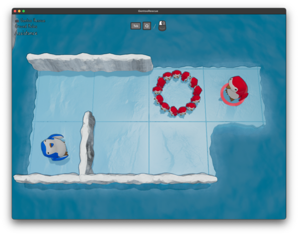

### Local state

Luckily, the local state is somewhat simpler at least to model. For now, we only have to track the `critters`. Although we will soon need to keep track of which cracked walls have been broken. 

```rust
#[derive(Clone, Debug, PartialEq, Eq, Hash)]
pub(crate) struct Local {
    pub(crate) critters: Vec<Critter>,
}
```

But now, the actual simulation. This is like a lot of my [[wiki:sokoban]]() style solvers: choose a single critter to move and (in this case) move them until they hit something:

```rust
impl Local {
    #[tracing::instrument(skip(self, global), ret)]
    pub(crate) fn try_move(
        &self,
        global: &Global,
        index: usize,
        direction: Direction,
    ) -> Option<Local> {
        let mut pt = self.critters[index].location;
        let mut moved = false;

        loop {
            // If we're on water, stop moving
            if global.tile_at(pt) == Tile::Water {
                tracing::debug!("{pt:?} stopped at water");
                break;
            }

            // Bumped into a wall
            if global.wall_at(pt, direction) != WallKind::Empty {
                tracing::debug!("{pt:?} stopped at wall");
                break;
            }

            // Bumped into any other critter
            if self
                .critters
                .iter()
                .any(|c| c.location == pt + direction.into())
            {
                tracing::debug!("{pt:?} stopped at critter");
                break;
            }

            pt = pt + direction.into();
            tracing::debug!("moved to {pt:?}");
            moved = true;
        }

        // If we didn't move, this is invalid location
        // TODO: Handle bouncing etc
        if !moved {
            return None;
        }

        let mut result = self.clone();
        result.critters[index].location = pt;
        Some(result)
    }
}
```

What they hit changes how it reacts. 

```rust
impl Local {
    #[tracing::instrument(skip(self, global), ret)]
    pub(crate) fn try_move(
        &self,
        global: &Global,
        index: usize,
        direction: Direction,
    ) -> Option<Local> {
        let mut pt = self.critters[index].location;
        let mut moved = false;

        loop {
            // If we're on water, stop moving
            if global.tile_at(pt) == Tile::Water {
                tracing::debug!("{pt:?} stopped at water");
                break;
            }

            // Bumped into a wall
            if global.wall_at(pt, direction) != WallKind::Empty {
                tracing::debug!("{pt:?} stopped at wall");
                break;
            }

            // Bumped into any other critter
            if self
                .critters
                .iter()
                .any(|c| c.location == pt + direction.into())
            {
                tracing::debug!("{pt:?} stopped at critter");
                break;
            }

            pt = pt + direction.into();
            tracing::debug!("moved to {pt:?}");
            moved = true;
        }

        // If we didn't move, this is invalid location
        // TODO: Handle bouncing etc
        if !moved {
            return None;
        }

        let mut result = self.clone();
        result.critters[index].location = pt;
        Some(result)
    }
}
```

For now, our state is always valid (we don't generate `next_states` that we can't get into). And a map is solved if each `Nest` has a `Penguin` that matches them. This will get more complicated as we learn new rules. Speaking of, here is `next_states`:

```rust
#[tracing::instrument(skip(global))]
fn next_states(&self, global: &Global) -> Option<Vec<(i64, Step, Local)>> {
    let mut next_states = vec![];

    for (index, _critter) in self.critters.iter().enumerate() {
        for d in Direction::all() {
            if let Some(next) = self.try_move(global, index, d) {
                next_states.push((1, (index, d), next))
            }
        }
    }

    // If we have any new states, return them
    if !next_states.is_empty() {
        Some(next_states)
    } else {
        None
    }
}
```

Just... try to move. That's it. (For now!)

## Adding seals 

Next up... seals! Or perhaps walruses? I called them seals in the code, so that's how they'll probably stick. [Here is the commit](https://github.com/jpverkamp/rust-solvers/commit/b88fed2c03c04ddd752d8e7f437077aa49a50ccd)

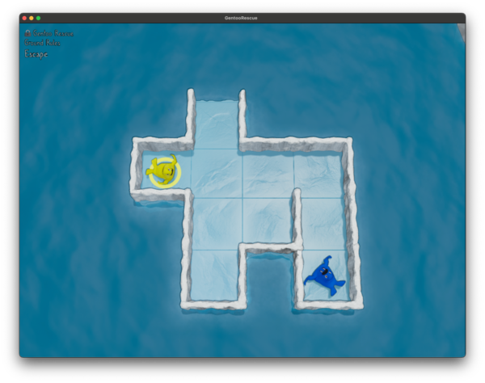

Seals don't have nests, obviously. Instead, you have to clear them off the level (there are a couple of ways to do this, but for now, go through an opening in the walls) in order to complete it. 

Luckily, this change is pretty straight forward:

```rust
#[tracing::instrument(skip(global))]
fn next_states(&self, global: &Global) -> Option<Vec<(i64, Step, Local)>> {
    let mut next_states = vec![];

    for (index, _critter) in self.critters.iter().enumerate() {
        for d in Direction::all() {
            if let Some(move_to) = self.try_move(global, index, d) {
                let mut new_local = self.clone();
                
                if global.tile_at(move_to) == Tile::Water {
                    // The critter went swimming
                    new_local.critters.remove(index);
                } else {
                    new_local.critters[index].location = move_to;
                }
                
                next_states.push((1, (index, d), new_local))
            }
        }
    }

    // If we have any new states, return them
    if !next_states.is_empty() {
        Some(next_states)
    } else {
        None
    }
}
```

If they move into water, remove them from the `critters` list. Then check that in `is_solved`:

```rust
#[tracing::instrument(skip(global), ret)]
fn is_solved(&self, global: &Global) -> bool {
    // All nests have a matching penguin on them
    // ...

    // There can't be any seals left (they all have to leave the level)
    if self.critters.iter().any(|c| c.kind == CritterKind::Seal) {
        return false;
    }

    true
}
```

Voila. Seals. 

## Restructuring to only local state

Okay, [next up](https://github.com/jpverkamp/rust-solvers/commit/b0d35b0f427d8d60d13546779501f43549e16e85), I'm going to make a relatively big change that I really should push into the solver framework itself: I'm going to do away with the global state. 

Mostly, everything changes. The floors and walls can be broken, critters move around (and sometimes wander off entirely), and the items that we'll be dealing with soon get picked up and moved around with the critters. Better to just make everything mutable:

```rust
#[derive(Clone, PartialEq, Eq, Hash, Debug)]
pub(crate) struct Map {
    pub(crate) width: usize,
    pub(crate) height: usize,

    tiles: Vec<Tile>,

    h_walls: Vec<WallKind>,
    v_walls: Vec<WallKind>,

    pub(crate) critters: Vec<Critter>,
    pub(crate) active_critter: usize,
}
```

While I was doing this, I did a major refactor as well, moving `color`, `critter`, `tile`, and `wall` into their own files. Modularity or something. 

As an aside: The entire reason that I had global and local state separate for such a long time was that these solvers can branch *a lot*, which means that I need a ton of memory to store all of the different states. If you have a part of the problem that doesn't change, it doesn't really make sense to copy that over and over (and over and over), but... you really don't have to. Just  (or ) it... 

Yeah. I know. Obvious in hindsight. Having one copy of the global with a reference (counted) link to it in each object? 

Sigh. 

It doesn't really help in this case (since, as above, everything changes), but I'll probably do this as a major refactor at some point. Perhaps a `Solver2` object?

## Let's get cracking

Okay, [next up](https://github.com/jpverkamp/rust-solvers/commit/ead5b2cc3c29a6224da1fbb38cc0d9ef1e3fde0e). Cracking!

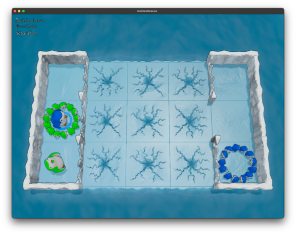

When anything (penguin or seal) slides across a cracking floor, it breaks and is treated as water after that. If you crash into cracked wall, the first time it will hold, but it will remove the wall so that anything else after that will just go right through it. 

Useful when the default method of movement is just to keep going until you hit something!

For this, I'm going to add some helpers to get/break the floor at a specific tile or the wall at a tile + direction:

```rust
impl Map {
    pub(crate) fn tile_at(&self, p: Point) -> Tile {
        if p.x < 0 || p.x >= (self.width as isize) || p.y < 0 || p.y >= (self.height as isize) {
            return Tile::Water;
        }

        let index = (p.y * (self.width as isize) + p.x) as usize;
        self.tiles[index]
    }

    pub(crate) fn break_floor(&mut self, p: Point) {
        assert!(
            p.x >= 0 || p.x < (self.width as isize) || p.y >= 0 || p.y < (self.height as isize),
            "Tried to break a floor out of bounds at {p:?}"
        );

        let index = (p.y * (self.width as isize) + p.x) as usize;
        assert_eq!(
            self.tiles[index],
            Tile::CrackedFloor,
            "Tried to break a non-cracked floor at {p:?}"
        );
        self.tiles[index] = Tile::Water;
    }

    pub(crate) fn wall_index(&self, p: Point, d: Direction) -> Option<(bool, usize)> {
        if p.x < 0 || p.x >= (self.width as isize) || p.y < 0 || p.y >= (self.height as isize) {
            return None;
        }

        let x = p.x as usize;
        let y = p.y as usize;

        match d {
            Direction::Up => Some((true, x + y * self.width)),
            Direction::Down => Some((true, x + (y + 1) * self.width)),
            Direction::Left => Some((false, x + y * (self.width + 1))),
            Direction::Right => Some((false, (x + 1) + y * (self.width + 1))),
        }
    }

    pub(crate) fn wall_at(&self, p: Point, d: Direction) -> WallKind {
        match self.wall_index(p, d) {
            Some((true, index)) => self.h_walls[index],
            Some((false, index)) => self.v_walls[index],
            None => WallKind::Empty,
        }
    }

    pub(crate) fn break_wall(&mut self, p: Point, d: Direction) {
        if let Some(wall) = match self.wall_index(p, d) {
            Some((true, index)) => self.h_walls.get_mut(index),
            Some((false, index)) => self.v_walls.get_mut(index),
            None => None,
        } {
            assert_eq!(
                *wall,
                WallKind::Cracked,
                "Tried to break a n non-cracked wall at {p:?} {d:?}"
            );
            *wall = WallKind::Empty
        }
    }
}
```

And then use that in movement:

```rust
impl Map {
    // Try to move the active critter in the given direction
    // Returns the point the critter moves to (if it moves) + if the critter changed
    #[tracing::instrument(skip(self), ret)]
    pub(crate) fn try_move(&self, _: &Global, direction: Direction) -> Option<(Map, bool)> {
        if self.critters.is_empty() {
            return None;
        }

        let mut pt = self.critters[self.active_critter].location;
        let mut moved = false;

        // We will throw this away if it's invalid, but this is necessary to update cracked walls/floors
        let mut new_map = self.clone();

        loop {
            match new_map.tile_at(pt) {
                Tile::Water => {
                    // If we're on water, stop moving
                    tracing::debug!("{pt:?} stopped at water");
                    break;
                }
                Tile::CrackedFloor => {
                    // Cracked tiles turn into water
                    // But we're allowed to continue (will stop if we hit it again)
                    tracing::debug!("{pt:?} broke the floor");
                    new_map.break_floor(pt);
                }
                Tile::Nest(_) | Tile::Floor => {
                    // Everything else just keep on sliding
                }
            }

            match new_map.wall_at(pt, direction) {
                WallKind::Empty => {}
                WallKind::Solid => {
                    // Bumped into a wall
                    tracing::debug!("{pt:?} stopped at wall");
                    break;
                }
                WallKind::Cracked => {
                    // Bumped into a cracked wall, break it
                    // This counts as moving even even though we stopped
                    tracing::debug!("{pt:?} stopped at cracked wall, breaking it");
                    new_map.break_wall(pt, direction);
                    moved = true;
                    break;
                }
            }

            // Bumped into any other critter
            if self
                .critters
                .iter()
                .any(|c| c.location == pt + direction.into())
            {
                tracing::debug!("{pt:?} stopped at critter");
                break;
            }

            pt = pt + direction.into();
            tracing::debug!("moved to {pt:?}");
            moved = true;
        }

        // If we didn't move, this is invalid location
        // TODO: Handle bouncing etc
        if !moved {
            return None;
        }

        // If the critter is on water, remove it and choose a new active critter
        if self.tile_at(pt) == Tile::Water {
            new_map.critters.remove(self.active_critter);
            if new_map.active_critter >= new_map.critters.len() {
                new_map.active_critter = 0;
            }

            return Some((new_map, true));
        }

        // Otherwise, the critter just moved
        new_map.critters[self.active_critter].location = pt;
        Some((new_map, false))
    }
}
```

There is a lot of cloning going on here (when we may very well end up in an impossible state), but cloning once and throwing away makes the code *so much* simpler compared to cloning at each point. I suppose I could have had `break_*` return a new Map... 

Anyways, that's enough to solve these levels. Onward!

## Springs and things

Okay, next new concept! Springs (and things)!

[Commit](https://github.com/jpverkamp/rust-solvers/commit/5ed902a23a5a5c828a152b987cd4aec80ccf67a5)

Basically, a `Thing` is something that can be placed on the `Map` and be picked up by any `Critter` that walks across it[^hack]:

[^hack]: They can also start holding a `Thing`. I actually hacked this into the level definition by just putting them on the same spot and running a pick up on load. It works pretty much exactly the same so far! I wonder if that's how they implemented it in the game. 

```rust
#[derive(Copy, Clone, Debug, PartialEq, Eq, Hash)]
pub(crate) enum ThingKind {
    Spring,
    Hammer,
}
```

The first one here is the `Spring`. When a `Critter` carrying a `Spring` hits a wall, they bounce backwards one spot. Which makes a level like this... actually solvable!

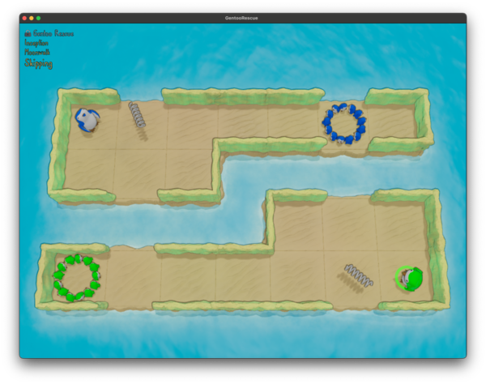

In this case, if Blue moves right, they will pick up the spring on the way and end up on the nest. Green, on the other hand, has to go around theirs or there is no way to get to that nest. They'll always bounce back rather than stopping on it. 

The changes to the `simulation` are actually fairly minimal (for now!):

```rust
impl Map {
    // Try to move the active critter in the given direction
    // Returns the point the critter moves to (if it moves) + if the critter changed
    #[tracing::instrument(skip(self), ret)]
    pub(crate) fn try_move(&self, _: &Global, direction: Direction) -> Option<(Map, bool)> {
        if self.critters.is_empty() {
            return None;
        }

        let mut pt = self.critters[self.active_critter].location;
        let mut moved = false;

        // We will throw this away if it's invalid, but this is necessary to update cracked walls/floors
        let mut new_map = self.clone();

        loop {
            // ...

            // Standing on a thing, pick it up
            // TODO: Only if not carrying something, is this correct?
            if new_map.critters[new_map.active_critter].carrying.is_none()
                && let Some(index) = self.things.iter().position(|t| t.location == pt)
            {
                let thing = new_map.things.remove(index);
                new_map.critters[new_map.active_critter].carrying = Some(thing.kind);
            }

            // ...
        }

        // ...

        // If, at the end of moving, the critter is carrying a spring, they bounce backwards one
        // TODO: Handle bouncing backwards over a wall
        if new_map.critters[new_map.active_critter].carrying == Some(ThingKind::Spring) {
            pt = pt - direction.into();
        }

        // ...
    }
}
```

For the moment, it works just fine to bounce 'back to where you came from', although that will eventually et trickier[^teleport]. I do end up refactoring `try_move` into a separate `try_move_one` function in the [next commit](https://github.com/jpverkamp/rust-solvers/commit/c837227d0a8739d590e7b383d7d1642e71333834) to start to solve this. 

[^teleport]: Teleporters.

One interesting gotcha that I had to work out with springs is that it is possible to move them one space. If you have something like this:

```text
Y B .
```

Where `Y` is Yellow, `B` is Blue with a spring, and `.` is open, if Blue moves to the left, they will slide into Yellow, bounce back one space, and then stop moving at `.`. Since we couldn't move single spaces before, this will come in handy!

I did end up with one more weirdness with springs that I [fixed here](https://github.com/jpverkamp/rust-solvers/commit/e91c43d5f170ae4807e71f284dac1042386183f4):

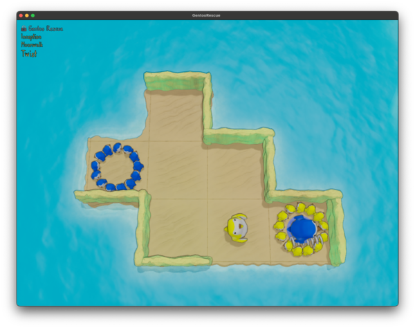

What happens if Blue tries to move? 

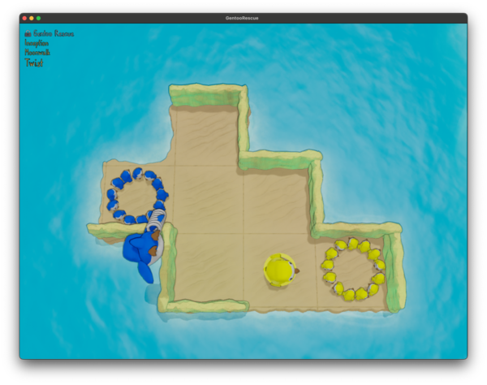

Basically, if a `critter` gets stuck in a loop, they will fly right off the level. Which I suppose is another way to get rid of seals? 

```rust
// Internal function to move a single tile in a direction, looped to slide or used once to bounce
// Modifies the map in place
// Returns if we should continue moving
#[tracing::instrument(skip(self), ret, fields(pt = ?self.critters[self.active_critter].location))]
fn try_move_one(&mut self, direction: Direction, depth: usize) -> bool {
    // If we're stuck in a bouncing loop, launch off the map 
    // TODO: Do we have to actually stop at a specific point or just 'off'?
    // TODO: Magick constants!
    if depth > 10 { 
        self.critters[self.active_critter].location = Point { x: -10, y: -10 };
        return false;
    }

    // ...
}
```

It doesn't actually help solve this level, but I did have to solve it or the solver would get stuck in an infinite loop / with solutions that don't actually work. Those are always interesting. 


## Hammer time

In [this change](https://github.com/jpverkamp/rust-solvers/commit/5a6bfa6ee32c4114e7e7d92458647ef72fee0fec), we have a new `Thing`: `Hammers`!

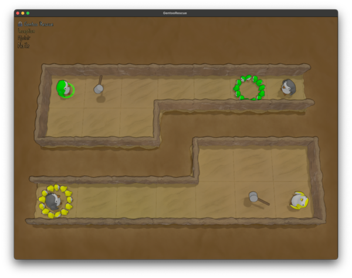

Basically, when a `Critter` is carrying a `Hammer` and they run into another `Critter`, they will stop, but they will also send the `Critter` they hit sliding recursively--plus the one with the hammer ends up in their spot! So in this level, Green cannot pick up the hammer because when they hit the top Gray, they will be stuck to the right of their nest. But Yellow can, since they do want to end up where bottom Gray is. 

This, we'll implement in `try_move_one`:

```rust
// Internal function to move a single tile in a direction, looped to slide or used once to bounce
// Modifies the map in place
// Returns if we should continue moving
#[tracing::instrument(skip(self), ret, fields(pt = ?self.critters[self.active_critter].location))]
fn try_move_one(&mut self, direction: Direction, depth: usize) -> bool {
    // ...

    // Bumped into any other critter
    if let Some(other_critter) = self
        .critters
        .iter()
        .position(|c| c.location == me.location + direction.into())
    {
        match self.critters[self.active_critter].carrying {
            Some(ThingKind::Spring) => {
                tracing::debug!("bounced off another critter");
                self.try_move_one(direction.flip(), depth + 1);
            },
            Some(ThingKind::Hammer) => {
                tracing::debug!("hammered off another critter");
                let my_index = self.active_critter;

                // The other critter gets bumped out of our way
                self.active_critter = other_critter;
                self.try_move_one(direction, depth + 1);
                
                // We take that spot
                self.active_critter = my_index;
                self.try_move_one(direction, depth + 1);
            },
            None => {
                tracing::debug!("hit another critter");
            },
        }
        return false;
    }

    let dst = me.location + direction.into();
    tracing::debug!("moved to {dst:?}");
    self.critters[self.active_critter].location = dst;
    true
}
```

For now, we're keeping track of the `active_critter` in the `Map`. We'll change it so that we can slide the other critter and then slide it back at the end for the final single movement into their spot. This won't work once things start being able to hit the same critter more than once[^again], but for now, that's all we need!

[^again]: Teleporters[^teleport]. Again. 

But there is actually a second behavior of a `Hammer` that we'll get to [here](https://github.com/jpverkamp/rust-solvers/commit/801b8e191f73d53da2e3872d189ef241e10adfc8): If a `Critter` with a `Hammer` hits a `Cracked Wall`, they don't stop and break it. They just break it and keep right on sliding!

```rust
// Internal function to move a single tile in a direction, looped to slide or used once to bounce
// Modifies the map in place
// Returns if we should continue moving
#[tracing::instrument(skip(self), ret, fields(pt = ?self.critters[self.active_critter].location))]
fn try_move_one(&mut self, direction: Direction, depth: usize) -> bool {
    // ...

    let wall = self.wall_at(me.location, direction);
    match wall {
        // ...
        WallKind::Cracked => {
            tracing::debug!("hit a cracked wall, breaking it");
            self.break_wall(me.location, direction);

            match self.critters[self.active_critter].carrying {
                Some(ThingKind::Spring) => {
                    tracing::debug!("bounced off a wall");
                    self.try_move_one(direction.flip(), depth + 1);
                }
                Some(ThingKind::Hammer) => {
                    tracing::debug!("smashed right on through it");
                    return true;
                }
                None => {}
            }

            // Either way, don't keep moving
            return false;
        }
    }
}

```

## A wall for thee but not for me

Okay, [next up](https://github.com/jpverkamp/rust-solvers/commit/23a92dfab8fbfd6d439532bb7959e1c01e8f03ba): color coded walls!

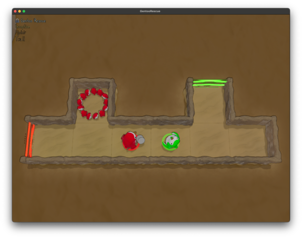

As you might expect, color coded walls work differently depending on which color of penguin runs into them. It really could go either way (either Red goes right through red walls or *only* Red is stopped by them), but in this case it's the first: only Red can go through a red wall. 

This does mean we need a new `Wall` type for the first time in a while:

```rust
#[derive(Copy, Clone, Debug, Default, PartialEq, Eq, Hash)]
pub enum WallKind {
    #[default]
    Empty,
    Solid,
    Cracked,
    Color(Color),
}
```

But otherwise, it's only a very small change to the `try_move_one` wall handling code:

```rust
let wall = self.wall_at(me.location, direction);
match wall {
    // ...
    WallKind::Color(c) => {
        if c == me.color {
            // Go right through my own colored walls!
        } else {
            // Treat every other color as solid
            if self.critters[self.active_critter].carrying == Some(ThingKind::Spring) {
                tracing::debug!("bounced off a mis-matched colored wall");
                self.try_move_one(direction.flip(), depth + 1);
            } else {
                tracing::debug!("hit colored wall");
            }

            // Either way, don't keep moving
            return false;
        }
    }
    // ...
}
```

One thing I do love about Rust is the exhaustiveness checks on `match` statements. When you add a new type to an `enum` (like the `Wall` here), the compiler will very helpful tell you everywhere you will need to change to make that work. 

And that's it! An easy one. 

## Eat my dust

[Next up](https://github.com/jpverkamp/rust-solvers/commit/3d30f1949257943b9aa143dcc91317e2f84a5ad3), dust clouds!

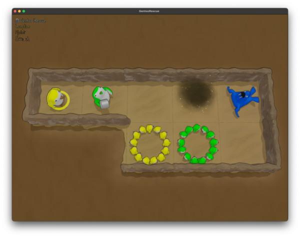

These don't actually affect movement at all. They could have been like a sandtrap, which stops movement, but I expect we'll get something else to do that later. Instead, they only come into play if a `Critter` stops (otherwise) in them. If a `Critter` is in a dust cloud, *you* can't move it, but other `Critters` (with a `Hammer`) can move them. 

```rust
pub(crate) fn try_move(&self, direction: Direction) -> Option<(Map, bool)> {
    // ... 

    // If the current critter is on a dust cloud it cannot move
    if self.tile_at(self.critters[self.active_critter].location) == Tile::Dust {
        return None;
    }

    // ...
}
```

This is already handled in the calling `next_states` function. If a critter cannot move, don't generate moves for it. 

## Small tweaks

A few small changes to clean things up before the next big change. 

1. [Fix what happens](https://github.com/jpverkamp/rust-solvers/commit/9fa8000eb417b002e792c7029f6fddc4a264807c) when you pick up a second/new `Thing`.

    ```rust
    // Standing on a thing, pick it up
    // If we were already holding something, chuck our current thing into the water
    if let Some(index) = self.things.iter().position(|t| t.location == me.location)
    {
        let thing = self.things.remove(index);
        tracing::debug!("picked up {thing:?}");
        self.critters[self.active_critter].carrying = Some(thing.kind);
    }
    ```

2. [Handle (ish)](https://github.com/jpverkamp/rust-solvers/commit/7d29a7e4494e54c8457749aabf7b4611cc3144c4) what happens if one critter bumps another and then gets `Hammered` before we return to evaluating it

    ```rust
    // The other critter gets bumped out of our way
    self.active_critter = other_critter;
    match self.try_move(direction) {
        Some((mut new_map, _)) => {
            std::mem::swap(self, &mut new_map);
        }
        None => {
            self.critters.remove(other_critter);
        }
    }

    // Find the original critter and switch back
    // TODO: Handle recursion that moves the original critter out of the way
    match self
        .critters
        .iter()
        .position(|oc| oc.location == my_position)
    {
        Some(new_index) => self.active_critter = new_index,
        None => panic!("Could not find original critter after hammer time"),
    }
    ```

3. [Bouncing off a wall into a crack](https://github.com/jpverkamp/rust-solvers/commit/deca14c5b6e558fe8db6f2a8a495e374547cd520)

    Or rather, stopping when don't hit a cracked wall / loop but one of them is cracked. 

    ```rust
    match wall {
        WallKind::Empty => {}
        WallKind::Solid => {
            if self.critters[self.active_critter].carrying == Some(ThingKind::Spring) {
                tracing::debug!("bounced off a wall");
                self.try_move_one(direction.flip(), depth + 1, true);
            } else {
                tracing::debug!("hit wall");
            }

            // Either way, don't keep moving
            return false;
        }
        WallKind::Color(c) => {
            if c == me.color {
                // Go right through my own colored walls!
            } else {
                // Treat every other color as solid
                if self.critters[self.active_critter].carrying == Some(ThingKind::Spring) {
                    tracing::debug!("bounced off a mis-matched colored wall");
                    self.try_move_one(direction.flip(), depth + 1, true);
                } else {
                    tracing::debug!("hit colored wall");
                }

                // Either way, don't keep moving
                return false;
            }
        }
        // ...
    }
    ```

## Now you're thinking...

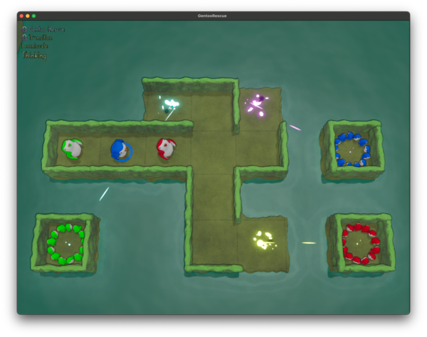

Yup. We [get to solve](https://github.com/jpverkamp/rust-solvers/commit/c8fcb6a566bdcb7c299a9079f996f7122a9fe847) portals. 

One the easy side, when a `Critter` hits a portal source they teleport to the portal destination and continue in the same direction they were moving. 

On the complicated side? Multiple sources! Multiple destinations! Infinite loops! TELEFRAGGING!

It's going to be fun. 

For basic implementation, a `Teleport` is actually just the source with a field storing the destination. This does mean that (as you can see in the map above), a destination can be directly onto a `Nest` or `Thing`... or even a `Critter` (we'll come back to that). 

```rust
#[derive(Copy, Clone, Debug, Default, PartialEq, Eq, Hash)]
pub enum Tile {
    #[default]
    Water,
    Floor,
    CrackedFloor,
    Nest(Color),
    Wall,
    Dust,
    Teleport(Point),
}
```

For now, just move them and keep going:

```rust
pub(crate) fn try_move(&self, direction: Direction) -> Option<(Map, bool)> {
    // ...

    match self.tile_at(me.location) {
        // ...
        Tile::Teleport(target) => {
            tracing::debug!("on teleport at {:?}", me.location);
            match self.critters.iter().position(|c| c.location == target) {
                Some(_) => {
                    tracing::debug!("cannot teleport to {target:?}, occupied");
                    // There is a critter where you're going
                    // Don't do that
                    return false;
                }
                None => {
                    // Teleport there and keep going!
                    tracing::debug!("teleporting to {target:?}");
                    self.critters[self.active_critter].location = target;
                    return true;
                }
            }
        }
    }

    // ...
}
```

However that needed [a refactor](https://github.com/jpverkamp/rust-solvers/commit/99964179fbdd7aaed9f0028dbca733c1b2faee57) as it didn't handle the case that if you teleport directly onto another source, you don't teleport again. And it doesn't solve infinite loops (`* . B . x` with `Teleport` from `*` to `x` and Blue moving left), so we needed a new helper for that, plus additional state tracking:

```rust
fn maybe_do_teleport(&mut self, direction: Direction) -> Option<bool> {
    let me = self.critters[self.active_critter];
    if let Tile::Teleport(target) = self.tile_at(me.location) {
        if self.teleport_cooldown {
            tracing::debug!("Cannot teleport, on cooldown");
            return None;
        }

        if self.used_teleports.contains(&(direction, me.location)) {
            tracing::debug!("teleport loop detected, not using teleport LAUNCHING");

            // TODO: Magic constants
            self.critters[self.active_critter].location = Point { x: -10, y: -10 };
            return Some(false);
        }

        match self.critters.iter().position(|c| c.location == target) {
            Some(_) => {
                tracing::debug!("cannot teleport to {target:?}, occupied");
                // There is a critter where you're going
                // Don't do that
                return Some(false);
            }
            None => {
                // Teleport there and keep going!
                tracing::debug!("teleporting to {target:?}");
                self.used_teleports.push((direction, me.location));
                self.teleport_cooldown = true;
                self.critters[self.active_critter].location = target;
                return Some(true);
            }
        }
    }

    None
}
```

And then we did have to [deal with the case](https://github.com/jpverkamp/rust-solvers/commit/c79d70810aa822f57c23bec497fde1f5c7b40fcf) of a `Critter` sitting right where you're going...

```rust
fn maybe_do_teleport(&mut self, direction: Direction) -> Option<bool> {
    let me = self.critters[self.active_critter];
    if let Tile::Teleport(target) = self.tile_at(me.location) {
        // ...

        match self.critters.iter().position(|c| c.location == target) {
            Some(other_critter) => {
                tracing::debug!("teleporting to {target:?}, TELEFRAG");
                self.critters[other_critter].location = Point { x: -10, y: -10 };
                return Some(true);
            }
            None => {
                // Teleport there and keep going!
                tracing::debug!("teleporting to {target:?}");
                self.used_teleports.push((direction, me.location));
                self.teleport_cooldown = true;
                self.critters[self.active_critter].location = target;
                return Some(true);
            }
        }
    }

    None
}
```

Which is yet another way to deal with seals, so that's cool!

This led to even more issues with escaping critters though. Since, as you see, I was just teleporting them off the map (to `-10, -10`), but that isn't *really* right, so [here](https://github.com/jpverkamp/rust-solvers/commit/39c8ea820a90eca8f6c97f682f7c44f029bd7f0f) I added an `escaped` flag to critters basically making them non-interactive (along with some other rewrites):

```rust
#[derive(Copy, Clone, Debug, PartialEq, Eq, Hash)]
pub struct Critter {
    kind: CritterKind,
    color: Color,
    location: Point,
    carrying: Option<ThingKind>,
    escaped: bool,
}
```

## Crutches

And [finally](https://github.com/jpverkamp/rust-solvers/commit/99028c34a7f213a7eded9781e3cccabd5306dad6)[^part1], we get `Crutches`. This is such a silly thing to get so relatively far into the game but `Crutches` let you... walk a single square at a time. That's it. Although give how much we've dealt with sliding all over the place, that's actually something...

[^part1]: For part 1! Now that this is written, I can start solving more levels!

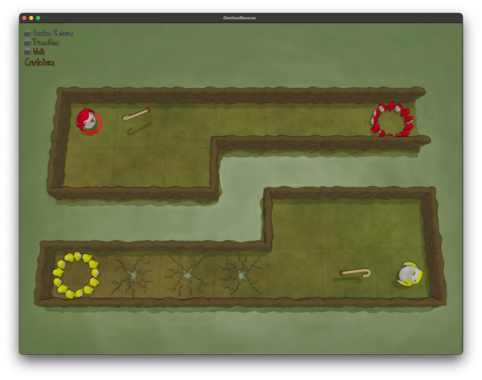

The main complication with these is those cracked floors. If you're only walking one at a time, stopping on a cracked floor *will* send you off the level. Which, sometimes, is a good thing?

[^seals]: I'm looking at you, seals. 

```rust
// Try to move the active critter in the given direction
// Returns if the move is possible (and something actually changed)
#[tracing::instrument(skip(self), ret, fields(critter = %self.critters[critter_index]))]
pub(crate) fn try_move(
    &mut self,
    critter_index: usize,
    direction: Direction,
    first_call: bool,
) -> bool {
    // Standing on a thing, pick it up
    // If we were already holding something, chuck our current thing into the water
    if let Some(index) = self.things.iter().position(|t| t.location == me.location()) {
        let thing = self.things.remove(index);
        tracing::debug!("picked up {thing:?}");
        self.critters[critter_index].pick_up(thing.kind);

        // Crutches stop movement immediately
        if thing.kind == ThingKind::Crutch {
            return false;
        }
    }

    // ...

    // If we're carrying a crutch, only move once
    if self.critters[critter_index].carrying() == Some(ThingKind::Crutch) {
        self.maybe_do_teleport(critter_index, direction);
        return false;
    }

    true
}
```

That first one is a neat bit though. `Crutches` actually give you a way to stop mid-flight, which is another thing we've been lacking. If a `Critter` picks up `Crutches`, they will stop immediately. 

## State so far 

[That... was a lot](https://github.com/jpverkamp/rust-solvers/compare/e47949c3af88589fd3b13775c51819b73969acdd...b17946447238c98ea50b7050cba9295ea08cbd9c).

Penguins and seals; springs, hammers, and crutches; walls, portals, and dust clouds. And that's not even everything! I'm currently sitting at *8 of 32* achievements of the game! There are levels I don't even know *how* to get to yet. And apparently, when you beat a nested world, you can take the penguin that beat that world and ... take them with you up a level?!

Man there is so much more to go. 

I've enjoyed this game a ton. If you think it's something you might like [buy a copy](https://store.steampowered.com/app/2830480/Gentoo_Rescue/)! I'll be back with part 2 soon™[^soon].

[^soon]: Hopefully when I beat the levels. Not another six months after that...