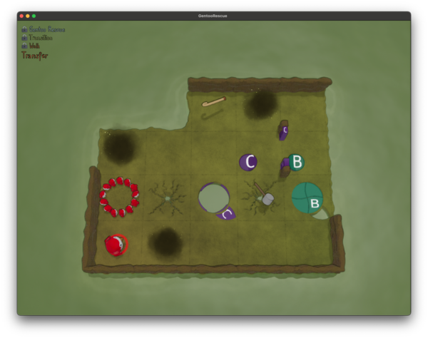
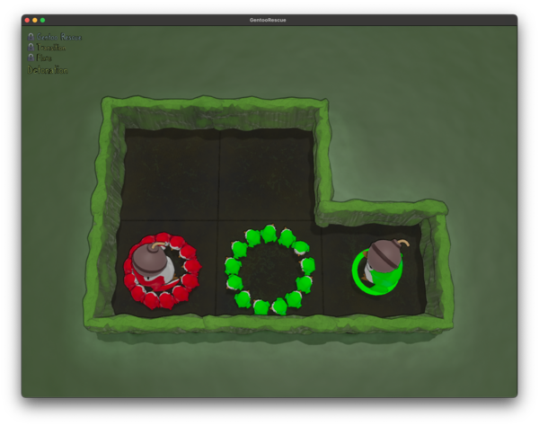
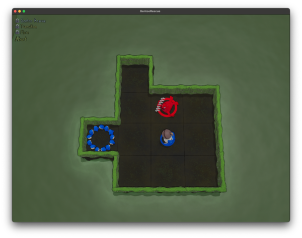
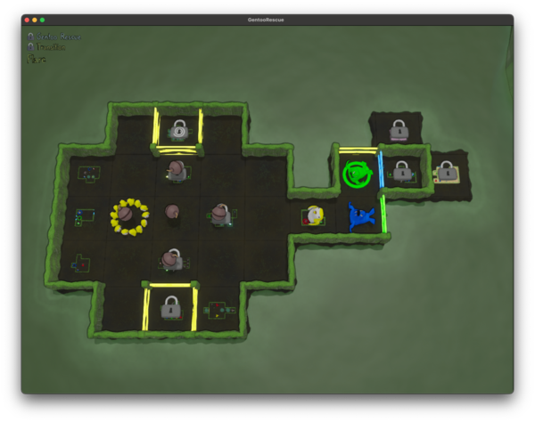
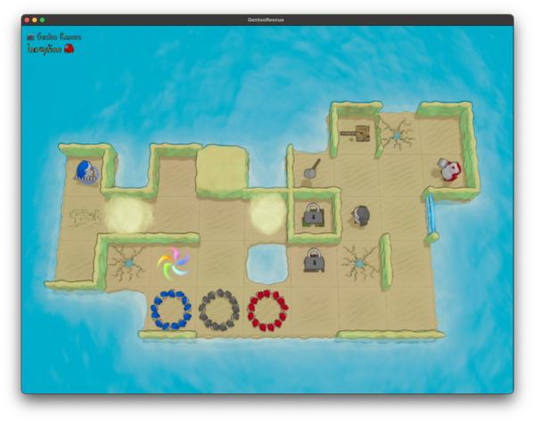
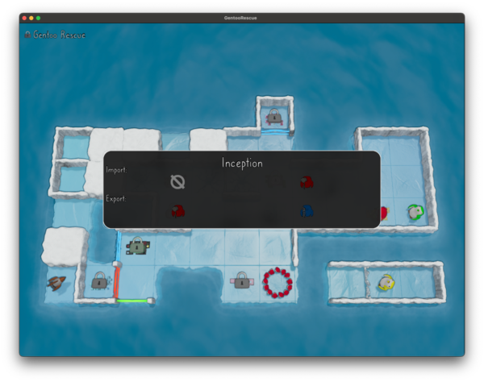

And here we have Part 2! It's not been that long for you, but since the first part took six months for me to actually get around to writing it... well, this is much better!

Things get a bit more complicated this time, with buttons that can open/close doors and even holes in the floor and BOMBS. But what's really crazy is how we actually get around to solving how to get to new sublevels this time... and how to take penguins back out of them. Things are getting complicated!

[Here are all of the commits](https://github.com/jpverkamp/rust-solvers/compare/915df5e61c8bd2167d4306a589e10166394d24b4...0f50b8f298b5a13bd9d8ea0ad6222fbb5eed5a93) from part 1 up through part 2.

And here are all of the parts in this series so far:



<!--more-->

- - - 

## Table of Contents



## Toggling

First [new bit of functionality](): `Toggling`!



Basically, when you walk over the `B` on the map, the floor just below it opens. When you walk on `C`, the floor in the middle *and* the wall just to the right of the `C` both close. 

To store these, I added the toggles to the floor tiles on the map (hopefully they won't share space with anything?) and the toggle actions as entities. Something like this:

```text
~~.*.
*..CB
.x~x.
.*...

......
......
|.....
|....|

..---
.....
.....
.....
-----

1 3 crutch
3 1 red nest
3 4 hammer
4 1 red penguin
toggle B floor 3 5
toggle C wall 2 4 right
toggle C floor 3 3
```

So when encoding the floors and walls, we actually just put them down as their original state (a solid floor for the `B` toggles floor and water/empty wall for `C`). I do limit toggles to uppercase letters, since we haven't used those for anything else yet. 

Then to define the rules for what happens with a `Toggle`:

```rust
#[derive(Copy, Clone, Debug, PartialEq, Eq, Hash)]
pub enum ToggleKind {
    Wall(Point, Direction),
    Floor(Point),
}

#[derive(Debug, Clone, PartialEq, Eq, Hash)]
pub struct ToggleRule {
    pub(crate) key: char,
    pub(crate) kind: ToggleKind,
}
```

What key the toggle is associated with and what is toggled. 

Then to actually use them, in `try_move_one`:

```rust
// If we moved onto a toggle, trigger any matching rules
if let Tile::Toggle(c) = self.tile_at(dst) {
    tracing::debug!("stepped on toggle {c}, checking rules");

    let matching_rules: Vec<_> = self
        .toggle_rules
        .iter()
        .filter(|r| r.key == c)
        .map(|r| r.kind)
        .collect();

    for kind in matching_rules {
        match kind {
            ToggleKind::Floor(p) => {
                tracing::debug!("toggle {c} rule: toggling floor at {p:?}");
                self.toggle_floor(p);
            }
            ToggleKind::Wall(p, d) => {
                tracing::debug!(
                    "toggle {c} rule: toggling wall at {p:?} in direction {d:?}"
                );
                self.toggle_wall(p, d);
            }
        }
    }
}
```

Which are `impl Map`:

```rust
// Toggle a floor
pub(crate) fn toggle_floor(&mut self, p: Point) {
    assert!(
        p.x >= 0 || p.x < (self.width as isize) || p.y >= 0 || p.y < (self.height as isize),
        "Tried to toggle a floor out of bounds at {p:?}"
    );

    let index = (p.y * (self.width as isize) + p.x) as usize;
    self.tiles[index] = match self.tiles[index] {
        Tile::Floor => Tile::Water,
        Tile::Water => Tile::Floor,
        other => {
            unimplemented!("Can only toggle floor/water tiles, but tile at {p:?} is {other:?}")
        }
    }
}

// Toggle a wall
pub(crate) fn toggle_wall(&mut self, p: Point, d: Direction) {
    if let Some(wall) = match self.wall_index(p, d) {
        Some((true, index)) => self.h_walls.get_mut(index),
        Some((false, index)) => self.v_walls.get_mut(index),
        None => None,
    } {
        *wall = match *wall {
            WallKind::Empty => WallKind::Solid,
            WallKind::Solid => WallKind::Empty,
            other => unimplemented!(
                "Can only toggle empty/solid walls, but wall at {p:?} {d:?} is {other:?}"
            ),
        }
    }
}
```

And... that's actually enough to solve this puzzle!

Almost. It turns out I did have to deal with a weird case with that `Hammer`. If you pick up the `Hammer` while moving onto it with a `Crutch`, you will keep moving. It's just not something I've seen before: having a `Thing` on a `Cracked Floor`. 


## Drop the BOMB



[Here]() we have BOMBS! If a `Critter` runs into another `Critter` carrying a bomb they *both* explode. 

Other than adding the item to `things.rs`, this only required a tweak to the part of `try_move_one` that deals with `Critter` collisions. Previously, we only cared about what the hitter was doing, now we care about both. 

```rust
// Bumped into any other critter
if let Some(other_critter) = self
    .critters
    .iter()
    .position(|c| c.location() == me.location() + direction.into())
{
    // Behavior based on what they are carrying
    match self.critters[other_critter].carrying() {
        Some(ThingKind::Bomb) => {
            tracing::debug!("other critter is carrying a bomb, BOOM");
            self.critters[critter_index].escape();
            self.critters[other_critter].escape();
            return false;

        }
        Some(ThingKind::Spring | ThingKind::Hammer | ThingKind::Crutch) | None => {},
    }

    // Behavior based on what we're carrying
    match self.critters[critter_index].carrying() {
        // ...
    }

    self.maybe_do_teleport(critter_index, direction);
    return false;
}
```

It's always fun when something comes together like that...

Except that's not *quite* it. There are some weird edge cases. 



If Red here moves down, they both explode. But if they move up... Well apparently if you bounce into a bomb, *that* doesn't count? So that is actually the solution to this level, and [so we need]:

```rust
// Behavior based on what they are carrying
match self.critters[other_critter].carrying() {
    Some(ThingKind::Bomb) => {
        tracing::debug!("other critter is carrying a bomb, BOOM");

        // Special case: if you bounce into a bomb, treat it as a wall for reasons
        tracing::debug!("depth = {depth}");
        if depth > 0 {
            tracing::debug!("but we bounced, just kidding");
        } else {
            self.critters[critter_index].escape();
            self.critters[other_critter].escape();
            return false;
        }
    }
    Some(ThingKind::Spring | ThingKind::Hammer | ThingKind::Crutch) | None => {}
}
```

## "Solving" sublevels

One thing that has been a thing for a while but I haven't really dealt with from a 'solving' perspective is the idea of sublevels:



Basically, each of those levels with a padlock (or the ones without like those on the right) are 'sub' levels, which we can enter into to solve. The ones with the lock, I haven't solved yet. To get into one, you have to get any `Critter` to the level. 

So how can we get our solver to handle these? ([commit]())

Well, first, let's add them to the level definitions (along with the ability to put blank lines in those + comments in this section):

```text
# Gentoo Rescue/Transition/Flare

~...~~~.~
.....~...
.......~~
.....~~~~
~...~~~~~

.|yy|.....
|....||b|.
|......g..
|....|....
.|yy|.....

.---.....
-.y.-.y-.
.....-.-.
.....--..
-.y.-....
.---.....

2 3 bomb
2 7 green seal
3 2 yellow nest
3 2 bomb
3 3 bomb
3 4 bomb
3 6 yellow penguin
3 7 blue seal
4 3 bomb

# 1 3 level Exodus
# 1 8 level ???
# 2 1 level Planted
# 2 8 level ??? 
# 2 9 level ???
# 3 1 level Trigger
# 3 4 level ???
# 3 6 level Detonation
# 4 1 level Abort
# 5 3 level ???
# 5 4 level Breach
```

The comments are going to be important later. Basically, if there are any active (uncommented) `level` nodes, the solver will return the first one it can put a `Critter` on. But if none are, solve like normal. This means we only need a minor change to the solver:

```rust
#[tracing::instrument(skip(self), ret)]
fn is_solved(&self, _: &Global) -> bool {
    // If any sublevels are active / not commented out
    // "Solved" is any Critter standing on that sublevel
    // If more than one sublevel is active, the first found will be returned
    // So comment the rest out
    if !self.sublevels.is_empty() {
        for (p, name) in self.sublevels.iter() {
            if self.critters.iter().any(|c| c.location() == *p) {
                tracing::debug!("Sublevel {name} is active at {p:?}");
                return true;
            }
        }

        return false;
    }

    // ...
}
```

And that's... it? This should be handy for getting to the more complicated levels at least! There's still a concept I haven't dealt with, which is when you solve a sublevel, you can 'export' one of the `Critters` back to the parent level (which is the only way I'm going to be able to get to those outside of the walls... I don't even know how to do that yet!)

A pretty neat concept!

## Sublevel swapping

Okay, [here's the last bit]() for this post, bringing us back up to the present day. 

So remember how the levels are nested? Well, there are some levels (I think I've only seen 1 I can actually use so far), where there is this swirly thing (right above the nests):



It turns out that if you can get a penguin to stand on that spot, it lets you 'register' that penguin (and what they are carrying as a penguin you can *export* out of the level, swapping them with the one in the level one level up. 



Inception indeed. 

What's neat, is you can actually import a penguin here too. So I can change which penguins are available! I'm ... not entirely sure what to do with this yet, but I'm sure we'll find something. 

To implement this, I need a way to define the `swaps` that I can do (the penguins I can swap a current penguin for):

```text
# Gentoo Rescue

# ...

4 10 swap blue penguin with spring
4 10 swap red penguin with hammer
```

Here, we have a row/column and `swap` as an 'item' type, then the color/critter type and and optional 'with item'. 

```rust
#[derive(Debug, Clone, PartialEq, Eq, Hash)]
pub(crate) struct Swap {
    pub(crate) critter: Critter,
    pub(crate) used: bool,
}
```

The row/column are embedded in the `Critter`. It's where they will end up if placed in the level. I did at one point also have this directly on the `Swap` object, which gave us a bit of speed (one less level of indirection), but saving the complexity and memory of storing it twice. 

Although, come to think of it, I don't have any pointers or Boxes or anything here, so Rust probably lays this each `Critter` out as a single spot in memory, so that probably isn't any slower at all once compiled... I should check this. 

In any case, to handle swaps, we have a method `try_swap` which will check a specific swap. If there's something standing on that spot in the level, change it out for the one defined in the `Swap` from the sublevel:

```rust
pub(crate) fn try_swap(&mut self, swap_index: usize) -> bool {
    // Critter index is the one creature at the swap's point
    let swap = &mut self.swaps[swap_index];
    let critter_index = match self
        .critters
        .iter()
        .position(|c| c.location() == swap.critter.location())
    {
        Some(i) => i,
        None => {
            return false;
        }
    };
    let me = self.critters[critter_index];

    if swap.used {
        return false;
    }

    if swap.critter.location() != me.location() {
        return false;
    }

    tracing::debug!("Swapping {me:?} for {:?}", swap.critter);
    self.critters[critter_index] = swap.critter;
    swap.used = true;
    true
}
```

Then, when generating states, we'll try each swap in addition to each move:

```rust
#[tracing::instrument(skip(self))]
fn next_states(&self, _: &Global) -> Option<Vec<(i64, Step, Map)>> {
    let mut next_states = vec![];

    // Try each swap
    for swap_index in 0..self.swaps.len() {
        let swap = &self.swaps[swap_index];

        if swap.used {
            continue;
        }

        // I probably shouldn't clone this many, but most maps don't have swaps
        let mut new_map = self.clone();
        if !new_map.try_swap(swap_index) {
            continue;
        }

        next_states.push((1, Step::Swap(swap_index), new_map));
    }

    // Try moving each critter
    // ...
}
```

This can get expensive, but there aren't *that* many levels (yet) that even has this feature and so far only two Critters that can come out of it. So it's acceptable. I do so far check that you can't swap the same Critter more than once. That might just be an infinite loop. 

So far... I haven't actually figured out how to get to any new levels (and I wanted to finish Part 2 this month), so that's all I have for now. That's just such a cool feature though. I'm sure there will be some brain bendy stuff to do with that.