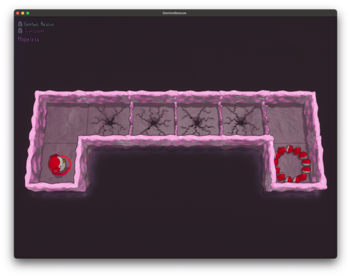
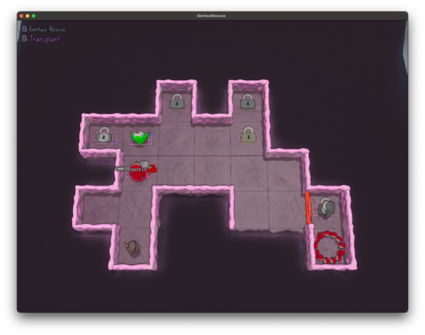
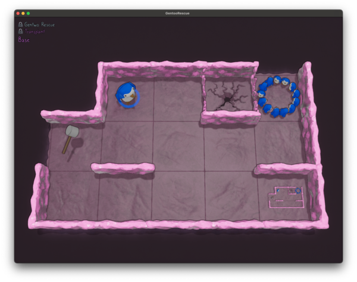
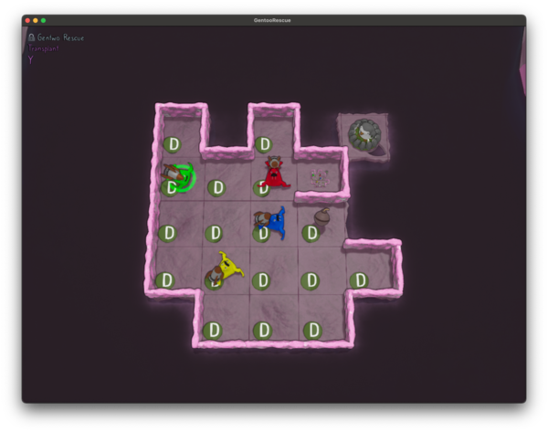
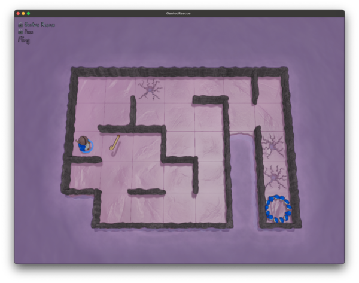
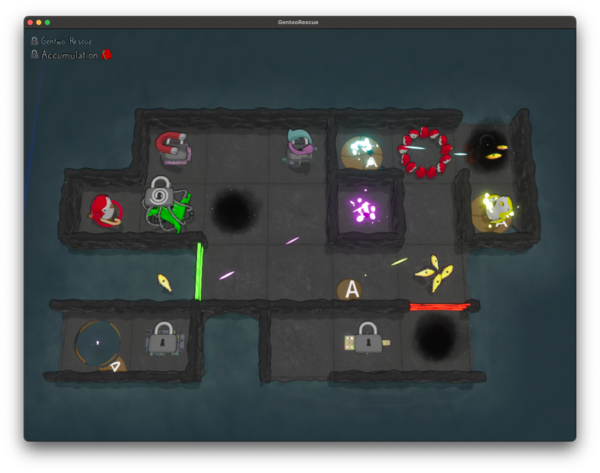

Part 3! Wherein we learn about rockets, recursion, and ricocheting items (oh my). And make it to ... the end? 

[Here are all of the commits](https://github.com/jpverkamp/rust-solvers/compare/0f50b8f298b5a13bd9d8ea0ad6222fbb5eed5a93...080330ab8b19dcb8f73e648a92c878162a0e30fc) from part 1 up through part 3.

And here are all of the parts in this series so far:



<!--more-->

- - - 

## Table of Contents



## Rocket ~Man~ Penguin

[Rockets!]()

Basically: 

* If you hit a wall or another critter while carrying a rocket you blast off[^pokemon][^notpokemon] (and `escape`)
* If you start moving with a rocket while another `Critter` is behind you, they'll be pushed back (featured in a later level)

[^pokemon]: At the speed of light!

[^notpokemon]: Nope. Wrong show. 

The blasting off behavior goes a few places (all in `try_move_one`), depending on what you hit:

```rust
// Bumped into a wall, check what kind
// hit_wall will be true if we hit any kind of wall
// force_continue will be true iff we should keep moving (hammer into a cracked wall)
let wall = self.wall_at(me.location(), direction);
let mut hit_wall = false;
let mut force_continue = false;

match wall {
    WallKind::Empty => {}
    WallKind::Solid => {
        hit_wall = true;
    }
    WallKind::Color(c) => {
        hit_wall = c != me.color();
    }
    WallKind::Cracked => {
        hit_wall = true;

        tracing::debug!("hit a cracked wall, breaking it");
        self.break_wall(me.location(), direction);

        if self.critters[critter_index].carrying() == Some(ThingKind::Hammer) {
            tracing::debug!("broke the wall with a hammer, keep going");
            force_continue = true;
        }
    }
}

if hit_wall {
    match self.critters[critter_index].carrying() {
        Some(ThingKind::Spring) => {
            tracing::debug!("bounced off a wall");
            self.try_move_one(critter_index, direction.flip(), depth + 1, true);
            self.maybe_do_teleport(critter_index, direction.flip());
        }
        Some(ThingKind::Rocket) => {
            tracing::debug!("rocketed off a wall");
            self.critters[critter_index].escape();
        }
        Some(
            ThingKind::Hammer | ThingKind::Crutch | ThingKind::Bomb | ThingKind::Sublevel,
        )
        | None => {
            // no special behavior
            // hammer is handled with force_continue
        }
    }

    if !force_continue {
        return false;
    }
}

// ...

// Bumped into any other critter
if let Some(other_critter) = self
    .critters
    .iter()
    .position(|c| c.location() == me.location() + direction.into())
{
    // Behavior based on what they are carrying
    // ...

    // Behavior based on what we're carrying
    match self.critters[critter_index].carrying() {
        // ...
        Some(ThingKind::Rocket) => {
            tracing::debug!("rocketed off another critter");
            self.critters[critter_index].escape();
        }
        Some(ThingKind::Crutch | ThingKind::Bomb | ThingKind::Sublevel) | None => {
            tracing::debug!("hit another critter");
        }
    }

    self.maybe_do_teleport(critter_index, direction);
    return false;
}
```

I did refactor the wall code, since it was getting a bit repetitive. But otherwise, it's fairly small changes. 

And for pushing, we have a new block *right* at the top of `try_move` (but after making sure we actually *will* move):

```rust
pub(crate) fn try_move(/* ... */) {
    // ... 

    // If we're carrying a rocket, the first thing that happens is pushing anything behind us
    if first_call && self.critters[critter_index].carrying() == Some(ThingKind::Rocket) {
        let behind_location = self.critters[critter_index].location() - direction.into();
        if let Some(other_critter) = self
            .critters
            .iter()
            .position(|c| c.location() == behind_location)
        {
            tracing::debug!("rocketing off another critter behind us");
            self.try_move_one(other_critter, direction.flip(), 0, false);
        }
    }

    // ...
}
```

So far, I don't deal with what happens if they crash into something. I'm sure we'll get there. I could see it going a bunch of ways. Escape, just don't move, stop the rocket. Who knows?!

## Weird interactions

* If a critter with a hammer launches a critter with a rocket, [they are propelled backwards]()
* If a floor under a critter is toggled; [they will escape]()
* If a critter is propelled by a rocket and doesn't have room to go anywhere; [they will escape]()
* A critter in dust but holding a rocket doesn't move but [still propels]()
* The `used_teleports` now tracks which critter teleported; [two different critters]() can use a teleport without triggering the infinite loop check
* If you teleport while using a rocket, [you propel when you land]()
* If you teleport onto an item, you pick it up; [this has interesting interactions with crutches]()


## Refactoring

Here are a couple of [refactoring commits]():

Now, levels are stored in folders:

```bash
$ tree .

.
├── Gentoo Rescue.txt
├── Ground Rules
│   ├── Assistance.txt
│   ├── Blockers.txt
# ...
│   └── Walk.txt
├── Transition.txt
├── Transplant
│   ├── Base.txt
│   └── Hopeless.txt
└── Transplant.txt-unsolved

12 directories, 102 files
```

And I've split the [[TestIT - Integration Testing for My Rust Solvers|testit]]() json files into two, one for solved and one for unsolved levels:

```bash
# Run all solved levels checking for new solutions/regressions
# This runs with --dry-run to not write partial/incorrect solves by accident
$ just test gentoo-rescue

cargo build --release --bin gentoo-rescue
    Finished `release` profile [optimized + debuginfo] target(s) in 0.02s
testit update --dry-run testit/gentoo-rescue.json

Summary:
	Successes: 100 (0 new)
	Failures: 0
	Timeouts: 0

# This do the same thing but without dry-run (so we can commit updated solutions)
$ just update gentoo-rescue 
# ...

# This one is intended to fail, so that when I test for regressions these don't mess it up
$ just test gentoo-rescue -unsolved

cargo build --release --bin gentoo-rescue
    Finished `release` profile [optimized + debuginfo] target(s) in 0.03s
testit update --dry-run testit/gentoo-rescue-unsolved.json
data/gentoo-rescue/Inception/Moonwalk.txt-unsolved: Failure

thread 'main' panicked at solvers/gentoo-rescue/src/main.rs:195:9:
No solution found
note: run with `RUST_BACKTRACE=1` environment variable to display a backtrace

===

data/gentoo-rescue/Transplant.txt-unsolved: Failure

thread 'main' panicked at solvers/gentoo-rescue/src/main.rs:195:9:
No solution found
note: run with `RUST_BACKTRACE=1` environment variable to display a backtrace

===


Summary:
	Successes: 0 (0 new)
	Failures: 2
	Timeouts: 0
error: Recipe `test` failed on line 3 with exit code 1
;_; code=1
```

## The End?

And ... that's actually enough to [beat the game?!]().

Okay, so technically that does roll the credits, but with the swapping mechanic from last time... we have so many more levels open now! Onward!

I don't have anything to mention or show here really, but did want to not when I 'beat' the game. 

## Imports 

Okay, now things are [getting crazy](). (I feel like I've said that before).

First: imports. 



Well. That's not possible. *But*...



We have a red penguin with a hammer one level 'up', which we can import into the puzzle!

I could implement this in the levels above; especially now that I have sublevels which I can use to show when it's possible. But for now, I'm just going to hard code this as I find new things to import:

```text
.xxxx.
.~~~~.

|.::::|
||...||

------
.----.
-....-

2 1 red penguin
2 6 red nest
import red hammer
```

So far as I know, we can only implement this at the beginning of a level. So we can implement as a new special case on `next_states`. If `map.imports` is still set, we will generate one level for every possible combination of imports. So if we have two imports, we can import `00`, `01`, `10`, or `11`. Some of these will lead to the same level, but our solver in general already has deduplication code, so this isn't a big deal. 

```rust
#[tracing::instrument(skip(self))]
fn next_states(&self, _: &Global) -> Option<Vec<(i64, Step, Map)>> {
    let mut next_states = vec![];

    // Before we do anything, if we have any available imports apply those
    // After that, clear the imports since we can only do those at start
    if !self.imports.is_empty() {
        // Generate a new state for each combination of imports
        // Count imports in binary
        for i in 0..(1 << (1 + self.imports.len())) {
            let mut new_map = self.clone();
            for j in 0..self.imports.len() {
                if (i & (1 << j)) != 0 {
                    let (color, thing) = self.imports[j];

                    // Find the first critter that matches the color and give them the thing
                    // Failing to import is fine, the de-duplication of states will take care of it
                    // TODO: What if there are multiple of a color?
                    if let Some(critter) =
                        new_map.critters.iter_mut().find(|c| c.color() == color)
                    {
                        tracing::debug!("Import {thing:?} for {color:?} critter");
                        critter.pick_up(thing);
                    } else {
                        tracing::debug!(
                            "No critter of color {color:?} to import {thing:?}, skipping import"
                        );
                    }
                }
            }
            new_map.imports.clear();
            next_states.push((0, Step::Imports(i), new_map));
        }

        if next_states.len() > 1 {
            return Some(next_states);
        }
    }

    // ...
}
```

There is a catch there... I don't know if we can choose which critter gets the import. So for now we're going to just ignore that. 

And that's actually enough to solve what we have so far! We don't have to otherwise touch the simulation code. 

Seems pretty simple. What else could make this more complicated?

## Recursion

[Recursion](#recursion).



That level in the bottom right? The same level we're on. Full on [Patrick's Parabox](https://www.patricksparabox.com/)[^next]. 

[^next]: I should solve that one! I think I even already own it...

So... how do we solve that? 

Well, let's add [yet another item]() to our map:

```rust
#[derive(Debug, Clone)]
pub(crate) struct Map {
    // ...

    // Allow maps to contain a copy of themselves
    pub(crate) recur: Option<(Point, Box<Map>)>,

    // ...
}
```

This theoretically would allow the recursive level to be different from the level we're on... but I'm not going to do deal with that just yet! 

Next, let's generate a new kind of move. If:

* There is a critter standing on the recursive sublevel
* The critter is carrying something different from what they started the level

Then you can reset the map back to it's initial state, *except* that critter is now carrying whatever it was one level 'up'. 

And for the implementation:

```rust
impl State<Global, Step> for Map {
    #[tracing::instrument(skip(self))]
    fn next_states(&self, _: &Global) -> Option<Vec<(i64, Step, Map)>> {
        let mut next_states = vec![];

        // ...

        // Next, try recurring
        if self.recur.is_some() {
            for critter_index in 0..self.critters.len() {
                if let Some(next_map) = self.try_recur(critter_index) {
                    next_states.push((1, Step::Recur(critter_index), next_map));
                }
            }
        }

        // ...
    }
}

impl Map {
    pub(crate) fn try_recur(&self, critter_index: usize) -> Option<Map> {
        let me = self.critters[critter_index];

        // No recursive (we shouldn't have called this)
        if self.recur.is_none() {
            return None;
        }

        let (recur_point, initial_map) = self.recur.as_ref().unwrap();
        let initial_map = initial_map.as_ref();

        // We have to be standing on a recur tile
        if me.location() != *recur_point {
            return None;
        }

        // And we have to be holding something different
        if me.carrying().is_none()
            || me.carrying() == initial_map.critters[critter_index].carrying()
        {
            return None;
        }

        let mut new_map = initial_map.clone();
        new_map.critters[critter_index].pick_up(me.carrying().unwrap());
        tracing::debug!(
            "Transitioning into sublevel with critter {critter_index} carrying {:?} (was {:?})",
            new_map.critters[critter_index].carrying(),
            me.carrying()
        );
        Some(new_map)
    }
}
```

This is a different (and probably more correct) form of `try_*`: if it succeeds, return the new map. If it doesn't, return `None`. So we don't have an extra clone before even trying it. 

It's actually kind of neat how relatively simple this logic is. We just keep a single copy of the initial state, clone that, and then update one carried thing. 

## Y though?



This one... [gave me some trouble](), since it introduce a couple of new rules:

* If two toggles are hit at the same time (which right now, you can only do with a propel), it skips the toggle (it's too quick or something)
* If you drop any item against a wall (like that bomb going up), the old item will be tossed onto the next space

For the first, we can check that by checking for 'water' after each ticket (in `try_move`):

```rust
// Take steps until we should not move any more
let original_state = self.clone(); // TODO: Expensive...
while self.try_move_one(critter_index, direction, 0, false) {
    // After each 'tick' check if anything fell in the water
    // This finally comes up in Transplant/Y when an number number moving at once is safe
    for index in 0..self.critters.len() {
        if self.critters[index].escaped() {
            continue;
        }

        if self.is_water(self.critters[index].location()) {
            tracing::debug!(
                "Critter {:?} ended up on {:?}, escaping",
                self.critters[index],
                self.tile_at(self.critters[index].location())
            );
            self.critters[index].escape();
        }
    }
}
```

That used to be an empty `while` block. 

And for the second (in `try_move_one`):

```rust
// Moved onto a thing, pick it up
if let Some(index) = self.things.iter().position(|t| t.location == dst) {
    let old_thing = self.critters[critter_index].carrying();
    let thing = self.things.remove(index);
    tracing::debug!("picked up {thing:?}");
    self.critters[critter_index].pick_up(thing.kind);

    // If we were already holding something
    // And there's a wall in the direction we're moving
    // It gets thrown forward one space instead of disappearing
    if let Some(old_thing) = old_thing
        && matches!(
            self.wall_at(me.location() + direction.into(), direction),
            WallKind::Solid | WallKind::Color(_) | WallKind::Cracked
        ) {
            // BUTTTTTTT... if that space is water, it just gets lost instead of thrown
            // This mostly preserves previous solutions, no critter could pick that up (?)
            let drop_location = dst + direction.into();
            if !self.is_water(drop_location) {
                tracing::debug!(
                    "but there's a wall in the way and we're already holding something, tossing the old thing"
                );

                tracing::debug!("tossed {old_thing:?} at {drop_location:?}");
                self.things.push(Thing {
                    kind: old_thing,
                    location: drop_location,
                });
            }
        }
}
```

That just seems so hacky... Without the innermost check there, we do get some 'new' solutions, but those are just going down a different branch since there's an item floating in the water which changes (slightly) some tie breaking... somewhere? But if those phantom items don't exist, all previous levels are solved the same way. This is why I `testit` for regressions!

## But actually... throw it *more*?

So if you have this map and move right:



Well... it turns out that I actually read that requirement wrong. It doesn't toss it one space. It tosses it just over the next wall. So the bomb Blue is holding ends up over the wall at row 3 column 4...

```rust
// If we were already holding something
// Find the next solid wall in the direction we're moving
// With a non-water tile one space beyond that
// That's where the items goes... (otherwise just into the water with you)
if let Some(old_thing) = old_thing {
    let mut drop_point = dst;
    let mut found_wall = false;

    loop {
        let wall = self.wall_at(drop_point, direction);
        if matches!(wall, WallKind::Solid | WallKind::Color(_) | WallKind::Cracked) {
            drop_point = drop_point + direction.into();
            found_wall = true;
            break;
        } else {
            drop_point = drop_point + direction.into();
        }

        if drop_point.x < 0
            || drop_point.x >= self.width as isize
            || drop_point.y < 0
            || drop_point.y >= self.height as isize
        {
            // Went off the map, just drop it in the water
            drop_point = Point {
                x: -10,
                y: -10,
            };
            break;
        }
    }

    if !found_wall || self.is_water(drop_point) {
        tracing::debug!("dropped {old_thing:?} into the water at {drop_point:?}");
    } else {
        // If there's a critter there, give them the item
        // TODO: What if they're holding something? Right now, they swap
        if let Some(other_critter) = self
            .critters
            .iter()
            .position(|c| c.location() == drop_point)
        {
            tracing::debug!(
                "dropped {old_thing:?} onto {other_critter:?}, giving it to them"
            );
            self.critters[other_critter].pick_up(old_thing);
            return true;
        } else {
            tracing::debug!("dropped {old_thing:?} at {drop_point:?}");
            self.things.push(Thing {
                kind: old_thing,
                location: drop_point,
            });
        }
    }
}
```

This `old_thing`? Some... fairly complicated code. This, again, is why I have regression testing... ALso, in case you were wondering:

`DRDLULUURDLDRDRRDRUUULDRDLURDRDRUDLULURRDRUD`

Yup. That's a lot of a single penguin movement. 

And it's still not right. [Further down the same branch]() of levels we get another twist (and this one doesn't *really* make sense, but it's official):

If a tossed item ends up on a previous item, the previous item is pushed (exactly) one space out of the way (clockwise). For reasons.

```rust
// Moved onto a thing, pick it up
if let Some(index) = self.things.iter().position(|t| t.location == dst) {
    let old_thing = self.critters[critter_index].carrying();
    let thing = self.things.remove(index);
    tracing::debug!("picked up {thing:?}");
    self.critters[critter_index].pick_up(thing.kind);
    if let Some(old_thing) = old_thing {
        self.toss_item(old_thing, dst, direction, true);
    }
}

// ...

#[tracing::instrument(skip(self), ret)]
pub(crate) fn toss_item(
    &mut self,
    tossed_thing: ThingKind,
    toss_from: Point,
    direction: Direction,
    depth: usize,
) {
    // Bail out if depth > 4: this is an infinite loop of bouncing items
    // It's 'valid' but should never be on the solution path
    if depth > 4 {
        tracing::warn!(
            "Hit max toss depth when tossing {tossed_thing:?} from {toss_from:?} in direction {direction:?}, likely an infinite loop. Dropping it into the water."
        );
        return;
    }

    // If we were already holding something
    // Find the next solid wall in the direction we're moving
    // With a non-water tile one space beyond that
    // That's where the items goes... (otherwise just into the water with you)
    let mut drop_point = toss_from;
    let mut valid_toss = false;

    if depth == 0 {
        loop {
            let wall = self.wall_at(drop_point, direction);
            if matches!(wall, WallKind::Solid) {
                drop_point = drop_point + direction.into();
                valid_toss = true;
                break;
            } else {
                drop_point = drop_point + direction.into();
            }

            if drop_point.x < 0
                || drop_point.x >= self.width as isize
                || drop_point.y < 0
                || drop_point.y >= self.height as isize
            {
                // Went off the map, just drop it in the water
                drop_point = Point { x: -10, y: -10 };
                break;
            }
        }
    } else {
        drop_point = drop_point + direction.into();
        valid_toss = true;
    }

    if !valid_toss || self.is_water(drop_point) {
        tracing::debug!("dropped {tossed_thing:?} into the water at {drop_point:?}");
        return;
    }

    // If there's a critter there, give them the item
    if let Some(other_critter) = self
        .critters
        .iter()
        .position(|c| c.location() == drop_point)
    {
        // If they were holding something, recursively toss it one tile clockwise
        if let Some(old_thing) = self.critters[other_critter].carrying() {
            tracing::debug!(
                "{them:?} was already holding {old_thing:?}, tossing it one tile clockwise",
                them = &self.critters[other_critter]
            );
            let new_direction = direction.turn_right();
            self.toss_item(old_thing, drop_point, new_direction, depth + 1);
        }

        tracing::debug!(
            "dropped {tossed_thing:?} onto {them:?}, giving it to them",
            them = &self.critters[other_critter]
        );
        self.critters[other_critter].pick_up(tossed_thing);

        return;
    }

    // If there was already an item there, it gets 'tossed' one tile clockwise
    if let Some(index) = self.things.iter().position(|t| t.location == drop_point) {
        tracing::debug!(
            "{thing:?} was already at {drop_point:?}, tossing it one tile clockwise",
            thing = &self.things[index]
        );

        let new_direction = direction.turn_right();
        let old_thing = self.things[index].kind;
        self.toss_item(old_thing, drop_point, new_direction, depth + 1);

        // This needs to be done by location since the index might have changed with recursive calls
        self.things = self
            .things
            .iter()
            .filter(|t| t.location != drop_point)
            .cloned()
            .collect();
    }

    tracing::debug!("dropped {tossed_thing:?} at {drop_point:?}");
    self.things.push(Thing {
        kind: tossed_thing,
        location: drop_point,
    });
}
```

This code is just silly. Basically, if we throw an item:

* It will fly over the next plain wall and onto the tile behind that
* If that tile had a critter on it, they will pick up an item
  * If that critter already had an item, it will bounce one tile clockwise
* If that tile didn't have a critter, but there was already an item there
  * The thrown item lands there and the item that was there bounces clockwise
* If any item bounces, bouncing continue recursively
* If that just keeps happening... *STACK OVERFLOW* (so avoid that, hopefully no level requires this...)

But that is enough to finish the hub and all but two sublevels of Pass... and I don't know how to get to the next levels yet. 

## Up next...

So, that's a lot for one post, let's leave it at that. And apparently... *we'll have a part four!

So what do we have left? 



That's an entire world with (at least) 81 levels/sublevels!

Just at a glance, I see arrows (which I assume let us swap critters or go through walls) and piles of fish[^thanks]...

[^thanks]: So long and thanks and all that. :smile:

Onward!
