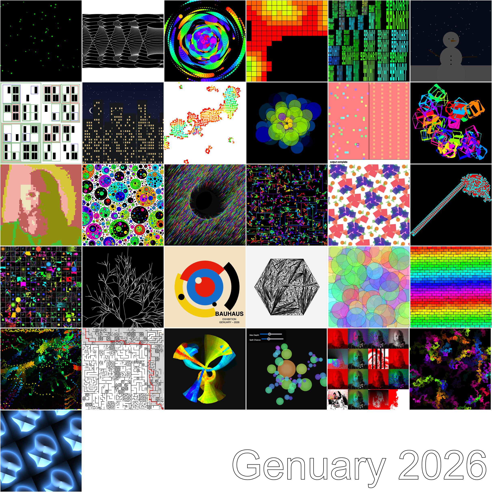

I just wanted to make a quick montage of all 31 sketches:

You can combine all of the preview images and then add some nice text with a pair of [imagemagick]() commands:

```bash
montage content/programming/2026/genuary/*/gen26.??.png \
  -tile 6x6 \
  -geometry +2+2 \
  -background none \
  gen26-grid.png

mogrify \
  -gravity southeast \
  -pointsize 200 \
  -fill "white" \
  -stroke "black" -strokewidth 2 \
  -annotate +20+20 "Genuary 2026" \
  gen26-grid.png
```

<!--more-->

<a href="gen26-grid.png"></a>

Or here you can click any one of these to go to the post: 

<div class="square-cover-list">
<style>
.square-cover-list .cover-list img {
  width: 100px;
  height: 100px;
  object-fit: cover;
}
</style>



</div>

<!--more-->